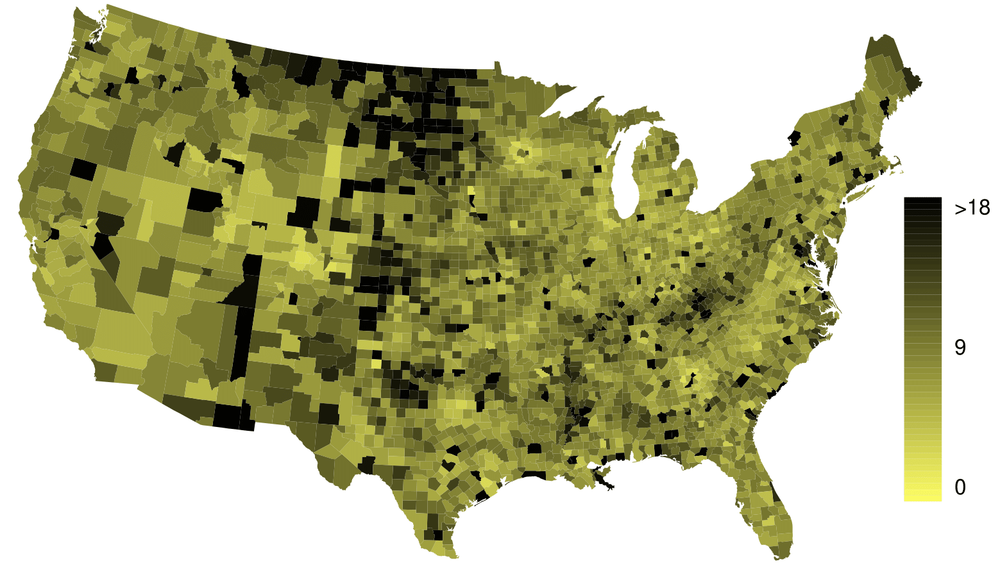
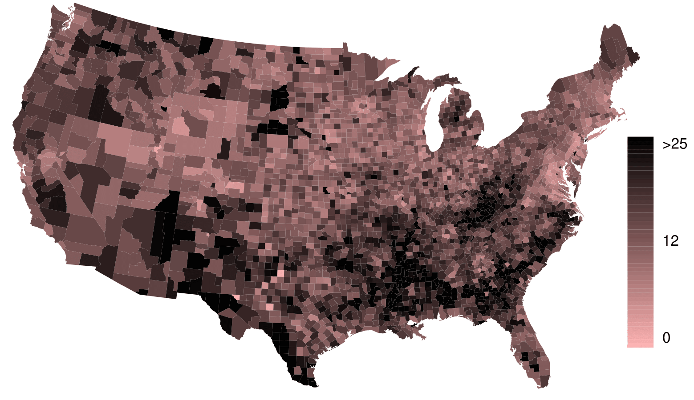
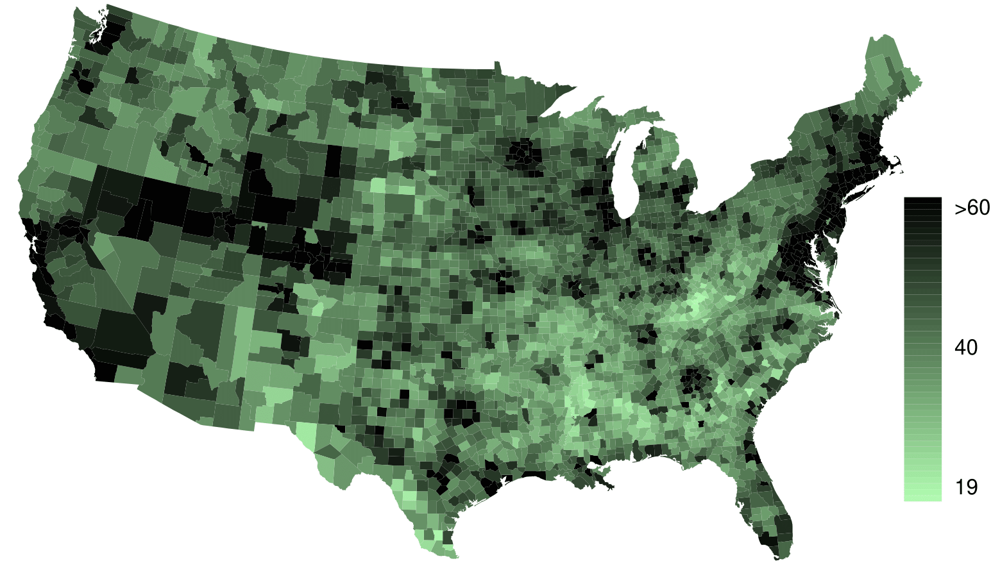
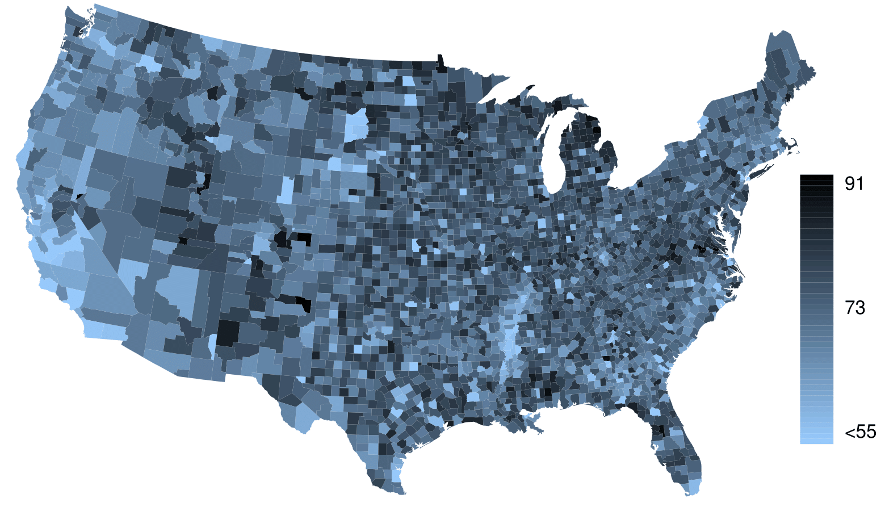

# Introdução aos Bancos de Dados {#ch1-intro}

Os cientistas procuram responder a perguntas usando métodos rigorosos e observações cuidadosas. Essas observações -- coletadas a partir de notas de campo, pesquisas e experimentos --  formam a espinha dorsal de uma investigação estatística e são chamadas de **banco de dados**. Estatística é o estudo de como melhor coletar, analisar e tirar conclusões dos dados. É útil colocar estatísticas no contexto de um processo geral de investigação:

+ Identifique uma questão ou problema.

+ Coletar dados relevantes sobre o tópico.

+ Analise os dados.

+ Faça uma conclusão.


Estatística como um assunto se concentra em tornar os estágios 2-4 objetivos, rigorosos e eficientes. Isto é, a estatística tem três componentes principais: como melhor podemos coletar dados? Como deve ser analisado? E o que podemos inferir da análise?
Os tópicos que os cientistas investigam são tão diversos quanto as perguntas que fazem. No entanto, muitas dessas investigações podem ser abordadas com um pequeno número de técnicas de coleta de dados, ferramentas analíticas e conceitos fundamentais em inferência estatística. Este capítulo fornece um vislumbre desses e de outros temas que encontraremos ao longo do restante do livro. Apresentamos os princípios básicos de cada ramo e aprendemos algumas ferramentas ao longo do caminho. Nós vamos encontrar aplicações de outros campos, alguns dos quais não são tipicamente associados à ciência, mas, mesmo assim, podem se beneficiar do estudo estatístico.


## Estudo de caso: usando *stents* para evitar derrames {#basicExampleOfStentsAndStrokes}


Seção \@ref(basicExampleOfStentsAndStrokes) introduz um desafio clássico na estatística: avaliar a eficácia de um tratamento médico. Os termos nesta seção e, na verdade, em grande parte deste capítulo, serão revisitados posteriormente no texto. O plano, por enquanto, é simplesmente ter uma noção do papel que as estatísticas podem desempenhar na prática.

Nesta seção, vamos considerar um experimento que estuda a eficácia dos *stents* no tratamento de pacientes com risco de acidente vascular cerebral^[Chimowitz MI, Lynn MJ, Derdeyn CP, et al. 2011. Stenting versus Aggressive Medical Therapy for Intracranial Arterial Stenosis. New England Journal of Medicine 365:993-1003.]. Os *stents* são dispositivos colocados dentro dos vasos sanguíneos que auxiliam na recuperação do paciente após eventos cardíacos e reduzem o risco de um novo acidente ou morte. Muitos médicos esperavam que houvesse benefícios similares para pacientes com risco de derrame. Começamos escrevendo a pergunta principal que os pesquisadores esperam responder:

> O uso de *stents* reduz o risco de acidente vascular cerebral?

Os pesquisadores que fizeram essa pergunta coletaram dados de 451 pacientes em risco. Cada paciente voluntário foi aleatoriamente designado para um dos dois grupos:

+ **Grupo de tratamento**: Os pacientes do grupo de tratamento receberam *stent* e tratamento médico. O manejo médico incluiu medicamentos, gerenciamento de fatores de risco e ajuda na modificação do estilo de vida.

+ **Grupo de controle**: Os pacientes do grupo controle receberam o mesmo tratamento médico do grupo de tratamento, mas não receberam *stents*.

Os pesquisadores distribuíram aleatoriamente 224 pacientes para o grupo de tratamento e 227 para o grupo de controle. Neste estudo, o grupo controle fornece um ponto de referência contra o qual podemos medir o impacto médico dos *stents* no grupo de tratamento.

Os pesquisadores estudaram o efeito dos *stents* em dois momentos: 30 dias após a inscrição e 365 dias após a inscrição. Os resultados de 5 pacientes estão resumidos na Tabela \@ref(tab:stentStudyResultsDF). Os resultados dos pacientes são registrados como "acidente vascular cerebral" ou "nenhum evento", representando se o paciente teve ou não um acidente vascular cerebral no final de um período de tempo.

```{r stentStudyResultsDF}
library(tidyverse)

table1 <- data.frame(Paciente = c(1, 2, 3, 450, 451), Grupo = c('tratamento',                                                'tratamento','tratamento','controle','controle'),
                     trinta_dias = c('sem evento','acidente','sem evento','sem evento',
                                'sem evento'),
                     trezentos_sessenta_cinco_dias = c('sem evento',
                                                       'acidente','sem evento',
                                                       'sem evento','sem evento'))

colnames(table1) <- c('Paciente','Grupo','0-30 dias','0-365 dias')

knitr::kable(table1, caption = ' Resultados para cinco pacientes do estudo stent',
             align = 'c')
```

Considerar os dados de cada paciente individualmente seria um caminho longo e complicado para responder à pergunta de pesquisa original. Em vez disso, executar uma análise estatística de dados nos permite considerar todos os dados de uma só vez. A Tabela \@ref(tab:stentStudyResults) resume os dados brutos de uma maneira mais útil. Nesta tabela, podemos ver rapidamente o que aconteceu durante todo o estudo. Por exemplo, para identificar o número de pacientes no grupo de tratamento que tiveram um derrame dentro de 30 dias, olhamos no lado esquerdo da mesa na intersecção do tratamento com o derrame: 33.

```{r stentStudyResults}
table2 <- data.frame(rbind(c(33, 191, 45, 179), 
                           c(13, 214, 28, 199), 
                           c(46, 405, 73, 378)))

#organiza~ção dos nomes
rownames(table2) <- c('tratamento', 'controle','total')
colnames(table2) <- c('ataque cardíaco (0-30 dias)', 'sem evento (0-30 dias)',
                      'ataque cardíaco (0-365 dias)', 'sem evento (0-365 dias)')

knitr::kable(table2, align = 'c',
             caption = 'Estatística descritiva para o estudo sobre stent')
```

***
```{exercise}
Dos 224 pacientes do grupo de tratamento, 45 tiveram um derrame no final do primeiro ano. Usando esses dois números, calcule a proporção de pacientes no grupo de tratamento que teve um acidente vascular cerebral até o final do primeiro ano. (Por favor, note: as respostas para todos os exercícios de **Práticas Orientadas** são fornecidas usando notas de rodapé.)^[A proporção dos 224 pacientes que tiveram um derrame dentro de 365 dias: $45/224 = 0,20$.]
```

***

Podemos calcular estatísticas através da tabela. Uma **estatística** é um único número que resume uma grande quantidade de dados.^[Formalmente, uma estatística é um valor calculado a partir dos dados. Algumas estatísticas resumidas são mais úteis do que outras.] Por exemplo, os principais resultados do estudo após um ano podem ser descritos por duas estatísticas resumidas: a proporção de pessoas que tiveram um derrame nos grupos de tratamento e de controle.

+ Proporção que teve um derrame no grupo tratamento (*stent*): 
$$\frac{45}{224} = 0.20 = 20\%$$

+ Proporção que teve um derrame no grupo de controle: 
$$\frac{28}{227} = 0.12 = 12\%$$

Estas duas estatísticas resumidas são úteis para procurar diferenças nos grupos, e temos uma surpresa: mais 8\% de pacientes no grupo de tratamento tiveram um derrame! Isto é importante por duas razões. Primeiro, é contrário ao que os médicos esperavam, que os *stents* *reduziriam*  a taxa de derrames. Segundo, leva a uma questão estatística: os dados mostram uma diferença "real" entre os grupos? 

Essa segunda questão é sutil. Suponha que você jogue uma moeda 100 vezes. Embora a chance de uma moeda cair cara em uma dada moeda seja de 50\%, provavelmente não observaremos exatamente 50 caras. Esse tipo de flutuação faz parte de praticamente qualquer tipo de processo de geração de dados. É possível que a diferença de 8\% no estudo do *stent* se deva a essa variação natural. No entanto, quanto maior a diferença que observamos (para um tamanho de amostra específico), menos crível é que a diferença seja devida ao acaso. Então, o que estamos realmente perguntando é o seguinte: **a diferença é tão grande que devemos rejeitar a noção de que isso se deve ao acaso?**

Embora ainda não tenhamos nossas ferramentas estatísticas para resolver totalmente essa questão por conta própria, podemos compreender as conclusões da análise publicada: havia evidências convincentes de danos por *stents* neste estudo de pacientes com AVC.

**Seja cuidadoso:** não generalizamos os resultados deste estudo para todos os pacientes e todos os *stents*. Este estudo analisou pacientes com características muito específicas que se voluntariaram para fazer parte deste estudo e que podem não ser representativos de todos os pacientes com AVC. Além disso, existem muitos tipos de *stents* e este estudo considerou apenas o *stent Wingspan* auto-expansível (Boston Scientific). No entanto, este estudo nos deixa uma lição importante: devemos manter nossos olhos abertos para surpresas.

## Noções básicas de dados {#dataBasics}

Apresentação eficaz e descrição dos dados é um primeiro passo na maioria das análises. Esta seção apresenta uma estrutura para organizar dados, bem como alguma terminologia que será usada ao longo deste livro.

###  Observações, variáveis e matrizes de dados {#observationsVariableData}

A Tabela \@ref(tab:email50DF) exibe as linhas 1, 2, 3 e 50 de um conjunto de dados referentes a 50 e-mails recebidos durante o início de 2012. Essas observações serão chamadas de conjunto de dados ``email50`` e são uma amostra aleatória de um conjunto de dados maior vamos ver na Seção \@ref(categoricalData).

```{r email50DF}
library(openintro)
data("email50")

table3 <- email50[,c('spam', 'num_char', 'line_breaks', 'format', 'number')]
table3$spam <- ifelse(table3$spam  == '0', 'não', 'sim')
table3$format <- ifelse(table3$format  == '0', 'text', 'html')


knitr::kable(table3[c(1:3,50),], align = 'c',
             caption = 'Quatro linhas da matriz de dados email50.')
```

Cada linha na tabela representa um único e-mail ou **caso**.^[Um caso é também chamado de **unidade de observação**.] As colunas representam características, chamadas **variéveis**, para cada um dos e-mails. Por exemplo, a primeira linha representa o email 1, que não é spam, contém 21,705 caracteres, 551 quebras de linha, está escrito em formato *HTML* e contém apenas números pequenos.

Na prática, é especialmente importante fazer perguntas esclarecedoras para garantir que aspectos importantes dos dados sejam compreendidos. Por exemplo, é sempre importante ter certeza de que sabemos o que cada variável significa e as unidades de medida. As descrições de todas as cinco variáveis de e-mail são dadas na Tabela \@ref(tab:email50Variables).

```{r email50Variables}
table4 <- data.frame(variavel = colnames(table3),
                     descricao = c('Especifica se a mensagem eras spam',
                                   'O número de caracteres no email',
                                   'O número de quebras de linha no email (não incluindo quebras por figura)',
                                   ' Indica se o email continha formatação especial, como negrito, tabelas, ou links, o que indicaria que a mensagem está no formato HTML',
                                   'Indica se o email não tinha nenhum número, um pequeno número (menor que 1 milhão), ou um número grande'))

knitr::kable(table4, align = 'r', 
             caption = ' Variáveis e suas descrições para o conjunto de dados email50')
```

Os dados na Tabela \@ref(tab:email50DF) representam a **matriz de dados**, que é uma maneira comum de organizar dados. Cada linha de uma matriz de dados corresponde a um caso único e cada coluna corresponde a uma variável. Uma matriz de dados para o estudo de acidente vascular cerebral foi introduzida na Seção \@ref(basicExampleOfStentsAndStrokes) é mostrado na Tabela \@ref(tab:stentStudyResultsDF), onde os casos eram pacientes e havia três variáveis registradas para cada paciente.

As matrizes de dados são uma maneira conveniente de registrar e armazenar dados. Se outro indivíduo ou caso for adicionado ao conjunto de dados, uma linha adicional poderá ser facilmente adicionada. Da mesma forma, outra coluna pode ser adicionada para uma nova variável.

***
```{exercise}
Consideramos um conjunto de dados publicamente disponível que resume informações sobre os 3.143 municípios nos Estados Unidos, e chamamos isso de conjunto de dados `condado`. Este conjunto de dados inclui informações sobre cada município: seu nome, o estado em que reside, sua população em 2000 e 2010, gastos federais per capita, taxa de pobreza e cinco características adicionais. Como esses dados podem ser organizados em uma matriz de dados? Lembrete: procure nas notas de rodapé as respostas para exercícios no texto.^[Cada município pode ser visto como um caso, e há onze partes de informações registradas para cada caso. Uma tabela com 3.143 linhas e 11 colunas poderia conter esses dados, onde cada linha representa um município e cada coluna representa uma peça específica de informação.]
```

***

Sete colunas do conjunto de dados `município` são mostrados na Tabela \@ref(tab:countyDF), e as variáveis estão resumidas na Tabela \@ref(tab:countyVariables). Esses dados foram coletados no site do Censo dos EUA^[quickfacts.census.gov/qfd/index.html].

```{r countyDF}
data(county)

knitr::kable(head(county, 7), align = 'c', 
             caption = 'Sete linhas do conjunto de dados condado.')
```

```{r countyVariables}
table6 <- data.frame(variavel = colnames(county), 
                     descricao = c('Nome do condado',
                                   'Estado onde fica o condado (também incluso o distrito de Colúmbia)',
                                   'População em 2000',
                                   'População em 2010',
                                   'Gasto federal per capita',
                                   'Porcentagem da população na pobreza',
                                   'Porcentagem da população que vive em sua própria casa ou vive com o dono (e.g. crianças vivendo com pais que são donos da casa)',
                                   ' Percentagem de unidades habitacionais que fazem parte de estruturas multi unidade (e.g. apartamentos)',
                                   'Renda per capita',
                                   'Renda por habitação mediana para o condado, onde a renda por habitação é igual a renda total de todos ocupantes com mais de 15 anos de idade'))

knitr::kable(table6, align = 'r', 
              caption = 'Variáveis e suas descrições para o banco de dados condado.')
```

### Tipos de variáveis {#typesVariables}

Examine as variáveis `fed_spend`, `pop2010`, `state`, e `med_income`  no conjunto de dados `condado`. Cada uma dessas variáveis é inerentemente diferente das outras três, mas muitas delas compartilham certas características.

Primeiro considere `fed_spend`, que é dito ser uma variável **numérica**, pois pode ter uma ampla gama de valores numéricos e é sensato adicionar, subtrair ou obter médias com esses valores. Por outro lado, não classificaríamos os códigos de área de telefone como numéricos, uma vez que sua média, soma e diferença não têm um significado claro.

A `pop2010` variável também é numérica, embora pareça ser um pouco diferente de `fed_spend`. Esta variável da contagem da população só pode ter números inteiros não negativos ($1,2,3,\dots$). Por essa razão, a variável *população* é dita ser **discreta** já que só pode assumir valores numéricos com saltos. Por outro lado, diz-se que a variável gasto federal é **contínua**.

A variável `state` pode levar até 51 valores, contabilizando Washington, DC: AL,$\dots$, e WY. Porque as próprias respostas são categorias, `state` é chamada uma variável **categórica**, e os valores possíveis são chamados de *níveis da variável*.

```{r variables, fig.cap = "Repartição das variáveis em seus respectivos tipos."}

vars <- data.frame(xmin = c(6, 0, 12.5, -3, 3, 9, 15),
                   xmax = c(11, 5, 17.5, 2, 8, 14, 20),
                   ymin = c(4, 2, 2, 0, 0, 0, 0), 
                   ymax = c(5, 3, 3, 1, 1, 1, 1), 
                   x = c(8.5, 2.5, 15, -0.5, 5.5, 11.5, 17.5), 
                   y = c(4.5, 2.5, 2.5, 0.5, 0.5, 0.5, 0.5),
                   labs = c('todas \n variáveis', 'numérica', 'categórica', 'contínua', 
                   'discreta', 'nominal \n(cat. sem ordem)', 'ordinal \n(cat. com ordem)'), 
                   size = c(3, 4, 4, 4, 4, 3, 3))

arrows <- data.frame(x = c(8, 9, 2, 3, 14.5, 15.5),
                     y = c(3.9, 3.9, 1.9, 1.9, 1.9, 1.9),
                     xend = c(5, 12.5, -0.5, 5.5, 11.5, 17.5),
                     yend = c(3.2, 3.2, 1.2, 1.2, 1.2, 1.2))

ggplot(data = vars) + 
  theme(panel.border = element_rect(colour = "black", fill = NA, size = 1)) +
  geom_rect(mapping = aes(xmin = xmin, xmax = xmax, ymin = ymin, ymax = ymax), 
            alpha = 0.5, color = 'black', fill = 'skyblue3') + 
  annotate(geom = 'text', x = vars$x, y = vars$y, 
           label = paste0(vars$labs), size = vars$size) + 
  theme(axis.text = element_blank(), axis.ticks = element_blank(), 
        axis.title = element_blank()) +
  geom_segment(data = arrows, aes(x = x, xend = xend, y = y, yend = yend), 
               arrow = arrow(length = unit(0.2, "cm")))
```

```{example}
Os dados foram coletados sobre os alunos em um curso de estatística. Três variáveis foram registradas para cada aluno: número de irmãos, altura do aluno e se o aluno já havia feito um curso de estatística. Classifique cada uma das variáveis como numérica contínua, numérica discreta ou categórica.
```


O número de irmãos e a altura dos alunos representam variáveis numéricas. Como o número de irmãos é uma contagem, ele é discreto. Altura varia continuamente, por isso é uma variável numérica contínua. A última variável classifica os alunos em duas categorias - aqueles que fizeram e aqueles que não fizeram um curso de estatística -- o que torna essa variável categórica.

***
```{exercise}
Considere as variáveis **grupo** e **resultado** (a 30 dias) do estudo *stent* na Seção \@ref(basicExampleOfStentsAndStrokes). São estas variáveis numéricas ou categóricas?^[Existem apenas dois valores possíveis para cada variável e, em ambos os casos, descrevem categorias. Assim, cada um é uma variável categórica.]
```

***

### Relações entre variáveis {#variableRelations}

Muitas análises são motivadas por um pesquisador que procura uma relação entre duas ou mais variáveis. Um cientista social pode gostar de responder a algumas das seguintes perguntas:

+ Os gastos federais, em média, são maiores ou menores nos condados com altas taxas de pobreza?

+ Se a variável *casa própria* for menor que a média nacional em um município, a percentagem de estruturas de várias unidades naquele município provavelmente estará acima ou abaixo da média nacional?

+ Quais municípios têm uma renda média maior: aqueles que decretam uma ou mais proibições de fumar ou aqueles que não a decretaram?

Para responder a essas perguntas, os dados devem ser coletados, como o conjunto de dados `condado`  mostrado na Tabela \@ref(tab:countyDF). Examinar as estatísticas-resumo poderia fornecer *insights* para cada uma das três perguntas sobre condados. Além disso, os gráficos podem ser usados para resumir visualmente os dados e são úteis para responder a essas perguntas também. **Gráficos de dispersão** são um tipo de gráfico usado para estudar a relação entre duas variáveis numéricas. A Figura \@ref(fig:countyfedspendVsPoverty) compara as variáveis `fed_spend` e `poverty`. 

Cada ponto representa um único condado. Por exemplo, o ponto realçado corresponde ao Condado 1088 no conjunto de dados: Owsley County, Kentucky, que tinha uma taxa de pobreza de 41,5\% e gastos federais de \$21,50 per capita. O gráfico de dispersão sugere uma relação entre as duas variáveis: os municípios com alta taxa de pobreza também tendem a ter um pouco mais de gastos federais. Podemos pensar em por que essa relação existe e investigar cada ideia para determinar qual é a explicação mais razoável.

```{r countyfedspendVsPoverty, fig.cap = 'Um gráfico de dispersão mostrando fed_spend contra poverty.'}

ggplot(data = county, mapping = aes(x = poverty, y = fed_spend)) +  
  theme(panel.border = element_rect(colour = "black", fill = NA, size = 1)) + 
  labs(x = 'Pobreza', y = 'Gasto federal per capita') + 
  geom_point() + 
  ylim(0, 30) + 
  scale_x_continuous(breaks = seq(0, 50, 10)) +
  geom_segment(aes(x = 0, y = 21.5, xend = 41.5, yend = 21.5), 
               linetype = "dashed", color = 'red') + 
  geom_segment(aes(x = 41.5, y = 0, xend = 41.5, yend = 21.5), 
               linetype = "dashed", color = 'red')

```

***
```{exercise}
Examine as variáveis no banco de dados `email50`, descritos na Tabela \@ref(tab:email50Variables). Crie duas perguntas sobre os relacionamentos entre essas variáveis que são de seu interesse.^[Duas perguntas de exemplo: (1) A intuição sugere que, se houver muitas quebras de linha em um email, haverá também muitos caracteres: isso é verdade? (2) Existe uma conexão entre se um formato de email é texto simples (versus HTML) e se é uma mensagem de spam?]
```

***

Diz-se que as duas variáveis estão associadas porque o gráfico mostra um padrão discernível. Quando duas variáveis mostram alguma conexão umas com as outras, elas são chamadas variáveis __associadas__. Variáveis associadas também podem ser chamadas variáveis *dependentes* e vice-versa.

```{example}
Este exemplo examina a relação entre a proporção de casa própria e a porcentagem de unidades em estruturas de multi-unidades (por exemplo, apartamentos e condomínios), que é visualizada usando um gráfico de dispersão na Figura \@ref(fig:multiunitsVsOwnership). Essas variáveis estão associadas?
```

```{r multiunitsVsOwnership, fig.cap = 'Gráfico de dispersão entre a proporção de casa própria e a porcentagem de unidades eem estruturas de multi-unidades'}

ggplot(data = countyComplete, 
       mapping = aes(x = housing_multi_unit, y = home_ownership)) +  
  theme(panel.border = element_rect(colour = "black", fill = NA, size = 1)) + 
  labs(x = 'Porcentagem de Unidades em Estruturas de Multi-Unidades', 
       y = 'Proporção de Casa Própria') + 
  geom_point()

```


Parece que quanto maior a fração de unidades em estruturas com várias unidades, menor a taxa de casa própria. Como existe alguma relação entre as variáveis, elas estão associadas.

Porque há uma tendência de queda na Figura \@ref(fig:multiunitsVsOwnership) -- municípios com mais unidades em estruturas de várias unidades estão associados a uma menor casa própria -- essas variáveis são consideradas __associadas negativamente__. Uma **associação positiva** é mostrada na relação entre as variáveis *poverty* e *fed_spend* representadas na Figura \@ref(fig:countyfedspendVsPoverty), onde os municípios com maiores taxas de pobreza tendem a receber mais gastos federais per capita.
Se duas variáveis não estão associadas, então elas são __independentes__. Ou seja, duas variáveis são independentes se não houver relação evidente entre as duas.

<div class="alert alert-info">
  <strong>Associado ou independente, não ambos</strong>: Um par de variáveis estão relacionadas de alguma forma (associadas) ou não (independentes). Nenhum par de variáveis são associadas e independentes.
</div>

## Visão geral dos princípios de coleta de dados {#overviewOfDataCollectionPrinciples}

O primeiro passo na condução de pesquisas é identificar tópicos ou questões que devem ser investigados. Uma pergunta de pesquisa claramente apresentada é útil para identificar quais assuntos ou casos devem ser estudados e quais variáveis são importantes. Também é importante considerar *como* os dados são coletados para que sejam confiáveis e ajudem a atingir as metas de pesquisa.

### Populações e amostras {#populationsAndSamples}

Considere as três perguntas de pesquisa a seguir:

+ Qual é o teor médio de mercúrio no peixe-espada do Oceano Atlântico?

+ Nos últimos 5 anos, qual é o tempo médio para concluir um curso para alunos de graduação da Duke?

+ Um novo medicamento reduz o número de mortes em pacientes com doença cardíaca grave?

Cada questão de pesquisa refere-se a uma __população alvo__. Na primeira questão, a população alvo é todo o peixe-espada no oceano Atlântico, e cada peixe representa um caso. Muitas vezes, é muito caro coletar dados para todos os casos em uma população. Em vez disso, uma amostra é obtida. A __amostra__ representa um subconjunto dos casos e geralmente é uma pequena fração da população. Por exemplo, 60 peixes-espada (ou algum outro número) na população podem ser selecionados, e esses dados de amostra podem ser usados para fornecer uma estimativa da média populacional e responder à pergunta da pesquisa.

***
```{exercise label = 'identifyingThePopulationForTwoQuestionsInPopAndSampSubsection'}
Para a segunda e terceira questões acima, identifique a população alvo e o que representa um caso individual.^[Observe que a primeira pergunta só é relevante para os alunos que concluem o curso; a média não pode ser calculada usando um aluno que nunca terminou sua graduação Assim, apenas os alunos de graduação da Duke que se formaram nos últimos cinco anos representam casos na população em questão. Cada um desses estudantes representaria um caso individual. Uma pessoa com doença cardíaca grave representa um caso. A população inclui todas as pessoas com doença cardíaca grave.]
```

***

### Evidência anedótica {#anecdotalEvidenceSubsection}

Considere as seguintes respostas possíveis para as três questões de pesquisa:

+ Um homem no noticiário tem envenenamento por mercúrio por comer espadarte, então a concentração média de mercúrio em espadarte deve ser perigosamente alta.

+ Eu conheci dois alunos que levaram mais de sete anos para se formar na Duke, então deve levar mais tempo para se formar na Duke do que em muitas outras faculdades.

+ O pai da minha amiga teve um ataque cardíaco e morreu depois que eles lhe deram uma nova droga para doença cardíaca, então a droga não deve funcionar.

Cada conclusão é baseada em dados. No entanto, existem dois problemas. Primeiro, os dados representam apenas um ou dois casos. Em segundo lugar, e mais importante, não está claro se esses casos são realmente representativos da população. Dados coletados dessa maneira casual são chamados __evidência anedótica__.

```{r mnWinter, fig.cap = 'Em fevereiro de 2010, alguns especialistas da mídia citaram uma grande tempestade de neve como evidência válida contra o aquecimento global. Como o comediante Jon Stewart apontou: É uma tempestade, em uma região, de um país.'}

knitr::include_graphics("images/c1/mnWinter.jpg")
```


<div class="alert alert-info">
  <strong>Evidência anedótica</strong>: Tenha cuidado com os dados coletados de maneira aleatória. Tal evidência pode ser verdadeira e verificável, mas pode apenas representar casos extraordinários.
</div>

A evidência anedótica é tipicamente composta de casos incomuns que lembramos com base em suas características marcantes. Por exemplo, é mais provável que nos lembremos das duas pessoas que conhecemos que levaram sete anos para se formar do que as outras seis que se formaram em quatro anos. Em vez de olhar para os casos mais incomuns, devemos examinar uma amostra de muitos casos que representam a população.

### Amostragem de uma população {#popSampling}

Podemos tentar estimar o tempo para a graduação de alunos de graduação da Duke nos últimos 5 anos, coletando uma amostra de alunos. Todos os graduados nos últimos 5 anos representam a população, e graduados que são amostra. Em geral, procuramos sempre __aleatoriamente__ selecionar uma amostra de uma população. O tipo mais básico de seleção aleatória é equivalente a como os sorteios são conduzidos. Por exemplo, na seleção de graduados, poderíamos escrever o nome de cada graduado em um bilhete de rifa e comprar 100 ingressos. Os nomes selecionados representariam uma amostra aleatória de 100 graduados.

```{r popToSampleGraduates, fig.cap='Neste gráfico, cinco graduados são selecionados aleatoriamente da população para serem incluídos na amostra.', out.width='80%'}

temp <- seq(0, 2 * pi, 2 * pi / 100)
x <- 0.5 + 0.5 * cos(temp)
y <- 0.5 + 0.5 * sin(temp)

s <- matrix(runif(700), ncol = 2)
S <- matrix(NA, 350, 2)
j <- 0
sub <- rep(FALSE, 1000)
for (i in 1:nrow(s)) {
  if(sum((s[i,] - 0.5)^2) < 0.23){
    j <- j+1
    S[j,] <- s[i,]
  }
  if(sum((s[i, ] - c(0.05, 0.18) - 0.5)^2) < 0.07){
    sub[j] <- TRUE
  }
}

set.seed(7)
N <- sample((1:j)[sub], 25)

SS <- (S[N, ] - 0.5) / 2 + 0.5
these <- c(2, 5, 7, 12, 15)

x0 <- y0 <- x1 <- y1 <- vector()

for (i in these){
  x0[i] <- S[N[i], 1]
  y0[i] <- S[N[i], 2]
  x1[i] <- SS[i, 1] + 1 - 0.03
  y1[i] <- SS[i, 2]
}

popgrad <- data.frame(x0 = na.omit(x0), 
                      y0 = na.omit(y0), 
                      x1 = na.omit(x1), 
                      y1 = na.omit(y1))

ggplot() + geom_path(aes(x,y)) + 
  theme(panel.border = element_rect(colour = "black", fill = NA, size = 1)) +
  theme(axis.text = element_blank(), axis.ticks = element_blank(), axis.title = element_blank()) +
  xlim(0, 2) + ylim(0, 1.1) + 
  geom_point(aes(na.omit(S[,1]), na.omit(S[,2])), color = 'skyblue3') + 
  annotate(geom = 'text', 0.5, 1.07, label  = 'todos os graduados') + 
  geom_path(aes((x - 0.5) / 2 + 1.5, (y - 0.5) / 2 + 0.5)) + 
  geom_point(aes(SS[these, 1] + 1, SS[these, 2]), color = 'tomato') + 
  annotate(geom = 'text', 1.5, 0.82, label = 'amostra') + 
  geom_segment(data = popgrad, aes(x = x0, xend = x1, y = y0, yend = y1), 
               arrow = arrow(length = unit(0.2, "cm")))

```

Por que escolher uma amostra aleatoriamente? Por que não escolher apenas uma amostra à mão? Considere o seguinte cenário.

```{example}
Suponha que perguntemos a um aluno que esteja se formando em nutrição para selecionar vários graduados para o estudo. Que tipo de alunos você acha que ela pode colecionar? Você acha que sua amostra seria representativa de todos os graduados?
```

Talvez ela escolheria um número desproporcional de graduados em campos relacionados à saúde. Ou talvez a seleção dela fosse bem representativa da população. Ao selecionar amostras manualmente, corremos o risco de escolher uma amostra __tendenciosa__, mesmo que esse preconceito não seja intencional ou difícil de discernir.

```{r popToSubSampleGraduates, fig.cap = 'Em vez de amostragem de todos os graduados igualmente, um nutricionista pode, inadvertidamente, escolher graduados com cursos relacionados à saúde de forma desproporcional.', out.width = '80%'}
temp <- seq(0, 2 * pi, 2 * pi / 100)
x <- 0.5 + 0.5 * cos(temp)
y <- 0.5 + 0.5 * sin(temp)

s <- matrix(runif(700), ncol = 2)
S <- matrix(NA, 350, 2)
j <- 0
sub <- rep(FALSE, 1000)
for (i in 1:nrow(s)) {
  if(sum((s[i,] - 0.5)^2) < 0.23){
    j <- j+1
    S[j,] <- s[i,]
  }
  if(sum((s[i, ] - c(0.05, 0.18) - 0.5)^2) < 0.07){
    sub[j] <- TRUE
  }
}

col_blue <- c("#569BBD", "#569BBDC0", "#569BBD80", "#569BBD40")

set.seed(7)
N <- sample((1:j)[sub], 25)

SS <- (S[N, ] - 0.5) / 2 + 0.5
these <- c(2, 5, 7, 12, 15)

x0 <- y0 <- x1 <- y1 <- vector()

for (i in these){
  x0[i] <- S[N[i], 1]
  y0[i] <- S[N[i], 2]
  x1[i] <- SS[i, 1] + 1 - 0.03
  y1[i] <- SS[i, 2]
}

popgrad <- data.frame(x0 = na.omit(x0), 
                      y0 = na.omit(y0), 
                      x1 = na.omit(x1), 
                      y1 = na.omit(y1))

ggplot() + geom_path(aes(x,y)) + 
  theme(panel.border = element_rect(colour = "black", fill = NA, size = 1)) +
  theme(axis.text = element_blank(), axis.ticks = element_blank(), axis.title = element_blank()) +
  xlim(0, 2) + ylim(0, 1.1) + 
  geom_point(aes(na.omit(S[,1]), na.omit(S[,2])), 
             color = col_blue[4 - 2 * sub][1:length(na.omit(S[,2]))]) + 
  annotate(geom = 'text', 0.5, 1.07, label  = 'todos os graduados') + 
  geom_path(aes((x - 0.5) * 2 * sqrt(0.07) + 0.55, (y - 0.5) * 2 * sqrt(0.07) + 0.68)) + 
  geom_path(aes((x - 0.5) / 2 + 1.5, (y - 0.5) / 2 + 0.5)) + 
  geom_point(aes(SS[these, 1] + 1, SS[these, 2]), color = 'tomato') + 
  annotate(geom = 'text', 1.5, 0.82, label = 'amostra') + 
  geom_segment(data = popgrad, aes(x = x0, xend = x1, y = y0, yend = y1), 
               arrow = arrow(length = unit(0.2, "cm"))) + 
  annotate(geom = 'text', 0.55, 0.5 + 0.08 - sqrt(0.07), label = 'graduados na\nárea da saúde')
```

Se alguém tiver permissão para escolher exatamente quais graduados foram incluídos na amostra, é totalmente possível que a amostra possa ser distorcida aos interesses dessa pessoa, o que pode ser totalmente não intencional. Isso introduz um _viés_ na amostra. Uma amostragem aleatória ajuda a resolver esse problema. A amostra aleatória mais básica é chamada de __amostra aleatória simples__, e é equivalente a usar um sorteio para selecionar casos. Isso significa que cada caso na população tem uma chance igual de ser incluído e não há conexão implícita entre os casos na amostra.

>  Às vezes, uma amostra aleatória simples é difícil de implementar e um método alternativo é útil. Um método substituto é uma __amostra sistemática__, onde um caso é amostrado depois de deixar um número fixo de outros, digamos 10 outros casos, passar. Como essa abordagem usa um mecanismo que não é facilmente sujeito a vieses pessoais, geralmente produz uma amostra razoavelmente representativa. Este livro se concentrará em amostras aleatórias, já que o uso de amostras sistemáticas é incomum e requer considerações adicionais do contexto.

O ato de pegar uma amostra aleatória simples ajuda a minimizar o viés. No entanto, o preconceito pode surgir de outras formas. Mesmo quando as pessoas são escolhidas aleatoriamente, por exemplo, deve-se ter cautela se a _não resposta_ está alta. Por exemplo, se apenas 30\% das pessoas amostradas aleatoriamente para uma pesquisa realmente responderem, então não está claro se os resultados são representativos de toda a população. Esse termo __viés de não resposta__ pode distorcer resultados.

```{r surveySample, fig.cap = 'Devido à possibilidade de não resposta, os estudos de pesquisa só podem atingir um determinado grupo dentro da população. É difícil, e muitas vezes impossível, corrigir completamente esse problema.', out.width='80%'}

temp <- seq(0, 2 * pi, 2 * pi / 100)
x <- 0.5 + 0.5 * cos(temp)
y <- 0.5 + 0.5 * sin(temp)

s <- matrix(runif(700), ncol = 2)
S <- matrix(NA, 350, 2)
j <- 0
sub <- rep(FALSE, 1000)
for (i in 1:nrow(s)) {
  if (sum((s[i,] - 0.5)^2) < 0.23) {
    j <- j + 1
    S[j, ] <- s[i, ]
  }
  if (sum((s[i, ] - c(-0.15, 0.05) - 0.5)^2) < 0.115) {
    sub[j] <- TRUE
  }
}

col_blue <- c("#569BBD", "#569BBDC0", "#569BBD80", "#569BBD40")

set.seed(7)
N <- sample((1:j)[sub], 25)

SS <- (S[N, ] - 0.5) / 2 + 0.5
these <- c(2, 5, 6, 7, 15)

x0 <- y0 <- x1 <- y1 <- vector()

for (i in these){
  x0[i] <- S[N[i], 1]
  y0[i] <- S[N[i], 2]
  x1[i] <- SS[i, 1] + 1 - 0.03
  y1[i] <- SS[i, 2]
}

popgrad <- data.frame(x0 = na.omit(x0), 
                      y0 = na.omit(y0), 
                      x1 = na.omit(x1), 
                      y1 = na.omit(y1))

ggplot() + geom_path(aes(x,y)) + 
  theme(panel.border = element_rect(colour = "black", fill = NA, size = 1)) +
  theme(axis.text = element_blank(), axis.ticks = element_blank(), axis.title = element_blank()) +
  xlim(0, 2) + ylim(0, 1.1) + 
  geom_point(aes(na.omit(S[,1]), na.omit(S[,2])), 
             color = col_blue[4 - 2 * sub][1:length(na.omit(S[,2]))]) + 
  annotate(geom = 'text', 0.5, 1.07, label  = 'população de interesse') + 
  geom_path(aes((x - 0.5) * 2 * sqrt(0.115) + 0.35, (y - 0.5) * 2 * sqrt(0.115) + 0.55)) + 
  geom_path(aes((x - 0.5) / 2 + 1.5, (y - 0.5) / 2 + 0.5)) + 
  geom_point(aes(SS[these, 1] + 1, SS[these, 2]), color = 'tomato') + 
  annotate(geom = 'text', 1.5, 0.82, label = 'amostra') + 
  geom_segment(data = popgrad, aes(x = x0, xend = x1, y = y0, yend = y1), 
               arrow = arrow(length = unit(0.2, "cm"))) + 
  annotate(geom = 'text', 0.55, 0.5 + 0.08 - sqrt(0.07), label = 'população realmente\n amostrada')

```

Outro método comum é uma __amostra de conveniência__, onde os indivíduos que são facilmente acessíveis têm maior probabilidade de serem incluídos na amostra. Por exemplo, se uma pesquisa política for feita em pessoas que andam no Bronx, isso não representará toda a cidade de Nova York. Muitas vezes é difícil discernir qual subpopulação uma amostra de conveniência representa.

***
```{exercise}
Podemos acessar facilmente classificações de produtos, vendedores e empresas por meio de sites. Essas classificações são baseadas apenas naquelas pessoas que fazem de tudo para fornecer uma classificação. Se 50\% das avaliações on-line de um produto forem negativas, você acha que isso significa que 50\% dos compradores estão insatisfeitos com o produto?^[As respostas variam. A partir de nossas próprias experiências, acreditamos que as pessoas tendem a reclamar mais sobre os produtos que caíram abaixo das expectativas do que as que têm o desempenho esperado. Por esse motivo, suspeitamos que haja um viés negativo nas classificações de produtos em sites como a Amazon. Entretanto, como nossas experiências podem não ser representativas, também mantemos uma mente aberta.]
```

***

### Variáveis explicativas e de resposta {#explanatoryAndResponse}

Considere a pergunta que foi feita para o conjunto de dados `condado` na seção \@ref(variableRelations):

+	Os gastos federais, em média, são maiores ou menores nos condados com altas taxas de pobreza?

Se suspeitarmos que a pobreza possa afetar os gastos em um país, então a pobreza é a variável __explanatória__ e o gasto federal é a variável __resposta__ no relacionamento. ^[Às vezes, a variável explicativa é chamada de variável independente e a variável resposta é chamada de variável dependente. No entanto, isso se torna confuso, pois um par de variáveis pode ser independente ou dependente, de modo que evitamos essa linguagem. Se houver muitas variáveis, pode ser possível considerar algumas delas como variáveis explicativas.]

<div class="alert alert-info">
  <strong>__Dica__: Variáveis explicativas e resposta</strong>: Para identificar a variável explicativa em um par de variáveis, identifique qual das duas é suspeita de afetar a outra e planeje uma análise apropriada.
</div>

<div class="alert alert-info">
  <strong>__Cuidado:__ associação não implica causalidade</strong>: Rotular variáveis como _explicativa_ e _resposta_ não garante que a relação entre os dois seja realmente causal, mesmo se houver uma associação identificada entre as duas variáveis. Usamos esses rótulos apenas para rastrear qual variável suspeitamos que afeta a outra.
</div>

Em alguns casos, não há variável explicativa ou resposta. 

Considere a seguinte pergunta da seção \@ref(variableRelations):

+	Se a casa própria for menor que a média nacional em um município, a percentagem de estruturas de várias unidades naquele município provavelmente estará acima ou abaixo da média nacional?

É difícil decidir qual dessas variáveis deve ser considerada a variável explicativa e resposta, ou seja, a direção é ambígua, portanto, nenhum rótulo explicativo ou de resposta é sugerido aqui.

### Introduzindo estudos observacionais e experimentos {#introObservationalExperimentStudies}

Existem dois tipos principais de coleta de dados: estudos observacionais e experimentos.

Pesquisadores realizam um __estudo observacional__ quando coletam dados de uma maneira que não interfere diretamente na forma como os dados surgem. Por exemplo, os pesquisadores podem coletar informações por meio de pesquisas, revisar registros médicos ou da empresa ou seguir uma _coorte_ de muitos indivíduos semelhantes para estudar por que certas doenças podem se desenvolver. Em cada uma dessas situações, os pesquisadores simplesmente observam os dados que surgem. Em geral, estudos observacionais podem fornecer evidências de uma associação natural entre variáveis, mas não podem, por si só, mostrar uma conexão causal.

Quando os pesquisadores querem investigar a possibilidade de uma conexão causal, eles conduzem um __experimento__. Geralmente, haverá uma variável explicativa e uma variável de resposta. Por exemplo, podemos suspeitar que administrar uma droga reduzirá a mortalidade em pacientes com ataque cardíaco no ano seguinte. Para verificar se existe realmente uma conexão causal entre a variável explicativa e a resposta, os pesquisadores coletarão uma amostra de indivíduos e os dividirão em grupos. Os indivíduos em cada grupo são atribuídos a um tratamento. Quando os indivíduos são aleatoriamente designados para um grupo, o experimento é chamado de __experimento aleatório__. Por exemplo, cada paciente com ataque cardíaco no estudo pode ser aleatoriamente designado, talvez jogando uma moeda, em um dos dois grupos: o primeiro grupo recebe um *placebo* e o segundo recebe o medicamento. Veja o estudo de caso na Seção \@ref(basicExampleOfStentsAndStrokes) para outro exemplo de um experimento, embora esse estudo não empregou um placebo.

<div class="alert alert-info">
  <strong>Associação $\neq$ causa</strong>: Em geral, a associação não implica causalidade, e a causalidade só pode ser inferida a partir de um experimento randomizado.
</div>

## Estudos observacionais e estratégias de amostragem {#observationalStudiesSamplingStrategies}

### Estudos observacionais {#observationalStudies}

Geralmente, os dados em estudos observacionais são coletados apenas pelo monitoramento do que ocorre, enquanto os experimentos exigem que a variável explicativa primária em um estudo seja atribuída para cada sujeito pelos pesquisadores.

Fazer conclusões causais baseadas em experimentos é geralmente razoável. No entanto, fazer as mesmas conclusões causais com base em dados observacionais pode ser traiçoeiro e não é recomendado. Assim, estudos observacionais são geralmente suficientes apenas para mostrar associações.

***
```{exercise, label = 'sunscreenLurkingExample'}
Suponha que um estudo observacional acompanhasse o uso de protetor solar e câncer de pele, e descobriu-se que quanto mais protetor solar alguém usava, maior a probabilidade de a pessoa ter câncer de pele. Isso significa que o protetor solar __causa__ câncer de pele?^[Não. Veja o parágrafo seguinte ao exercício para uma explicação.]
```

***

Algumas pesquisas anteriores nos dizem que usar protetor solar realmente reduz o risco de câncer de pele, então talvez haja outra variável que pode explicar essa associação hipotética entre uso de filtro solar e câncer de pele. Uma informação importante que está ausente é a exposição ao sol. Se alguém está no sol o dia todo, ela é mais propensa a usar protetor solar e mais chances de ter câncer de pele. A exposição ao sol não é contabilizada na simples investigação.

```{r}
vars <- data.frame(xmin = c(5, -2, 11.5),
                   xmax = c(12, 7, 18.5),
                   ymin = c(4.3, 2.3, 2.3), 
                   ymax = c(4.7, 2.7, 2.7), 
                   x = c(8.5, 2.5, 15), 
                   y = c(4.5, 2.5, 2.5),
                   labs = c('exposição ao sol', 'uso do protetor solar', 'câncer de pele'), 
                   size = c(4, 4, 4))

arrows <- data.frame(x = c(8, 9, 7.5),
                     y = c(4.2, 4.2, 2.5),
                     xend = c(5, 12.5, 10.8),
                     yend = c(2.8, 2.8, 2.5))


ggplot(data = vars) + 
  theme(panel.border = element_rect(colour = "black", fill = NA, size = 1)) +
  geom_rect(mapping = aes(xmin = xmin, xmax = xmax, ymin = ymin, ymax = ymax), 
            alpha = 0.5, color = 'black', fill = 'skyblue3') + 
  annotate(geom = 'text', x = vars$x, y = vars$y, 
           label = paste0(vars$labs), size = vars$size) + 
  theme(axis.text = element_blank(), axis.ticks = element_blank(), 
        axis.title = element_blank()) +
  geom_segment(data = arrows, aes(x = x, xend = xend, y = y, yend = yend), 
               arrow = arrow(length = unit(0.1, "cm"))) + 
  annotate(geom = 'text', x = 9, y = 2.8, color = 'red', label = '?')
```


A exposição ao sol é o que é chamado de __variável de confusão__^[Também chamado de variável oculta, fator de confusão ou um confundidor.]. Que é uma variável correlacionada com as variáveis explicativas e respostas. Enquanto um método para justificar a tomada de conclusões causais a partir de estudos observacionais é exaurir a busca por variáveis de confusão, não há garantia de que todas as variáveis confusas possam ser examinadas ou medidas.

Da mesma forma, o conjunto de dados `condado` é um estudo observacional com variáveis confundidoras, e seus dados não podem ser facilmente usados para fazer conclusões causais.

***
```{exercise}
A Figura \@ref(fig:multiunitsVsOwnership) mostra uma associação negativa entre a taxa de propriedade e a porcentagem de estruturas de múltiplas unidades em um município. No entanto, não é razoável concluir que existe uma relação causal entre as duas variáveis. Sugira uma ou mais outras variáveis que possam explicar a relação visível na Figura \@ref(fig:multiunitsVsOwnership).^[As respostas vão variar. A densidade populacional pode ser importante. Se um município é muito denso, isso pode exigir que uma fração maior de residentes viva em estruturas com várias unidades. Além disso, a alta densidade pode contribuir para o aumento do valor da propriedade, tornando a posse de imóvel inviável para muitos moradores.]

```

***

Estudos observacionais vêm em duas formas: estudos prospectivos e retrospectivos. Um __estudo prospectivo__ identifica os indivíduos e coleta informações à medida que os eventos se desdobram. Por exemplo, pesquisadores médicos podem identificar e acompanhar um grupo de indivíduos semelhantes durante muitos anos para avaliar as possíveis influências do comportamento no risco de câncer. Um exemplo de tal estudo é *The Nurses 'Health Study*, iniciado em 1976 e expandido em 1989^[www.channing.harvard.edu/nhs]. Este estudo prospectivo recruta enfermeiros registrados e, em seguida, coleta dados deles usando questionários. __Estudos retrospectivos__ coletam dados após os eventos terem ocorrido, por exemplo os pesquisadores podem revisar os eventos passados nos registros médicos. Alguns conjuntos de dados, como `condado`, podem conter variáveis coletadas prospectiva e retrospectivamente. Os governos locais coletam prospectivamente algumas variáveis à medida que os eventos se desenrolam (por exemplo, vendas de varejo) enquanto o governo federal coletou retrospectivamente outras durante o censo de 2010 (por exemplo, contagem da população do condado).

### Quatro métodos de amostragem (tópico especial) {#fourSamplingMethods}


Quase todos os métodos estatísticos são baseados na noção de aleatoriedade implícita. Se os dados observacionais não forem coletados em uma estrutura aleatória de uma população, esses métodos estatísticos -- as estimativas e os erros associados às estimativas -- não são confiáveis. Aqui, consideramos quatro técnicas de amostragem aleatória: amostragem simples, estratificada, por conglomerados e de múltiplos estágios. Figuras \@ref(fig:simplestratified) e \@ref(fig:clustermultistage} fornecem representações gráficas dessas técnicas.

```{r simplestratified, fig.cap = 'Exemplos de amostragem simples  e amostragem estratificada. No painel superior, a amostragem aleatória simples foi usada para selecionar aleatoriamente os 18 casos. No painel inferior, utilizou-se amostragem estratificada: os casos foram agrupados em estratos e, em seguida, a amostragem aleatória simples foi feita para cada estrato.'}

set.seed(4)
N <- 108
n <- 18
x   <- runif(N, 0, 2)
y   <- runif(N)
these <- sample(N, n)

# AAS
aas <- ggplot() + 
  geom_point(aes(x, y), color = 'skyblue3') + 
  geom_point(aes(x[these], y[these]), color = 'red') + 
  geom_point(aes(x[these], y[these]), color = 'red', shape = 21, size = 3) + 
  theme(panel.border = element_rect(colour = "black", fill=NA, size=1)) + 
  theme(axis.text = element_blank(), axis.ticks = element_blank(), axis.title = element_blank())

#---------------------------------------------------------- Estratificada

X    <- c(0.18, 0.3, 0.68, 1.18, 1.4, 1.74)
Y    <- c(0.2, 0.78, 0.44, 0.7, 0.25, 0.65)

N    <- 1.1*c(15, 12, 35, 22, 13, 28)
R    <- sqrt(N/500)


# poligono, ou os circulos
auxx <- auxy <- list()
# pontos 
ptx <- pty <- list()
# pontos vermelhos
these <- matrix(NA, ncol = 6, nrow = 3)


for(i in 1:6){
  hold <- seq(0, 2 * pi, len = 99)
  
  auxx[[i]] <- X[i] + (R[i]+0.01)*cos(hold)
  auxy[[i]] <- Y[i] + (R[i]+0.01)*sin(hold)
  
  x <- rep(NA, N[i])
  y <- rep(NA, N[i])
  
  for(j in 1:N[i]){
    inside <- FALSE
    while(!inside){
      xx <- runif(1, -R[i], R[i])
      yy <- runif(1, -R[i], R[i])
      if(sqrt(xx^2 + yy^2) < R[i]){
        inside <- TRUE
        x[j]   <- xx
        y[j]   <- yy
      }
    }
  }
  these[,i]  <- sample(N[i], 3)
  
  ptx[[i]]    <- X[i]+x
  pty[[i]]    <- Y[i]+y
}

above <- c(-1, 1, 1, 1, 1, -1)
labs <- c('Estrato 1', 'Estrato 2', 'Estrato 3', 'Estrato 4', 'Estrato 5', 'Estrato 6')

strat <- ggplot() + 
  theme(panel.border = element_rect(colour = "black", fill=NA, size=1)) + 
  theme(axis.text = element_blank(), axis.ticks = element_blank(), axis.title = element_blank()) + 
  geom_path(aes(auxx[[1]], auxy[[1]])) + 
  geom_path(aes(auxx[[2]], auxy[[2]])) + 
  geom_path(aes(auxx[[3]], auxy[[3]])) + 
  geom_path(aes(auxx[[4]], auxy[[4]])) + 
  geom_path(aes(auxx[[5]], auxy[[5]])) + 
  geom_path(aes(auxx[[6]], auxy[[6]])) + 
  geom_point(aes(ptx[[1]], pty[[1]]), color = 'skyblue3') + 
  geom_point(aes(ptx[[2]], pty[[2]]), color = 'skyblue3') + 
  geom_point(aes(ptx[[3]], pty[[3]]), color = 'skyblue3') + 
  geom_point(aes(ptx[[4]], pty[[4]]), color = 'skyblue3') +
  geom_point(aes(ptx[[5]], pty[[5]]), color = 'skyblue3') + 
  geom_point(aes(ptx[[6]], pty[[6]]), color = 'skyblue3') + 
  geom_point(aes(ptx[[1]][these[,1]], pty[[1]][these[,1]]), color = 'red') + 
  geom_point(aes(ptx[[2]][these[,2]], pty[[2]][these[,2]]), color = 'red') + 
  geom_point(aes(ptx[[3]][these[,3]], pty[[3]][these[,3]]), color = 'red') + 
  geom_point(aes(ptx[[4]][these[,4]], pty[[4]][these[,4]]), color = 'red') +
  geom_point(aes(ptx[[5]][these[,5]], pty[[5]][these[,5]]), color = 'red') + 
  geom_point(aes(ptx[[6]][these[,6]], pty[[6]][these[,6]]), color = 'red') +
  geom_point(aes(ptx[[1]][these[,1]], pty[[1]][these[,1]]), color = 'red', shape = 21, size = 3) + 
  geom_point(aes(ptx[[2]][these[,2]], pty[[2]][these[,2]]), color = 'red', shape = 21, size = 3) + 
  geom_point(aes(ptx[[3]][these[,3]], pty[[3]][these[,3]]), color = 'red', shape = 21, size = 3) + 
  geom_point(aes(ptx[[4]][these[,4]], pty[[4]][these[,4]]), color = 'red', shape = 21, size = 3) +
  geom_point(aes(ptx[[5]][these[,5]], pty[[5]][these[,5]]), color = 'red', shape = 21, size = 3) + 
  geom_point(aes(ptx[[6]][these[,6]], pty[[6]][these[,6]]), color = 'red', shape = 21, size = 3) + 
  annotate(geom = 'text', x = X, y = Y + above*(R) , label = labs)

require(gridExtra)
grid.arrange(aas, strat, ncol = 1)

```

A __amostragem aleatória simples__ é provavelmente a forma mais intuitiva de amostragem aleatória. Considere os salários dos jogadores da Major League Baseball (MLB), onde cada jogador é membro de uma das 30 equipes da liga. Para pegar uma simples amostra aleatória de 120 jogadores de beisebol e seus salários da temporada de 2010, poderíamos escrever os nomes dos 828 jogadores daquela temporada em pedaços de papel, colocar os pedaços de papel num balde, sacudir o balde até termos certeza de que os nomes estão todos misturados, depois escreva os nomes tirados até que tenhamos a amostra de 120 jogadores. Em geral, uma amostra é chamada de *aleatória simples* se cada caso na população tiver uma chance igual de ser incluído na amostra final e saber que um caso é incluído em uma amostra não fornece informações úteis sobre quais outros casos estão incluídos.

A __amostragem Estratificada__ é uma estratégia de amostragem de 'divisão e conquista'. A população é dividida em grupos chamados __estratos__. Os estratos são escolhidos de modo que os casos semelhantes sejam agrupados e, em seguida, um segundo método de amostragem, geralmente amostragem aleatória simples, é empregado dentro de cada estrato. No exemplo do salário no beisebol, as equipes poderiam representar os estratos, já que algumas equipes têm muito mais dinheiro (até 4 vezes mais!). Então, podemos aleatoriamente amostrar 4 jogadores de cada equipe para um total de 120 jogadores.

A amostragem estratificada é especialmente útil quando os casos em cada estrato são muito semelhantes em relação ao resultado de interesse. A desvantagem é que analisar dados de uma amostra estratificada é uma tarefa mais complexa do que analisar dados de uma amostra aleatória simples. Os métodos de análise introduzidos neste livro precisariam ser estendidos para analisar os dados coletados usando amostragem estratificada.


```{example}
Por que seria bom que os casos dentro de cada estrato fossem muito semelhantes?
```

Podemos obter uma estimativa mais estável para a subpopulação em um estrato, se os casos forem muito semelhantes. Essas estimativas aprimoradas para cada subpopulação nos ajudarão a construir uma estimativa confiável para toda a população.

Em uma __amostragem por conglomerados__, nós dividimos a população em muitos grupos, chamados __clusters__. Em seguida, amostramos um número fixo de clusters e incluímos todas as observações de cada um desses clusters na amostra. Uma __amostra de vários estágios__ é como uma amostra de cluster, mas em vez de manter todas as observações em cada cluster, coletamos uma amostra aleatória em cada cluster selecionado.

```{r clustermultistage, fig.cap = 'Exemplos de comglomerados e amostragem de múltiplos estágios. No painel superior, foi usada a amostragem por conglomerados. Aqui, os dados foram colocados em nove clusters, três desses clusters foram amostrados e todas as observações dentro desses três clusters foram incluídas na amostra. No painel inferior, foi utilizada amostragem multiestágios. Diferencia-se da amostragem por conglomerados na dos clusters selecionados, selecionamos aleatoriamente um subconjunto de cada cluster a ser incluído na amostra.'}

X    <- c(0.18, 0.3, 0.68, 1.18, 1.4, 1.74, 2.18, 2.41, 2.78)
Y    <- c(0.2, 0.78, 0.44, 0.7, 0.25, 0.65, 0.33, 0.78, 0.4)

N    <- 1.1*c(15, 12, 35, 22, 13, 28, 17, 25, 12)
R    <- sqrt(N/500)


# poligono, ou os circulos
auxx <- auxy <- list()
# pontos 
ptx <- pty <- list()
# pontos vermelhos
these <- matrix(NA, ncol = length(X), nrow = 3)


for(i in 1:length(X)){
  hold <- seq(0, 2 * pi, len = 99)
  
  auxx[[i]] <- X[i] + (R[i]+0.01)*cos(hold)
  auxy[[i]] <- Y[i] + (R[i]+0.01)*sin(hold)
  
  x <- rep(NA, N[i])
  y <- rep(NA, N[i])
  
  for(j in 1:N[i]){
    inside <- FALSE
    while(!inside){
      xx <- runif(1, -R[i], R[i])
      yy <- runif(1, -R[i], R[i])
      if(sqrt(xx^2 + yy^2) < R[i]){
        inside <- TRUE
        x[j]   <- xx
        y[j]   <- yy
      }
    }
  }
  these[,i]  <- sample(N[i], 3)
  
  ptx[[i]]    <- X[i]+x
  pty[[i]]    <- Y[i]+y
}

above <- c(-1, 1, -1, 1, -1, -1, -1, 1, -1)

labs <- vector()
for (i in 1:length(X)){
  labs[i] <- paste0('Cluster ', i)
}

clust <- ggplot() + 
  theme(panel.border = element_rect(colour = "black", fill=NA, size=1)) + 
  theme(axis.text = element_blank(), axis.ticks = element_blank(), axis.title = element_blank()) + 
  geom_path(aes(auxx[[1]], auxy[[1]])) + 
  geom_path(aes(auxx[[2]], auxy[[2]])) + 
  geom_path(aes(auxx[[3]], auxy[[3]]), linetype = 'dashed', color = 'red') + 
  geom_path(aes(auxx[[4]], auxy[[4]]), linetype = 'dashed', color = 'red') + 
  geom_path(aes(auxx[[5]], auxy[[5]])) + 
  geom_path(aes(auxx[[6]], auxy[[6]])) + 
  geom_path(aes(auxx[[7]], auxy[[7]])) + 
  geom_path(aes(auxx[[8]], auxy[[8]]), linetype = 'dashed', color = 'red') + 
  geom_path(aes(auxx[[9]], auxy[[9]])) + 
  geom_point(aes(ptx[[1]], pty[[1]]), color = 'skyblue3') + 
  geom_point(aes(ptx[[2]], pty[[2]]), color = 'skyblue3') + 
  geom_point(aes(ptx[[3]], pty[[3]]), color = 'red') + 
  geom_point(aes(ptx[[3]], pty[[3]]), color = 'red', size = 3, pch = 21) + 
  geom_point(aes(ptx[[4]], pty[[4]]), color = 'red') +
  geom_point(aes(ptx[[4]], pty[[4]]), color = 'red', size = 3, pch = 21) +
  geom_point(aes(ptx[[5]], pty[[5]]), color = 'skyblue3') + 
  geom_point(aes(ptx[[6]], pty[[6]]), color = 'skyblue3') + 
  geom_point(aes(ptx[[7]], pty[[7]]), color = 'skyblue3') + 
  geom_point(aes(ptx[[8]], pty[[8]]), color = 'red') + 
  geom_point(aes(ptx[[8]], pty[[8]]), color = 'red', size = 3, pch = 21) + 
  geom_point(aes(ptx[[9]], pty[[9]]), color = 'skyblue3') + 
  annotate(geom = 'text', x = X, y = Y + above*(R) , label = labs)

mult <- ggplot() + 
  theme(panel.border = element_rect(colour = "black", fill=NA, size=1)) + 
  theme(axis.text = element_blank(), axis.ticks = element_blank(), axis.title = element_blank()) + 
  geom_path(aes(auxx[[1]], auxy[[1]])) + 
  geom_path(aes(auxx[[2]], auxy[[2]])) + 
  geom_path(aes(auxx[[3]], auxy[[3]]), linetype = 'dashed', color = 'red') + 
  geom_path(aes(auxx[[4]], auxy[[4]]), linetype = 'dashed', color = 'red') + 
  geom_path(aes(auxx[[5]], auxy[[5]])) + 
  geom_path(aes(auxx[[6]], auxy[[6]])) + 
  geom_path(aes(auxx[[7]], auxy[[7]])) + 
  geom_path(aes(auxx[[8]], auxy[[8]]), linetype = 'dashed', color = 'red') + 
  geom_path(aes(auxx[[9]], auxy[[9]])) + 
  geom_point(aes(ptx[[1]], pty[[1]]), color = 'skyblue3') + 
  geom_point(aes(ptx[[2]], pty[[2]]), color = 'skyblue3') + 
  geom_point(aes(ptx[[3]], pty[[3]]), color = 'skyblue3') + 
  geom_point(aes(ptx[[3]][these[,3]], pty[[3]][these[,3]]), color = 'red') + 
  geom_point(aes(ptx[[3]][these[,3]], pty[[3]][these[,3]]), color = 'red', size = 3, pch = 21) + 
  geom_point(aes(ptx[[4]], pty[[4]]), color = 'skyblue3') +
  geom_point(aes(ptx[[4]][these[,4]], pty[[4]][these[,4]]), color = 'red') +
  geom_point(aes(ptx[[4]][these[,4]], pty[[4]][these[,4]]), color = 'red', size = 3, pch = 21) +
  geom_point(aes(ptx[[5]], pty[[5]]), color = 'skyblue3') + 
  geom_point(aes(ptx[[6]], pty[[6]]), color = 'skyblue3') + 
  geom_point(aes(ptx[[7]], pty[[7]]), color = 'skyblue3') + 
  geom_point(aes(ptx[[8]], pty[[8]]), color = 'skyblue3') + 
  geom_point(aes(ptx[[8]][these[,8]], pty[[8]][these[,8]]), color = 'red') + 
  geom_point(aes(ptx[[8]][these[,8]], pty[[8]][these[,8]]), color = 'red', size = 3, pch = 21) + 
  geom_point(aes(ptx[[9]], pty[[9]]), color = 'skyblue3') + 
  annotate(geom = 'text', x = X, y = Y + above*(R) , label = labs)

require(gridExtra)
grid.arrange(clust, mult, ncol = 1)

```

Às vezes, a amostragem por conglomerados ou em múltiplos estágios pode ser mais econômica do que as técnicas alternativas de amostragem. Além disso, ao contrário da amostragem estratificada, essas abordagens são mais úteis quando há muita variabilidade caso a caso dentro de um cluster, mas os próprios clusters não parecem muito diferentes um do outro. Por exemplo, se os bairros representarem clusters, então o cluster ou a amostragem multi-estágio funcionará melhor quando os bairros forem muito diversos. Uma desvantagem desses métodos é que as técnicas de análise mais avançadas são normalmente necessárias, embora os métodos neste livro possam ser estendidos para lidar com esses dados.

```{example}
Suponha que estamos interessados em estimar a taxa de malária em uma parte densamente tropical da Indonésia rural. Aprendemos que existem 30 aldeias naquela parte da selva indonésia, cada uma mais ou menos semelhante à seguinte. Nosso objetivo é testar 150 indivíduos por malária. Qual método de amostragem deve ser empregado?
```

Uma simples amostra aleatória provavelmente atrairia indivíduos de todas as 30 aldeias, o que poderia tornar a coleta de dados extremamente cara. A amostragem estratificada seria um desafio, pois não está claro como construiríamos estratos de indivíduos semelhantes. No entanto, a amostragem por conglomerados ou a amostragem em múltiplos estágios parece ser uma boa ideia. Se decidirmos usar a amostragem de múltiplos estágios, podemos selecionar aleatoriamente metade das aldeias e, em seguida, selecionar aleatoriamente 10 pessoas de cada uma. Isso provavelmente reduziria nossos custos de coleta de dados substancialmente em comparação a uma amostra aleatória simples, e essa abordagem ainda nos forneceria informações confiáveis.

## Experimentos {#experimentsSection}

Estudos em que os pesquisadores atribuem tratamentos a casos são chamados de __experimentos__. Quando esta tarefa inclui aleatoriedade, por exemplo, usando uma moeda para decidir qual tratamento um paciente recebe, é chamado de __experimento aleatório__. Experimentos aleatórios são fundamentalmente importantes quando se tenta mostrar uma conexão causal entre duas variáveis.

## Princípios do design experimental {#experimentalDesignPrinciples}

Experimentos randomizados são geralmente construídos em quatro princípios.

+ __Controlando:__ Os pesquisadores atribuem tratamentos aos casos e fazem o melhor que podem para _controlar_ quaisquer outras diferenças nos grupos. Por exemplo, quando os pacientes tomam uma droga em forma de pílula, alguns pacientes tomam a pílula com apenas um gole de água enquanto outros a tomam com um copo inteiro de água. Para controlar o efeito do consumo de água, o médico pode pedir a todos os pacientes que bebam um copo de água com a pílula.

+ __Randomização:__ Pesquisadores randomizam os pacientes em grupos de tratamento para responder por variáveis que não podem ser controladas. Por exemplo, alguns pacientes podem ser mais suscetíveis a uma doença do que outros devido a seus hábitos alimentares. A randomização dos pacientes no grupo de tratamento ou controle ajuda a nivelar essas diferenças e também evita que vieses acidentais entrem no estudo.

+ __Replicação:__ Quanto mais casos os pesquisadores observam, mais precisamente eles podem estimar o efeito da variável explicativa sobre a resposta. Em um único estudo, nós _replicamos_ coletando uma amostra suficientemente grande. Além disso, um grupo de cientistas pode replicar um estudo inteiro para verificar uma descoberta anterior.

+ __Bloqueio:__ Os pesquisadores às vezes sabem ou suspeitam que variáveis, além do tratamento, influenciam a resposta. Nestas circunstâncias, eles podem primeiro agrupar os indivíduos com base nesta variável _bloqueadora_ e depois randomiza os casos dentro de cada bloco para os grupos de tratamento. Esta estratégia é frequentemente referida como _bloqueio_. Por exemplo, se estivermos analisando o efeito de um medicamento nos ataques cardíacos, podemos dividir os pacientes no estudo em blocos de baixo risco e alto risco, e então atribuir aleatoriamente metade dos pacientes de cada bloco ao grupo controle e outra metade para o grupo de tratamento, como mostrado na Figura \@ref(fig:figureShowingBlocking). Essa estratégia garante que cada grupo de tratamento tenha um número igual de pacientes de baixo risco e alto risco.

```{r figureShowingBlocking, fig.cap = 'Bloqueio usando uma variável representando risco do paciente. Os pacientes são primeiro divididos em blocos de baixo risco e alto risco, em seguida, cada bloco é uniformemente separado nos grupos de tratamento usando randomização. Essa estratégia garante uma representação igual dos pacientes em cada grupo de tratamento, tanto nas categorias de baixo risco quanto de alto risco.', fig.height=10, out.height='100%'}

slimBox3 <- 0.03


n   <- 6 * 9
set.seed(2)
pat.df <- data.frame(expand.grid(rev(seq(0.3, 0.8, len = 6)), seq(0.1, 0.9, len = 9)), obs = 1:n)
pat.df$pch <- c(1, 21)[sample(2, n, TRUE, c(0.8, 1.2))]
pat.df$col <- ifelse(pat.df$pch == '21', 'red', 'skyblue3')

these.ctr <- which(pat.df$pch == 21)

x.aux <- y.aux <- vector()

x <- x.aux[1] <- 0.078
y <- y.aux[1] <- 1.83

cont = 2

for (i in these.ctr) {
  
  x.aux[cont] <- x
  y.aux[cont] <- y
  cont = cont + 1
  
  if(y < 1.3){
    x <- x + 0.06
    y <- 1.83
  } else {
    y <- y - 0.11
  }
}

these.hr <- which(pat.df$pch == 1)
x.aux2 <- y.aux2 <- vector()

x <- x.aux2[1] <- 0.615
y <- y.aux2[1] <- 1.82

cont = 2

for (i in these.hr) {
  x.aux2[cont] <- x
  y.aux2[cont] <- y
  cont = cont + 1
  
  if(y < 1.3){
    x <- x + 0.08
    y <- 1.83
  } else {
    y <- y - 0.095
  }
}

# --- 

ctr.br <- sort(sample(1:length(these.ctr), length(these.ctr)/2))
ctr.ar <- sort(sample(1:length(these.hr), length(these.hr)/2))

df.br <- data.frame(obs = these.ctr[ctr.br], 
                    y = c(rep(c(0.78, 0.68, 0.58), 5), 0.78), 
                    x = sort(rep(unique(x.aux), 3))[-c(17:18)], 
                    obs2 = these.ctr[-ctr.br])

df.ar <- data.frame(obs = these.hr[ctr.ar], 
                    y = c(rep(c(0.78, 0.68, 0.58), 4)[-12]), 
                    x = sort(rep(unique(x.aux2), 3))[-12], 
                    obs2 = these.hr[-ctr.ar])


ggplot() + 
  geom_rect(mapping = aes(xmin = 0, xmax = 1, ymin = 2.2, ymax = 2.9)) + 
  theme(panel.border = element_rect(colour = "black", fill = NA, size = 1)) + 
  theme(axis.text = element_blank(), axis.ticks = element_blank(), axis.title = element_blank()) +
  annotate(geom = 'text', 
           x = c(0.5, 0.5, 0.2, 0.2+0.55, 0.25, 0.25+0.55), 
           y = c(2.985, 2.07, 2.02, 2.02, 1.08, 1.08), 
           label = c('Pacientes numerados', 'Cria os \nblocos', 'Pacientes de baixo-risco',
                     'Pacientes de alto-risco', 'aleatoriamente \n divide na metade', 
                     'aleatoriamente \n divide na metade'), size = c(4, 3, 3, 3, 3, 3)) + 
  geom_rect(mapping = aes(xmin = c(0, 0, 0.55, 0, 0), 
                          ymin = c(2.2, 1.2, 1.2, 0.48, 0), 
                          xmax = c(1, 0.45, 1, 1, 1), 
                          ymax = c(2.9, 1.9, 1.9, 0.9, 0.42)), 
            color = 'black', fill = 'white') + 
  geom_segment(aes(x = c(0.56, 0.44, 0.09, 0.12 + 0.55), 
                   y = c(2.17, 2.17, 1.16, 1.16), 
                   xend = c(0.75, 0.25, 0.09, 0.12 + 0.55), 
                   yend = c(2.07, 2.07, 1, 1)),
               arrow = arrow(length = unit(0.1, "cm"))) + 
  geom_rect(mapping = aes(xmin = c(0.02, 0.02, 0.57+slimBox3, 0.57+slimBox3), 
                          ymin = c(0.50, 0.02, 0.5, 0.02), 
                          xmax = c(0.41, 0.41, 0.98, 0.98), ymax = c(0.88, 0.4, 0.88, 0.4)), 
            fill = 'white', color = 'gray') + 
  geom_rect(mapping = aes(xmin = c(-0.05, -0.05), ymin = c(0.39 + 0.47, 0.39), 
                          xmax = c(0.14, 0.14), ymax = c(0.45 + 0.47, 0.45)), 
            color = 'black', fill = 'white') + 
  annotate(geom = 'text', x = c(0.02, 0.04), y = c(0.424 + 0.47, 0.424), 
           label = c('Controle', 'Tratamento'), size = c(3, 3)) + 
  # pacientes
  geom_point(data = pat.df, mapping = aes(x = Var2, y = Var1 + 2), color = paste0(pat.df$col)) + 
  annotate(geom = 'text', x = pat.df$Var2, y = pat.df$Var1 + 2.06, 
           label = pat.df$obs, size = 2, color = paste0(pat.df$col)) + 
  # low-risk separados
  geom_point(aes(x.aux, y.aux), color = 'red') + 
  annotate(geom = 'text', x = x.aux[-1], y = y.aux[-1] + 0.05, 
           label = paste0(these.ctr), color = 'red', size = 2) + 
  # high-risk separados
  geom_point(aes(x.aux2, y.aux2), color = 'skyblue3') + 
  annotate(geom = 'text', x = x.aux2[-1], y = y.aux2[-1] + 0.05, 
           label = paste0(these.hr), color = 'skyblue3', size = 2) + 
  # controle e tratamento para low-risk 
  geom_point(data = df.br, aes(x, y), color = 'red') + 
  annotate(geom = 'text', x = df.br$x, y = df.br$y + 0.05, 
           label = paste0(df.br$obs), color = 'red', size = 2) +
  geom_point(data = df.br, aes(x, y - 0.48), color = 'red') + 
  annotate(geom = 'text', x = df.br$x, y = df.br$y - 0.42, 
           label = paste0(df.br$obs2), color = 'red', size = 2) + 
  # controle e tratamento para high-risk
  geom_point(data = df.ar, aes(x + 0.05, y), color = 'skyblue3') + 
  annotate(geom = 'text', x = df.ar$x + 0.05, y = df.ar$y + 0.05, 
           label = paste0(df.ar$obs), color = 'skyblue3', size = 2) +
  geom_point(data = df.ar, aes(x + 0.05, y - 0.48), color = 'skyblue3') + 
  annotate(geom = 'text', x = df.ar$x + 0.05, y = df.ar$y - 0.42, 
           label = paste0(df.ar$obs2), color = 'skyblue3', size = 2)
```

É importante incorporar os três primeiros princípios de projeto experimental em qualquer estudo, e este livro descreve os métodos aplicáveis para analisar dados de tais experimentos. O bloqueio é uma técnica um pouco mais avançada, e os métodos estatísticos neste livro podem ser estendidos para analisar os dados coletados usando o bloqueio.


### Redução do viés em experimentos em humanos {#biasInHumanExperiments}

Experimentos aleatórios são o padrão ouro para a coleta de dados, mas não garantem uma perspectiva imparcial sobre as relações de causa e efeito em todos os casos. Estudos humanos são exemplos perfeitos onde o preconceito pode surgir involuntariamente. Aqui nós reconsideramos um estudo em que um novo medicamento foi usado para tratar pacientes com ataque cardíaco^[Grupo de Pesquisa Experimental de Reinfarto Anturano. 1980. Sulfinpirazona na prevenção de morte súbita após infarto do miocárdio. New England Journal of Medicine 302 (5):250-256.]. Em particular, os pesquisadores queriam saber se a droga reduziu as mortes em pacientes.

Esses pesquisadores planejaram um experimento aleatório porque queriam tirar conclusões causais sobre o efeito da droga. Os voluntários do estudo^[Os assuntos humanos são freqüentemente chamados de pacientes, voluntários ou participantes do estudo.] Foram aleatoriamente colocados em dois grupos de estudo. Um grupo, o __grupo de tratamento__, recebeu o medicamento. O outro grupo, chamado de __grupo controle__, não recebeu nenhum tratamento medicamentoso.

Coloque-se no lugar de uma pessoa no estudo. Se você estiver no grupo de tratamento, receberá uma nova droga que você espera que o ajude. Por outro lado, uma pessoa do outro grupo não recebe a droga e senta-se à toa, esperando que sua participação não aumente seu risco de morte. Essas perspectivas sugerem que existem dois efeitos: o de interesse é a eficácia do medicamento e o segundo é um efeito emocional difícil de quantificar.

Os pesquisadores geralmente não estão interessados no efeito emocional, o que pode influenciar o estudo. Para contornar esse problema, os pesquisadores não querem que os pacientes saibam em que grupo estão. Quando os pesquisadores mantêm os pacientes desinformados sobre seu tratamento, o estudo é considerado como sendo __cego__. Mas há um problema: se um paciente não receber um tratamento, ele saberá que está no grupo de controle. A solução para este problema é dar tratamentos falsos aos pacientes do grupo controle. Um tratamento falso é chamado de __placebo__, e um placebo eficaz é a chave para tornar um estudo verdadeiramente cego. Um exemplo clássico de placebo é uma pílula de açúcar que é feita para se parecer com a pílula de tratamento atual. Muitas vezes, um placebo resulta em uma melhora leve, mas real, nos pacientes. Este efeito foi apelidado de *efeito placebo*.

Os pacientes não são os únicos que devem ser cegados: médicos e pesquisadores podem acidentalmente enviesar um estudo. Quando um médico sabe que um paciente recebeu o tratamento real, ele pode, inadvertidamente, dar mais atenção ou cuidado ao paciente do que um paciente que ele sabe que está tomando placebo. Para se proteger contra esse viés, que de novo foi descoberto ter um efeito mensurável em alguns casos, a maioria dos estudos modernos emprega a configuração __duplo-cego__ onde médicos ou pesquisadores que interagem com pacientes são, assim como os pacientes, inconscientes de quem está ou não recebendo o tratamento^[Há sempre alguns pesquisadores envolvidos no estudo que sabem quais pacientes estão recebendo o tratamento. No entanto, eles não interagem com os pacientes do estudo e não informam aos profissionais de saúde cegos que estão recebendo o tratamento.].

***
```{exercise}
Olhe para o estudo na Seção \@ref(basicExampleOfStentsAndStrokes) onde os pesquisadores estavam testando se *stents* foram eficazes na redução de acidentes vasculares cerebrais em pacientes de risco. Isso é uma experiência? O estudo foi cego? Foi duplo-cego? ^[Os pesquisadores atribuíram os pacientes em seus grupos de tratamento, então este estudo foi um experimento. No entanto, os pacientes puderam distinguir o tratamento que receberam, portanto este estudo não foi cego. O estudo não poderia ser duplo-cego, uma vez que não era cego.]
```

***

## Examinando dados numéricos {#numericalData}

Nesta seção, serão introduzidos técnicas para explorar e resumir variáveis numéricas. Os conjuntos de dados `email50` e `condado` da Seção \@ref(dataBasics) fornecem ricas oportunidades para exemplos. Lembre-se de que os resultados de variáveis numéricas são números nos quais é razoável realizar operações aritméticas básicas. Por exemplo, a variável __pop2010__, que representa as populações dos municípios em 2010, é numérica, já que podemos discutir sensivelmente a diferença ou a proporção das populações em dois municípios. Por outro lado, os códigos de área e CEPs não são numéricos e sim variáveis categóricas.


### Gráficos de dispersão para dados pareados {#scatterPlots}

Um __gráfico de dispersão__ fornece uma visão caso a caso de dados para duas variáveis numéricas. Na Figura \@ref(fig:countyfedspendVsPoverty), um gráfico de dispersão foi usado para examinar como os gastos federais e a pobreza estavam relacionados no conjunto de dados `condado`. Outro gráfico de dispersão é mostrado na Figura \@ref(fig:email50LinesCharacters), comparando o número de quebras de linha e número de caracteres em e-mails para o conjunto de dados `email50`. Em qualquer gráfico de dispersão, cada ponto representa um único caso. Como há 50 casos em `email50`, há 50 pontos na Figura \@ref(fig:email50LinesCharacters).

```{r email50LinesCharacters, fig.cap = 'Um gráfico de dispersão entre as variáveis número de quebras de linhas e número de caractéres em emails para o conjunto de dados email50'}

ggplot(data = email50, mapping = aes(x = num_char, y = line_breaks)) +  
  theme(panel.border = element_rect(colour = "black", fill = NA, size = 1)) + 
  labs(x = 'Número de Caracteres', y = 'Número de linhas') + 
  geom_point(size = 2, color = 'skyblue3') 

```

Para colocar o número de caracteres em perspectiva, este parágrafo possui 363 caracteres. Olhando para a Figura \@ref(fig:email50LinesCharacters), parece que alguns e-mails são incrivelmente detalhados! Após uma investigação mais aprofundada, descobriríamos que a maioria dos e-mails longos usa o formato HTML, o que significa que a maioria dos caracteres desses e-mails é usada para formatar o e-mail em vez de fornecer texto.

***
```{exercise}
O que os gráficos de dispersão revelam sobre os dados e como eles podem ser úteis?^[As respostas podem variar. Os diagramas de dispersão são úteis para identificar rapidamente associações relacionadas a variáveis, independentemente de essas associações virem na forma de tendências simples ou se esses relacionamentos são mais complexos.]
```

***

```{example}
Considere um novo conjunto de dados de 54 carros com duas variáveis: preço do veículo e peso^[www.amstat.org/publications/jse/v1n1/datasets.lock.html]. Um gráfico de dispersão do preço do veículo versus peso é mostrado na Figura \@ref(fig:carsPriceVsWeight). O que pode ser dito sobre a relação entre essas variáveis?
```

```{r carsPriceVsWeight, fig.cap = 'Um gráfico de dispersão de price versus weight para 54 carros.'}
data(cars)

g <- lm(price ~ weight + I(weight^2),
        cars,
        weights = 1/weight^2)
w <- seq(1000, 5000, 75)

ggplot(data = cars) +  
  theme(panel.border = element_rect(colour = "black", fill = NA, size = 1)) + 
  labs(x = 'Peso (em pounds)', y = 'Preço em $1000s)') + 
  geom_point(mapping = aes(x = weight, y = price), size = 2, color = 'skyblue3') + 
  geom_line(aes(x = w, y = predict(g, data.frame(weight = w))), linetype = 'dashed')

```


A relação é evidentemente não-linear, conforme destacado pela linha tracejada. Isso é diferente dos gráficos de dispersão anteriores que vimos, como na Figura \@ref(fig:countyfedspendVsPoverty) e Figura \@ref(fig:email50LinesCharacters), que mostram relações que são muito lineares.

***
```{exercise}
Descreva duas variáveis que teriam uma associação em forma de ferradura em um gráfico de dispersão.^[Considere o caso em que seu eixo vertical representa algo "bom" e seu eixo horizontal representa algo que só é bom com moderação. A saúde e o consumo de água se encaixam nessa descrição, já que a água se torna tóxica quando consumida em quantidades excessivas.]
```

***

### Gráfico de pontos e a média {#dotPlot}

Às vezes, duas variáveis são demais: apenas uma variável pode ser de interesse. Nesses casos, um gráfico de pontos fornece as informações mais básicas. Um __gráfico de pontos__ é um gráfico de dispersão de uma variável. Um exemplo usando o número de caracteres de 50 e-mails é mostrado na Figura \@ref(fig:emailCharactersDotPlot). Uma versão empilhada deste gráfico de pontos é mostrada na Figura \@ref(fig:emailCharactersDotPlotStacked).

```{r emailCharactersDotPlot, fig.cap = 'Um gráfico de pontos da variável número de caracteres para o banco de dados email50'}

ggplot(data = email50, aes(x = num_char, y = rep(0, times = nrow(email50)))) +  
  theme(panel.border = element_rect(colour = "black", fill = NA, size = 1)) + 
  labs(x = 'Número de Caracteres', y = NULL) + 
  geom_point(color = 'skyblue3', size = 2) + 
  xlim(0, 70) + ylim(0,1) + 
  theme(axis.text.y = element_blank(), axis.ticks.y = element_blank()) + 
  geom_point(aes(x = 11.6, y = 0), color = 'red', size = 2)
```


```{r emailCharactersDotPlotStacked, fig.cap='Um gráfico de pontos empilhados do número de caracteres para o banco de dados email50.'}

ggplot(data = email50, aes(x = num_char)) +  
  theme(panel.border = element_rect(colour = "black", fill = NA, size = 1)) + 
  labs(x = 'Número de Caracteres', y = NULL) + 
  geom_dotplot(fill = 'skyblue3') + 
  xlim(0, 70) + 
  theme(axis.text.y = element_blank(), axis.ticks.y = element_blank()) + 
  geom_vline(xintercept = 11.6, linetype = 'dashed', color = 'red')
```


A __média__, é uma maneira comum de medir o centro de uma __distribuição__ de dados. Para encontrar o número médio de caracteres nos 50 e-mails, somamos todas as contagens de caracteres e dividimos pelo número de e-mails. Para conveniência computacional, o número de caracteres é listado em milhares e arredondado para o primeiro decimal.

\begin{eqnarray}
\bar{x} = \frac{21.7 + 7.0 + \cdots + 15.8}{50} = 11.6
(\#eq:sampleMeanEquation)
\end{eqnarray}

A média da amostra é frequentemente rotulada de $\bar{x}$. A letra $x$ está sendo usada como um marcador genérico para a variável de interesse, `var_char`, e a barra sobre o $x$ comunica que o número médio de caracteres nos 50 e-mails foi de 11.6. É útil pensar na média como o ponto de equilíbrio da distribuição. A média da amostra é mostrada como um ponto vermelho na Figura \@ref(fig:emailCharactersDotPlot) e uma linha pontilhada vermelha na Figura \@ref(fig:emailCharactersDotPlotStacked).

<div class="alert alert-info">
  <strong>Média</strong>:  A média amostral de uma variável numérica é calculada como a soma de todas as observações divididas pelo número de observações:
  
\begin{eqnarray}
\bar{x} = \frac{x_1+x_2+\cdots+x_n}{n}
(\#eq:meanEquation)
\end{eqnarray}

onde $x_1, x_2, \dots, x_n$ representa os $n$ valores observados.
</div>

***
```{exercise}
Examine as Equações \@ref(eq:sampleMeanEquation) e \@ref(eq:meanEquation) a seguir. Com o que $x_1$ corresponde? E $x_2$? Você pode inferir um significado geral para o que $x_i$ pode representar?^[$x_1$ corresponde ao número de caracteres no primeiro e-mail da amostra (21.7, em milhares), $x_2$ ao número de caracteres na amostra segundo e-mail (7.0, em milhares) e $x_i$ corresponde ao número de caracteres no i-ésimo e-mail no conjunto de dados.]
```

***

***
```{exercise}
O que era $n$ nessa amostra de e-mails?^[O tamanho da amostra era $n=50$.]

```

***

O conjunto de dados `email` representa uma amostra de uma população maior de emails recebidos em janeiro e março. Podemos calcular uma média para essa população da mesma maneira que a média da amostra. No entanto, a média populacional tem um rótulo especial: $\mu$. O símbolo $\mu$ é a letra grega *mu* e representa a média de todas as observações na população. Às vezes, um subscrito, como $_x$, é utilizado para representar a que variável a média populacional se refere, $\mu_x$.

```{example}
O número médio de caracteres em todos os e-mails pode ser estimado usando os dados de um amostra. Com base na amostra de 50 emails, qual seria uma estimativa razoável de $\mu_x$, o número médio de caracteres em todos os emails no conjunto de dados? (Lembre-se de que `email50` é uma amostra de `email`.)
```

A média da amostra, 11.600, pode fornecer uma estimativa razoável de $\mu_x$. Embora este número não seja perfeito, ele fornece uma __estimativa pontual__ da média da população. Além disso, desenvolveremos ferramentas para caracterizar a precisão das estimativas pontuais, e descobriremos que as estimativas pontuais baseadas em amostras maiores tendem a ser mais precisas do que aquelas baseadas em amostras menores.

```{example, label = 'wtdMeanOfIncome'}
Podemos querer calcular a renda média por pessoa nos EUA. Para fazer isso, podemos pensar primeiro em obter a média da renda per capita nos 3143 condados do conjunto de dados `condado`. Qual seria uma abordagem melhor?
```

O banco de dados `condado`  é especial, pois cada condado na verdade representa muitas pessoas individuais. Se fôssemos simplesmente fazer a média através da variável `renda`, estaríamos tratando municípios com 5.000 e 5.000.000 residentes igualmente nos cálculos. Em vez disso, devemos calcular a renda total de cada município, somar todos os totais dos municípios e dividir pelo número de pessoas em todos os municípios. Se concluíssemos essas etapas com os dados de `condado`, descobriríamos que a renda per capita dos EUA é de \$27.348,43. Se tivéssemos calculado a média simples de renda per capita entre os países, o resultado teria sido de apenas \$ 22.504,70!

O Exemplo \@ref(exm:wtdMeanOfIncome) usou o que é chamado de __média ponderada__, que não será um tópico chave neste livro. No entanto, fornecemos um suplemento on-line sobre meios ponderados para leitores interessados:

\begin{center}
[www.openintro.org/d?f=wtdmean]
\end{center}

### Histogramas e forma {#histogramsAndShape}

Os gráficos de pontos mostram o valor exato de cada observação. Isso é útil para pequenos conjuntos de dados, mas eles podem se tornar difíceis de ler com amostras maiores. Em vez de mostrar o valor de cada observação, preferimos pensar no valor como pertencente a um _intervalo_. Por exemplo, no conjunto de dados `email50`, criamos uma tabela de contagens para o número de casos com contagens de caracteres entre 0 e 5.000, depois o número de casos entre 5.000 e 10.000 e assim por diante. Observações que caem no limite de um intervalo (por exemplo, 5.000) são alocadas no intervalo inferior. Esta tabulação é mostrada na Tabela \@ref(tab:binnedNumCharTable). Essas contagens binárias são plotadas como barras na Figura \@ref(fig:email50NumCharHist) no que é chamado de __histograma__, que se assemelha ao gráfico de pontos empilhados mostrado na Figura \@ref(fig:emailCharactersDotPlotStacked).

```{r binnedNumCharTable}

cont <- matrix(c('19', '12', '6', '2', '3', '5', '···', '0', '1'), nrow = 1)
rownames(cont) <- c('contagem')
colnames(cont) <- c('0-5', '5-10', '10-15', '15-20', 
                    '20-25', '25-30', '···', '55-60', '60-65')

knitr::kable(cont , align = 'c', 
              caption = 'As contagens para os dados número de caracteres em forma de intervalos')
```


```{r email50NumCharHist, fig.cap = 'Um histograma da variavel num_char. Esta distribuição é muito fortemente inclinada para a direita'}
ggplot(data = email50, aes(x = num_char)) +  
  theme(panel.border = element_rect(colour = "black", fill = NA, size = 1)) + 
  labs(x = 'Número de Caracteres', y = NULL) + 
  geom_histogram(fill = 'skyblue3', color = 'white', bins = 12) + 
  xlim(0, 70) + 
  theme(axis.text.y = element_blank(), axis.ticks.y = element_blank())
```


Histogramas fornecem uma visão da __densidade de dados__. Barras mais altas representam onde os dados são relativamente mais comuns. Por exemplo, existem muito mais e-mails com menos de 20.000 caracteres que e-mails com pelo menos 20.000 no conjunto de dados. As barras facilitam ver como a densidade dos dados muda em relação ao número de caracteres.

Os histogramas são especialmente convenientes para descrever a forma da distribuição. A Figura \@ref(fig:email50NumCharHist) mostra que a maioria dos e-mails tem um número relativamente pequeno de caracteres, enquanto poucos e-mails têm um número muito grande de caracteres. Quando os dados se arrastam para a direita dessa maneira e têm uma maior cauda para direita, a forma é dita ser __assimétrico a direita__^[Outras maneiras de descrever dados que estão inclinados para a direita: inclinado para a direita ou assimetria positiva.].

Os conjuntos de dados com a característica inversa -- uma cauda longa e fina à esquerda -- são considerados __assimétricos a esquerda__. Nós também dizemos que tal distribuição tem uma cauda longa e esquerda. Conjuntos de dados que mostram aproximadamente iguais em ambas as direções são chamados simétricos.

<div class="alert alert-info">
  <strong>Cauda longa para identificar inclinação</strong>: Quando os dados desaparecem em uma direção, a distribuição tem uma _causa longa_.
</div>

***
```{exercise}
Dê uma olhada nos gráficos de pontos na Figuras \@ref(fig:emailCharactersDotPlot) e \@ref(fig:emailCharactersDotPlotStacked). Você pode ver a inclinação nos dados? É mais fácil ver a inclinação neste histograma ou os gráficos de pontos?^[A inclinação é visível em todos os três gráficos, embora o gráfico de pontos seja o menos útil. O gráfico e o histograma de pontos empilhados são visualizações úteis para identificar distorções.]
```

***

***
```{exercise}
Além da média (desde que foi rotulado), o que você pode ver nos gráficos de pontos que você não pode ver no histograma?^[Contagens de caracteres para e-mails individuais.]
```

***

Além de verificar se uma distribuição é assimétrica ou simétrica, os histogramas podem ser usados para identificar modas. Uma __moda__ é representada por um pico proeminente na distribuição.^[Outra definição de moda, que não é normalmente usada em estatísticas, é o valor com maior número de ocorrências. É comum ter observações com o mesmo valor em um conjunto de dados, o que torna essa outra definição inútil para muitos conjuntos de dados reais.] Há apenas um pico proeminente no histograma de `_char`.

A Figura \@ref(fig:singleBiMultiModalPlots) mostra histogramas que têm um, dois ou três picos proeminentes. Tais distribuições são chamadas unimodal, bimodal e multimodal, respectivamente. Qualquer distribuição com mais de 2 picos proeminentes é chamada multimodal. Observe que havia um pico proeminente na distribuição unimodal com um segundo pico menos proeminente que não foi contado, uma vez que só difere de seus intervalos vizinhos por algumas observações.

```{r singleBiMultiModalPlots, fig.cap = 'Contando apenas picos proeminentes, as distribuições são (da esquerda para a direita) unimodal, bimodal e multimodal. Note que dissemos que o gráfico da esquerda é unimodal intencionalmente. Isso ocorre porque estamos contando picos proeminentes, e não apenas um pico.'}


set.seed(51)
x1 <- rchisq(65, 6)
x2 <- c(rchisq(22, 5.8),
        rnorm(40, 16.5, 2))
x3 <- c(rchisq(20, 3),
        rnorm(35, 12),
        rnorm(42, 18, 1.5))


p1 <- ggplot() + 
  theme(panel.border = element_rect(colour = "black", fill = NA, size = 1)) + 
  theme(axis.text = element_blank(), axis.ticks = element_blank()) + 
  geom_histogram(aes(x = x1), color = 'white', bins = 10, fill = 'skyblue3') + 
  labs(x = NULL, y = NULL)

p2 <- ggplot() + 
  theme(panel.border = element_rect(colour = "black", fill = NA, size = 1)) + 
  theme(axis.text = element_blank(), axis.ticks = element_blank()) + 
  geom_histogram(aes(x = x2), color = 'white', bins = 10, fill = 'skyblue3') + 
  labs(x = NULL, y = NULL)

p3 <- ggplot() + 
  theme(panel.border = element_rect(colour = "black", fill = NA, size = 1)) + 
  theme(axis.text = element_blank(), axis.ticks = element_blank()) + 
  geom_histogram(aes(x = x3), color = 'white', bins = 10, fill = 'skyblue3') + 
  labs(x = NULL, y = NULL)

grid.arrange(p1, p2, p3, ncol = 3)

```


***
```{exercise}
A Figura \@ref(fig:email50NumCharHist) revela apenas um moda proeminente no número de caracteres. A distribuição é unimodal, bimodal ou multimodal?^[Unimodal]
```

***

***
```{exercise}
Medidas de altura de jovens estudantes e professores adultos em uma escola primária K-3 foram tomadas. Quantas modas você anteciparia neste conjunto de dados de altura? ^[Pode haver dois grupos de altura visíveis no conjunto de dados: um dos alunos e um dos adultos. Ou seja, os dados são provavelmente bimodais.]
```

*** {}

<div class="alert alert-info">
  <strong>Procurando por modas</strong>: Procurar por modas não é encontrar uma resposta clara e correta sobre o número de modas em uma distribuição, e é por isso que _proeminente_ não é rigorosamente definido neste livro. A parte importante deste exame é entender melhor seus dados e como eles podem ser estruturados.
</div>

### Variância e desvio padrão {#variability}

A média foi introduzida como um método para descrever o centro de um conjunto de dados, a variância nos dados também é importante. Aqui, introduzimos duas medidas de variabilidade: a variância e o desvio padrão. Ambos são muito úteis na análise de dados, apesar de suas fórmulas serem um pouco tediosas para serem calculadas manualmente. O desvio padrão é o mais fácil dos dois para entender, e descreve aproximadamente o quão longe a observação típica é da média.

Nós chamamos a distância de uma observação de seu _desvio médio_. Abaixo estão os desvios para o $1º$, $2º$, $3º$, e $50º$ observações na variável `num_car`. Para conveniência computacional, o número de caracteres é listado em milhares e arredondado para o primeiro decimal.

\begin{align*}
x_1^{}-\bar{x} &= 21.7 - 11.6 = 10.1 \hspace{5mm}\text{ } \\
x_2^{}-\bar{x} &= 7.0 - 11.6 = -4.6 \\
x_3^{}-\bar{x} &= 0.6 - 11.6 = -11.0 \\
			&\ \vdots \\
x_{50}^{}-\bar{x} &= 15.8 - 11.6 = 4.2
\end{align*}

Se nós levarmos ao quadrado esses desvios e então tomarmos uma média, o resultado é aproximadamente igual ao da amostra, denotado por $s_{}^2$.

\begin{align*}
s_{}^2 &= \frac{10.1_{}^2 + (-4.6)_{}^2 + (-11.0)_{}^2 + \cdots + 4.2_{}^2}{50-1} \\
	&= \frac{102.01 + 21.16 + 121.00 + \cdots + 17.64}{49} \\
	&= 172.44
\end{align*}

Nós dividimos por $n-1$, em vez de dividir por $n$ ao calcular a variância (você não precisa se preocupar com essa nuance matemática do material deste livro). Observe que a quadratura dos desvios faz duas coisas. Primeiro, torna grandes valores muito maiores, vistos comparando $10.1^2$, $(-4.6)^2$, $(-11.0)^2$, e $4.2^2$. Em segundo lugar, elimina quaisquer sinais negativos.

O __desvio padrão__ é definido como a raiz quadrada da variância:

$$s=\sqrt{172.44} = 13.13$$


O desvio padrão do número de caracteres em um e-mail é de cerca de 13.13 mil. Um subscrito de $_x$ pode ser adicionado à variância e ao desvio padrão, ou seja,$s_x^2$ e $s_x^{}$, como um lembrete de que estas são a variância e desvio padrão das observações representadas por $x_1^{}, x_2^{}, \dots, x_n^{}$. O $_{x}$ subscrito é normalmente omitido quando está claro quais dados a variância ou desvio padrão estão referenciando.

<div class="alert alert-info">
  <strong>Variância e o desvio padrão</strong>: A variância é aproximadamente a distância quadrada média da média. O desvio padrão é a raiz quadrada da variância. O desvio padrão é útil quando se considera quão próximos os dados estão da média.
</div>

Fórmulas e métodos usados para calcular a variância e o desvio padrão para uma população são semelhantes aos usados para uma amostra^[A única diferença é que a variância da população tem uma divisão por $n$ em vez de $n-1$.]. No entanto, como a média, os valores da população têm símbolos especiais: $\sigma_{}^2$ a variância populacional e $\sigma$ para o desvio padrão populacional. O simbolo $\sigma$  é a letra Grega _sigma_.


```{r sdAsRuleForEmailNumChar, fig.cap = 'No banco de dados num_char, 41 dos 50 (82%) emails estão dentro de 1 desvio padrão da média, e 47 dos 50 e-mails (94%) estão dentro de 2 desvios padrão. Normalmente, cerca de 70% dos dados estão dentro de 1 desvio padrão da média e 95% estão dentro de 2 desvios padrão, embora essa regra regal seja menos precisa para dados distorcidos, conforme mostrado neste exemplo.'}

s = round(sd(email50$num_char), 1)
m = round(mean(email50$num_char), 1)

ggplot(data = email50, aes(x = num_char, y = rep(0, times = nrow(email50)))) +  
  theme(panel.border = element_rect(colour = "black", fill = NA, size = 1)) + 
  labs(x = 'Número de Caracteres', y = NULL) + 
  ylim(0,1) + 
  xlim(m-(3*s), 65) + 
  geom_rect(mapping = aes(xmin=m-(3*s), xmax=m+(3*s), ymin=0, ymax=1), 
            fill = "gray48", alpha = 0.5) +
  theme(axis.text.y = element_blank(), axis.ticks.y = element_blank()) + 
  geom_rect(mapping = aes(xmin = m - (2*s), xmax = m + (2*s), ymin = 0, ymax = 1),
            fill = "gray28", alpha = 0.5) +
  geom_rect(mapping = aes(xmin = m-s, xmax = m + s, ymin=0, ymax=1), 
            fill = "gray60") +
  geom_point(color = 'skyblue3', size = 3) + 
  geom_vline(xintercept = 11.6, color = 'red', linetype = 'dashed') 

```

<div class="alert alert-info">
  <strong>Desvio padrão descreve variabilidade</strong>: Concentre-se no significado conceitual do desvio padrão como um descritor de variabilidade em vez das fórmulas. Normalmente, 70\% dos dados estarão dentro de um desvio padrão da média e cerca de 95\% estarão dentro de dois desvios padrão. No entanto, como visto na Figura \@ref(fig:sdAsRuleForEmailNumChar) e na Figura\@ref(fig:severalDiffDistWithSdOf1), estas percentagens não são regras restritas.
</div>

```{r severalDiffDistWithSdOf1, fig.cap = 'Três distribuições populacionais muito diferentes com a mesma média (0) e desvio padrão (1)'}

x1 <- rep(0:1, c(10,10)); x1 <- (x1-mean(x1))/sd(x1)
x2 <- qnorm(seq(0.0025,0.9975, 0.00049)); x2 <- (x2-mean(x2))/sd(x2)
x3 <- qchisq(seq(0.01,0.98, 0.0005), 4); x3 <- (x3-mean(x3))/sd(x3)

m = 0 
s = 1

g1 <- ggplot() +  
  theme(panel.border = element_rect(colour = "black", fill = NA, size = 1)) + 
  labs(x = NULL, y = NULL) + 
  xlim(-4, 4) + 
  theme(axis.text.y = element_blank(), axis.ticks.y = element_blank()) + 
  geom_rect(mapping = aes(xmin = m - (3*s), xmax = m + (3*s), ymin = 0, ymax = 10), 
            fill = "gray48", alpha = 0.5) +
  geom_rect(mapping = aes(xmin = m - (2*s), xmax = m + (2*s), ymin = 0, ymax = 10), 
            fill = "gray28", alpha = 0.5) +
  geom_rect(mapping = aes(xmin = m - s, xmax = m + s, ymin = 0, ymax = 10), 
            fill = "gray60") +
  geom_histogram(aes(x = x1), color = 'white', fill = 'skyblue3') +
  geom_vline(xintercept = m, color = 'red', linetype = 'dashed') 


g2 <- ggplot() +  
  theme(panel.border = element_rect(colour = "black", fill = NA, size = 1)) + 
  labs(x = NULL, y = NULL) + 
  xlim(-4, 4) + 
  theme(axis.text.y = element_blank(), axis.ticks.y = element_blank()) + 
  geom_rect(mapping = aes(xmin = m - (3*s), xmax = m + (3*s), ymin = 0, ymax = 250), 
            fill = "gray48", alpha = 0.5) +
  geom_rect(mapping = aes(xmin = m - (2*s), xmax = m + (2*s), ymin = 0, ymax = 250), 
            fill = "gray28", alpha = 0.5) +
  geom_rect(mapping = aes(xmin = m - s, xmax = m + s, ymin = 0, ymax = 250), 
            fill = "gray60") +
  geom_histogram(aes(x = x2), color = 'white', fill = 'skyblue3') +
  geom_vline(xintercept = m, color = 'red', linetype = 'dashed') 

g3 <- ggplot() +  
  theme(panel.border = element_rect(colour = "black", fill = NA, size = 1)) + 
  labs(x = NULL, y = NULL) + 
  xlim(-4, 4) + 
  theme(axis.text.y = element_blank(), axis.ticks.y = element_blank()) + 
  geom_rect(mapping = aes(xmin = m - (3*s), xmax = m + (3*s), ymin = 0, ymax = 250), 
            fill = "gray48", alpha = 0.5) +
  geom_rect(mapping = aes(xmin = m - (2*s), xmax = m + (2*s), ymin = 0, ymax = 250), 
            fill = "gray28", alpha = 0.5) +
  geom_rect(mapping = aes(xmin = m - s, xmax = m + s, ymin = 0, ymax = 250), 
            fill = "gray60") +
  geom_histogram(aes(x = x3), color = 'white', fill = 'skyblue3') +
  geom_vline(xintercept = m, color = 'red', linetype = 'dashed') 

grid.arrange(g1, g2, g3, ncol = 1)

```

***
```{exercise}
O conceito de forma de uma distribuição foi introduzido. Uma boa descrição da forma de uma distribuição deve incluir a modalidade e se a distribuição é simétrica ou assimétrica para um lado. Usando a Figura \@ref(fig:severalDiffDistWithSdOf1) por exemplo, explique por que tal descrição é importante^[A Figura \@ref(fig:severalDiffDistWithSdOf1) mostra três distribuições que parecem bem diferentes, mas todas têm a mesma média, variância e desvio padrão. Usando a modalidade, podemos distinguir entre o primeiro gráfico (bimodal) e os dois últimos (unimodal). Usando a assimetria, podemos distinguir entre o último plot (direita inclinada) e as duas primeiras. Enquanto uma imagem, como um histograma, conta uma história mais completa, podemos usar a modalidade e a forma (simetria / inclinação) para caracterizar informações básicas sobre uma distribuição.],
```

***

```{example}
Descrever a distribuição da variável `num_char` usando o histograma na Figura \@ref(fig:email50NumCharHist). A descrição deve incorporar o centro, a variabilidade e a forma da distribuição e também deve ser colocada no contexto: o número de caracteres nos emails. Observe também quaisquer casos especialmente incomuns.}
```

A distribuição de contagens de caracteres de e-mails é unimodal e muito inclinada. Muitas das contagens se aproximam da média em 11.600, e a maioria cai dentro de um desvio padrão (13.130) da média. Há um e-mail excepcionalmente longo com cerca de 65.000 caracteres.

Na prática, a variância e o desvio padrão às vezes são usados como um meio para um fim, onde o "fim" é capaz de estimar com precisão a incerteza associada a uma estatística de amostra. Por exemplo, mais a frente usaremos a variância e o desvio padrão para avaliar quão próxima a média da amostra é da média populacional.

### Box-plot, quartis e a mediana {#boxplotQuantileMedian}

O __box-plot__ resume um conjunto de dados usando cinco estatísticas ao mesmo tempo em que grava observações incomuns. A Figura \@ref(fig:boxPlotLayoutNumVar) fornece um gráfico de pontos vertical ao lado de um box-plot da variável `var_char` do banco de dados `email50`.

```{r boxPlotLayoutNumVar, fig.cap = 'Um gráfico de pontos vertical ao lado de uma caixa rotulada para o número de caracteres em 50 emails. A mediana (6.890) divide os dados em 50% inferiores e os 50% superiores, marcados no gráfico de pontos por traços horizontais e círculos abertos, respectivamente.'}

quants <- as.numeric(quantile(email50$num_char, probs = c(0.25, 0.50, 0.75)))
quants <- c(quants, sort(email50$num_char)[48:50])


ggplot(data = email50, aes(y = num_char)) +
  theme(panel.border = element_rect(colour = "black", fill = NA, size = 1)) + 
  theme(axis.text.x = element_blank(), axis.ticks.x = element_blank()) + 
  labs(x = NULL, y = 'Número de caracteres') + 
  xlim(-0.6,0.6) +
  geom_boxplot() + 
  geom_point(aes(x = rep(-0.4, times = nrow(email50)), y = num_char), 
             color = ifelse(email50$num_char > median(email50$num_char), 
                            'skyblue3', 'red')) + 
  annotate(geom = "text", x = rep(0.55, 6), y = c(quants[1:3], 50, 0, 30), 
           label = c('Q1', "mediana", 'Q3', 'Possíveis \nOutliers', 
                     'Q1 - 1.5 x IQR', 'Q3 + 1.5 x IQR'), size = 3) +
  geom_segment(aes(x = 0.48, xend = 0.4, y = quants[1], yend = quants[1]),
               arrow = arrow(length = unit(0.1, "cm")), color = "skyblue3") +
  geom_segment(aes(x = 0.48, xend = 0.4, y = quants[2], yend = quants[2]),
               arrow = arrow(length = unit(0.1, "cm")), color = "skyblue3") +
  geom_segment(aes(x = 0.48, xend = 0.4, y = quants[3], yend = quants[3]),
               arrow = arrow(length = unit(0.1, "cm")), color = "skyblue3") + 
  geom_segment(aes(x = 0.48, xend = 0.03, y = 50, yend = quants[4]),
               arrow = arrow(length = unit(0.1, "cm")), color = "skyblue3") + 
  geom_segment(aes(x = 0.48, xend = 0.03, y = 50, yend = quants[5]),
               arrow = arrow(length = unit(0.1, "cm")), color = "skyblue3") +
  geom_segment(aes(x = 0.48, xend = 0.03, y = 50, yend = quants[6]),
               arrow = arrow(length = unit(0.1, "cm")), color = "skyblue3") +
  geom_segment(aes(x = 0.45, xend = 0.03, y = 0, yend = 0),
               arrow = arrow(length = unit(0.1, "cm")), color = "skyblue3") +
  geom_segment(aes(x = 0.45, xend = 0.03, y = 30, yend = 30),
               arrow = arrow(length = unit(0.1, "cm")), color = "skyblue3")
```


O primeiro passo na construção de um box-plot é desenhar uma linha escura indicando a __mediana__, que divide os dados ao meio. A Figura \@ref(fig:boxPlotLayoutNumVar) mostra 50\% dos dados caindo abaixo da mediana pontos vermelhos) e outros 50\% caindo acima da mediana (pontos azuis). Existem 50 contagens de caracteres no conjunto de dados (um número par) para que os dados sejam perfeitamente divididos em dois grupos de 25. Nós tomamos a mediana, neste caso, como: $(\text{6.768} + \text{7.012}) / 2 = \text{6.890}$. Quando há um número ímpar de observações, haverá exatamente uma observação que divide os dados em duas metades e, nesse caso, a observação é a mediana (sem necessidade de média).

<div class="alert alert-info">
  <strong>Mediana: o número no meio</strong>: Se os dados forem ordenados do menor para o maior, a __mediana__ é a observação no meio. Se houver um número par de observações, haverá dois valores no meio e a mediana será considerada como média desses dois valores.
</div>

O segundo passo na construção de um box-plot é desenhar um retângulo para representar os 50\% do meio dos dados. O comprimento total da caixa, mostrado verticalmente na Figura \@ref(fig:boxPlotLayoutNumVar), é chamado de __intervalo interquartílico__ (IQR). Isso, como o desvio padrão, é uma medida de variabilidade dos dados. Quanto mais variáveis os dados, maior o desvio padrão e o IQR. Os dois limites da caixa são chamados de primeiro quartil (Q1) (o 25 percentil, ou seja, 25\% dos dados ficam abaixo desse valor) e o terceiro quartil (Q3) (O 75 percentil, 75\% dos dados ficam abaixo desse valor), e estes são frequentemente rotulados $Q_1$ e $Q_3$, respectivamente.

<div class="alert alert-info">
  <strong>Intervalo Interquartílico (IQR)</strong>: O IQR  é o comprimento da caixa em um box-plot. É calculado como
  
\begin{eqnarray*}
IQR = Q_3 - Q_1
\end{eqnarray*}
onde $Q_1$ e $Q_3$ são os 25 e 75 percentis.}
</div>

***
```{exercise}
Qual porcentagem dos dados está entre $Q_1$ e a mediana? Qual porcentagem está entre a mediana e $Q_3$?^[Como $Q_1$ e $Q_3$ capturam o meio 50\% dos dados e a mediana divide os dados no meio, 25\% dos dados ficam entre $Q_1$ e a mediana e outros 25\% entre a mediana e $Q_3$.]
```

***

Estendendo-se para fora da caixa, as linhas verticais tentam capturar os dados fora da caixa, no entanto, nunca é permitido que seu alcance seja superior a $1.5\times IQR$^[Enquanto a escolha de exatamente 1.5 é arbitrária, é o valor mais comumente usado para box-plots.]. Eles capturam tudo dentro desse alcance. Na Figura \@ref(fig:boxPlotLayoutNumVar), a linha vertical superior não se estende até os últimos três pontos, o que está além de $Q_3 + 1.5\times IQR$, e assim se estende apenas até o último ponto abaixo desse limite. A linha vertical inferior para no valor mais baixo, uma vez que não há dados adicionais para alcançar. O limite inferior não é mostrado na figura porque o gráfico não se estende até $Q_1 - 1,5\times IQR$. Em certo sentido, a caixa é como o corpo da caixa e as linhas verticais são como seus braços tentando alcançar o resto dos dados.

Qualquer observação que esteja além dessas linhas verticais é rotulada com um ponto. O objetivo de rotular esses pontos - em vez de apenas estender as linhas aos valores mínimo e máximo observados - é ajudar a identificar quaisquer observações que pareçam estar distantes do resto dos dados. Observações anormalmente distantes são chamadas de __outliers__. Nesse caso, seria razoável classificar os e-mails com contagens de caracteres de 41.623, 42.793 e 64.401 como outliers, uma vez que estão numericamente distantes da maioria dos dados.

<div class="alert alert-info">
  <strong>Outliers são extremos</strong>: Um __outlier__ é uma observação que parece extrema em relação ao resto dos dados.
</div>

<div class="alert alert-info">
  <strong>Por que é importante procurar outliers</strong>: O exame de dados para possíveis outliers serve a muitos propósitos úteis, incluindo:
  
+ Identificando forte inclinação na distribuição.

+ Identificar na coleta de dados erros de entrada. Por exemplo, reexaminamos o email supostamente com 64.401 caracteres para garantir que esse valor é preciso.

+ Fornecendo informações sobre propriedades interessantes dos dados.
</div>


***
```{exercise}
A observação 64.401, suspeita de ser um outlier, foi uma observação precisa. O que tal observação sugere sobre a natureza do caráter nos e-mails?^[Que ocasionalmente pode haver e-mails muito longos.]
```

***

***
```{exercise}
Usando a Figura \@ref(fig:boxPlotLayoutNumVar), estime os seguintes valores para a variável número de caracteres nos dados `email50`:  (a) $Q_1$, (b) $Q_3$, e (c) IQR.^[Essas estimativas visuais variam um pouco de uma pessoa para outra: $Q_1=$ 3,000, $Q_3=$ 15,000, $\text{IQR}=Q_3 - Q_1 = $ 12,000. (Os verdadeiros valores: $Q_1=$ 2,536, $Q_3=$ 15,411, $\text{IQR} = $ 12,875.)]
```

***

### Estatísticas robustas {#statisticsRobust}

Como as estatísticas da amostra do conjunto de dados `num_char` são afetados pela observação 64.401? O que teria acontecido se este email não fosse observado? O que aconteceria com estas estatísticas se a observação 64.401 fosse ainda maior, digamos 150.000? Esses cenários são plotados ao lado dos dados originais na Figura \@ref(fig:email50NumCharDotPlotRobustEx), e estatísticas de amostra são computadas em cada cenário na Tabela \@ref(tab:robustOrNotTable).

```{r email50NumCharDotPlotRobustEx, fig.cap = 'Gráficos de pontos dos dados de contagem de caracteres originais e dois conjuntos de dados modificados.'}

n1<- email50$num_char
n2 <- email50$num_char; n2[11] <- -1
n3 <- email50$num_char; n3[11] <- 150

ggplot() + 
  theme(panel.border = element_rect(colour = "black", fill=NA, size=1)) + 
  geom_point(aes(x = n1, y = rep(0.1, length(n1))), color = 'skyblue3') + 
  geom_point(aes(x = n2, y = rep(0.05, length(n2))), color = 'tomato') + 
  geom_point(aes(x = n3, y = rep(0, length(n3))), color = 'green') + 
  theme(axis.text = element_blank(), axis.ticks = element_blank()) + 
  labs(x = NULL, y = NULL) + 
  xlim(0, 150)
```

```{r robustOrNotTable}
table7 <- rbind(c(quantile(n1, probs = 0.5), 
                  quantile(n1, probs = 0.75) -  quantile(n1, probs = 0.25), 
                  mean(n1), sd(n1)),
                c(quantile(n2[-11], probs = 0.5), 
                  quantile(n2[-11], probs = 0.75) -  quantile(n2[-11], probs = 0.25), 
                  mean(n2[-11]), sd(n2[-11])),
                c(quantile(n3, probs = 0.5), 
                  quantile(n3, probs = 0.75) -  quantile(n3, probs = 0.25), 
                  mean(n3), sd(n3)))

colnames(table7) <- c('Mediana', 'IQR', 'Média', 'Desvio Padrão')
rownames(table7) <- c('Original (Azul)', 
                      'Sem o dado 64.401 (Vermelho)', 
                      '150.000 no lugar de 64.401 (Verde)')

knitr::kable(table7, align = 'c', 
             caption = 'Uma comparação de como a mediana, IQR, média, e desvio padrão muda quando observações extremas estiverem presentes.')
```

***
```{exercise, label = 'numCharWhichIsMoreRobust'}
(a) Qual é mais afetado por observações extremas, a média ou mediana? A Tabela \@ref(tab:robustOrNotTable) pode ser útil.

(b) O desvio padrão ou IQR é mais afetado por observações extremas?^[(a) A média é mais afetada. (b) O desvio padrão é mais afetado. Explicações completas são fornecidas no material a seguir à Prática Orientada \@ref(exr:numCharWhichIsMoreRobust).]
```

***

A mediana e o IQR são chamados de __estimativas robustas__ porque observações extremas têm pouco efeito sobre seus valores. A média e o desvio padrão são muito mais afetados pelas mudanças nas observações extremas.

```{example}
A mediana e o IQR não mudam muito sob os três cenários na Tabela \@ref(tab:robustOrNotTable). Por que isso pode acontecer?
```

A mediana e o IQR são sensíveis apenas a números próximos de $Q_1$, a mediana e $Q_3$. Como os valores nessas regiões são relativamente estáveis - não há grandes saltos entre as observações - a mediana e as estimativas de IQR também são bastante estáveis.

***
```{exercise}
A distribuição dos preços dos veículos tende a ser bem distorcida, com alguns carros de luxo e esportivos pendurados na cauda direita. Se você estava procurando por um carro novo e se preocupava com o preço, deveria estar mais interessado no preço médio ou mediano dos veículos vendidos, supondo que você esteja no mercado para um carro comum? ^[Compradores de um 'carro comum' devem estar preocupados com o preço médio. As vendas de carros de luxo podem inflacionar drasticamente o preço médio, enquanto a mediana será mais robusta em relação à influência dessas vendas.]
```

***

### Transformando dados (tópico especial) {#transformingDataSubsection}

Quando os dados são muito distorcidos, as vezes os transformamos para que sejam mais fáceis de modelar. Considere o histograma dos salários dos jogadores de beisebol da Major League de 2010, que é mostrado na Figura \@ref(fig:histMLBSalariesReg).

```{r histMLBSalariesReg, fig.cap = 'Histograma dos salários dos jogadores da MLB em 2010, em milhões de dólares'}

data(MLB)

ggplot(data = MLB) + 
  theme(panel.border = element_rect(colour = "black", fill=NA, size=1)) +
  geom_histogram(aes(salary/1000), fill = 'skyblue3', color = 'white') + 
  labs(x = 'Salário (em milhões de dólares)', y = NULL)

```

```{r histMLBSalariesLog, fig.cap = 'Histograma dos salários dos jogadores da MLB transformados em log para 2010.'}

ggplot(data = MLB) + 
  theme(panel.border = element_rect(colour = "black", fill=NA, size=1)) +
  geom_histogram(aes(log(salary/1000)), fill = 'skyblue3', color = 'white') + 
  labs(x = 'log(Salário) (em milhões de dólares)', y = NULL)

```

```{example}
O histograma dos salários dos jogadores da MLB é útil, pois podemos ver que os dados são extremamente distorcidos e centrado (medido pela mediana) em cerca de \$1 milhão. O que não é útil sobre este gráfico?}
```

A maioria dos dados é coletada em um compartimento no histograma e os dados são tão distorcidos que muitos detalhes nos dados são obscurecidos.

Existem algumas transformações padrão que são geralmente aplicadas quando grande parte do cluster de dados está próximo de zero (em relação aos valores maiores no conjunto de dados) e todas as observações são positivas. A __transformação__ é um reescalonamento dos dados usando uma função. Por exemplo, uma plotagem do logaritmo natural^[Estatísticos geralmente escrevem o logaritmo natural como $\log$. Você pode estar mais familiarizado com isso sendo escrito como $\ln$.] dos salários dos jogadores resulta em um novo histograma na Figura \@ref(fig:histMLBSalariesLog). Às vezes, é mais fácil trabalhar com dados transformados ao aplicar modelos estatísticos, pois os dados transformados são muito menos distorcidos e os outliers são geralmente menos extremos.

Transformações também podem ser aplicadas a uma ou ambas as variáveis em um gráfico de dispersão. Um gráfico de dispersão das variáveis `quebra_linha` e `num_char` é mostrado na Figura \@ref(fig:email50LinesCharactersMod), que foi mostrado anteriormente na Figura \@ref(fig:email50LinesCharacters). Podemos ver uma associação positiva entre as variáveis e que muitas observações são agrupadas perto de zero. Mais a frente podemos querer usar uma linha reta para modelar os dados. No entanto, descobriremos que os dados em seu estado atual não podem ser modelados muito bem.

```{r email50LinesCharactersMod, fig.cap = 'Gráfico de dispersão de quebra de linha contra número de caracteres para 50 emails'}
ggplot(data = email50) + 
  theme(panel.border = element_rect(colour = "black", fill = NA, size = 1)) +
  labs(x = 'Número de Caracteres', y = 'Quebra de Linhas') + 
  geom_point(aes(x = num_char, y = line_breaks), color = 'skyblue3')
```

A Figura \@ref(fig:email50LinesCharactersModLog) mostra um gráfico de dispersão onde ambas variáveis foram transformadas usando uma transformação log (base $e$). Embora haja uma associação positiva em cada parcela, os dados transformados mostram uma tendência mais estável, que é mais fácil de modelar do que os dados não transformados.

```{r email50LinesCharactersModLog, fig.cap = 'Um gráfico de dispersão dos mesmos dados, mas em que cada variável foi transformada em log.'}
ggplot(data = email50) + 
  theme(panel.border = element_rect(colour = "black", fill = NA, size = 1)) +
  labs(x = 'log(Número de Caracteres)', y = 'log(Quebra de Linhas)') + 
  geom_point(aes(x = log(num_char), y = log(line_breaks)), color = 'skyblue3')
```


Transformações além do logaritmo podem ser úteis também. Por exemplo, a raiz quadrada ($\sqrt{\text{observação original}}$) e inversa ($\frac{1}{\text{observação original}}$) são usados por estatísticos. Os objetivos comuns na transformação de dados são ver a estrutura de dados de maneira diferente, reduzir a distorção, auxiliar na modelagem ou endireitar um relacionamento não linear em um gráfico de dispersão.

### Mapeamento de dados (tópico especial)} {#mapingDataSubsection}

O banco de dados `condado` oferece muitas variáveis numéricas que poderíamos plotar usando gráficos de pontos, gráficos de dispersão ou box-plots, mas eles perdem a verdadeira natureza dos dados. Em vez disso, quando nos deparamos com dados
geográficos, devemos mapeá-lo usando um __mapa de intensidade__, onde as cores são usadas para mostrar valores mais altos e maisbaixos de uma variável. As Figuras \@ref(fig:countyIntensityMaps1), \@ref(fig:countyIntensityMaps2), \@ref(fig:countyIntensityMaps3) e \@ref(fig:countyIntensityMaps4) mostram mapas de intensidade para gastos federais per capita (`var_fed`), taxa de pobreza em porcentagem (`poverty`), taxa de casa própria em porcentagem (`homeownership`), e renda familiar mediana (`med_income`). A paleta colorida indica quais cores correspondem a
quais valores. Observe que os mapas de intensidade geralmente não são muito úteis para obter valores precisos em nenhum estado, mas são muito úteis para ver tendências geográficas e gerar interessantes perguntas de pesquisa.

```{r countyIntensityMaps1, fig.cap = 'Mapa dos gastos federais (dólares per capita)', out.width = '50%'}


```

```{r countyIntensityMaps2, fig.cap = 'Mapa de intensidade da taxa de pobreza (por cento).', out.width = '50%'}


```

```{r countyIntensityMaps3, fig.cap = 'Mapa de intensidade da taxa de propriedade (por cento).', out.width = '50%'}

```

```{r countyIntensityMaps4, fig.cap = 'Mapa de intensidade da renda familiar média ($1000s).', out.width = '50%'}

```

```{example}
Que características interessantes são evidentes nos mapas de intensidade de gasto e pobreza?}
```

O mapa de intensidade de gasto federal mostra gastos substanciais nas Dakotas e ao longo da parte central a oeste da fronteira canadense, o que pode estar relacionado ao boom do petróleo nesta região. Há várias outras parcelas de gastos federais, como uma faixa vertical no leste de Utah e Arizona e a área onde o Colorado, Nebraska e Kansas se encontram. Há também condados aparentemente aleatórios com gastos federais muito altos em relação aos seus vizinhos. Se não limitássemos o gasto federal em \$18 per capita, descobriríamos que alguns municípios têm gastos federais extremamente altos, enquanto quase não há gastos federais nos municípios vizinhos. Esses municípios de alto gasto podem conter bases militares, empresas com grandes contratos governamentais ou outras instalações governamentais com muitos funcionários.

As taxas de pobreza são evidentemente mais altas em alguns locais. Notavelmente, o sul mostra taxas de pobreza mais altas, assim como a fronteira sudoeste do Texas. A faixa vertical do leste de Utah e do Arizona, mencionada acima por seus gastos federais mais altos, também parece ter taxas mais altas de pobreza (embora geralmente seja observada pouca relação entre as duas variáveis). Altos índices de pobreza são evidentes nas planícies aluviais do Mississipi, um pouco ao norte de Nova Orleans e também em uma grande parte de Kentucky e West Virginia.

***
```{exercise}
Que características interessantes são evidentes no mapa de intensidade na Figura \@ref(fig:countyIntensityMaps3)?^[Nota: as respostas irão variar. Há uma correspondência muito forte entre as áreas de alta renda e metropolitana. Você pode procurar por cidades grandes com as quais esteja familiarizado e tentar localizá-las no mapa como pontos escuros.]
```

***

## Considerando dados categóricos {#categoricalData}

Como os dados numéricos, os dados categóricos também podem ser organizados e analisados. Nesta seção, apresentaremos tabelas e outras ferramentas básicas para dados categóricos que são usadas neste livro. O conjunto de dados `email50` representa uma amostra de um conjunto de dados de e-mail maior chamado `email`. Este conjunto de dados maior contém informações sobre 3.921 e-mails. Nesta seção, examinaremos se a presença de números, pequenos ou grandes, em um e-mail fornece qualquer valor útil na classificação de e-mail como spam ou não spam.

### Tabelas de Contingência e Gráficos de Barras {#tablesBarGraphics}

A Tabela \@ref(tab:emailSpamNumberTableTotals) resume duas variáveis: `spam` e `número`. Lembre-se de que `número` é uma variável categórica que descreve se um email não contém números, apenas números pequenos (valores abaixo de 1 milhão) ou pelo menos um número grande (um valor de 1 milhão ou mais). Uma tabela que resume dados para duas variáveis categóricas dessa maneira é chamada de __tabela de contingência__. Cada valor na tabela representa o número de vezes que uma combinação específica de resultados de variáveis ocorreu. Por exemplo, o valor 149 corresponde ao número de e-mails no conjunto de dados que são spam e não tinham nenhum número listado no e-mail. Os totais de linha e coluna também estão incluídos. O termo __totais da linha__ fornece as contagens totais em cada linha (por ex.$149 + 168 + 50 = 367$), e os __totais da coluna__ são totais contagens abaixo de cada coluna.

Uma tabela para uma única variável é chamada de __tabela de frequência__. A Tabela \@ref(tab:emailNumberTable) é uma tabela de frequência para a variável `número`. Se substituíssemos as contagens por porcentagens ou proporções, a tabela seria chamada de __tabela de frequência relativa__.

```{r emailSpamNumberTableTotals}
data(email)

table7 <- addmargins(table(email$spam, email$number))
colnames(table7) <- c('Nenhum', 'Pequeno', 'Grande', 'Total')
rownames(table7) <- c('Não Spam', 'Spam', 'Total')

knitr::kable(table7, align = 'c',
             caption = 'Uma tabela de contingência para spam e número.')
```

```{r emailNumberTable}
table8 <- addmargins(t(table(email$number)))[1,]
names(table8) <- c('Nenhum', 'Pequeno', 'Grande', 'Total')

knitr::kable(t(table8), align = 'c', 
             caption = 'Uma tabela de frequências para a variável número')
```

Um gráfico de barras é uma maneira comum de exibir uma única variável categórica. O painel esquerdo da Figura \@ref(fig:emailNumberBarPlot) mostra um __gráfico de barras__ para a variável __número__. No gráfico da direita, as contagens são convertidas em proporções (por ex. $549/3921=0.140$ para nenhum), mostrando a proporção de observações que estão em cada nível (ou seja, em cada categoria).

```{r emailNumberBarPlot, fig.cap = 'Dois gráficos de barras para a variável número. O gráfico da esquerda mostra as contagens e o gráfico da direita mostra as proporções em cada grupo.'}

bar1 <- ggplot(email) + 
  theme(panel.border = element_rect(colour = "black", fill=NA, size=1)) + 
  geom_bar(aes(x = number), fill = 'skyblue3') + labs(x = 'Number', y = 'Contagem')

bar2 <- ggplot(data.frame(table(email$number)/nrow(email))) + 
  theme(panel.border = element_rect(colour = "black", fill=NA, size=1)) + 
  geom_bar(aes(x = Var1, y = Freq), stat = 'identity', fill = 'skyblue3') + 
  labs(x = 'Number', y = 'Proporção')

grid.arrange(bar1, bar2, ncol = 2)
```


### Proporções de linha e coluna {#rowColumnProportion}

A Tabela \@ref(tab:rowPropSpamNumber) mostra as proporções de linha para a Tabela \@ref(tab:emailSpamNumberTableTotals). As __proporções de linha__ são computadas como as contagens divididas por seus totais de linha. O valor 149 na interseção de `spam` e `nenhum` é substituído por $149/367=0.406$, isto é, 149 dividido por seu total de linhas, 367. Então, o que 0.406 representa? Corresponde à proporção de e-mails de spam na amostra que não inclui números na mensagem.

```{r rowPropSpamNumber}
table9 <- table7

for(i in 1:3) table9[i,] <- table9[i,]/table9[i,4]

knitr::kable(table9, align = 'c', digits = 3,  
             caption = 'Uma tabela de contingência com proporções de linha para as variáveis spam e número')
```

Uma tabela de contingência das proporções da coluna é calculada de forma semelhante, onde cada __proporção da coluna__ é calculada como a contagem dividida pelo total da coluna correspondente. A Tabela \@ref(tab:colPropSpamNumber) mostra tal tabela, e aqui o valor 0.271 indica que 27,1\% de emails sem números eram spam. Essa taxa de spam é muito maior em comparação a e-mails com apenas números pequenos (5,9\%) ou grandes números (9,2\%). Porque essas taxas de spam variam entre os três níveis de `número` (nenhum, pequeno, grande), isso fornece evidências de que as variáveis `spam` e `número` estão associadas.

```{r colPropSpamNumber}
table10 <- table7
for (i in 1:4) table10[,i] <- table10[,i]/table10[3,i]

knitr::kable(table10, align = 'c', digits = 3,  
             caption = 'Uma tabela de contingência com proporções de coluna para as variáveis spam e número')
```

Também poderíamos ter verificado uma associação entre `spam` e `número` na Tabela \@ref(tab:rowPropSpamNumber) usando proporção de colunas. Ao comparar essas proporções de linha, analisamos as colunas para ver se a fração de emails sem números, números pequenos e números grandes variava de `spam` à `não~spam`.

***
```{exercise}
O que 0,458 representa na Tabela \@ref(tab:rowPropSpamNumber)? O que 0,059 representa na Tabela \@ref(tab:colPropSpamNumber)?^[0,458 representa a proporção de e-mails de spam que tinham um pequeno número. 0,059 representa a fração de e-mails com números pequenos que são spam.]
```

***

***
```{exercise}
O que 0.139 representa na interseção de não spam e grande na Tabela \@ref(tab:rowPropSpamNumber)? O que 0,908 representa na Tabela \@ref(tab:colPropSpamNumber)?^[0,139 representa a fração de e-mail não-spam que teve um grande número. 0,908 representa a fração de e-mails com números grandes que são e-mails não-spam.]
```

***

```{example, label = 'weighingRowColumnProportions'}
Os cientistas de dados usam estatísticas para filtrar o spam de mensagens de e-mail recebidas. Ao observar características específicas de um email, um cientista de dados pode classificar alguns emails como spam ou não como spam com alta precisão. Uma dessas características é se o email não contém números, números pequenos ou números grandes. Outra característica é se um email tem ou não algum conteúdo HTML. Uma tabela de contingência para as variáveis `spam` e `format` do conjunto de dados `email` são mostrados na Tabela \@ref(tab:emailSpamHTMLTableTotals). Lembre-se de que um email em HTML é um email com capacidade para formatação especial, por ex. texto em negrito. Na Tabela \@ref(tab:emailSpamHTMLTableTotals), qual seria mais útil para alguém que espera classificar email como spam ou email regular: proporções de linha ou coluna?
```

Essa pessoa estaria interessada em saber como a proporção de spam é alterada em cada formato de email. Isso corresponde a proporções de coluna: a proporção de spam em emails de texto sem formatação e a proporção de spam em emails HTML.

Se gerarmos as proporções da coluna, poderemos ver que uma fração maior de e-mails de texto sem formatação é spam ($209/1195 = 17.5\%$) do que em comparação com e-mails em HTML ($158/2726 = 5.8\%$). Esta informação por si só é insuficiente para classificar um email como spam ou não spam, pois mais de 80\% dos emails com texto simples não são spam. No entanto, quando combinamos cuidadosamente essas informações com muitas outras características, como `número` e outras variáveis, temos uma chance razoável de sermos capazes de classificar alguns e-mails como spam ou não spam.

```{r emailSpamHTMLTableTotals}
table11 <- addmargins(table(email$spam, email$format))
colnames(table11) <- c('texto', 'HTML', 'Total')
rownames(table11) <- c('Não Spam', 'Spam', 'Total')

knitr::kable(table11, align = 'c', 
             caption = 'Uma tabela de contingência para spam e format.')
```


O Exemplo \@ref(exm:weighingRowColumnProportions) aponta que as proporções de linha e coluna não são equivalentes. Antes de escolher um formulário para uma tabela, é importante considerar cada um para garantir que a tabela mais útil seja construída.

***
```{exercise}
Olhe para as Tabelas \@ref(tab:rowPropSpamNumber) e \@ref(tab:colPropSpamNumber). O que seria mais útil para alguém na esperança de identificar e-mails de spam usando a variável `número`?^[As proporções da coluna na Tabela~\ref{colPropSpamNumber} provavelmente será mais útil, o que torna mais fácil ver que e-mails com números pequenos são spam cerca de 5,9\% do tempo (relativamente raro). Vimos também que cerca de 27,1\% de e-mails sem números são spam e 9,2\% de e-mails com números grandes são spam.]
```

***

### Barras segmentadas e mosaicos {#segmentedBarPlotsAndIndependence}

Tabelas de contingência que usam proporções de linha ou coluna são especialmente úteis para examinar como duas variáveis categóricas estão relacionadas. Barras segmentadas e gráficos de mosaico fornecem uma maneira de visualizar as informações nessas tabelas.

Um __gráfico de barras segmentadas__ é uma exibição gráfica das informações da tabela de contingência. Por exemplo, um gráfico de barras segmentado representado na Tabela \@ref(tab:colPropSpamNumber) é mostrado na Figura \@ref(fig:emailSpamNumberSegBarPlot), onde criamos primeiro um gráfico de barras usando a variável `número` e depois dividimos cada grupo pelos níveis de `spam`. As proporções da coluna da Tabela \@ref(tab:colPropSpamNumber) foram traduzidos em um gráfico de barras segmentadas padronizadas na Figura \@ref(fig:emailSpamNumberSegBarPlot), que é uma visualização útil da fração de e-mails de spam em cada nível de `número`.

```{r emailSpamNumberSegBarPlot, fig.cap = '(a) Gráficos de barras segmentadas para números encontrados em emails, onde as contagens foram divididas pela variável spam e (b) Versão normalizada'}

bar1 <- ggplot(email) + 
  theme(panel.border = element_rect(colour = "black", fill=NA, size=1)) + 
  geom_bar(aes(x = number, fill = as.factor(spam))) + 
  labs(x = '(a)', y = NULL, fill = 'Spam') 


temp = table(email$spam, email$number)
for (i in 1:3){
  temp[,i] <- temp[,i]/apply(temp, 2, sum)[i]
}

bar2 <- ggplot(data.frame(data.frame(temp))) + 
  theme(panel.border = element_rect(colour = "black", fill=NA, size=1)) + 
  geom_bar(aes(x = Var2, y = Freq, fill = as.factor(Var1)), stat = 'identity') + 
  labs(x = '(b)', y = NULL, fill = 'Spam')

grid.arrange(bar1, bar2, ncol = 2)
```

```{example}
Examine os dois gráficos de barras segmentados. Qual é mais útil?
```


Pela Figura \@ref(fig:emailSpamNumberSegBarPlot), o primeiro gráfico contém mais informações, mas o segundo apresenta a informação mais claramente. Este segundo gráfico deixa claro que e-mails sem número têm uma taxa relativamente alta de e-mail de spam -- cerca de 27\%! Por outro lado, menos de 10\% de e-mail com números pequenos ou grandes são spam.

Como a proporção de spam é alterada entre os grupos na no segundo gráfico, Podemos concluir que as variáveis são dependentes, o que é algo que também conseguimos discernir usando proporções de tabela. Porque tanto o grupo nenhum quanto o grupo grande têm relativamente poucas observações em comparação com o grupo pequeno, a associação é mais difícil de ver na Figura \@ref(fig:emailSpamNumberSegBarPlot).

Em alguns outros casos, um gráfico de barras segmentado que não seja padronizado será mais útil na comunicação de informações importantes. Antes de estabelecer um gráfico de barras segmentado específico, crie formulários padronizados e não padronizados e decida qual deles é mais eficaz na comunicação de características dos dados.

```{r emailSpamNumberMosaicPlot, fig.cap = '(a) O mosaico de uma variável para número e (b) o mosaico de duas variáveis para ambos número e spam.'}
require(ggmosaic)
library(gridExtra)

bar1 <- ggplot(email) + 
  theme(panel.border = element_rect(colour = "black", fill=NA, size=1)) + 
  geom_mosaic(aes(x = product(number), fill = number)) +
  theme(legend.position = 'none') #+ 
  #labs(x = '(a)', y = NULL) + 
  #theme(axis.ticks.y = element_blank(), axis.text.y = element_blank())


temp = table(email$spam, email$number)
for (i in 1:3){
  temp[,i] <- temp[,i]/apply(temp, 2, sum)[i]
}


library(ggmosaic)
temp = data.frame(data.frame(temp))
temp$Var1 <- ifelse(temp$Var1 == '0', 'Não é Spam', 'Spam')

temp = temp %>%
        mutate(Var1 = as.factor(Var1))
  

bar2 <- ggplot(data = temp) +
  geom_mosaic(aes(weight = Freq, x = product(Var2), fill = Var1)) +
  theme(legend.position = 'none') #+ 
  #labs(x = '(b)', y = NULL) + 
  #theme(panel.border = element_rect(colour = "black", fill=NA, size=1))

grid.arrange(bar1, bar2, ncol = 2)
```

Um __gráfico de mosaico__ é uma exibição gráfica de informações da tabela de contingência que é semelhante a um gráfico de barras para uma variável ou um gráfico de barras segmentadas ao usar duas variáveis. O primeiro plot da Figura \@ref(fig:emailSpamNumberMosaicPlot) mostra um gráfico de mosaico para a variável `número`. Cada coluna representa um nível de `número`, e as larguras das colunas correspondem à proporção de e-mails para cada tipo de número. Por exemplo, há menos e-mails sem números do que e-mails com apenas números pequenos, portanto a coluna de e-mails não numerados é menor. Em geral, os gráficos de mosaico usam áreas para representar o número de observações que a caixa representa.

Esta plotagem em mosaico de uma variável é dividida em partes na segunda figura usando a variável `spam`. Cada coluna é dividida proporcionalmente de acordo com a fração de e-mails que eram spam em cada categoria de número. Por exemplo, a segunda coluna, representando e-mails com apenas números pequenos, foi dividida em e-mails que eram spam e não spam.

Como outro exemplo, a terceira coluna representa e-mails de spam que tinham números grandes, e a parte superior da terceira coluna representa e-mails regulares que tinham números grandes. Podemos novamente usar este gráfico para ver que as variáveis `spam` e `número` estão associadas, pois algumas colunas são divididas em diferentes localizações verticais do que outras, que é a mesma técnica usada para verificar uma associação na versão padronizada do gráfico de barras segmentadas.

```{r emailSpamNumberMosaicRev, fig.cap = 'Gráfico em que os e-mails são agrupados pela variável número depois de terem sido divididos em spam e não spam.'}
ggplot(data = temp) +
  geom_mosaic(aes(weight = Freq, x = product(Var1), fill = Var2)) +
  theme(legend.position = 'none') #+ 
  #labs(x = NULL, y = NULL) + 
  #theme(panel.border = element_rect(colour = "black", fill = NA, size = 1))
```

De forma semelhante, um mosaico representando proporções da Tabela \@ref(tab:emailSpamNumberTableTotals) poderia ser construído, como mostrado na Figura \@ref(fig:emailSpamNumberMosaicRev). No entanto, como é mais perspicaz para esse aplicativo considerar a fração de spam em cada categoria da variável `número`, preferimos a Figura \@ref(fig:emailSpamNumberMosaicPlot).

### O único gráfico de pizza que você verá nesta apostila {#onlyPizzaGraph}

Embora os gráficos de pizza sejam bem conhecidos, eles normalmente não são tão úteis quanto outros gráficos em uma análise de dados. Um __gráfico de pizza__ é mostrado na Figura \@ref(fig:emailNumberPieChart) ao lado de um gráfico de barra. Geralmente, é mais difícil comparar tamanhos de grupos em um gráfico de pizza do que em um gráfico de barras, especialmente quando as categorias têm contagens ou proporções quase idênticas. No caso das categorias nenhum e grande, a diferença é tão pequena que você pode ser incapaz de distinguir qualquer diferença nos tamanhos dos grupos para ambos os gráficos!

```{r emailNumberPieChart, fig.cap = 'Um gráfico de pizza e um gráfico de barras de número para o conjunto de dados email.'}

bar2 <- ggplot(email) + 
  theme(panel.border = element_rect(colour = "black", fill=NA, size=1)) + 
  theme(legend.position = 'none') + 
  labs(x = NULL, y = NULL) + 
  geom_bar(aes(x = number, fill = number)) 


bar1 <-  ggplot(data.frame(table(email$number)/nrow(email)), 
                aes(x = "", y = Freq, fill = Var1)) + 
  geom_bar(width = 1, stat = "identity", color = "white") +
  coord_polar("y", start = 0) + 
  theme(panel.border = element_rect(colour = "black", fill=NA, size=1)) + 
  theme(legend.position = 'bottom') + 
  labs(x = NULL, y = NULL, fill = 'número') + 
  theme(axis.text = element_blank())

grid.arrange(bar1, bar2, ncol = 2)

```


### Comparando dados numéricos entre grupos {#comparingAcrossGroups}

Algumas das investigações mais interessantes podem ser consideradas examinando dados numéricos entre grupos. Os métodos necessários aqui não são realmente novos. Tudo o que é necessário é fazer um gráfico numérico para cada grupo. Aqui dois métodos convenientes são introduzidos: box-plot lado a lado e histogramas.

Vamos dar uma olhada novamente no conjunto de dados `condado` e comparar a renda familiar média para os municípios, em comparação com os municípios que não tiveram ganho. Embora possamos gostar de estabelecer uma conexão causal aqui, lembre-se de que esses dados são observacionais e, portanto, tal interpretação seria injustificada.

Havia 2.041 municípios, onde a população aumentou de 2000 a 2010, e havia 1.099 municípios sem ganho (todos, exceto um, foram uma perda). Uma amostra aleatória de 100 municípios do primeiro grupo e 50 do segundo grupo são mostrados na Tabela \@ref(tab:countyIncomeSplitByPopGainTable) para dar uma melhor noção de alguns dos dados brutos.

```{r countyIncomeSplitByPopGainTable}
ganho <- c(
  '41.2, 22.9, 47.9, 50.1, 57.4, 43.8, 41.3, 68.3, 42.6, 66.4',
  '51.9, 44.5, 39.4, 43.8, 71.3, 50.2, 35.8, 33.1, 39.9, 36.4',
  '27.3, 42.6, 26, 40.5, 48.3, 53.6, 41.4, 83.3, 34, 38.6',
  '71.7, 36.3, 45.8, 40.4, 30.4, 31.4, 42.2, 37.5, 40.6, 33.8',
  '68.3, 38.7, 50.7, 34.3, 46.3, 48.7, 40, 45.1, 36.4, 45.7',
  '51.5, 37.3, 45.1, 43.2, 53.5, 48.8, 35.7, 31, 62, 35.1',
  '38.9, 48.4, 45.2, 57.3, 32.2, 41,60.2, 66.4, 79.1, 50.6',
  '31.8, 26.1, 28.1, 38.5, 46.7, 37.6, 30.6, 37.3, 40.8, 34.7',
  '45.2, 63.3, 37, 53.1, 36.1, 34.5, 59.4, 36.9, 57.2, 29.4',
  '42.3, 30.5, 32.2, 56.8, 41.7, 42.6, 32.2, 33.1, 54.7, 66.7')

nganho <- c('40.3, 29.5, 28, 38.1, 43.3',
            '43.7, 35.8, 46, 38.6, 37.6',
            '57.5, 46.2, 38.4, 36.4, 39.7',
            '21.4, 43.6, 33.5, 31.8, 39.1',
            '39.5, 37.5, 36.7, 38.7, 42.3',
            '31.9, 29.3, 32.6, 26.5, 46.7',
            '41.5, 37, 29.3, 39.8, 34.8',
            '41.3, 42.8, 22.3, 47.1, 36',
            '39.8, 48.2, 31.1, 30.1, 31.1',
            '40.1, 25.9, 45.7, 37.7, 50.1')

table13 <- cbind(ganho, nganho)
colnames(table13) <- c('ganho populacional', 'nenhum ganho')

library(dplyr)


knitr::kable(table13, caption = 'Nesta tabela, a renda familiar média (em $1000s) de uma amostra aleatória de 100 municípios que ganharam população entre 2000-2010. Rendimentos médios de uma amostra aleatória de 50 municípios que não tiveram ganho de população são mostrados também')
```

O __box-plot lado a lado__ é uma ferramenta tradicional para comparação entre grupos. Um exemplo é mostrado no gráfico esquerdo da Figura \@ref(fig:countyIncomeSplitByPopGain), onde há dois gráficos, um para cada grupo, colocados em uma janela de plotagem e desenhados na mesma escala.

```{r countyIncomeSplitByPopGain, fig.cap = 'Box-plot lado a lado e histogramas para a variável renda_med, onde os municípios são divididos por se houce um ganho ou perda populacional de 2000 a 2010. Os dados de renda foram coletados entre 2006 e 2010.'}

library(openintro)
data(countyComplete)
data(COL)

cc  <- countyComplete
pop <- sign(cc$pop2010 - cc$pop2000 - 0.5)
pov <- cc$median_household_income / 1000

set.seed(1)
these <- sample(sum(pop == -1, na.rm = TRUE), 50)
sampL <- round(pov[pop == -1][these], 1)
these <- sample(sum(pop == 1, na.rm = TRUE), 100)
sampG <- round(pov[pop == 1][these], 1)
M  <- matrix(c(sampG, rep("", 2), sampL, rep("", 1)), 17)
DB <- 6

pop[pop == 1] <- "gain"
pop[pop == -1] <- "no gain"

side_side <- na.omit(data.frame(pop, pov))

g1 <- ggplot(side_side) + 
  geom_boxplot(aes(y = pov, color = pop)) +
  theme(panel.border = element_rect(colour = "black", fill=NA, size=1)) + 
  labs(x = 'Mudança na População', y = 'Renda Média ($1000)', color = NULL)

g2 <- ggplot(side_side) + 
  geom_histogram(aes(x = pov, fill = pop), alpha = 0.7, color = 'white') +
  theme(panel.border = element_rect(colour = "black", fill=NA, size=1)) + 
  labs(x = 'Mudança na População', y = 'Renda Média ($1000)', fill = NULL)

grid.arrange(g1, g2, ncol = 2)

```


Outro método de plotagem útil são __histogramas juntos__ para comparar dados numéricos entre grupos. Estes são os histogramas de cada grupo colocados no mesmo enredo, como mostrado no gráfico do lado direito da Figura \@ref(fig:countyIncomeSplitByPopGain).

***
```{exercise, label = 'comparingPriceByTypeExercise'}
Use os gráficos na Figura \@ref(fig:countyIncomeSplitByPopGain) para comparar os rendimentos para os municípios nos dois grupos. O que você percebe sobre o centro aproximado de cada grupo? O que você percebe sobre a variabilidade entre os grupos? A forma é relativamente consistente entre os grupos? Quantas modas *proeminentes* existem para cada grupo?^[As respostas podem variar um pouco. Os municípios com ganhos de população tendem a ter renda mais alta (mediana de cerca de \$45.000) versus municípios sem um ganho (mediana de cerca de \$40.000). A variabilidade também é um pouco maior para o grupo de ganho de população. Isso é evidente no IQR, que é cerca de 50\% maior no grupo ganho. Ambas as distribuições mostram inclinação a direita e são unimodais. Há um pequeno aumento secundário em torno de \$60.000 para o grupo sem ganho, visível no histograma, que parece fora de lugar. (Examinando o conjunto de dados, verificamos que 8 desses 15 municípios estão no Alasca e no Texas.) Os box-plots indicam que há muitas observações muito acima da mediana em cada grupo, embora devamos antecipar que muitas observações vão além ao se usar um conjunto de dados tão grande.]
```

***

***
```{exercise}
Quais componentes de cada gráfico na Figura \@ref(fig:countyIncomeSplitByPopGain) você acha mais útil?^[As respostas irão variar. Os gráficos de box-plot lado-a-lado são especialmente úteis para comparar centros e variabilidades, enquanto os histogramas são mais úteis para ver a forma de distribuição, inclinação e grupos de anomalias.]
```

***

## Estudo de caso: discriminação de gênero (tópico especial) {#caseStudyGenderDiscrimination}

```{example, label = 'classRightLeftSideApple'}
Suponha que seu professor divida os alunos da classe em dois grupos: alunos à esquerda e alunos à direita. Se $\hat{p}_{_E}$ e $\hat{p}_{_S}$ representam a proporção de alunos que possuem um produto da Apple à esquerda e à direita, respectivamente, você ficaria surpreso se $\hat{p}_{_E}$ e $\hat{p}_{_D}$?} não fossem exatamente iguais?
```

Embora as proporções provavelmente estivessem próximas umas das outras, seria incomum que elas fossem exatamente as mesmas. Nós provavelmente observaríamos uma pequena diferença devido ao __acaso__.

***
```{exercise}
Se não achamos que o lado da sala em que uma pessoa está sentada na aula está relacionado a se ela possui um produto da Apple, que suposição estamos fazendo sobre a relação entre essas duas variáveis?^[Nós estaríamos assumindo que essas duas variáveis são independentes.]
```

***

### Variabilidade nos dados {#variabilityWithinData}

Consideramos um estudo investigando a discriminação de gênero na década de 1970, que é definida no contexto das decisões de pessoal dentro de um banco^[Rosen B e Jerdee T. 1974. Influência dos estereótipos do papel sexual nas decisões de pessoal. Journal of Applied Psychology 59 (1): 9-14.]. A pergunta de pesquisa que esperamos responder é

> "As mulheres são discriminadas injustamente em decisões de promoção feitas por gerentes do sexo masculino?"

Os participantes deste estudo são 48 supervisores bancários do sexo masculino que frequentam um instituto de gestão da Universidade da Carolina do Norte em 1972. Eles foram solicitados a assumir o papel de diretor de pessoal de um banco e receberam um arquivo pessoal para julgar se a pessoa deveria ser promovido a um cargo de gerente de filial. Os arquivos dados aos participantes eram idênticos, exceto que metade deles indicava que o candidato era do sexo masculino e a outra metade indicava que o candidato era do sexo feminino. Esses arquivos foram aleatoriamente atribuídos.
 
***
```{exercise}
Isso é um estudo observacional ou um experimento? Que implicações o tipo de estudo tem sobre o que pode ser inferido dos resultados?^[O estudo é uma experiência, pois os sujeitos foram aleatoriamente designados com um arquivo masculino ou um arquivo feminino. Como esse é um experimento, os resultados podem ser usados para avaliar uma relação causal entre gênero de um candidato e a decisão de promoção.}
```

***

Para cada supervisor, registramos o gênero associado ao arquivo atribuído e à decisão da promoção. Usando os resultados do estudo resumidos na Tabela \@ref(tab:discriminationResults), gostaríamos de avaliar se as mulheres são injustamente discriminadas nas decisões de promoção. Neste estudo, uma proporção menor de mulheres é promovida do que os homens (0.583 versus 0.875), mas não está claro se a diferença fornece __evidências convincentes__ de que as mulheres são discriminadas injustamente.

```{r discriminationResults}
table14 <- data.frame(promovido = c(21,14,35), 
                      npromovido = c(3,10,13), 
                      total = c(24,24,48))

colnames(table14) <- c('Promovido', 'Não Promovido', 'Total')
rownames(table14) <- c('Homem', 'Mulher', 'Total')

knitr::kable(table14, align = 'c', caption = 'Resultados resumidos para o estudo de discriminação de gênero.')
```

```{example, label = 'discriminationResultsWhatIsConvincingEvidence'}
Os estatísticos são às vezes chamados a avaliar a força da evidência. Ao olhar para as taxas de promoção para homens e mulheres neste estudo, o que vem à mente quando tentamos determinar se os dados mostram evidências convincentes de uma diferença real?
```

As taxas de promoção observadas (58,3\% para mulheres versus 87,5\% para homens) sugerem que pode haver discriminação contra as mulheres nas decisões de promoção. No entanto, não podemos ter certeza se a diferença observada representa discriminação ou se é apenas por acaso. Geralmente, há um pouco de flutuação nos dados da amostra, e não esperamos que as proporções da amostra sejam _exatamente_ iguais, mesmo que a verdade seja que as decisões de promoção eram independentes do gênero.

O Exemplo \@ref(exm:discriminationResultsWhatIsConvincingEvidence) é um lembrete de que os resultados observados na amostra podem não refletir perfeitamente as relações verdadeiras entre as variáveis na população subjacente. A Tabela \@ref(tab:discriminationResults) mostra que houve 7 menos promoções no grupo feminino do que no masculino, uma diferença nas taxas de promoção de 29.2\% $\left( \frac{21}{24} - \frac{14}{24} = 0.292 \right)$. Essa diferença é grande, mas o tamanho da amostra para o estudo é pequeno, não ficando claro se essa diferença observada representa discriminação ou se é simplesmente por acaso. Nós rotulamos essas duas afirmações concorrentes, $H_0$ e $H_1$:

+ $H_0$: __Hipótese nula:__ As variáveis gênero e decisão são independentes. Eles não têm nenhum relacionamento, e a diferença observada entre a proporção de homens e mulheres que foram promovidos, 29,2\%, deu-se pelo acaso.

+ $H_A$: __Hipótese alternativa:__ As variáveis gênero e decisão não são independentes. A diferença nas taxas de promoção de 29,2\% não se deve ao acaso, e as mulheres igualmente qualificadas são menos propensas a serem promovidas do que os homens.

O que significaria se o modelo de independência, que diz que as variáveis gênero e decisão não estão relacionadas, é verdade? Isso significaria que cada banqueiro iria decidir se promoveria o candidato sem considerar o gênero indicado no arquivo. A diferença nas porcentagens de promoção se deu à maneira como os arquivos foram aleatoriamente divididos entre os banqueiros, e a aleatorização acabou dando origem a uma diferença relativamente grande de 29,2\%.

Considere o modelo alternativo: os banqueiros foram influenciados por qual gênero foi listado no arquivo pessoal. Se isso fosse verdade, e especialmente se essa influência fosse substancial, esperaríamos ver alguma diferença nas taxas de promoção de candidatos do sexo masculino e feminino. Se esse viés de gênero fosse contra as mulheres, esperaríamos uma fração menor das decisões de promoção para os arquivos de pessoal feminino em relação aos arquivos masculinos.

Escolhemos entre essas duas afirmações concorrentes, avaliando se os dados conflitam tanto com $H_0$ que o modelo de independência não pode ser considerado razoável. Se este for o caso, e os dados suportarem $H_1$, então rejeitaremos a noção de independência e concluiremos que houve discriminação.

### Simulando o estudo {#simulatingTheStudy}

A Tabela \@ref(tab:discriminationResults) mostra que 35 supervisores bancários recomendaram promoção e 13 não o fizeram. Agora, suponha que as decisões dos banqueiros fossem independentes do gênero. Então, se conduzirmos o experimento novamente com um arranjo aleatório diferente de arquivos, as diferenças nas taxas de promoção seriam baseadas apenas na flutuação aleatória. Na verdade, podemos realizar essa *randomização*, que simula o que teria acontecido se as decisões dos banqueiros tivessem sido independentes do gênero, mas tivéssemos distribuído os arquivos de maneira diferente.

Nesta simulação, nós misturamos 48 arquivos pessoais, 24 rotulados *masculino* e 24 rotulados *femininos* e processe esses arquivos em duas pilhas. Vamos distribuir 35 arquivos na primeira pilha, o que representará os 35 supervisores que recomendaram a promoção. A segunda pilha terá 13 arquivos e representará os 13 supervisores que recomendaram contra a promoção. Então, como fizemos com os dados originais, tabulamos os resultados e determinamos a fração de homens e mulheres que foram promovidos. A randomização de arquivos nesta simulação é independente das decisões de promoção, o que significa que qualquer diferença nas duas frações é inteiramente devido ao acaso. A Tabela \@ref(tab:discriminationRand1) mostra os resultados de tal simulação.

```{r discriminationRand1}
table15 <- data.frame(promovido = c(18,17,35), 
                      npromovido = c(6,7,13), 
                      total = c(24,24,48))

colnames(table15) <- c('Promovido', 'Não Promovido', 'Total')
rownames(table15) <- c('Homem', 'Mulher', 'Total')

knitr::kable(table15, align = 'c', caption = 'Resultados da simulação, em que qualquer diferença nas taxas de promoção entre homens e mulheres é puramente devido ao acaso.')
```

***
```{exercise, label = 'sampleDifferenceInMaleAndFemaleDiscrimination'}
Qual é a diferença nas taxas de promoção entre os dois grupos simulados na Tabela \@ref(tab:discriminationRand1)? Como isso se compara aos 29,2\% observados nos grupos reais?^[$18/24 - 17/24 = 0,042$ ou cerca de 4,2\% em favor dos homens. Essa diferença devido ao acaso é muito menor que a diferença observada nos grupos reais.]
```

***

### Checando independência {#checkingIndependence}

Calculamos uma diferença possível sob o modelo de independência na Prática Orientada \@ref(exr:sampleDifferenceInMaleAndFemaleDiscrimination), que representa uma diferença devido ao acaso. Enquanto nesta primeira simulação, nós distribuímos arquivos fisicamente, é mais eficiente executar esta simulação usando um computador. Repetindo a simulação em um computador, temos outra diferença devido ao acaso: -0,042. E outro: 0,208. E assim por diante, até repetirmos a simulação suficientemente para termos uma boa idéia do que representa a __distribuição das diferenças do acaso__. A Figura \@ref(fig:discRandDotPlot) mostra um gráfico das diferenças encontradas em 100 simulações, onde cada ponto representa uma diferença simulada entre as proporções de arquivos masculinos e femininos que foram recomendadas para promoção.

```{r discRandDotPlot, fig.cap = 'Um gráfico de pontos empilhados de diferenças de 100 simulações produzidas sob o modelo independente, H0, onde gênero e decisão são independentes. Duas das 100 simulações apresentaram diferença de pelo menos 29.2%, diferença observada no estudo.'}
library(openintro)
data(COL)

set.seed(8535)

gender  <- c(rep('male', 24), rep('female', 24))
outcome <- c(rep(c('promoted', 'not promoted'), c(21, 3)),
             rep(c('promoted', 'not promoted'), c(14, 10)))

nsim    <- 100
n       <- length(gender)
group   <- gender
var1    <- outcome
success <- "promoted"
sim     <- matrix(NA, nrow = n, ncol = nsim)
n1      <- 24
n2      <- 24

statistic <- function(var1, group) {
  t1 <- var1 == success & group == levels(as.factor(group))[1]
  t2 <- var1 == success & group == levels(as.factor(group))[2]
  return(sum(t1) / n1 - sum(t2) / n2)
}

for (i in 1:nsim) {
  sim[,i] <- sample(group, replace = FALSE)
}


sim_dist <- apply(sim, 2, statistic, var1 = outcome)
diffs    <- sim_dist
pval     <- sum(diffs >= 0.29) / nsim
values   <- table(sim_dist)


X <- c()
Y <- c()
for (i in 1:length(diffs)) {
  x   <- diffs[i]
  rec <- sum(sim_dist == x)
  X   <- append(X, rep(x, rec))
  Y   <- append(Y, 1:rec)
}

ggplot() + 
  geom_point(aes(x = X, y = Y), color = 'skyblue3') + 
  theme(panel.border = element_rect(colour = "black", fill=NA, size=1)) + 
  labs(x = 'Diferença', y = NULL) + 
  theme(axis.text.y = element_blank(), axis.ticks.y = element_blank())
```

Observe que a distribuição dessas diferenças simuladas é centralizada em torno de 0. Simulamos essas diferenças assumindo que o modelo de independência era verdadeiro e, sob essa condição, esperamos que a diferença seja zero com alguma flutuação aleatória. Nós geralmente ficariamos surpresos ao ver uma diferença de exatamente 0: às vezes, apenas por acaso, a diferença é maior que 0, e outras vezes é menor que zero.

```{example}
Quantas vezes você observaria uma diferença de pelo menos 29,2\% (0,292) de acordo com a Figura \@ref(fig:discRandDotPlot)? Muitas vezes, às vezes, raramente ou nunca?
```

Parece que uma diferença de pelo menos 29,2\% devido ao acaso só aconteceria em torno de 2\% do tempo, de acordo com a Figura \@ref(fig:discRandDotPlot). Uma probabilidade tão baixa indica um evento raro.

A diferença de 29,2\% sendo um evento raro sugere duas possíveis interpretações dos resultados do estudo:

+ $H_0$ __Modelo independente.__ O gênero não tem efeito sobre a decisão de promoção, e observamos uma diferença que só aconteceria raramente.

+ $H_1$ __Modelo alternativo.__ O gênero tem um efeito sobre a decisão de promoção, e o que observamos foi, na verdade, devido a mulheres igualmente qualificadas serem discriminadas nas decisões de promoção, o que explica a grande diferença de 29,2\%.

Com base nas simulações, temos duas opções: 

+ (1) Concluímos que os resultados do estudo não fornecem fortes evidências contra o modelo de independência. Ou seja, não temos evidências suficientemente fortes para concluir que houve discriminação de gênero. 

+ (2) Concluímos que a evidência é suficientemente forte para rejeitar $H_0$ e afirmar que houve discriminação de gênero. Quando conduzimos estudos formais, geralmente rejeitamos a noção de que acabamos de observar um evento raro.^[Este raciocínio geralmente não se estende a observações anedóticas. Cada um de nós observa eventos incrivelmente raros todos os dias, eventos que não poderíamos esperar prever. No entanto, no cenário não rigoroso de evidência anedótica, quase tudo pode parecer um evento raro, então a ideia de procurar eventos raros nas atividades do dia a dia é traiçoeira. Por exemplo, podemos olhar para a loteria: havia apenas 1 em 176 milhões de chances que os números para o maior jackpot da história (30 de março de 2012) seriam (2, 4, 23, 38, 46) com uma Mega de 23, mas mesmo assim esses números surgiram! No entanto, independentemente dos números, eles teriam as mesmas probabilidades incrivelmente raras. Ou seja, __qualquer conjunto de números que poderíamos ter observado seria extremamente raro__. Esse tipo de situação é típico de nossas vidas diárias: cada evento possível em si parece incrivelmente raro, mas, se considerarmos todas as alternativas, esses resultados também são incrivelmente raros. Devemos ser cautelosos para não interpretar erroneamente tal evidência anedótica.] Assim, neste caso, rejeitamos o modelo de independência em favor da alternativa. Ou seja, estamos concluindo que os dados fornecem fortes evidências de discriminação de gênero contra as mulheres pelos supervisores.

Um campo de estatística, inferência estatística, é construído sobre a avaliação se tais diferenças são devidas ao acaso. Na inferência estatística, os estatísticos avaliam qual modelo é mais razoável, dados os dados. Ocorrem erros, assim como eventos raros, e podemos escolher o modelo errado. Embora nem sempre escolhamos corretamente, a inferência estatística nos fornece ferramentas para controlar e avaliar com que frequência esses erros ocorrem. Mais a frente, damos uma introdução formal ao problema da seleção de modelos. A seguir construiremos uma base de probabilidade e teoria necessária para tornar essa discussão rigorosa.

***
<center><a rel="license" href="http://creativecommons.org/licenses/by-sa/3.0/"></a><br />This work is licensed under a <a rel="license" href="http://creativecommons.org/licenses/by-sa/3.0/">Creative Commons Attribution-ShareAlike 3.0 Unported License</a>.</center>
