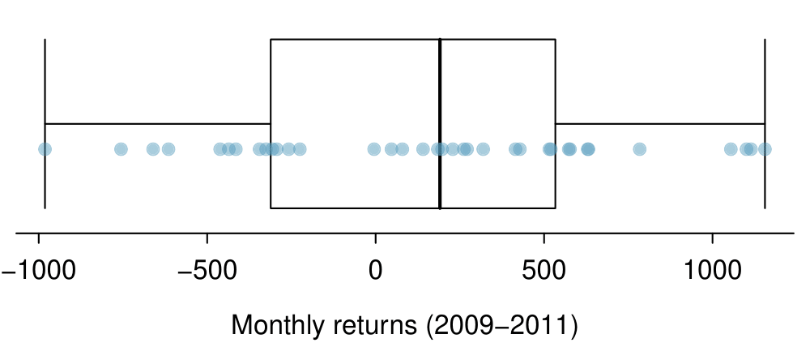

# Probabilidade (tópico especial) {#ch2-prob}

Probabilidade forma uma base para a estatística, e você pode já estar familiarizado com muitos aspectos da probabilidade. No entanto, a formalização dos conceitos é nova para a maioria. Este capítulo tem como objetivo introduzir a probabilidade em termos familiares usando processos que a maioria das pessoas já viu antes.

## Definindo probabilidade (tópico especial) {#basicsOfProbability}

```{example, label = 'probOf1'}
Um dado é um cubo com seis faces numeradas 1, 2, 3, 4, 5 e 6. Qual é a chande de conseguir 1 ao jogar o dado? 
```

Se o dado é honesto, então a chance de um 1 é tão provável quanto a chance de qualquer outro número. Como há seis resultados, a chance deve ser de 1 em 6 ou, equivalentemente, $1/6$.

```{example, label = 'probOf1Or2'}
Qual é a chance de conseguir um 1 ou 2 na próxima rodada? 
```

1 e 2 constituem dois dos seis resultados igualmente prováveis, então a chance de obter um desses dois resultados deve ser $2/6 = 1/3$.

```{example, label = 'probOf123456'}
Qual é a chance de conseguir 1, 2, 3, 4, 5 ou 6 na próima rodada? 
```

100\%. O resultado deve ser um desses números.

```{example, label = probNot2}
Qual é a chande de não sair um 2? 
```


Já que a chance de cair um 2 é $1/6$ ou $16.66\%$, a chance de não cair um 2 deve ser $100\% - 16.66\% = 83.33\%$ ou $5/6$.

Alternativamente, poderíamos ter notado que não caindo 2 é o mesmo que conseguir um 1, 3, 4, 5, ou 6, que compõe cinco dos seis resultados igualmente prováveis e tem probabilidade $5/6$.

```{example, label = 'probOf2Ones'}
Considere jogar dois dados. Se $1/6$ das vezes em que o primeiro dado é um 1 e $1/6$ das vezes o segundo dado é um 1, qual é a chance de conseguir dois 1s?
```


Se em $1/6$ das vezes o primeiro dado é um 1 e $1/6$ dessas vezes o segundo dado também é um 1, então a chance de que ambos os dados são 1 é $(1/6)\times (1/6)$ ou $1/36$.


### Probabilidade {#probability}

Usamos probabilidade para construir ferramentas para descrever e entender a aparente aleatoriedade. Nós geralmente enquadramos a probabilidade em termos de um __processo aleatório__ dando origem a um `resultado`.

\begin{center}
\begin{tabular}{lll}
Role um dado &$\rightarrow$ & 1, 2, 3, 4, 5, ou 6 \\
Jogue uma moeda &$\rightarrow$ & \resp{C} ou \resp{K} \\
\end{tabular}
\end{center}

$$\text{Jogue um dado} \longrightarrow 1, 2, 3, 4, 5 \text{ ou } 6 \\ 
\text{Jogue uma moeda} \longrightarrow \text{cara, coroa}$$

Jogar um dado ou jogar uma moeda é um processo aparentemente aleatório e cada um dá origem a um resultado. 

<div class="alert alert-info">
  <strong>Probabilidade: </strong> A probabilidade de um resultado é a proporção de vezes que o resultado ocorreria se observássemos o processo aleatório um número infinito de vezes.
</div>

A probabilidade é definida como uma proporção e sempre recebe valores no intervalo fechado de 0 a 1. Também pode ser exibido como uma porcentagem entre 0\% e 100\%.

A probabilidade pode ser ilustrada jogando um dado muitas vezes. $\hat{p}_n$ é a proporção de resultados que são 1 após as primeiras $n$ jogadas. À medida que o número de jogadas aumenta, $\hat{p}_n$ irá convergir para a probabilidade de jogar um 1, $p = 1/6$. A Figura \@ref(fig:dieProp) mostra essa convergência para 100.000 jogadas de dados. A tendência de $\hat{p}_n$ estabilizar em torno de $p$ é descrito pela __Lei dos Grandes Números__. 

```{r dieProp, fig.cap = 'A fração de jogadas de dados que deram 1 em cada estágio de uma simulação. A proporção tende a se aproximar da probabilidade 1/6 à medida que o número de jogadas aumenta.'}

library(openintro)
data(COL)

# _____ Simulate _____ #
set.seed(51)
n <- 10^5
x <- sample(0:1, n, TRUE, p = c(5 / 6, 1 / 6))
y <- cumsum(x) / 1:n
X <- c(1:100, seq(102, 500, 2),
	seq(510, 1500, 10), seq(1550, 10000, 50),
	seq(10100, 25000, 100), seq(25250, 100000, 250))
Y <- y[X]

plot(X, Y,
     log = 'x',
     type = 'l',
     xlab = '',
     ylab = '',
     axes = FALSE,
     col = COL[1],
     lwd = 2)
mtext('n (number of rolls)', side = 1, line = 2.5)
abline(h = 1 / 6, lty = 2)
at <- 10^(0:5)
labels <- c('1', '10', '100', '1,000', '10,000', '100,000')
axis(1, at, labels)
axis(2, at = seq(0, 0.3, 0.1))
axis(2, at = seq(0.05, 0.3, 0.1), labels = rep(NA, 3), tcl = -0.15)
at <- 1 / 6
labels <- expression(paste(hat(p)[n]))
axis(2, at, labels,
     line = 2.3,
     tick = FALSE,
     cex.axis = 1.1)
```

<div class="alert alert-info">
  <strong>Lei dos Grandes Números</strong> À medida que mais observações são coletadas, a proporção $\hat{p}_n$ de ocorrências com um determinado resultado converge para a probabilidade $p$ desse resultado.
</div>

Ocasionalmente, a proporção se desviará da probabilidade e parecerá desafiar a Lei dos Grandes Números, como acontece com $\hat{p}_n$ muitas vezes, pela Figura \@ref(fig:dieProp). No entanto, esses desvios diminuem à medida que o número de jogadas aumenta.

Acima, escrevemos $p$ como a probabilidade de lançar um 1. Também podemos escrever essa probabilidade como

\begin{eqnarray*}
P(\text{lançar um 1})
\end{eqnarray*}

À medida que nos tornarmos mais confortáveis com essa notação, vamos abreviá-la ainda mais. Por exemplo, se está claro que o processo é "jogar um dado", nós poderíamos abreviar $P($lançando um 1$)$ como $P(1)$. 

***
```{exercise, label = 'randomProcessExercise'}

Processos aleatórios incluem jogar um dado e lançar uma moeda. (a) Pense em outro processo aleatório. (b) Descreva todos os resultados possíveis desse processo. Por exemplo, jogar um dado é um processo aleatório com possíveis resultados $1, 2, \dots, 6$.^[Aqui estão quatro exemplos. (i) Se alguém fica doente no próximo mês ou não é um processo aparentemente aleatório com os resultados *doente* e *não doente*. (ii) Podemos gerar um processo aleatório escolhendo aleatoriamente uma pessoa e medindo a altura dessa pessoa. O resultado deste processo será um número positivo. (iii) Se o mercado de ações sobe ou desce na próxima semana é um processo aparentemente aleatório com possíveis resultados *cima*, *baixo*, e *sem mudança*. Alternativamente, poderíamos ter usado a variação percentual no mercado de ações como um resultado numérico. (iv) Se o seu colega de quarto limpa os seus pratos esta noite, provavelmente parece ser um processo aleatório com possíveis resultados *limpa* e *não limpa*.]

```

***

O que pensamos como processos aleatórios não são necessariamente aleatórios, mas podem ser muito difíceis de entender exatamente. O quarto exemplo na solução de nota de rodapé para a Prática Orientada \@ref(exr:randomProcessExercise) sugere que o comportamento de um colega de quarto é um processo aleatório. No entanto, mesmo que o comportamento de um colega de quarto não seja verdadeiramente aleatório, modelar seu comportamento como um processo aleatório ainda pode ser útil.

<div class="alert alert-info">
  <strong>Modelando um processo como aleatório</strong> Pode ser útil modelar um processo como aleatório, mesmo que não seja verdadeiramente aleatório.
</div>


### Resultados disjuntos ou mutuamente exclusivos {#disjointMutuallyExclusiveResults}

Dois resultados são chamados de __disjuntos__ ou __mutuamente exclusivos__ se ambos não puderem acontecer. Por exemplo, se jogarmos um dado, os resultados 1 e 2 são disjuntos, pois não podem ocorrer. Por outro lado, os resultados 1 e *jogar um número ímpar* não são disjuntos, pois ambos ocorrem se o resultado do teste for um 1. Os termos __disjunto__ e __mutuamente exclusivos__ são equivalentes e intercambiáveis.

Calcular a probabilidade de desfechos desarticulados é fácil. Ao jogar um dado, os resultados 1 e 2 são disjuntos e calculamos a probabilidade de que um desses resultados ocorra, adicionando suas probabilidades separadas:


\begin{eqnarray*}
P(\text{1 ou 2}) = P(\text{1}) + P(\text{2}) = 1/6 + 1/6 = 1/3
\end{eqnarray*}


Quanto à probabilidade de lançar um 1, 2, 3, 4, 5, ou 6? Aqui, novamente, todos os resultados são disjuntos, então adicionamos as probabilidades:


\begin{eqnarray*}
&&P(\text{1 ou 2 ou 3 ou 4 ou 5 ou 6}) \\
	&&\quad= P(\text{1})+P(\text{2})+P(\text{3})+P(\text{4})+P(\text{5})+P(\text{6}) \\
	&&\quad= 1/6 + 1/6 + 1/6 + 1/6 + 1/6 + 1/6 = 1.
\end{eqnarray*}


A __Regra da Adição__ garante a precisão desta abordagem quando os resultados são disjuntos. 

<div class="alert alert-info">
  <strong>Regra da adição de resultados disjuntos</strong> Se $A_1$ e $A_2$ representam dois desfechos disjuntos, então a probabilidade de que um deles ocorra é dada por
  
\begin{eqnarray*}
P(A_1\text{ ou } A_2) = P(A_1) + P(A_2)
\end{eqnarray*}

Se houver muitos resultados disjuntos $A_1,\dots, A_k$, então a probabilidade de que um desses resultados ocorra é

\begin{eqnarray}
P(A_1) + P(A_2) + \cdots + P(A_k)
\end{eqnarray}
</div>

***
```{exercise}
Estamos interessados na probabilidade de rolar um 1, 4, ou 5. 

(a) Explicar porque os resultados 1, 4, e 5 são disjuntos. 

(b) Aplicar a Regra da Adição para resultados disjuntos para determinar $P(1 ou 4 ou 5)$.^[(a) O processo aleatório é jogar um dado e, no máximo, um desses resultados pode surgir. Isso significa que eles são resultados disjuntos (b) $P(1 ou 4 ou 5$) = P(1) + P(4) + P(5) = \frac{1}{6} + \frac{1}{6} + \frac{1}{6} = \frac{3}{6} = \frac{1}{2}$]
```

***

***
```{exercise}
No banco de dados `email` da introdução, a variável _número_ descreveu se nenhum número, apenas um ou mais números pequenos, ou se pelo menos um grande número apareceu em um email. Dos 3.921 e-mails, 549 não tinham números, 2.827 tinham apenas um ou mais números pequenos e 545 tinham pelo menos um número grande. 

(a) Os resultados __nenhum__, __pequeno__, e __grande__ são  disjuntos? 

(b) Determinar a proporção de emails com valor __pequeno__ e __grande__, separadamente. 

(c) Use a Regra da Adição para resultados disjuntos para calcular a probabilidade de um e-mail selecionado aleatoriamente do conjunto de dados ter um número, pequeno ou grande.^[(a) Sim. Cada email é categorizado em apenas um nível de número. (b) Pequeno: $\frac{2827}{3921} = 0.721$. Grande: $\frac{545}{3921} = 0.139$. (c) $P(\text{pequeno ou grande}) = P(\text{pequeno}) + P(\text{grande}) = 0.721 + 0.139 = 0.860$.]
```

***

Suponha que $A$ representa o evento no qual um lançamento de dados resulta 1 ou 2 e $B$ representa o evento que o dado é um 4 ou 6. Escrevemos $A$ como o conjunto de resultados $\{1,2\}$ e $B = \{4, 6\}$. Esses conjuntos são comumente chamados de __eventos__. Como $A$ e $B$ não possuem elementos em comum, eles são eventos disjuntos. $A$ e $B$ estão representados na Figura \@ref(fig:disjointSets).

```{r disjointSets, fig.cap = 'Três eventos, A, B e D, consistem em resultados do lançamento de um dado. A e B são disjuntos, pois não tem nenhum resultado em comum.'}

library(openintro)
data(COL)

par(mar = rep(0, 4))
plot(c(0.05, 0.95),
     c(0.13, 0.82),
     type = 'n',
     axes = FALSE)

for(i in 1:6){
  text(i / 7, 0.5, i)
}
theta <- seq(0, 2 * pi, length.out = 100)

# _____ A _____ #
lines(1 / 7 * cos(theta) + 1.5 / 7,
      1 / 6 * sin(theta) + 0.5,
      col = COL[1])
text(1.5 / 7, 0.75, 'A', col = COL[1])

# _____ B _____ #
x <- 1 / 15 * cos(seq(3 * pi / 2, 3 * pi-0.3, length.out = 40)) + 6 / 7
y <- 1 / 6 * sin(seq(3 * pi / 2, 3 * pi, length.out = 40)) + 0.5
x <- c(x, seq(11 / 14, 9 / 14, length.out = 10))
y <- c(y, seq(-0.3, 0.3, length.out = 10)^2 + 0.4)
x <- c(x, 1 / 15 * cos(seq(0.3, 3 * pi / 2, length.out = 40)) + 4 / 7)
y <- c(y, 1 / 6 * sin(seq(0, 3 * pi / 2, length.out = 40)) + 0.5)
x <- c(x, x[1])
y <- c(y, y[1])
lines(x, y, lty = 2, col = COL[2])
text(5 / 7, 0.2, 'B', col = COL[2])

# _____ D _____ #
lines(1 / 7 * cos(theta) + 2.5 / 7,
      1 / 6 * sin(theta) + 0.5,
      lty = 3,
      col = COL[4],
      lwd = 2.425)
text(2.5 / 7, 0.75, 'D', col = COL[4])

```


A Regra da Adição aplica-se tanto a resultados disjuntos quanto a eventos disjuntos. A probabilidade de que um dos eventos disjuntos $A$ ou $B$ ocorra é a soma das probabilidades separadas:

\begin{align*}
P(A\text{ ou }B) = P(A) + P(B) = 1/3 + 1/3 = 2/3
\end{align*}

***
```{exercise}
(a) Verifique a probabilidade do evento $A$, $P(A) = 1/3$ usando a Regra da Adição. 

(b) Faça o mesmo para o evento $B$.^[(a) $P(A) = P(1 ou 2) = P(1) + P(2) = \frac{1}{6} + \frac{1}{6} = \frac{2}{6} = \frac{1}{3}$. (b) Similarmente, $P(B) = 1/3$.]
```

***

***
```{exercise, label = 'exerExaminingDisjointSetsABD'}
(a) Usando Figura \@ref(fig:disjointSets) como referência, que resultados são representados pelo evento $D$? 
  
(b) Os eventos $B$ e $D$ são disjuntos? 
  
(c) Os eventos $A$ e $D$ são disjuntos?^[(a) Resultados 2 e 3. (b) Sim, Os eventos $B$ e $D$ são disjuntos porque não compartilham resultados. (c) Os eventos $A$ e $D$ compartilham um resultado em comum, 2, e portanto não são disjuntos]
```

***

***
```{exercise}
Na Prática Orientada \@ref(exr:exerExaminingDisjointSetsABD), você confirmou que $B$ e $D$ da Figura \@ref(fig:disjointSets) são disjuntos. Calcule a probabilidade de que o evento $B$ ou evento $D$ ocorra.^[Como $B$ e $D$ são eventos disjuntos, use a regra da adição: $P(B \text{ ou } D) = P(B) + P(D) = \frac{1}{3} + \frac{1}{3} = \frac{2}{3}$.]
```

***

### Probabilidades quando os eventos não são disjuntos {#probabilityEventsNotDisjoint}

Vamos considerar cálculos para dois eventos que não são disjuntos no contexto de um __baralho padrão de 52 cartas__. Se você não estiver familiarizado com as cartas em um baralho regular, consulte a nota de rodapé.^[As 52 cartas são divididas em quatro naipes: $\clubsuit$ (paus), $\diamondsuit$ (ouros), $\heartsuit$ (copas) e $\spadesuit$ (espadas). Cada naipe tem suas 13 cartas rotulados: $2, 3, \dots, 10, J (valete), Q (rainha), K (rei), e A (ás)$. Assim, cada carta é uma combinação única de um naipe e um rótulo, por exemplo 4$\heartsuit$ e J$\clubsuit$. As 12 cartas representadas pelos valetes, rainhas e reis são chamadas figuras. As cartas que são $\diamondsuit$ ou $\heartsuit$ são tipicamente vermelhas enquanto os outros dois naipes são tipicamente de cor preta.

***
```{exercise}
(a) Qual é a probabilidade de uma carta selecionada aleatoriamente ser um ouro? 
  
(b)Qual é a probabilidade de uma carta selecionada aleatoriamente ser um carta de figura?^[(a) Existem 52 cartas e 13 ouros. Se as cartas são embaralhadas, cada carta tem uma chance igual de ser sorteada, então a probabilidade de uma carta selecionada aleatoriamente ser um ouro é $P(\diamondsuit) = \frac{13}{52} = 0.250$. (b) Da mesma forma, existem 12 figuras, então $P(\text{figuras}) = \frac{12}{52} = \frac{3}{13} = 0.231$.]
```

***

Os __Diagramas de Venn__ são úteis quando os resultados podem ser categorizados como dentro ou fora para duas ou três variáveis, atributos ou processos aleatórios. O diagrama de Venn na Figura \@ref(fig:cardsDiamondFaceVenn) usa um círculo para representar ouros e outro para representar cartas de figura. Se uma carta é um ouro e uma carta de figura, ela cai na interseção dos círculos. Se for um ouro, mas não uma carta de figura, ele será parte do círculo esquerdo que não está no círculo direito (e assim por diante). O número total de cartas que são ouro é dado pelo número total de cartas no círculo de ouros: $10+3=13$. As probabilidades também são mostradas (por ex. $10/52 = 0.1923$).

```{r cardsDiamondFaceVenn, fig.cap='Um diagrama de Venn para ouros e cartas de figura.'}
library(openintro)
data(COL)

plot(c(0.2, 2.5),
     c(-0.13, 1.15),
     type = 'n',
     axes = FALSE)

z <- seq(0,2 * pi, len = 99)
x2 <- cos(z) / 2 + 1.3
y2 <- sin(z) / 3 + 0.5
polygon(c(x2, x2[1]), c(y2, y2[1]), col = COL[3,3])

x1 <- cos(z) / 2 + 0.7
y1 <- sin(z) / 3 + 0.5
polygon(c(x1, x1[1]),c(y1, y1[1]), col = COL[1,3])

text(c(0.55, 1, 1.45),
     rep(0.57, 3),
     c(10, 3, 9),
     cex = c(1.3, 1.2, 1.3))
text(c(0.55, 1, 1.45),
     c(0.41, 0.43, 0.41),
     c('0.1923', '0.0577', '0.1731'),
	 cex = c(1, 0.9, 1))
# text(0.5, -0.25, 'Other cards: 30', cex = 0.8)
# text(0.98, -0.26, '(0.5769)', cex = 0.8)
text(2.25, 0.55, cex = 0.8,
     paste("There are also", "30 cards that are",
           "neither diamonds", "nor face cards", sep = "\n"))
# text(2.25, 0.28, '(0.5769)', cex = 0.8)
Braces(0.7, 0.92, 3 * pi / 2, 0.98, 0.12)
text(0.7, 1.09, 'Diamonds, 0.2500')
Braces(1.3, 0.08, pi / 2, 0.98, 0.12)
text(1.3, -0.08, 'Face cards, 0.2308')

```

***
```{exercise}
Utilizando a Figura \@ref(fig:cardsDiamondFaceVenn), verifique que $P(\text{figura}) = 12/52 = 3/13$^[O diagrama de Venn mostra que as cartas figuras estão separadas em: *carta de figura mas não é de ouro* e *carta de figura e de ouro*. Já que são eventos disjuntos, a probabilidade é dada pela soma das probabilidades dos dois eventos $\frac{3}{52} + \frac{9}{52} = \frac{12}{52} = \frac{3}{13}$]
```

***

$A$ representa o evento em que uma carta selecionada aleatoriamente é um ouro e $B$ representa o evento que é uma carta de figura. Como calculamos $P(A \text{ ou } B)$? Eventos $A$ e $B$ não são disjuntos -- as cartas $J\diamondsuit, Q\diamondsuit$, e $K\diamondsuit$ caem em ambas as categorias - por isso não podemos usar a Regra da Adição para eventos disjuntos. Em vez disso, usamos o diagrama de Venn. Começamos adicionando as probabilidades dos dois eventos:

\begin{eqnarray}
P(A) + P(B)
  = P({\diamondsuit}) + P(\text{figuras})
  = 13/52 + 12/52
  (\#eq:overCountFaceDiamond)
\end{eqnarray}


No entanto, as três cartas que estão em ambos os eventos foram contadas duas vezes, uma vez em cada probabilidade. Devemos corrigir essa contagem dupla:

\begin{eqnarray}
P(A\text{ ou } B) &=&P(\diamondsuit\text{ ou figura}) \\
  &=& P({\color{redcards}\diamondsuit}) + P(\text{figura}) - P({\color{redcards}\diamondsuit}\text{ e figura})  \\
  &=& 13/52 + 12/52 - 3/52 \\
  &=& 22/52 = 11/26 
    (\#eq:diamondFace)
\end{eqnarray}

A Equação \@ref(eq:diamondFace) é um exemplo da __Regra Geral da Adição__. 

<div class="alert alert-info">
  <strong>Regra Geral da Adição</strong> Se $A$ e $B$ são quaisquer dois eventos, disjuntos ou não, então a probabilidade de que pelo menos um deles ocorra é
  
\begin{eqnarray}
P(A\text{ ou }B) = P(A) + P(B) - P(A\text{ e }B)
(\#eq:generalAdditionRule)
\end{eqnarray}

onde $P(A \text{ e }B)$ é a probabilidade de que ambos os eventos ocorram.
</div>

<div class="alert alert-info">
  <strong>ou é inclusivo</strong> Quando escrevemos *ou* em estatística, queremos dizer e/ou, a menos que declaremos explicitamente o contrário. Assim, $A$ ou $B$ ocorrer significa que $A$, $B$, ou ambos $A$ e $B$ ocorrem.
</div>

***
```{exercise}
(a) Se $A$ e $B$ forem disjuntos, descreva porque isso implica $P(A$ e $B) = 0$. 

(b) Usando a parte (a), verifique se a Regra da Adição Geral engloba a regra de adição para eventos disjuntos se $A$ e $B$ forem disjuntos^[(a) Se $A$ e $B$ forem disjuntos, $A$ e $B$ nunca podem ocorrer simultaneamente. (b) Se $A$ e $B$ são disjuntos, então o último termo da Equação \@ref(eq:generalAdditionRule) é 0 (veja a parte (a)) e ficamos com a regra da adição para eventos disjuntos.]
```

***

***
```{exercise, label = 'emailSpamNumberVennExer'}
No banco de dados `email` com 3.921 e-mails, 367 eram spam, 2.827 continham alguns números pequenos, mas não números grandes, e 168 tinham ambas as características. Crie um diagrama de Venn para este exemplo^[A imagem fica a critério do aluno fazer].
```

***

***
```{exercise}
(a) Use seu diagrama de Venn da Prática Orientada \@ref(exr:emailSpamNumberVennExer) para determinar a probabilidade de um e-mail tirado aleatoriamente do conjunto de dados ser spam e ter números pequenos (mas não números grandes). 

(b) Qual é a probabilidade de que o email tenha um desses atributos?^[(a) A solução é representada pela interseção dos dois círculos: 0.043. (b) Esta é a soma das três probabilidades disjuntas mostradas nos círculos: $0.678 + 0.043 + 0.051 = 0.772$.]
```

***

### Distribuições de probabilidade {#probabilityDistribution}


A __distribuição de probabilidade__ é uma tabela de todos os resultados separados e suas probabilidades associadas. Tabela \@ref(tab:diceProb) mostra a distribuição de probabilidade para a soma de dois dados. 

```{r diceProb, warning=FALSE}

tab1 <- rbind(c(2:12), c('1/36', '2/36', '3/36', '4/36', '5/36', '6/36', 
                         '5/36', '4/36', '3/36', '2/36', '1/36'))

rownames(tab1) <- c('Soma dos Dados', 'Probabilidade')

knitr::kable(tab1, caption = 'Distribuição de probabilidade da soma de dois dados.', 
             align = 'c')

```

<div class="alert alert-info">
  <strong>Regras para distribuições de probabilidade</strong> Uma distribuição de probabilidade é uma lista dos resultados possíveis com probabilidades correspondentes que satisfazem três regras:
  
+ Os resultados listados devem ser separados.

+ Cada probabilidade deve estar entre 0 e 1.

+ As probabilidades devem totalizar 1.
</div>

***
```{exercise, label = 'usHouseholdIncomeDistsExercise'}
Tabela \@ref(tab:usHouseholdIncomeDists) sugere três distribuições para renda familiar nos Estados Unidos. Apenas uma está correta. Qual deles deve ser? O que há de errado com as outras duas?^[As probabilidades de (a) não somam 1. A segunda probabilidade em (b) é negativa. Isso deixa (c), que com certeza satisfaz os requisitos de uma distribuição. Um dos três foi dito ser a distribuição real dos rendimentos das famílias dos EUA, por isso deve ser (c).]
```

***

```{r usHouseholdIncomeDists}
tab2 = cbind(c(0.18, 0.38, 0.28), c(0.39, -0.27, 0.27), 
             c(0.33, 0.52, 0.29), c(0.16, 0.37, 0.16))

rownames(tab2) <- c('(a)', '(b)', '(c)')
colnames(tab2) <- c('0-25', '25-50', '50-100', '100+')

knitr::kable(tab2, align = 'c', caption = 'Propostas de distribuições de renda familiar nos EUA')
```

Capítulo anterior enfatizou a importância de plotar dados para fornecer resumos rápidos. As distribuições de probabilidade também podem ser resumidas em um gráfico de barras. Por exemplo, a distribuição dos rendimentos familiares nos EUA é mostrada na Figura \@ref(fig:usHouseholdIncomeDistBar) como um gráfico de barra.^[Também é possível construir um gráfico de distribuição quando a renda não é artificialmente colocada em quatro grupos. As distribuições __contínuas__ são consideradas na Seção \@ref(contDist).]

A distribuição de probabilidade para a soma de dois dados é mostrada na Tabela \@ref(tab:diceProb) e plotado na Figura \@ref(fig:diceSumDist).

```{r usHouseholdIncomeDistBar, fig.cap = 'A distribuição de probabilidade da renda familiar dos EUA.'}
temp <- data.frame(p = c(0.28, 0.27, 0.29, 0.16), 
                   name = c('0-25', '25-50', '50-100', '100+'))

temp$name <- factor(temp$name, levels = c('0-25', '25-50', '50-100', '100+'))


require(ggplot2)

ggplot(data = temp) + 
  geom_col(aes(x = name, y = p), fill = 'skyblue3') + 
  labs(x = 'Renda Familiar do US ($1000s)', y = 'Probabilidade') + 
  theme(panel.border = element_rect(colour = "black", fill = NA, size = 1))

```


```{r diceSumDist, fig.cap='A distribuição de probabilidade da soma de dois dados.'}
library(openintro)
data(COL)

probDist <- function(x,
                     prob,
                     labels1 = NA,
                     labels2 = NA,
                     thickness = NA,
                     col = NA,
                     ylim = NULL,
                     ...) {
  R <- range(x)
  R <- R + c(-1,1)*(R[2]-R[1])/20
  Ry <- c(0, range(prob)[2])
  if (!is.null(ylim)[1]) {
    Ry <- ylim
  }
  plot(x, prob, type = 'n', axes = F, xlim = R, ylim = Ry, ...)
  if(is.na(labels1)[1]) labels1 <- x
  if(is.na(labels2)[1]) labels2 <- TRUE
  axis(1, at = x, labels = labels1)
  make.bar(x, prob, thickness = thickness, col = col)
}

make.bar <- function(at,
                     height,
                     thickness = NA,
                     col = NA) {
  if (is.na(thickness)) {
    R <- range(at)
    minDiff <- min(diff(at))
    thickness <- min(c(minDiff), (R[2]-R[1])/12)
  }
  x1 <- at - thickness/2
  x2 <- at + thickness/2
  if (is.na(col)) {
    col <- 'grey'
  }
  for (i in 1:length(at)) {
    rect(x1[i], 0, x2[i], height[i], col = col)
  }
}

at = 2:12
prob = c(1:6, 5:1)/36


probDist(at, prob,
         xlab = 'Dice sum',
         ylab = '',
         thickness = 0.5,
         col = COL[1])
abline(h = 0)
axis(2)
mtext('Probability', side = 2, 3.3, las = 0)
```


Nestas colunas de barras, as alturas das barras representam as probabilidades de resultados. Se os resultados forem numéricos e discretos, geralmente é (visualmente) conveniente fazer um gráfico de barras que se pareça com um histograma, como no caso da soma de dois dados. Outro exemplo de gráfico de barras em suas respectivas localizações é mostrado na Figura \@ref(fig:bookCostDist).

### Complemento de um evento {#complementEvent}

Jogar um dado produz um valor no conjunto $\{1, 2, 3, 4, 5, 6\}$. Esse conjunto de todos os resultados possíveis é chamado de __espaço amostral__ ($S$)

Vamos considerar que $D=\{2, 3\}$ representa o evento que o resultado de um rolamento de dados é 2 ou 3. Então o _complemento_ do $D$ representa todos os resultados em nosso espaço amostral que não estão em $D$, que é denotado por $D^c = \{1, 4, 5, 6\}$. Ou seja, $D^c$ é o conjunto de todos os resultados ainda possíveis e não incluídos no $D$. A Figura \@ref(fig:complementOfD) mostra a relação entre $D$, $D^c$, e o espaço amostral $S$. 

```{r complementOfD, fig.cap = 'Evento D = {2, 3} e seu complemento {1, 4, 5, 6}. S representa o espaço amostral, que é o conjunto de todos os resultados possíveis.'}
library(openintro)
data(COL)

par(mar = rep(0, 4))
plot(c(-0.05, 1), c(0.18, 0.92), type = 'n', axes = FALSE)

for(i in c(1,4,5,6)){
  text(i / 7, 0.5, i)
}
for(i in 2:3){
  text(i / 7, 0.55, i)
}
theta <- seq(0,2 * pi,length.out = 100)

# _____ D _____ #
lines(1 / 7 * cos(theta) + 2.5 / 7,
      1 / 9 * sin(theta) + 0.55,
      lty = 3,
      col = COL[4],
      lwd = 2.425)
text(2.5 / 7, 0.75, 'D', col = COL[4])

# _____ D^c _____ #
x <- 1 / 20 * cos(seq(0.5, 3 * pi / 2, length.out = 20)) + 1 / 7
y <- 1 / 5 * sin(seq(0.2, 3 * pi / 2, length.out = 20)) + 0.5
x <- c(x, 1 / 20 * cos(seq(-pi / 2, pi / 2, length.out = 20)) + 6 / 7)
y <- c(y, 0.175 * sin(seq(-pi / 2, pi / 2, length.out = 20)) + 0.47)
x <- c(x, 1 / 20 * cos(seq(pi / 2, pi, length.out = 10)) + 4 / 7)
y <- c(y, 1 / 5 * sin(seq(pi / 2, pi-0.5, length.out = 10)) + .45)
x <- c(x, seq(1 / 2, 3 / 14, length.out = 10))
y <- c(y, seq(-0.35, 0.35, length.out = 10)^2 + 0.33)
x <- c(x, x[1])
y <- c(y, y[1])
lines(x, y, lty = 2, col = COL[2])
text(5 / 7, 0.75, expression(D^C), col = COL[2])

# _____ S _____ #
x <- 1 / 10 * cos(seq(pi / 2, 3 * pi / 2, length.out = 20)) + 1 / 9
y <- 1 / 3 * sin(seq(pi / 2, 3 * pi / 2, length.out = 20)) + 0.55
x <- c(x, 1 / 10 * cos(seq(-pi / 2, pi / 2, length.out = 20)) + 8 / 9)
y <- c(y, 1 / 3 * sin(seq(-pi / 2, pi / 2, length.out = 20)) + 0.55)
#x <- c(x, 1 / 20 * cos(seq(pi / 2, pi, length.out = 10)) + 4 / 7)
#y <- c(y, 1 / 5 * sin(seq(pi / 2, pi-0.5, length.out = 10)) + .45)
#x <- c(x, seq(1 / 2, 3 / 14, length.out = 10))
#y <- c(y, seq(-0.35, 0.35, length.out = 10)^2 + 0.33)
x <- c(x, x[1])
y <- c(y, y[1])
lines(x, y, lty = 1, col = COL[1])
text(0, 0.55, expression(S), col = COL[1], pos = 2, cex = 1.3)

```

***
```{exercise}
(a) Calcule $P(D^c) = P(\text{lançar um} 1, 4, 5,\text{ ou }6)$. 

(b) Qual é a $P(D) + P(D^c)$?^[(a) Os resultados são disjuntos e cada um tem probabilidade $1/6$, então a probabilidade total é $4/6 = 2/3$. (b) Nós também podemos ver isso $P(D)=\frac{1}{6} + \frac{1}{6} = 1/3$. Desde que $D$ e $D^c$ são disjuntos, $P(D) + P(D^c) = 1$.]
```

***

***
```{exercise}
Eventos $A=\{1, 2, 4, 6\}$ são mostrados na Figura \@ref(fig:disjointSets). 

(a) Escreva o que $A^c$ e $B^c$ representam. 

(b)Calcule $P(A^c)$ e $P(B^c)$. 

(c)Calcule $P(A)+P(A^c)$ e $P(B)+P(B^c)$.^[Soluções breves: (a) $A^c = \{3, 4, 5, 6\}$ e $B^c=\{1,2,3,5\}$. (b) Observando que cada resultado é disjunto, adicione as probabilidades dos resultados individuais para obter $P(A^c)=2/3$ e $P(B^c)=2/3$. (c) $A$ e $A^c$ são disjuntos, e o mesmo vale para $B$ e $B^c$. Assim sendo, $P(A) + P(A^c) = 1$ e $P(B) + P(B^c) = 1$.]
```

***

Um complemento de um evento $A$ é construído para ter duas propriedades muito importantes: (i) todo resultado possível não em $A$ é em $A^c$, e (ii) $A$ e $A^c$ são disjunto. Propriedade (i) implica

\begin{eqnarray}
P(A\text{ ou }A^c) = 1
(\#eq:complementSumTo1)
\end{eqnarray}

Isto é, se o resultado não estiver em $A$, deve ser representado em $A^c$. Usamos a regra da adição para eventos separados para aplicar a propriedade (ii):

\begin{eqnarray}
P(A\text{ ou }A^c) = P(A) + P(A^c)
(\#eq:complementDisjointEquation)
\end{eqnarray}

Combinando as Equações \@ref(eq:complementSumTo1} e \@ref(eq:complementDisjointEquation) rende uma relação muito útil entre a probabilidade de um evento e seu complemento.

<div class="alert alert-info">
  <strong>Complemento</strong> O complemento do evento $A$ é denotado por $A^c$ e representa todos os resultados que não estão em~ $A$. $A$ e $A^c$ estão matematicamente relacionados: 
  
\begin{eqnarray}
P(A) + P(A^c) = 1, \text{ i.e. } P(A) = 1-P(A^c)
(\#eq:complement)
\end{eqnarray}

</div>

Em exemplos simples, a computação de $A$ ou $A^c$ é viável em poucos passos. No entanto, usar o complemento pode economizar muito tempo à medida que os problemas aumentam em complexidade.

***
```{exercise}
Vamos representar $A$ o evento onde jogamos dois dados e o total deles é menor que 12. 

(a) O que o evento $A^c$ representa? 

(b) Determine $P(A^c)$ da Tabela \@ref(tab:diceProb). 

(c) Determine $P(A)$.^[(a) O complemento de $A$: quando o total é igual a 12. (b) $P(A^c) = 1/36$. (c) Use a probabilidade do complemento da parte (b), $P(A^c) = 1/36$, e Equação \@ref(eq:complement): $P(\text{menos do que }12) = 1 - P(12) = 1 - 1/36 = 35/36$.]
```

***

***
```{exercise}
Considere novamente as probabilidades da Tabela \@ref(tab:diceProb) e o jogar dois dados. Encontre as seguintes probabilidades: 

(a) A soma dos dados _não_ é 6. 

(b) A soma é pelo menos 4. Ou seja, determine a probabilidade do evento $B=\{4, 5, \dots, 12\}$. 

(c) A soma não é mais que 10. Ou seja, determine a probabilidade do evento $D=\{2, 3, \dots, 10\}$.^[(a) Primeiro ache $P(6)=5/36$, então use o complemento: $P(\text{não }6) = 1 - P(6) = 31/36$. (b) Primeiro, encontre o complemento, que requer muito menos esforço: $P(2 \text{ ou } 3)=1/36+2/36=1/12$. Então calcule $P(B) = 1-P(B^c) = 1-1/12 = 11/12$. (c) Como antes, encontrar o complemento é a maneira inteligente de determinar $P(D)$. Primeiro ache $P(D^c) = P(11 \text{ ou } 12)=2/36 + 1/36=1/12$. Então calcule $P(D) = 1 - P(D^c) = 11/12$.]
```

***

### Independência {#probabilityIndependence}

Assim como variáveis e observações podem ser independentes, processos aleatórios podem ser independentes também. Dois processos são **independentes**,  se conhecer o resultado de um não fornece informações úteis sobre o resultado do outro. Por exemplo, jogar uma moeda e jogar um dado são dois processos independentes -- saber que a moeda é cara não ajuda a determinar o resultado de um lançamento de dados. Por outro lado, os preços das ações geralmente sobem ou descem juntos, então eles não são independentes.

O Exemplo \@ref(exm:probOf2Ones) fornece um exemplo básico de dois processos independentes: jogar dois dados. Queremos determinar a probabilidade de ambos serem 1. Suponha que um dos dados seja vermelho e o outro branco. Se o resultado do dado vermelho for 1, ele não fornece informações sobre o resultado do dado branco. Nós encontramos a mesma pergunta pela primeira vez no Exemplo \@ref(exm:probOf2Ones), onde calculamos a probabilidade usando o seguinte raciocínio: $1/6$ das vezes o dado vermelho é um 1, e $1/6$ dessas vezes o dado branco também será 1. Isso é ilustrado na Figura \@ref(fig:indepForRollingTwo1s). Como os testes são independentes, as probabilidades dos resultados correspondentes podem ser multiplicadas para obter a resposta final: $(1/6)\times(1/6)=1/36$. Isso pode ser generalizado para muitos processos independentes.

```{r indepForRollingTwo1s, fig.cap = '1/6 das vezes, a primeira jogada é um 1. Então 1/6 dessas vezes, a segunda jogada também será um 1.'}

library(openintro)
data(COL)

par(mar = rep(0, 4))
plot(0:1, c(0, 1.1), type = 'n', axes = FALSE)
x <- cos(seq(0, 2 * pi, length.out = 99))
y <- sin(seq(0, 2 * pi, length.out = 99))
#lines(x / 2 + 0.5, y / 2 + 0.5)
text(0, 1.05, pos = 4, 'All rolls')
rect(0, 0, 1, 1)
rect(1/6, 0, 2/6, 1,
     lty = 2,
     border = COL[1],
     col = COL[1,3])
text(2/6, 0.7,
     '1/6th of the first\nrolls are a 1.',
     pos = 4,
     col = COL[1])
rect(1/6, 1/6, 2/6, 2/6,
     lty = 3,
     border = "#00000000",
     col = COL[2])
the.text <- paste("1/6th of those times where",
                  "the first roll is a 1 the",
                  "second roll is also a 1.",
                  sep  =  "\n")
text(2 / 6, 3 / 12 - 0.02,
    the.text,
    pos = 4,
    col = COL[2])

```

```{example, label = 'threeDice'}
Se houvesse também um dado azul independente dos outros dois? Qual é a probabilidade de jogar os três dados e obter todos os 1s?
```

A mesma lógica se aplica a partir do Exemplo \@ref(exm:probOf2Ones). Se $1/36$ das vezes  os dados brancos e vermelhos são ambos 1, então $1/6$ dessas vezes o dado azul também será 1, então multiplique:

\begin{align*}
P(\text{branco} = 1 \text{ e vermelho } = 1 \text{ e azul } = 1) \\
= P(\text{branco} = 1) \times P(\text{vermelho } = 1) \times P(\text{azul } = 1) \\
= 1/6 \times 1/6 \times 1/6 = 1/216.
\end{align*} 


O Exemplo \@ref(exm:threeDice) ilustra o que é chamado de Regra da Multiplicação para processos independentes,

<div class="alert alert-info">
  <strong>Regra da Multiplicação para processos independentes</strong> Se $A$ e $B$ representam eventos de dois processos diferentes e independentes, então a probabilidade de ocorrer tanto $A$ como $B$ pode ser calculada como o produto de suas probabilidades separadas: 
  
\begin{eqnarray}
P(A \text{ e }B) = P(A) \times  P(B)
(\#eq:eqForIndependentEvents)
\end{eqnarray}

Da mesma forma, se houver $k$ eventos $A_1,\dots, A_k$ de $k$ processos independentes, então a probabilidade de que todos ocorram é 

\begin{eqnarray*}
P(A_1) \times  P(A_2)\times  \cdots \times  P(A_k)
\end{eqnarray*}
</div>

***
```{exercise, label = 'ex2Handedness'}
Cerca de 9\% das pessoas são canhotas. Suponha que duas pessoas sejam selecionadas aleatoriamente da população dos EUA. Como o tamanho da amostra de 2 é muito pequeno em relação à população, é razoável supor que essas duas pessoas sejam independentes. (a) Qual é a probabilidade de ambos serem canhotos? (b) Qual é a probabilidade de ambos serem destros?^[(a) A probabilidade da primeira pessoa ser canhota é de $0,09$, o que é o mesmo para a segunda pessoa. Aplicamos a regra de multiplicação para processos independentes para determinar a probabilidade de ambos serem canhotos: $0.09 \times 0.09 = 0.0081$. (b) É razoável supor que a proporção de pessoas que são ambidestras (tanto destros quanto canhotos) é quase 0, o que resulta em $P(\text{destro}) = 1 - 0.09 = 0.91$. Usando o mesmo raciocínio como em parte (a), a probabilidade de ambos serem destros é $0.91 \times 0.91 = 0.8281$.]
```

***

***
```{exercise, label = 'ex5Handedness'}

Suponha que 5 pessoas sejam selecionadas aleatoriamente.^[(a) As abreviações D e C são usadas para destros e canhotos, respectivamente. Como cada um é independente, aplicamos a regra de multiplicação para processos independentes: $P(\text{todos são D}) = P(\text{primeiro} = D, \text{ segundo } = D, \dots, \text{ quinto } = D) = P(\text{primeiro } = D)\times P(\text{segundo} = D)\times  \dots \times P(\text{quinto }= D) = 0.91\times 0.91\times 0.91\times 0.91\times 0.91 = 0.624$ (b) Usando o mesmo raciocínio que (a), $0,09\times 0,09\times 0,09\times 0,09\times 0,09 = 0,0000059$. (c) Use o complemento, $P(\text{todos os cinco são D})$, para responder a esta pergunta: $P(\text{nem todos D}) = 1 - P(\text{todos D}) = 1 – 0,624 = 0,376]$]

(a) Qual é a probabilidade de que todos sejam destros?

(b) Qual é a probabilidade de que todos sejam canhotos?

(c) Qual é a probabilidade de que nem todas as pessoas sejam destras?
```

***

Suponha que as variáveis *servidão* e *gênero* sejam independentes, ou seja, saber que o gênero de alguém não fornece informações úteis sobre a servidão e vice-versa. Então podemos calcular se uma pessoa selecionada aleatoriamente é destra e mulher^[A proporção real da população dos EUA que é mulher é de aproximadamente 50\%, e então usamos 0.5 para a probabilidade de amostrar uma mulher. No entanto, essa probabilidade é diferente em outros países.]. Usando a regra de multiplicação:


\begin{eqnarray*}
P(\text{destro e mulher }) &=& P(\text{destro }) \times  P(\text{feminino}) \\
&=& 0,91 \times  0,50 = 0,455
\end{eqnarray*}

***
```{exercise}

Três pessoas são selecionadas aleatoriamente.^[Breves respostas são fornecidas. (a) Isso pode ser escrito em notação de probabilidade como $P(\text{a pessoa selecionada aleatoriamente é do sexo masculino e destro}) = 0.455$. (b) 0.207. (c) 0.045. (d) 0.0093.] 

(a) Qual é a probabilidade de que a primeira pessoa seja do sexo masculino e destro?

(b) Qual é a probabilidade de que as duas primeiras pessoas sejam do sexo masculino e destras ?.

(c) Qual é a probabilidade de que a terceira pessoa seja do sexo feminino e canhoto?

(d) Qual é a probabilidade de que as duas primeiras pessoas sejam do sexo masculino e destras e a terceira pessoa seja do sexo feminino e canhoto?

```

***

Às vezes nos perguntamos se um resultado fornece informações úteis sobre outro resultado. A pergunta que estamos fazendo é: as ocorrências dos dois eventos são independentes? Dizemos que dois eventos $A$ e $B$ são independentes se satisfizerem a Equação \@ref(eq:eqForIndependentEvents).

```{example}
Se embaralharmos um baralho de cartas e pegarmos uma carta, o evento que a carta é de copas é independente do evento em que o carta é um ás? A probabilidade de a carta ser de copas é de $1/4$ e a probabilidade de ser um ás é $1/13$. A probabilidade da carta ser o ás de copas é $1/52$. Nós verificamos se a Equação \@ref(eq:eqForIndependentEvents) é satisfeita:
```


\begin{align*}
P({\heartsuit})\times P(\text{ás}) = \frac{1}{4}\times \frac{1}{13} = \frac{1}{52} 
					= P({\color{redcards}\heartsuit}\text{ e ás})
\end{align*}

Porque a equação é válida, o evento em que a carta é de copas e o evento em que a carta é um ás são eventos independentes.

## Probabilidade condicional (tópico especial) {#conditionalProbabilitySection}

O conjunto de dados `família_ensino` contém uma amostra de 792 casos com duas variáveis, *adolescentes* e *pais*, e está resumido na Tabela \@ref(tab:contTableOfParStCollege).^[Um conjunto de dados simulado baseado em resumos reais da população em nces.ed.gov/pubs2001/2001126.pdf.] A variável adolescentes é: *faculdade* ou *não*, onde o rótulo faculdade significa que o adolescente foi para a faculdade imediatamente após o ensino médio. A variável pais recebe o valor *graduado* se pelo menos um dos pais do adolescente tiver completado o ensino superior.

```{r contTableOfParStCollege}

tab3 <- cbind(c(231, 49, 280), c(214, 298, 512), c(445, 347, 792))
rownames(tab3) <- c('faculdade', 'não', 'total')
colnames(tab3) <- c('graduado', 'não', 'total')

knitr::kable(tab3, align = 'c', 
             caption = 'Tabela de contingência resumindo o conjunto de dados familia_ensino')
```

```{r familyCollegeVenn, fig.cap = 'Um diagrama de Venn usando caixas para o conjunto de dados familia_ensino'}
library(openintro)
data(COL)

# Proportions not exactly right. Adjusted slightly for aesthetics.

par(mar = rep(0, 4))
plot(0:1, 0:1, type = 'n', axes = FALSE)
rect(0, 0, 1, 1, lwd=2)
rect(0.07, 0.15,
     0.59, 0.82,
     border = COL[4,2],
     col = paste0(COL[4], "25"),
     lty = 3,
     lwd = 2.512)
text(0.33, 0.07, 'parent completed a college degree', col=COL[4,2])
rect(0.18, 0.14,
     0.96, 0.86,
     border=COL[1],
     col = paste0(COL[1], "40"),
     lty = 2,
     lwd = 2)
text(0.74, 0.84, 'Teenager went to college', col = COL[1], pos = 3)
text(0.39, 0.48, 0.29, col = COL[5]) # intersection
text(0.13, 0.47, 0.06, col = COL[4])
text(0.8, 0.5, 0.27, col = COL[1])
text(0.83, 0.05, 'Neither: 0.38', col = COL[6]) # outersection

```

```{example}
Se pelo menos um dos pais de um adolescente concluiu o curso superior, qual é a chance de o adolescente frequentar a faculdade logo após o ensino médio?
```

Podemos estimar essa probabilidade usando os dados. Dos 280 casos neste conjunto de dados onde *pais* leva valor *graduado*, 231 representam casos em que a variável *adolescente* leva valor *faculdade*:


\begin{eqnarray*}
P(\text{adolescente faculdade | pais graduado}) = \frac{231}{280} = 0.825
\end{eqnarray*}

```{example, label = 'collegeProbOfParentsGivenStudentNot'}
Uma adolescente é selecionada aleatoriamente da amostra e ela não frequentou a faculdade logo após o ensino médio. Qual é a probabilidade de que pelo menos um dos pais dela tenha um diploma universitário?
```

Se a adolescente não frequentou a faculdade logo após o ensino médio, ela é uma das 347 adolescentes da segunda fila. Dos 347 adolescentes, 49 tiveram pelo menos um dos pais que obteve um diploma universitário:

\begin{eqnarray*}
P(\text{pais graduado | adolescente não}) = \frac{49}{347} = 0.141
\end{eqnarray*}

### Probabilidades marginais e conjuntas {#marginalAndJointProbabilities}


A Tabela \@ref(tab:contTableOfParStCollege) inclui totais de linha e coluna para cada variável separadamente no conjunto de dados `faculdade_família`. Esses totais representam **probabilidades marginais** para a amostra, que são as probabilidades baseadas em uma única variável sem considerar quaisquer outras variáveis. Por exemplo, uma probabilidade baseada apenas na variável adolescente é uma probabilidade marginal:

\begin{align*}
P(\text{adolescente faculdade}) = \frac{445}{792} = 0.56
\end{align*}

Uma probabilidade de resultados para duas ou mais variáveis ou processos é chamada de **probabilidade conjunta**:

\begin{align*}
P(\text{adolescente faculdade e pais não}) = \frac{214}{792} = 0.27
\end{align*}

É comum substituir uma vírgula por ``e'' em uma probabilidade conjunta, embora seja aceitável. Isso é,

$$
P(\text{adolescente faculdade, pais não}) = P(\text{adolescente faculdade e pais não})
$$

<div class="alert alert-info">
  <strong>Probabilidades marginais e conjuntas: </strong> Se uma probabilidade é baseada em uma única variável, é uma **probabilidade marginal**. A probabilidade de resultados para duas ou mais variáveis ou processos é chamada de **probabilidade conjunta**.
</div>


Nós usamos *tabelas de proporções* para resumir as probabilidades conjuntas para a amostra `faculdade\_família`. Essas proporções são calculadas dividindo cada contagem na Tabela \@ref(tab:contTableOfParStCollege) pelo total da tabela, 792, para obter as proporções na Tabela \@ref(tab:familyCollegeProbTable). A distribuição de probabilidade conjunta das variáveis pais e adolescentes é mostrada na Tabela \@ref(tab:familyCollegeDistribution).

```{r familyCollegeProbTable}

tab4 <- cbind(c(0.29, 0.06, 0.35), c(0.27, 0.38, 0.65), c(0.56, 0.44, 1.00))
rownames(tab4) <- c('adolescente:faculdade', 'adolescente:não', 'Total')
colnames(tab4) <- c('pais:graduado', 'pais:não', 'Total')

knitr::kable(tab4, allign = 'c', 
             caption = 'Tabela de probabilidade resumindo se pelo menos um dos pais tinha um diploma universitário e se o adolescente frequentou a faculdade.')
```

```{r familyCollegeDistribution}

tab5 = cbind(c('pais:graduado e adolescente:faculdade', 'pais:graduado e adolescente:não', 
               'pais:não e adolescente:faculdade', 'pais:não e adolescente:não', 'Total'), 
             c(0.29, 0.06, 0.27, 0.38, 1.00))

colnames(tab5) <- c('Resultado Conjunto', 'Probabilidade')

knitr::kable(tab5, align = 'c', 
             caption = 'Distribuição de probabilidade conjunta para o conjunto de dados faculdade_familia')
```

***
```{exercise}
Verifique que a Tabela \@ref(tab:familyCollegeDistribution) representa uma distribuição de probabilidade: os eventos são separados, todas as probabilidades são não-negativas e as probabilidades somam 1.^[Cada uma das quatro combinações de resultados é disjunta, todas as probabilidades são de fato não-negativas e a soma das probabilidades é $0.29 + 0.06 + 0.27 + 0.38 = 1.00 $.]
```

***

Podemos calcular as probabilidades marginais usando probabilidades conjuntas em casos simples. Por exemplo, a probabilidade de um adolescente aleatório do estudo ir para a faculdade é encontrada somando os resultados onde adolescente leva o valor faculdade:


\begin{align*}
P(\text{adolescente faculdade})
&=  P(\text{pais graduado e adolescente faculdade}) + P(\text{pais não e adolescente faculdade}) \\
&= 0.29 + 0.27 \\
&= 0.56
\end{align*}


### Definindo probabilidade condicional {#definingConditionalProbability}

Há alguma conexão entre o nível de escolaridade dos pais e do adolescente: um diploma universitário de um dos pais está associado com a decisão de ir para uma faculdade do adolescente. Nesta seção, discutiremos como usar informações sobre associações entre duas variáveis para melhorar a estimativa de probabilidade.

A probabilidade de um adolescente aleatório do estudo freqüentar a faculdade é de 0,56. Poderíamos atualizar essa probabilidade se soubéssemos que um dos pais do adolescente tem um diploma universitário? Absolutamente. Para fazer isso, limitamos nossa visão apenas aos 280 casos em que um pai tem um diploma universitário e olha a fração em que o adolescente frequentou a faculdade:

\begin{eqnarray*}
P(\text{adolescente faculdade | pais graduado}) = \frac{231}{280} = 0.825
\end{eqnarray*}

Chamamos isso de **probabilidade condicional** porque calculamos a probabilidade sob uma condição: um pai tem um diploma universitário. Existem duas partes para uma probabilidade condicional, o *termo de interesse* e a *condição*. É útil pensar na condição como informação que sabemos ser verdadeira, e essa informação geralmente pode ser descrita como um resultado ou evento conhecido.

Nós separamos o texto dentro de nossa notação de probabilidade no resultado de interesse e a condição^[A barra vertical ``$|$'' é lida como *dado*.]:


\begin{eqnarray}
&& P(\text{adolescente faculdade | pais graduado})  \\
&& = P(\text{adolescente faculdade}\ |\ \text{pais graduado}) = \frac{231}{280} = 0.825
(\#eq:probStudentUsedIfParentsUsedInFormalNotation)
\end{eqnarray}


Na Equação \@ref(eq:probStudentUsedIfParentsUsedInFormalNotation), calculamos a probabilidade de um adolescente frequentar a faculdade com base na condição de que pelo menos um dos pais tenha um diploma universitário como uma fração:


\begin{eqnarray}
&& P(\text{adolescente faculdade} | \text{pais graduado}) \\
&&\quad = \frac{\text{\# casos onde adolescente faculdade e pais graduado}}{\text{\# casos onde pais graduado}} \\
&&\quad = \frac{231}{280} = 0.825 \notag
(\#eq:ratioOfBothToRatioOfConditionalForParentsAndStudent)
\end{eqnarray}


Consideramos apenas os casos que preenchiam a condição, *pais graduado* e, em seguida, calculamos a proporção dos casos que satisfizeram nosso resultado de interesse, o adolescente cursou a faculdade.

Frequentemente, probabilidades marginais e conjuntas são fornecidas em vez de dados de contagem. Por exemplo, as taxas de doenças são comumente listadas em porcentagens, e não em um formato de contagem. Gostaríamos de poder computar probabilidades condicionais mesmo quando não há contagens disponíveis, e usamos a Equação\@ref(eq:ratioOfBothToRatioOfConditionalForParentsAndStudent) como um modelo para entender essa técnica.

Consideramos apenas os casos que satisfizeram a condição, *pais graduado*. Destes casos, a probabilidade condicional foi a fração que representou o desfecho de interesse, *adolescente faculdade*. Suponha que nos foram fornecidas apenas as informações na Tabela \@ref(tab:familyCollegeProbTable), isto é, apenas dados de probabilidade. Então, se pegássemos uma amostra de 1000 pessoas, anteciparíamos cerca de 35\% ou $0.35\times 1000 = 350$ satisfariam o critério de informação (pais graduado). Da mesma forma, seria de esperar cerca de 29\% ou $0.29\times 1000 = 290$ para atender aos critérios de informação e representar nosso resultado de interesse. Então a probabilidade condicional pode ser computada como:


\begin{align}
&P(\text{adolescente faculdade} | \text{pais graduado})  \\
	&= \frac{\text{\# (adolescente faculdade e pais graduado)}}{\text{\# (pais graduado)}}  \\
	&= \frac{290}{350}
		= \frac{0.29}{0.35}
		= 0.829\quad\text{( diferente de 0.825 devido a erro de arredondamento)}
(\#eq:stUserPUsedHypSampSize)
\end{align}


Na Equação \@ref(eq:stUserPUsedHypSampSize), nós examinamos exatamente a fração de duas probabilidades, 0.29 e 0.35, que podemos escrever como


\begin{align*}
P(\text{adolescente faculdade e pais graduado})
	\quad\text{e}\quad
	P(\text{pais graduado}).
\end{align*}


A fração dessas probabilidades é um exemplo da fórmula geral para probabilidade condicional.

<div class="alert alert-info">
  <strong>Probabilidade condicional: </strong> A probabilidade condicional do resultado do evento $A$ dada condição $B$ é calculada como o seguinte:
  
\begin{align}
P(A | B) = \frac{P(A\text{ e }B)}{P(B)}
(\#eq:condProbEq)
\end{align}
</div>

***
```{exercise, label = 'familyCollegeProbOfParentsEqualNotGivenTeen'}
(a) Escreva a seguinte declaração em notação de probabilidade condicional: **A probabilidade de um caso aleatório em que nenhum dos pais tem um diploma universitário, se é sabido que o adolescente não frequentou a faculdade logo após o ensino médio**. Observe que a condição agora é baseada no adolescente, não nos pais.

(b) Determinar a probabilidade de parte (a). A Tabela \@ref(tab:familyCollegeProbTable) pode ser útil.^[(a) $P(\text{pais não}\ | \text{adolescente não})$. (b) Equação \@ref(eq:condProbEq) para probabilidade condicional indica que devemos primeiro encontrar $P(\text{pais não e adolescente não}) = 0.38$ e $P(\text{adolescente não}) = 0.44$. Então a proporção representa a probabilidade condicional: $0.38 / 0.44 = 0.864$.]
```

***

***
```{exercise, label = 'whyCondProbSumTo1'}
(a) Determinar a probabilidade de um dos pais ter um diploma universitário, se se sabe que o adolescente não frequentou a faculdade. 

(b) Usando as respostas da parte (a) e Prática Orientada \@ref(exr:familyCollegeProbOfParentsEqualNotGivenTeen) (b), calcule $P(\text{pais graduado | adolescente não}) + P(\text{pais não | adolescente não})$

(c) Forneça um argumento intuitivo para explicar por que a soma de (b) é 1.^[(a) Esta probabilidade é $\frac{P(\text{pais graduado, adolescente não})}{P(\text{adolescente não})} = \frac{0.06}{0.44} = 0.136$. (b) O total é igual a 1. (c) Sob a condição de o adolescente não frequentar a faculdade, os pais devem ter um diploma universitário ou não. O complemento ainda funciona para probabilidades condicionais, desde que as probabilidades estejam condicionadas à mesma informação.]
```

***

***
```{exercise}
Os dados indicam que há uma associação entre os pais que possuem um diploma universitário e o adolescente que frequenta a faculdade. Isso significa que o(s) grau(s) universitário(s) dos pais causou o adolescente a ir para a faculdade?^[Não. Embora haja uma associação, os dados são observacionais. Duas variáveis potencialmente confundidoras incluem renda e região. Você pode pensar nas outras.]
```

***

### Varíola em Boston, 1721 {#boston1721}

O conjunto de dados `varíola` fornece uma amostra de 6.224 pessoas a partir do ano de 1721 que foram expostas à varíola em Boston.^[Fenner F. 1988. _Varíola e sua erradicação (História da Saúde Pública Internacional, nº 6)_. Genebra: Organização Mundial de Saúde. ISBN 92-4-156110-6.] Os médicos da época acreditavam que a inoculação, que envolve a exposição de uma pessoa à doença de forma controlada, poderia reduzir a probabilidade de morte.

Cada caso representa uma pessoa com duas variáveis: *inoculada* e *resultado.* A variável inoculada leva dois níveis: sim ou não, indicando se a pessoa foi inoculada ou não. A variável resultado tem resultados viveu ou morreu. Estes dados estão resumidos nas Tabelas \@ref(tab:smallpoxContingencyTable) e \@ref(tab:smallpoxProbabilityTable).

```{r smallpoxContingencyTable}
tab6 <- cbind(c(238, 6, 244), c(5136, 844, 5980), c(5374, 850, 6224))
colnames(tab6) <- c('inoculado: sim', 'inoculado: não', 'Total')
rownames(tab6) <- c('resultado: viveu', 'resultado: morreu', 'Total')

knitr::kable(tab6, align = 'c', caption = 'Tabela de contingência para o conjunto de dados varíola')
```

```{r smallpoxProbabilityTable}
tab7 <- cbind(c(238/6224, 6/6224, 244/6224), 
              c(5136/6224, 844/6224, 5980/6224), 
              c(5374/6224, 850/6224, 6224/6224))

colnames(tab7) <- c('inoculado: sim', 'inoculado: não', 'Total')
rownames(tab7) <- c('resultado: viveu', 'resultado: morreu', 'Total')

knitr::kable(round(tab7, 4), align = 'c', caption = 'Proporções da tabela para os dados de varíola, calculados dividindo cada contagem pelo total da tabela, 6224.')
```

***
```{exercise, label = 'probDiedIfNotInoculated'}
Escreva, em notação formal, a probabilidade de uma pessoa selecionada aleatoriamente, que não foi inoculada, morrer de varíola, e calcule o valor da probabilidade.^[$P(\text{resultado} = \text{morreu} | \text{inoculado} = \text{não}) = \frac{P(\text{resultado = morreu e inoculado = não})}{P(\text{inoculado = não})} = \frac{0,1356}{0,9608} = 0,1411$.]
```

***

***
```{exercise}
Determine a probabilidade de que uma pessoa inoculada tenha morrido de varíola. Como este resultado se compara com o resultado da Prática Orientada \@ref(exr:probDiedIfNotInoculated)?^[$P(\text{resultado = morreu | inoculado = sim}) = \frac{P(\text{resultado = morreu e inoculado = sim})}{P(\text{inoculado = sim})} = \frac{0.0010}{0.0392} = 0.0255$ (se evitássemos erros de arredondamento, teríamos $6 / 244 = 0.0246$). A taxa de mortalidade para os indivíduos que foram inoculados é de apenas cerca de 1 em 40, enquanto a taxa de mortalidade é de cerca de 1 em 7 para aqueles que não foram inoculados.]
```

***

***
```{exercise, label = 'SmallpoxInoculationObsExpExercise'}
As pessoas de Boston se auto-selecionaram se deveriam ou não ser inoculadas. 

(a) Este estudo é observacional ou foi uma experiência? 

(b) Podemos inferir qualquer conexão causal usando esses dados? 

(c) Quais são algumas possíveis variáveis de confusão que podem influenciar se alguém viveu ou morreu e também afeta se essa pessoa foi inoculada?^[Respostas breves: (a) Observacional (b) Não, não podemos inferir a causalidade a partir deste estudo observacional. (c) Acessibilidade aos cuidados médicos mais recentes e melhores. Existem outras respostas válidas.]
```

***

### Regra geral da multiplicação {#generalRuleMultiplication}

Seção \@ref(probabilityIndependence) introduziu a regra da multiplicação para processos independentes. Aqui nós fornecemos a __Regra Geral de Multiplicação__ para eventos que podem não ser independentes.

<div class="alert alert-info">
<strong>Regra Geral de Multiplicação: </strong> Se $A$ e $B$ representam dois resultados ou eventos, então

\begin{eqnarray*}
P(A\text{ e }B) = P(A | B)\times P(B)
\end{eqnarray*}

É útil pensar em $A$ como resultado de interesse e $B$ como condição.  
</div>


Esta Regra Geral de Multiplicação é simplesmente um rearranjo da definição de probabilidade condicional na Equação \@ref(eq:condProbEq).

```{example}
Considere o conjunto de dados varíola. Suponha que nos sejam dadas apenas duas informações: 96,08\% dos residentes não foram inoculados e 85,88\% dos residentes que não foram inoculados acabaram por sobreviver. Como poderíamos calcular a probabilidade de um residente não ter sido inoculado e vivido?
  
Nós calcularemos nossa resposta usando a regra de multiplicação geral e, em seguida, verificá-la usando Tabela \@ref(tab:smallpoxProbabilityTable). Queremos determinar

\begin{eqnarray*}
P(\text{resultado = viveu e inoculado = não})
\end{eqnarray*}

e nos é dado que

\begin{eqnarray*}
P(\text{resultado = viveu | inoculado = não})=0,8588 \\
P(\text{inoculado = não})=0,9608
\end{eqnarray*}

Entre os 96,08\% de pessoas que não foram inoculadas, 85,88\% sobreviveram:

\begin{eqnarray*}
P(\text{resultado = viveu e inoculado = não}) = 0,8588 \times 0,9608 = 0,8251
\end{eqnarray*}

Isso é equivalente à regra geral de multiplicação. Podemos confirmar essa probabilidade na Tabela \@ref(tab:smallpoxProbabilityTable) na intersecção de não e viveu (com um pequeno erro de arredondamento).
```

***
```{exercise}
Use $P(inoculado = sim) = 0,0392$ e $P(resultado = viveu | inoculado = sim) = 0,9754$ para determinar a probabilidade de que uma pessoa foi inoculada e viveu.^[A resposta é 0´.0382, que pode ser verificada usando a Tabela \@ref(tab:smallpoxProbabilityTable).]
```

***

***
```{exercise}
Se 97,54\% das pessoas que foram inoculadas viveram, que proporção de pessoas inoculadas deve ter morrido?^[Houve apenas dois resultados possíveis: viveu ou morreu. Isso significa que 100\% - 97.54\% = 2.46\% das pessoas que foram inoculadas morreram.]
```

***

<div class="alert alert-info">
  <strong>Soma das probabilidades condicionais: </strong> Vamos representar $A_1, \dots, A_k$ todos os resultados disjuntos para uma variável ou processo. Então, se $B$ é um evento, possivelmente para outra variável ou processo, temos: 
  
\begin{eqnarray*}
P(A_1|B)+\cdots+P(A_k|B) = 1
\end{eqnarray*}

A regra para complementos também é válida quando um evento e seu complemento são condicionados à mesma informação: 

\begin{eqnarray*}
P(A | B) = 1 - P(A^c | B)
\end{eqnarray*}
</div>

***
```{exercise}
Com base nas probabilidades calculadas acima, parece que a inoculação é eficaz na redução do risco de morte por varíola?^[As amostras são grandes em relação à diferença nas taxas de mortalidade para as inoculações _inoculadas_  e _não inoculadas_, então parece que existe uma associação entre inoculado e resultado. No entanto, como observado na solução para Prática Orientada \@ref(exr:SmallpoxInoculationObsExpExercise), este é um estudo observacional e não podemos ter certeza se existe uma conexão causal. (Pesquisas adicionais mostraram que a inoculação é eficaz na redução das taxas de mortalidade.)]
```

***

### Considerações de independência em probabilidade condicional {#indConsiderationsCondProb}

Se dois eventos são independentes, saber o resultado de um não deve fornecer informações sobre o outro. Nós podemos mostrar que isso é matematicamente verdadeiro usando probabilidades condicionais.

***
```{exercise, label = 'condProbOfRollingA1AfterOne1'}
Vamos representar $X$ e $Y$ como resultados de jogar dois dados.^[Soluções breves: (a) $1/6$. (b) $1/36$. (c) $\frac{P(Y = \text{ 1 e }X=\text{ 1})}{P(X=\text{ 1})} = \frac{1/36}{1/6} = 1/6$. (d) A probabilidade é a mesma que na parte (c): $P(Y=1)=1/6$. A probabilidade de que $Y=1$ permaneceu inalterado pelo conhecimento sobre $X$, o que faz sentido, pois $X$ e $Y$ são independentes.]

+ Qual é a probabilidade de que $X$ seja 1?
  
+ Qual é a probabilidade de que tanto $X$ quanto $Y$ sejam 1?
  
+ Use a fórmula para probabilidade condicional para calcular $P(Y = 1\ | X =  1)$.
  
+ O que é $P(Y=1)$? Isso é diferente da resposta da parte (c)? Explique.
```

***

Podemos mostrar na Prática Orientada \@ref(exr:condProbOfRollingA1AfterOne1)(c) que a informação de condicionamento não tem influência usando a Regra de Multiplicação para processos independentes:

\begin{eqnarray*}
P(Y=\text{1}\ |\ X=\text{1})
	&=& \frac{P(Y=\text{1 e }X=\text{1})}{P(X=\text{1})} \\
	&=& \frac{P(Y=\text{1})\times P(X=\text{1})}{P(X=\text{1})} \\
	&=& P(Y=\text{1}) \\
\end{eqnarray*}

***
```{exercise}
Ron está assistindo a uma mesa de roleta em um cassino e percebe que os últimos cinco resultados foram _preto_. Ele acha que as chances de conseguir _preto_ seis vezes seguidas é muito pequena (cerca de $1/64$) e coloca seu salário em vermelho. O que está errado com seu raciocínio?^[Ele esqueceu que o próximo giro da roleta é independente das rodadas anteriores. Casinos empregam esta prática; eles publicam os últimos resultados de muitos jogos de apostas para enganar os jogadores desavisados a acreditar que as probabilidades estão a seu favor. Isso é chamado de __falácia do jogador__.]
```

***

### Diagramas de árvore {#treeDiagram}

__Diagramas de árvore__ são uma ferramenta para organizar resultados e probabilidades em torno da estrutura dos dados. Eles são mais úteis quando dois ou mais processos ocorrem em uma sequência e cada processo é condicionado em seus predecessores.

O `varíola` se encaixa nessa descrição. Nós vemos a população dividida por inoculação: sim e não. Após esta divisão, as taxas de sobrevivência foram observadas para cada grupo. Essa estrutura é refletida no __diagrama de árvore__ mostrado na Figura \@ref(fig:smallpoxTreeDiagram). O primeiro ramo para inoculação é dito ser o ramo _primário_ enquanto os outros ramos são _secundários_.

```{r smallpoxTreeDiagram, fig.cap = 'Um diagrama de árvore do conjunto de dados varíola'}
library(openintro)

treeDiag(c('Inoculated', 'Result'),
         c(0.0392, 0.9608),
         list(c(0.9754, 0.0246),
              c(0.8589, 0.1411)),
         textwd = 0.2,
         solwd = 0.35,
         cex.main = 1.4,
         c('yes', 'no'),
         c('lived', 'died'),
         digits = 5,
         col.main = COL[1],
         showWork = TRUE)
```


Os diagramas de árvore são anotados com probabilidades marginais e condicionais, como mostrado na Figura \@ref(fig:smallpoxTreeDiagram). Este diagrama de árvore divide os dados de varíola por inoculação nos grupos sim e não com respectivas probabilidades marginais de 0.0392 e 0.9608. As ramificações secundárias são condicionadas na primeira, portanto, atribuímos probabilidades condicionais a essas ramificações. Por exemplo, o ramo superior na Figura \@ref(fig:smallpoxTreeDiagram) é a probabilidade de que `resultado = viveu` condicionado à informação de que `inoculado = sim`. Podemos (e geralmente) construir probabilidades conjuntas no final de cada ramo em nossa árvore, multiplicando os números que encontramos enquanto nos movemos da esquerda para a direita. Estas probabilidades conjuntas são calculadas usando a Regra Geral de Multiplicação:


\begin{eqnarray*}
&& P(\text{inoculado = sim e resultado = viveu}) \\
	&&\quad = P(\text{inoculado = sim})\times P(\text{resultado = viveu}|\text{inoculado = sim}) \\
	&&\quad = 0,0392\times 0,9754=0,0382
\end{eqnarray*}

```{example, label = 'exerciseForTreeDiagramOfStudentGettingAOnMidtermGivenThatSheGotAOnFinal'}
Considere o meio e o final de uma aula de estatística. Suponha que 13\% dos alunos tenham ganho A no meio do caminho. Dos alunos que ganharam um A no meio do ano, 47\% receberam A na final, e 11\% dos alunos que ganharam menos do que um A no meio do ano recebeu um A na final. Você pega aleatoriamente um exame final e percebe que o aluno recebeu um A. Qual é a probabilidade de que esse aluno tenha ganhado A no meio do caminho?
```

O objetivo final é encontrar $P(\text{parcial = A} | \text{final = A})$. Para calcular essa probabilidade condicional, precisamos das seguintes probabilidades:

\begin{eqnarray*}
P(\text{parcial = A e final = A}) \qquad\text{e}\qquad
P(\text{final = A})
\end{eqnarray*}

No entanto, essas informações não são fornecidas e não é óbvio como calcular essas probabilidades. Como não temos certeza de como proceder, é útil organizar as informações em um diagrama de árvore, como mostrado na Figura \@ref(fig:testTree). Ao construir um diagrama de árvore, as variáveis fornecidas com probabilidades marginais são freqüentemente usadas para criar os ramos primários da árvore; Nesse caso, as probabilidades marginais são fornecidas para os graus intermediários. As notas finais, que correspondem às probabilidades condicionais fornecidas, serão mostradas nos ramos secundários.

```{r testTree, fig.cap = 'Um diagrama de árvora descrevendo as variáveis parcial e final.'}
library(openintro)

treeDiag(c('Midterm', 'Final'),
         c(0.13, 0.87),
         list(c(0.47, 0.53),
              c(0.11, 0.89)),
         textwd = 0.2,
         solwd = 0.35,
         cex.main = 1.4,
         c('A', 'other'),
         c('A', 'other'),
         digits = 5,
         col.main = COL[1],
         showWork = TRUE)
```


Com o diagrama de árvore construído, podemos calcular as probabilidades necessárias:


\begin{eqnarray*}
&&P(\text{parcial = A e final = A}) = 0,0611 \\
&&P(\text{final = A})  \\
&& \quad= P(\text{parcial = \resp{outra} e final = A}) + P(\text{parcial = A e final = A}) \\
&& \quad= 0,0957 + 0,0611  = 0,1568
\end{eqnarray*}

A probabilidade marginal, $P(\text{final = A})$, foi calculado somando todas as probabilidades conjuntas no lado direito da árvore que correspondem a *final = A*. Podemos agora finalmente pegar a razão das duas probabilidades:

\begin{eqnarray*}
P(\text{parcial = A} | \text{final = A}) &=& \frac{P(\text{parcial = A e final = A})}{P(\text{final = A})} \\
&=& \frac{0,0611}{0,1568} = 0,3897
\end{eqnarray*}

A probabilidade de o aluno também ganhar um A no meio do ano é de cerca de 0,39.

***
```{exercise}
Após um curso de estatística introdutória, 78\% dos alunos podem construir com sucesso diagramas de árvore. Daqueles que podem construir diagramas de árvores, 97\% foram aprovados, enquanto apenas 57\% dos alunos que não puderam construir diagramas de árvores foram aprovados.^[(a) O diagrama da árvore é mostrado à direita. (b) Identificar quais duas probabilidades conjuntas representam os alunos que passaram e adicioná-los: $P(\text{passou}) = 0,7566+0,1254= 0,8820$. (c) $P(\text{diagrama de árvore de construção | passou}) = \frac{0.7566}{0.8820} = 0.8578$.]

(a) Organize esta informação em um diagrama de árvore. 

(b) Qual é a probabilidade de um aluno selecionado aleatoriamente passar? 

(c)Computar a probabilidade de um aluno ser capaz de construir um diagrama de árvore, se é sabido que ele passou.

```

***

### Teorema de Bayes {#bayesTheoremSubsection}

Em muitos casos, nos é dada uma probabilidade condicional da forma

\begin{align*}
P(\text{ declaração sobre a variável 1} | \text{ declaração sobre a variável 2})
\end{align*}

mas nós realmente gostaríamos de saber a probabilidade condicional invertida:

\begin{align*}
P(\text{ declaração sobre a variável 2} | \text{ declaração sobre a variável 1})
\end{align*}

Diagramas de árvore podem ser usados para encontrar a segunda probabilidade condicional quando dada a primeira. No entanto, às vezes, não é possível desenhar o cenário em um diagrama de árvore. Nestes casos, podemos aplicar uma fórmula muito útil e geral: o Teorema de Bayes.

Primeiramente, examinamos criticamente um exemplo de inversão de probabilidades condicionais em que ainda aplicamos um diagrama de árvore.

```{example, label = 'probabilityOfBreastCancerGivenPositiveTestExample'}
No Canadá, cerca de 0,35\% de mulheres com mais de 40 anos desenvolverão câncer de mama em qualquer ano. Um teste de rastreamento comum para o câncer é a mamografia, mas esse teste não é perfeito. Em cerca de 11\% dos pacientes com câncer de mama, o teste dá um *falso negativo*: indica que uma mulher não tem câncer de mama quando ela tem câncer de mama. Da mesma forma, o teste dá um *falso positivo* em 7\% dos pacientes que não têm câncer de mama: indica que esses pacientes têm câncer de mama quando eles realmente não têm.^[As probabilidades relatadas aqui foram obtidas usando estudos relatados a www.breastcancer.org e www.ncbi.nlm.nih.gov/pmc/articles/PMC1173421.] Se nós testamos uma mulher aleatória acima de 40 anos para câncer de mama usando uma mamografia e o teste voltou positivo -- ou seja, o teste sugeriu que o paciente tem câncer -- qual é a probabilidade de o paciente realmente ter câncer de mama?
```

```{r BreastCancerTreeDiagram, fig.cap = 'Diagrama de árvore para o Exemplo acima, calculando a probabilidade de um paciente aleatório que testa positivo em uma mamografia realmente ter câncer de mama.'}

library(openintro)

treeDiag(c('Truth', 'Mammogram'),
         c(0.0035, 0.9965),
         list(c(0.89, 0.11),
              c(0.07, 0.93)),
         textwd = 0.2,
         solwd = 0.35,
         cex.main = 1.4,
         c('cancer', 'no cancer'),
         c('positive','negative'),
         digits = 5,
         col.main = COL[1],
         showWork = TRUE)

```

Observe que nos é dada informação suficiente para calcular rapidamente a probabilidade de testes positivos se uma mulher tiver câncer de mama ($ 1.00-0.11 = 0.89 $). No entanto, buscamos a probabilidade invertida: de câncer, dado um resultado positivo. (Cuidado com a linguagem médica não intuitiva: um resultado positivo}do teste sugere a possível presença de câncer em um rastreamento mamográfico.) Esta probabilidade invertida pode ser dividida em dois pedaços:

\begin{align*}
P(\text{tem CM  |  mamografia}^+) = \frac{P(\text{ tem CM e mamografia}^+)}{P(\text{ mamografia}^+)}
\end{align*}

onde *tem CM* é uma abreviação para o paciente realmente ter câncer de mama e mamografia$^+$ significa que o rastreio da mamografia foi positivo. Um diagrama em árvore é útil para identificar cada probabilidade e é mostrado na Figura \@ref(fig:BreastCancerTreeDiagram). A probabilidade de o paciente ter câncer de mama e a mamografia ser positiva é


\begin{align*}
P(\text{ tem CM e mamografia}^+) &= P(\text{ mamografia}^+ | \text{ tem CM})P(\text{tem CM}) \\
	&= 0,89\times 0,0035 = 0,00312
\end{align*}

A probabilidade de um resultado de teste positivo é a soma dos dois cenários correspondentes:

\begin{align*}
P(\text{mamografia}^+) &= P(\text{mamografia}^+ \text{e tem CM}) + P(\text{mamografia}^+ \text{e sem CM}) \\
	&= P(\text{tem CM})P(\text{mamografia}^+ | \text{ tem CM}) \\
	&\qquad\qquad	+ P(\text{sem CM})P(\text{mamografia}^+ | \text{ sem CM}) \\
	&= 0,0035\times 0,89 + 0,9965\times 0,07 = 0,07288
\end{align*}

Então, se a triagem mamográfica for positiva para um paciente, a probabilidade de o paciente ter câncer de mama é

\begin{align*}
P(\text{tem CM } | \text{ mamografia}^+)
	&= \frac{P(\text{tem CM e mamografia} ^+)}{P(\text{mamografia}^+)}\\
	&= \frac{0.00312}{0.07288} \approx 0.0428
\end{align*}

Ou seja, mesmo que um paciente tenha uma triagem mamográfica positiva, ainda há apenas uma chance de 4\% que ela tenha câncer de mama.

O Exemplo \@ref(exm:probabilityOfBreastCancerGivenPositiveTestExample) destaca por que os médicos geralmente realizam mais testes, independentemente do primeiro resultado positivo do teste. Quando uma condição médica é rara, um único teste positivo geralmente não é definitivo.

Considere novamente a última equação do Exemplo \@ref(exm:probabilityOfBreastCancerGivenPositiveTestExample).
Usando o diagrama de árvore, podemos ver que o numerador (o topo da fração) é igual ao seguinte produto:

\begin{align*}
P(\text{tem CM e mamografia}^+) = P(\text{mamografia}^+ | \text{ tem CM})P(\text{tem CM})
\end{align*}

O denominador -- a probabilidade de o rastreamento ser positivo -- é igual à soma das probabilidades para cada cenário de rastreamento positivo:


\begin{align*}
P(\text{mamografia}^+)
	&= P(\text{mamografia}^+\text{ e sem CM})
		+ P(\text{mamografia}^+\text{ e tem CM})
\end{align*}


No exemplo, cada uma das probabilidades no lado direito foi dividida em um produto de uma probabilidade condicional e probabilidade marginal usando o diagrama de árvore.

\begin{align*}
P(\text{mamografia}^+)
&= P(\text{mamografia}^+\text{ e sem CM}) + P(\text{mamografia}^+\text{ e tem CM}) \\
&= P(\text{mamografia}^+ | \text{ sem CM})P(\text{sem CM}) + P(\text{mamografia}^+ | \text{ tem CM})P(\text{tem CM})
\end{align*}

Podemos ver uma aplicação do Teorema de Bayes substituindo as expressões de probabilidade resultantes no numerador e no denominador da probabilidade condicional original.

\begin{align*}
& P(\text{tem CM } | \text{ mamografia}^+)
= \frac{P(\text{mamografia}^+ | \text{ tem CM})P(\text{tem CM})}
	{P(\text{mamografia}^+ | \text{ sem CM})P(\text{sem CM}) + P(\text{mamografia}^+ | \text{ tem CM})P(\text{tem CM})}
\end{align*}

<div class="alert alert-info">
  <strong>Teorema de Bayes: invertendo probabilidades: </strong> Considere a seguinte probabilidade condicional para a variável 1 e a variável 2:
  
\begin{align*}
P(\text{ resultado }A_1\text{ da variável 1} | \text{ resultado B da variável 2})
\end{align*}

O Teorema de Bayes afirma que essa probabilidade condicional pode ser identificada como a seguinte fração:


\begin{align}
\frac{P(B | A_1) P(A_1)}
	{P(B | A_1) P(A_1) + P(B | A_2) P(A_2) + \cdots + P(B | A_k) P(A_k)}
	(\#eq:equationOfBayesTheorem)
\end{align}

onde $A_2, A_3, \dots, A_k$ representam todos os outros resultados possíveis da primeira variável.
</div>

O Teorema de Bayes é apenas uma generalização do que fizemos usando diagramas de árvores. O numerador identifica a probabilidade de obter $A_1$ e $B$. O denominador é a probabilidade marginal de obter $B$. Este componente inferior da fração parece longo e complicado, uma vez que temos que somar probabilidades de todas as maneiras diferentes para obter $B$. Nós sempre completamos este passo quando usamos diagramas de árvores. No entanto, nós geralmente fizemos isso em uma etapa separada para que não parecesse tão complexo.

Para aplicar o Teorema de Bayes corretamente, existem duas etapas preparatórias:

+ Primeiro, identifique as probabilidades marginais de cada resultado possível da primeira variável: $P(A_1), P(A_2), \dots, P(A_k)$.

+ Em seguida, identifique a probabilidade do resultado $B$, condicionada em cada cenário possível para a primeira variável: $P(B | A_1), P(B | A_2), \dots, P(B | A_k)$.

Uma vez que cada uma dessas probabilidades sejam identificadas, elas podem ser aplicadas diretamente dentro da fórmula.

<div class="alert alert-info">
  <strong>Dica: Use somente o Teorema de Bayes quando os diagramas de árvore são difíceis: </strong> Desenhar um diagrama de árvore facilita a compreensão de como duas variáveis estão conectadas. Use o Teorema de Bayes somente quando houver muitos cenários que desenhar um diagrama de árvore seria complexo.
</div>

***
```{exercise, label = 'exerciseForParkingLotOnCampusBeingFullAndWhetherOrNotThereIsASportingEvent'}
José visita o campus toda quinta-feira à noite. No entanto, alguns dias a garagem está cheia, muitas vezes devido a eventos universitários. Há eventos acadêmicos em 35\% das noites, eventos esportivos em 20\% das noites e nenhum evento em 45\% das noites. Quando há um evento acadêmico, a garagem está cheia em 25\% do tempo, e 70\% em noites com eventos esportivos. Nas noites em que não há eventos, ela está cheia somente em 5\% do tempo. Se José vem ao campus e encontra a garagem cheia, qual é a probabilidade de haver um evento esportivo? Use um diagrama de árvore para resolver este problema.^[O diagrama da árvore, com três ramificações principais, fica a critério do aluno desenhar. Em seguida, identificamos duas probabilidades no diagrama em árvore. (1) A probabilidade de que haja um evento esportivo e a garagem esteja cheia: 0.14. (2) A probabilidade de a garagem estar cheia: $0,0875 + 0,14 + 0,0225 = 0,25$. Então a solução é a razão dessas probabilidades: $\frac{0,14}{0,25} = 0,56$. Se a garagem estiver cheia, existe uma probabilidade de 56\% de haver um evento esportivo.]
```

***

```{example}
Aqui nós resolvemos o mesmo problema apresentado na Prática Orientada \@ref(exr:exerciseForParkingLotOnCampusBeingFullAndWhetherOrNotThereIsASportingEvent), exceto que desta vez usamos o Teorema de Bayes.
```

O resultado do interesse é saber se há um evento esportivo (ligue para esse valor de $A_1$) e a condição é que o lote esteja cheio ($B$). Deixe $A_2$ representar um evento acadêmico e $A_3$ representam não haver evento no campus. Então as probabilidades dadas podem ser escritas como

\begin{align*}
&P(A_1) = 0,2 &&P(A_2) = 0,35 &&P(A_3) = 0,45 \\
&P(B | A_1) = 0,7 &&P(B | A_2) = 0,25 &&P(B | A_3) = 0,05
\end{align*}

Teorema de Bayes pode ser usado para calcular a probabilidade de um evento esportivo ($A_1$) sob a condição de que o estacionamento esteja cheio ($B$):

\begin{align*}
P(A_1 | B) &= \frac{P(B | A_1) P(A_1)}{P(B | A_1) P(A_1) + P(B | A_2) P(A_2) + P(B | A_3) P(A_3)} \\
		&= \frac{(0,7)(0,2)}{(0,7)(0,2) + (0,25)(0,35) + (0,05)(0,45)} \\
		&= 0.56 
\end{align*}

Com base nas informações de que a garagem está cheia, há uma probabilidade de 56\% de que um evento esportivo seja realizado no campus naquela noite.

***
```{exercise, label = 'exerciseForParkingLotOnCampusBeingFullAndWhetherOrNotThereIsAnAcademicEvent'}
Use as informações do exercício anterior e o exemplo para verificar se a probabilidade de que haja um evento acadêmico condicionado ao estacionamento estar cheio é de 0,35.^[Resposta curta: $P(A_2 | B) = \frac{P(B | A_2) P(A_2)}{P(B | A_1) P(A_1) + P(B | A_2) P(A_2) + P(B | A_3) P(A_3)} = \frac{(0,25)(0,35)}{(0,7)(0,2) + (0,25)(0,35) + (0,05)(0,45)} = 0,35$]
```

***

***
```{exercise, label = 'exerciseForParkingLotOnCampusBeingFullAndWhetherOrNotThereIsNoEvent'}
Na Prática Orientada \@ref(exr:exerciseForParkingLotOnCampusBeingFullAndWhetherOrNotThereIsASportingEvent) e \@ref(exr:exerciseForParkingLotOnCampusBeingFullAndWhetherOrNotThereIsAnAcademicEvent), você descobriu que, se o estacionamento está cheio, a probabilidade de haver um evento esportivo é de 0.56 e a probabilidade de haver um evento acadêmico é de 0.35. Usando esta informação, calcule $P( \text{sem evento | a garagem está cheia})$.^[Cada probabilidade é condicionada à mesma informação que a garagem está cheia, então o complemento pode ser usado: $1.00 - 0.56 - 0,35 = 0,09$.]
```

***

Os últimos exercícios ofereceram uma maneira de atualizar nossa crença sobre se há um evento esportivo, um evento acadêmico ou nenhum evento acontecendo na escola com base nas informações de que o estacionamento estava lotado. Essa estratégia de *atualizar crenças* usando o Teorema de Bayes é, na verdade, a base de toda uma seção de estatísticas chamada de __Estatística Bayesiana__. Embora as estatísticas bayesianas sejam muito importantes e úteis, não teremos tempo para abordar muito mais delas neste livro.

## Amostragem de uma população pequena (tópico especial) {#smallPop}

```{example}
Os professores às vezes escolhem um aluno aleatoriamente para responder a uma pergunta. Se cada aluno tiver uma chance igual de ser selecionado e houver 15 pessoas na sua turma, qual é a chance de ela escolher você para a próxima pergunta?
```


Se há 15 pessoas para perguntar, então a probabilidade é $1/15$, ou $0.067$.

```{example, label = '3woRep'}
Se o professor fizer 3 perguntas, qual é a probabilidade de você não ser selecionado? Suponha que ele não vai escolher a mesma pessoa duas vezes em uma determinada palestra.
```

Para a primeira pergunta, ele escolherá outra pessoa com probabilidade de $14/15$. Quando ele faz a segunda pergunta, ela só tem 14 pessoas que ainda não foram perguntadas. Assim, se você não foi escolhido na primeira pergunta, a probabilidade de você não ser novamente escolhido é $13/14$. Da mesma forma, a probabilidade de você não ser novamente escolhido na terceira pergunta é de $12/13$, e a probabilidade de não ser escolhido para qualquer uma das três perguntas é

\begin{eqnarray*}
&&P(\text{não chamoar em 3 perguntas}) = P(\text{Q1} = \text{não escolhido}, \text{Q2} = \text{não escolhido}, \text{Q3} = \text{não escolhido}) \\
&&\quad = \frac{14}{15}\times\frac{13}{14}\times\frac{12}{13} = \frac{12}{15} = 0.80
\end{eqnarray*}

***
```{exercise}
Qual regra nos permitiu multiplicar as probabilidades no Exemplo \@ref(exm:3woRep)?^[As três probabilidades que calculamos eram na verdade uma probabilidade marginal, $P(Q1 = \text{não escolhido})$ e duas probabilidades condicionais: $P(\text{Q2 = não escolhido} |\text{Q1} = \text{não escolhido}) \text{ e } P(\text{Q3} =  \text{não escolhido} |\text{ Q1} = \text{não escolhido}, \text{Q2} = \text{não escolhido})$. Usando a Regra Geral de Multiplicação, o produto dessas três probabilidades é a probabilidade de não ser escolhido em 3 questões.]
```

***

```{example, label = '3wRep'}
Suponha que o professor escolha aleatoriamente sem considerar quem ele já selecionou, ou seja, os alunos podem ser escolhidos mais de uma vez. Qual é a probabilidade de você não ser escolhido para nenhuma das três perguntas?
```

Cada escolha é independente e a probabilidade de não ser escolhido para qualquer questão individual é de $14/15$. Assim, podemos usar a regra de multiplicação para processos independentes.

\begin{eqnarray*}
&&P(\text{ não pegou em 3 perguntas}) \\
&&\quad = P(\text{Q1} = \text{não escolhido}, \text{Q2} = \text{não escolhido}, \text{Q3} = \text{não escolhido}.) \\
&&\quad = \frac{14}{15}\times\frac{14}{15}\times\frac{14}{15} = 0,813
\end{eqnarray*}

Você tem uma chance um pouco maior de não ser escolhida em comparação a quando ela escolheu uma nova pessoa para cada pergunta. No entanto, você agora pode ser escolhido mais de uma vez.

***
```{exercise}
Sob a configuração do Exemplo \@ref(exm:3wRep), qual é a probabilidade de ser escolhido para responder a todas as três perguntas?^[$P(\text{sendo escolhido para responder a todas as três perguntas}) = \left(\frac{1}{15}\right)^3 = 0,00030$.]
```

***

Se nós provamos de uma pequena população __sem reposição__, nós não temos mais independência entre nossas observações. No Exemplo \@ref(exm:3woRep), a probabilidade de não ser escolhido para a segunda questão estava condicionada ao fato de você não ter sido escolhido para a primeira questão. No Exemplo \@ref(exm:3wRep), a professora escolheu seus alunos *com substituição*: ela repetidamente escolheu entre a turma inteira sem considerar quem ela já havia escolhido.

***
```{exercise, label = 'raffleOf30TicketsWWOReplacement'}
Seu departamento está sorteando uma rifa. Eles vendem 30 ingressos e oferecem sete prêmios. 

(a) Colocam os ingressos em um chapéu e pegam um para cada prêmio. Os bilhetes são amostrados sem substituição, ou seja, os bilhetes selecionados não são colocados de volta no chapéu. Qual é a probabilidade de ganhar um prêmio se você comprar um ingresso? 

(b) E se os bilhetes forem amostrados com substituição?^[(a) Primeiro determine a probabilidade de não ganhar. Os bilhetes são amostrados sem substituição, o que significa que a probabilidade de você não ganhar no primeiro sorteio é $29/30$, $28/29$ para o segundo, ..., e $23/24$ para o sétimo. A probabilidade de você não ganhar nenhum prêmio é o produto dessas probabilidades separadas: $23/30$. Ou seja, a probabilidade de ganhar um prêmio é $1 - 23/30 = 7/30 = 0,233$. (b) Quando os bilhetes são amostrados com reposição, há sete sorteios independentes. Novamente, primeiro encontramos a probabilidade de não ganhar um prêmio: $(29/30)^7 = 0,789$. Assim, a probabilidade de ganhar (pelo menos) um prêmio ao sortear com reposição é 0,211.]
```

***

***
```{exercise, label = 'followUpToRaffleOf30TicketsWWOReplacement'}
Compare suas respostas na Prática Orientada \@ref(exr:raffleOf30TicketsWWOReplacement). Quanta influência o método de amostragem tem sobre suas chances de ganhar um prêmio?^[Existe uma chance 10\% maior de ganhar um prêmio ao usar amostragem sem reposição. No entanto, no máximo um prêmio pode ser ganho sob este procedimento de amostragem.]
```

***

Se tivéssemos repetido a Prática Orientada \@ref(exr:raffleOf30TicketsWWOReplacement) com 300 tíquetes em vez de 30, teríamos encontrado algo interessante: os resultados seriam quase idênticos. A probabilidade seria 0,0233 sem reposição e 0,0231 com reposição. Quando o tamanho da amostra é apenas uma pequena fração da população (abaixo de 10\%), as observações são quase independentes, mesmo quando a amostragem é feita sem reposição.

## Variáveis aleatórias (tópico especial) {#randomVariablesSection}

```{example, label = 'bookStoreSales'}
Dois livros são atribuídos para uma aula de estatística: um livro didático e seu guia de estudo correspondente. A livraria da universidade determinou que 20\% dos estudantes matriculados não compram nenhum dos livros, 55\% apenas compram um livro e 25\% compram ambos os livros, e essas porcentagens são relativamente constantes de um semestre para outro. Se houver 100 alunos inscritos, quantos livros a livraria espera vender para essa classe?
```

Cerca de 20 alunos não compram nenhum livro (0 livros no total), cerca de 55 compram um livro (55 livros no total) e cerca de 25 compram dois livros (totalizando 50 livros para estes 25 alunos). A livraria deve vender cerca de 105 livros para esta classe.

***
```{exercise}
Você ficaria surpreso se a livraria vendesse um pouco mais de 105 livros?^[Se eles vendem um pouco mais ou um pouco menos, isso não deve ser uma surpresa. Esperançosamente o Capítulo de Introdução ajudou a deixar claro que há variabilidade natural nos dados observados. Por exemplo, se jogássemos uma moeda 100 vezes, ela normalmente não virá cara metade do tempo, mas provavelmente será perto.]
```

***

```{example, label = 'bookStoreRev'}
O livro custa \$137 e o guia de estudo \$33. Quanta receita a livraria deve esperar desta turma de 100 alunos?
```

Cerca de 55 alunos irão apenas comprar um livro didático, fornecendo receita de

\begin{eqnarray*}
\$137 \times  55 = \$7.535
\end{eqnarray*}

Cerca de 25 alunos que compram o livro didático e o guia de estudo pagariam um total de

\begin{eqnarray*}
(\$137 + \$33) \times  25 = \$170 \times  25 = \$4,250
\end{eqnarray*}

Assim, a livraria deve gerar cerca de $\$7.535 + \$4.250 = \$11.785$ desses 100 alunos para essa classe. No entanto, pode haver alguma __variabilidade de amostragem__ para que a quantidade real possa diferir um pouco.

```{r bookCostDist, fig.cap = 'Distribuição de probabilidade para a receita da livraria de um único aluno. A distribuição se equilibra em um triângulo representando a receita média por estudante.'}
library(openintro)
data(COL)

make.bar <- function(at,
                     height,
                     thickness = NA,
                     col = NA) {
  if(is.na(thickness)){
    R <- range(at)
    minDiff <- min(diff(at))
    thickness <- min(minDiff, diff(R) / 12)
  }
  x1 <- at - thickness / 2
  x2 <- at + thickness / 2
  if(is.na(col)) {
    col <- 'grey'
  }
  for (i in 1:length(at)) {
    rect(x1[i], 0,
         x2[i], height[i],
         col = col)
  }
}

probDist <- function(x,
                     prob,
                     labels1 = NA,
                     labels2 = NA,
                     thickness = NA,
                     col = NA,
                     ylim = NULL,
                     ...) {
  R <- range(x)
  R <- R + c(-1, 1) * diff(R)/20
  Ry <- c(0, range(prob)[2])
  if(!is.null(ylim)[1]){
    Ry <- ylim
  }
  plot(x, prob,
       type = 'n',
       axes = FALSE,
       xlim = R,
       ylim = Ry,
       ...)
  if (is.na(labels1)[1]) {
    labels1 <- x
  }
  if (is.na(labels2)[1]) {
    labels2 <- TRUE
  }
  axis(1, at = x, labels = labels1)
  make.bar(x, prob, thickness = thickness, col = col)
}

at <- c(0, 137, 170)
prob <- c(0.2, .55, .25)

par(mar = c(2.9, 4, 0.1, 0.5),
    mgp = c(1.7, 0.7, 0))
probDist(at, prob,
         xlab = 'Cost (US Dollars)',
         ylab = '',
         ylim = c(-0.02, 0.55),
         col = COL[1])
axis(2, at = seq(0,0.5, 0.1))
lines(c(-10, 180), c(0,0))
polygon(117.85 + c(-17, 17, 0),
        c(-0.08, -0.08, 0),
        col = COL[4])
par(las = 0)
mtext('Probability', side = 2, line = 2.8)
```

```{example, label = 'revFromStudent'}
Qual é a receita média por aluno para este curso?
```

A receita total esperada é de \$11.785 e há 100 alunos. Portanto, a receita esperada por aluno é $\$11,785/100 =  \$117.85$.

### Experança {#expectation}

Chamamos uma variável ou processo com um resultado numérico de __variável aleatória__, e geralmente representamos essa variável aleatória com uma letra maiúscula, como $X$, $Y$ ou $Z$. A quantidade de dinheiro que um único aluno gastará em seus livros de estatística é uma variável aleatória, e nós a representamos por $X$.

<div class="alert alert-info">
  <strong>Variável aleatória: </strong> Um processo aleatório ou variável com um resultado numérico.
</div>

Os possíveis resultados de $X$ são rotulados com uma letra minúscula correspondente $x$ e subscritos. Por exemplo, nós escrevemos $x_1=\$0$, $x_2=\$137$, e $x_3=\$170$, que ocorrem com probabilidades de $0,20$, $0,55$ e $0,25$. A distribuição de $X$ é resumida na Figura \@ref(fig:bookCostDist) e Tabela \@ref(tab:statSpendDist).

```{r statSpendDist}
tab8 <- rbind(c('$0', '$137', '$170', '-'), 
              c(0.20, 0.55, 0.25, 1.00))

colnames(tab8) <- c(1:3, 'Total')
rownames(tab8) <- c('i', 'P(X = xi)')

knitr::kable(tab8, align = 'c', caption = 'A distribuição de probabilidade para a variável aleatória X, representando a receita da livraria de um único aluno.')
```

Calculamos o resultado médio de $X$ como \$117,85 no Exemplo \@ref(exm:revFromStudent). Chamamos essa média de __valor esperado__ de $X$, denotado por $E(X)$. O valor esperado de uma variável aleatória é calculado adicionando cada resultado ponderado por sua probabilidade:

\begin{align*}
E(X) &= 0 \times  P(X=0) + 137 \times  P(X=137) + 170 \times  P(X=170) \\
	&= 0 \times  0.20 + 137 \times  0.55 + 170 \times  0.25 = 117.85
\end{align*}

<div class="alert alert-info">
  <strong> Valor esperado de uma variável aleatória discreta: </strong> Se $X$ tiver resultados $x_1, \dots, x_k$ com probabilidades $P(X=x_1),\dots, P(X=x_k)$, o valor esperado de $X$ é a soma de cada resultado multiplicado por sua probabilidade correspondente:

\begin{align}
E(X) 	&= x_1\times P(X=x_1) + \cdots + x_k\times P(X=x_k) \notag \\
	&= \sum_{i=1}^{k}x_iP(X=x_i)
\end{align}

A letra grega $\mu$ pode ser usado no lugar da notação $E(X)$.
</div>

O valor esperado de uma variável aleatória representa o resultado médio. Por exemplo, $E(X) = 117,85$ representa o valor médio que a livraria espera fazer de um único aluno, que também poderíamos escrever como $\mu=117.85$.

Também é possível calcular o valor esperado de uma variável aleatória contínua (veja a Seção \@ref(contDist). No entanto, requer um pouco de cálculo e nós o salvamos para uma aula posterior.^[$\mu = \int xf(x)dx$ onde $f(x)$ representa uma função para a curva de densidade.]

Na física, a esperança tem o mesmo significado que o centro de gravidade. A distribuição pode ser representada por uma série de pesos em cada resultado e a média representa o ponto de equilíbrio. Isso é representado nas Figuras \@ref(fig:bookCostDist) e \@ref(fig:bookWts). A ideia de um centro de gravidade também se expande para distribuições de probabilidade contínuas. Figura \@ref(fig:contBalance) mostra uma distribuição de probabilidade contínua equilibrada sobre uma cunha colocada na média.

```{r bookWts, fig.cap = 'Um sistema de pesos representando a distribuição de probabilidade para $X$. A corda mantém a distribuição na média para manter o sistema balanceado.'}
library(openintro)
data(COL)

at <- c(0, 137, 170)
wt <- c(0.2, 0.55, 0.25)

createWtSystem <- function(at, wt, size = 1, label = TRUE){
  R <- range(at)
  r <- diff(R)
  W <- range(wt)
  M <- weighted.mean(at, wt)
  par(mar = rep(0, 4))
  plot(R + c(-1, 1) * r / 12,
       0:1,
       type = 'n')

  # make hanger
  x <- c(M, M)
  y <- c(0.7, 1.0)
  lines(x, y)

  # make the board
  rect(R[1],0.685,R[2],0.7)

  # add weights
  for(i in 1:length(at)) {
    createWt(at[i],wt[i], size)
  }

  # label
  if(label){
    text(at, rep(0.74, length(at)), at)
    text(M, 0.64, M)
  }
}

createWt <- function(at, wt, size = 1){
  # hook
  x <- rep(at, 2)
  y <- c(0.64, 0.6925)
  lines(x, y)

  # the weight
  x <- x + c(-1, 1) * size
  y <- c(0.64, 0.64 - wt)
  rect(x[1], y[1],
       x[2], y[2],
       col = COL[1])
}

createWtSystem(at, wt, 5, TRUE)
```


```{r contBalance, fig.cap = 'Uma distribuição contínua também pode ser balanceada em sua média.'}
library(openintro)
data(COL)

x <- seq(0, 22, 0.01)
y <- dchisq(x, 5)
M <- weighted.mean(x, y)

par(mar = c(1.65, 0, 0, 0), mgp = c(5, 0.5, 0))
plot(x, y + 0.035,
     type = 'l',
     ylim = range(c(0.025, y + 0.035)),
     axes = FALSE)
axis(1, at = c(-100, M, 100), labels = c('', expression(mu), ''))
lines(c(0, 22), rep(0.035, 2))
polygon(x, y + 0.035, col = COL[1])
polygon(c(M - 20, M + 20, M),
        c(-0.2, -0.2, 0.035),
        col = COL[4])
```

### Variabilidade em variáveis aleatórias {#variabilityRandomVariables}

Suponha que você administrasse a livraria da universidade. Além de quanto receita você espera gerar, você também pode querer saber a volatilidade (variabilidade) de sua receita. 

A __variância__ e __desvio padrão__ pode ser usado para descrever a variabilidade de uma variável aleatória. A Seção \@ref(variability) introduziu um método para encontrar a variância e desvio padrão para um conjunto de dados. Nós primeiro calculamos desvios da média ($x_i - \mu$), eleva ao quadrado esses desvios, e faz uma média para obter a variância. No caso de uma variável aleatória, novamente calculamos os desvios quadrados. No entanto, consideramos a soma ponderada pelas probabilidades correspondentes, exatamente como fizemos para a esperança. Essa soma ponderada de desvios quadrados é igual à variância e calculamos o desvio padrão tomando a raiz quadrada da variância, como fizemos na Seção \@ref(variability).

<div class="alert alert-info">
  <strong> Fórmula geral da variância: </strong> Se $X$ leva os resultados $x_1, \dots, x_k$ com probabilidades $P(X=x_1), \dots, P(X=x_k)$ e valor esperado $\mu=E(X)$, então a variância de $X$, denotada por $Var(X)$ ou o símbolo $\sigma^2$, é

\begin{align}
\sigma^2 &= (x_1-\mu)^2\times P(X=x_1) + \cdots \notag \\
	& \qquad\quad\cdots+ (x_k-\mu)^2\times P(X=x_k) \notag \\
	&= \sum_{j=1}^{k} (x_j - \mu)^2 P(X=x_j)
\end{align}


O desvio padrão de $X$, rotulado $\sigma$, é a raiz quadrada da variância.
</div>

```{example}
Calcule o valor esperado, a variação e o desvio padrão de $X$, a receita de um único estudante de estatística para a livraria.
```

É útil construir uma tabela que armazene os cálculos para cada resultado separadamente e depois some os resultados.

```{r}
tab9 <- rbind(tab8, c(0, 75.35, 42.50, 117.85))
rownames(tab9)[3] <- 'xi * P(X = xi)'


knitr::kable(tab9, align = 'c')
```

Assim, o valor esperado é $\mu = 117,85$, que calculamos anteriormente. A variância pode ser construída estendendo essa tabela:

```{r}
tab10 <- rbind(tab9, 
               c(-117.85, 19.15, 52.15, ''),
               c(13888.62, 366.72, 2719.62, ''),
               c(2777.7, 201.7, 679.9, 3659.3))
rownames(tab10)[4:6] <- c('xi - mu', '(xi - mu)²', '(xi - mu)² * P(X = xi)')


knitr::kable(tab10, align = 'c')
```


A variação de $X$ é $\sigma^2 = 3659,3$, o que significa que o desvio padrão é $\sigma = \sqrt{3659,3} = \$60,49$.

***
```{exercise}
A livraria também oferece um livro de química por \$159 e um complemento para o livro por \$41. A partir da experiência passada, eles sabem que cerca de 25\% de estudantes de química apenas compram o livro enquanto 60\% compram o livro e o suplemento.^[(a) 100\% - 25\% - 60\% = 15\% dos alunos não compram livros na turma. A parte (b) é representada por $y_i = [0.00, 159.00, 200.00]$, para 1 (nenhum livro), 2(livro didático) e 3 (ambos), respectivamente. E $P(Y = y_i) =  0.15, 0.25, 0.60]$. A esperança para a parte (c) é dada como o total de $y_i\times P(Y=y_i) = 159,75$. O resultado da parte (d) é a raiz quadrada da variância: $\sigma = \sqrt{Var(Y)} = \$69,28$.]

+ (a) Que proporção de estudantes não compra um dos livros? Suponha que nenhum aluno compre o suplemento sem o livro didático.

+ (b) Se $Y$ representar a receita de um único aluno. Escreva a distribuição de probabilidade de $Y$, ou seja, uma tabela para cada resultado e sua probabilidade associada.

+ (c) Calcule a receita esperada de um único estudante de química. 

+ (d) Encontre o desvio padrão para descrever a variabilidade associada à receita de um único aluno.
```

***

### Combinações lineares de variáveis aleatórias {#linearCombinationRandomVariables}

Até agora, pensamos que cada variável é uma história completa em si mesma. Às vezes é mais apropriado usar uma combinação de variáveis. Por exemplo, a quantidade de tempo que uma pessoa gasta diariamente para ir ao trabalho pode ser dividida em vários deslocamentos diários. Da mesma forma, o ganho ou a perda total em uma carteira de ações é a soma dos ganhos e perdas em seus componentes.

```{example}
John viaja para o trabalho cinco dias por semana. Usaremos $X_1$ para representar seu tempo de viagem na segunda-feira, $X_2$ para representar seu tempo de viagem na terça-feira e assim por diante. Escreva uma equação usando $X_1, \dots, X_5$ que representa seu tempo de viagem para a semana, denotado por $W$.
```

Seu tempo total de viagem semanal é a soma dos cinco valores diários:
$$W = X_1 + X_2 + X_3 + X_4 + X_5$$
Quebrar o tempo de viagem semanal $W$ em pedaços fornece uma estrutura para entender cada fonte de aleatoriedade e é útil para modelar $W$.


```{example}
John leva uma média de 18 minutos por dia para ir ao trabalho. O que você esperaria que seu tempo médio de deslocamento fosse na semana?
```

Fomos informados de que a média (ou seja, o valor esperado) do tempo de viagem é de 18 minutos por dia: $E(X_i) = 18$. Para obter o tempo esperado para a soma dos cinco dias, podemos adicionar o tempo esperado para cada dia individual:

\begin{align*}
E(W) &= E(X_1 + X_2 + X_3 + X_4 + X_5) \\
	&= E(X_1) + E(X_2) + E(X_3) + E(X_4) + E(X_5) \\
	&= 18 + 18 + 18 + 18 + 18 = 90\text{ minutos}
\end{align*}

A esperança do tempo total é igual à soma dos tempos individuais esperados. Mais geralmente, a esperança de uma soma de variáveis aleatórias é sempre a soma da esperança para cada variável aleatória.

***
```{exercise, label = 'elenaIsSellingATVAndBuyingAToasterOvenAtAnAuction'}
Elena está vendendo uma TV em um leilão a dinheiro e também pretende comprar uma torradeira no leilão. Se $X$ representa o lucro para vender a TV e $Y$ representa o custo da torradeira, escreva uma equação que represente a mudança líquida no dinheiro de Elena.^[Ela fará $X$ dólares na TV mas gastará $Y$ dólares na torradeira: $X-Y$.]
```

***

***
```{exercise}
Baseado em leilões anteriores, Elena acha que deve receber cerca de \$175 na TV e pagar cerca de \$23 pela torradeira. No total, quanto ela deve esperar receber ou gastar?^[$E(X-Y) = E(X) - E(Y) = 175 - 23 = \$152$. Ela deve esperar receber \$152.]
```

***

***
```{exercise, label = 'explainWhyThereIsUncertaintyInTheSum'}
Você ficaria surpreso se o trajeto semanal de John não fosse exatamente de 90 minutos ou se Elena não fizesse exatamente \$152? Explique.^´[Não, já que provavelmente há alguma variabilidade. Por exemplo, o tráfego varia de um dia para o outro, e os preços de leilão variam dependendo da qualidade da mercadoria e do interesse dos participantes.]
```

***

Dois conceitos importantes sobre combinações de variáveis aleatórias foram introduzidos  até agora. Primeiro, um valor final pode às vezes ser descrito como a soma de suas partes em uma equação. Segundo, a intuição sugere que colocar os valores médios individuais nessa equação fornece o valor médio que esperamos no total. Este segundo ponto precisa de esclarecimento -- é garantido que é verdade naquilo que é chamado de _combinações lineares de variáveis aleatórias_.

Uma __combinação linear__ de duas variáveis aleatórias $X$ e $Y$ é uma frase chique para descrever uma combinação

$$ aX + bY$$

onde $a$ e $b$ são números fixos e conhecidos. Para o tempo de deslocamento de John, havia cinco variáveis aleatórias -- uma para cada dia de trabalho -- e cada variável aleatória poderia ser escrita como tendo um coeficiente fixo em 1: 

$$1X_1 + 1 X_2 + 1 X_3 + 1 X_4 + 1 X_5$$

Para o ganho ou perda líquida de Elena, a variável aleatória $X$ tinha um coeficiente de +1 e a variável aleatória $Y$ tinha um coeficiente -1.

Ao considerar a média de uma combinação linear de variáveis aleatórias, é seguro inserir a média de cada variável aleatória e depois calcular o resultado final. Para alguns exemplos de combinações não-lineares de variáveis aleatórias -- casos em que não podemos simplesmente conectar os meios -- veja a nota de rodapé.^[Se $X$ e $Y$ forem variáveis aleatórias, considere as seguintes combinações: $X^{1+Y}$, $X\times Y$, $X/Y$. Nesses casos, conectar o valor médio de cada variável aleatória e calcular o resultado geralmente não resultará em um valor médio preciso para o resultado final.]

<div class="alert alert-info">
  <strong>Combinações lineares de variáveis aleatórias e o resultado médio: </strong> Se $X$ e $Y$ são variáveis aleatórias, então uma combinação linear das variáveis aleatórias é dada por

\begin{align}
aX + bY
(\#eq:linComboOfRandomVariablesXAndY)
\end{align}

onde $a$ e $b$ são alguns números fixos. Para calcular o valor médio de uma combinação linear de variáveis aleatórias, conecte a média de cada variável aleatória individual e calcule o resultado:

\begin{align*}
a\times E(X) + b\times E(Y)
\end{align*}

Lembre-se de que o valor esperado é o mesmo que a média, por exemplo. $E(X) = \mu_X$.
</div>

```{example}
Leonard investiu \$6000 na Google Inc. (ticker de ações: GOOG) e \$2000 na Exxon Mobil Corp (XOM). Se $X$ representar a mudança nas ações do Google no mês que vem e $Y$ representar a mudança nas ações da Exxon Mobil no mês que vem, escreva uma equação que descreva quanto dinheiro será ganho ou perdido nas ações de Leonard no mês.
```

Por simplicidade, vamos supor que $X$ e $Y$ não estão em porcentagem, mas estão na forma decimal (por exemplo, se o estoque do Google aumenta 1\%, então $X = 0,01$; ou se ele perder 1\%, então $X = -0,01$). Então podemos escrever uma equação para o ganho do Leonard como

\begin{align*}
\$6000\times X + \$2000\times Y
\end{align*}

Se inserirmos a mudança no valor do estoque para $X$ e $Y$, essa equação fornece a mudança no valor da carteira de ações da Leonard para o mês. Um valor positivo representa um ganho e um valor negativo representa uma perda.

***
```{exercise, label = 'expectedChangeInLeonardsStockPortfolio'}
Suponha que as ações do Google e da Exxon Mobil tenham subido recentemente 2,1\% e 0,4\% por mês, respectivamente. Calcule a mudança esperada na carteira de ações da Leonard para o próximo mês.^[$E(\$6000\times X + \$2000\times Y) = \$6000\times 0,021 + \$2000\times 0,004 = \$134$].
```

***

***
```{exercise}
Você deveria ter descoberto que Leonard espera um ganho positivo na Prática Orientada \@ref(exr:expectedChangeInLeonardsStockPortfolio). No entanto, você ficaria surpreso se ele realmente tivesse uma perda este mês?^[Não. Embora os estoques tendam a aumentar com o tempo, eles geralmente são voláteis a curto prazo.]
```

***

### Variabilidade em combinações lineares de variáveis aleatórias {#variabilityLinearCombinationRandomVariables}

A quantificação do resultado médio de uma combinação linear de variáveis aleatórias é útil, mas também é importante ter alguma noção da incerteza associada ao resultado total dessa combinação de variáveis aleatórias. O ganho ou perda líquida esperada da carteira de ações da Leonard foi considerado na Prática Orientada \@ref(exr:expectedChangeInLeonardsStockPortfolio). No entanto, não houve discussão quantitativa da volatilidade desta carteira. Por exemplo, enquanto o ganho médio mensal pode ser de aproximadamente \$134 de acordo com os dados, esse ganho não é garantido. A Figura \@ref(fig:changeInLeonardsStockPortfolioFor36Months) mostra as mudanças mensais em uma carteira como a da Leonard durante os 36 meses de 2009 a 2011. Os ganhos e perdas variam muito, e quantificar essas flutuações é importante quando se investe em ações.

```{r changeInLeonardsStockPortfolioFor36Months, fig.cap = 'A mudança em um portfólio como o de Leonard para os 36 meses de 2009 a 2011, em que $6000 está no estoque do Google e $2000 está no da Exxon Mobil.'}


```

Assim como fizemos em muitos casos anteriores, usamos a variância e o desvio padrão para descrever a incerteza associada aos retornos mensais de Leonard. Para fazer isso, as variações do retorno mensal de cada ação serão úteis, e elas são mostradas na Tabela \@ref(tab:sumStatOfGOOGXOM). Os retornos das ações são quase independentes.

```{r sumStatOfGOOGXOM}
tab11 <- rbind(c(0.0210, 0.0846,	0.0072), c(0.0038, 0.0519, 0.0027))
colnames(tab11) <- c('Média', 'Desvio Padrão', 'Variância')
rownames(tab11) <- c('GOOG', 'XOM')

knitr::kable(tab11, align = 'c', 
             caption = 'A média, desvio padrão e variância dos estoques GOOG e XOM. Essas estatísticas foram estimadas a partir de dados históricos de estoque.')
```

Aqui usamos uma equação da teoria da probabilidade para descrever a incerteza dos retornos mensais de Leonard; deixamos a prova deste método para um curso de probabilidade avançado. A variância de uma combinação linear de variáveis aleatórias pode ser computada por meio das variâncias das variáveis aleatórias individuais e a quadratura dos coeficientes das variáveis aleatórias:

\begin{align*}
Var(aX + bY) = a^2\times Var(X) + b^2\times Var(Y)
\end{align*}

É importante notar que essa igualdade assume que as variáveis aleatórias são independentes; se a independência não se sustenta, então são necessários métodos mais avançados. Essa equação pode ser usada para calcular a variância do retorno mensal de Leonard:

\begin{align*}
Var(6000\times X + 2000\times Y)
	&= 6000^2\times Var(X) + 2000^2\times Var(Y) \\
	&= 36.000.000\times 0,0072 + 4,000,000\times 0,0027 \\
	&= 270.000
\end{align*}

O desvio padrão é calculado como a raiz quadrada da variância: $\sqrt{270.000} = \$520$. Enquanto um retorno mensal médio de \$134 em um investimento de \$8000 não é baixo, os retornos mensais são tão voláteis que Leonard não deve esperar que essa renda seja muito estável.

<div class="alert alert-info">
  <strong>Variabilidade de combinações lineares de variáveis aleatórias: </strong> A variância de uma combinação linear de variáveis aleatórias pode ser calculada por meio da quadratura das constantes, substituindo nas variâncias as variáveis aleatórias e calculando o resultado:
  
\begin{align*}
Var(aX + bY) = a^2\times Var(X) + b^2\times Var(Y)
\end{align*}

Essa equação é válida desde que as variáveis aleatórias sejam independentes umas das outras. O desvio padrão da combinação linear pode ser encontrado tomando a raiz quadrada da variância.
</div>

```{example, label = 'sdOfJohnsCommuteWeeklyTime'}
Suponha que o deslocamento diário de John tenha um desvio padrão de 4 minutos. Qual é a incerteza em seu tempo total de deslocamento para a semana?
```

A expressão para o tempo de viagem de John era

\begin{align*}
X_1 + X_2 + X_3 + X_4 + X_5
\end{align*}

Cada coeficiente é 1 e a variância do tempo de cada dia é $4^2=16$. Assim, a variância do tempo total semanal de deslocamento é


\begin{align*}
&\text{variância }= 1^2 \times  16 + 1^2 \times  16 + 1^2 \times  16 + 1^2 \times  16 + 1^2 \times  16 = 5\times 16 = 80 \\
&\text{desvio padrão} = \sqrt{\text{variância}} = \sqrt{80} = 8.94
\end{align*}

O desvio padrão para o horário de trabalho semanal de John é de cerca de 9 minutos.

***
```{exercise}
O cálculo no Exemplo \@ref(exm:sdOfJohnsCommuteWeeklyTime) dependia de uma suposição importante: o tempo de deslocamento diário de cada dia é independente do horário nos outros dias da semana. Você acha que isso é válido? Explique.^[Uma preocupação é se os padrões de tráfego tendem a ter um ciclo semanal (por exemplo, sextas-feiras podem ser piores do que em outros dias). Se esse é o caso, e John dirige, então a suposição provavelmente não é razoável. No entanto, se John for para o trabalho, seu trajeto provavelmente não será afetado por nenhum ciclo de tráfego semanal.]
```

***

***
```{exercise, label = 'elenaIsSellingATVAndBuyingAToasterOvenAtAnAuctionVariability'}
Considere os dois leilões de Elena da Prática Orientada \@ref(exr:elenaIsSellingATVAndBuyingAToasterOvenAtAnAuction). Suponha que esses leilões sejam aproximadamente independentes e que a variabilidade nos preços de leilão associados à TV e à torradeira possa ser descrita usando desvios-padrão de \$25 e \$8, respectivamente. Calcule o desvio padrão do ganho líquido de Elena.^[A equação para Elena pode ser escrita como
$(1)\times X + (-1)\times Y$. As variações de $X$ e $Y$ são 625 e 64. Nós ajustamos os coeficientes e ligamos os desvios: $(1)^2\times Var(X) + (-1)^2\times Var(Y) = 1\times 625 + 1\times 64 = 689$. A variância da combinação linear é 689, e o desvio padrão é a raiz quadrada de 689: sobre \$26.25.]
```

***

Considere novamente a Prática Orienada  \@ref(exr:elenaIsSellingATVAndBuyingAToasterOvenAtAnAuctionVariability). O coeficiente negativo para $Y$ na combinação linear foi eliminado quando nós ajustamos os coeficientes. Isso geralmente é verdade: os negativos em uma combinação linear não terão impacto sobre a variabilidade calculada para uma combinação linear, mas afetam os cálculos do valor esperado.

## Distribuições contínuas (tópico especial)] {#contDist}

```{example, label = 'usHeights'}
Figura \@ref9fig:fdicHistograms) mostra alguns histogramas diferentes, da variável altura para 3 milhões de adultos dos EUA a partir de meados dos anos 90.^[Esta amostra pode ser considerada uma amostra aleatória simples da população dos EUA. Ele se baseia no USDA Food Commodity Intake Database.] Como a alteração do número de intervalos permite que você faça diferentes interpretações dos dados?
```

Adicionando mais "caixas"" fornece maiores detalhes. Essa amostra é extremamente grande, e é por isso que intervalos muito pequenos ainda funcionam bem. Normalmente, não usamos muitos intervalos com tamanhos de amostra menores, pois contagens pequenas por intervalos significam que as alturas do intervalo são muito voláteis.

```{r fdicHistograms, fig.cap = ' Quatro histogramas de alturas de adultos dos EUA com diferentes larguras de intervalo.'}
library(openintro)
data(COL)
load("data/fdicHistograms.rda")

par(mfrow = c(2,2))

MIDS <- br[-1] - diff(br[1:2]) / 2
BR <- list()
BR[[1]] <- seq(110, 210, 10)
BR[[2]] <- seq(115, 210, 5)
BR[[3]] <- seq(110, 210, 2)
BR[[4]] <- seq(110, 210, 1)
COUNTS <- list()
for (i in 1:4) {
  COUNTS[[i]] <- rep(0, length(BR[[i]])-1)
  for (j in 1:(length(BR[[i]])-1)) {
    these <- apply(cbind(MIDS < BR[[i]][j+1],
                         MIDS >= BR[[i]][j]),
                   1,
                   all)
    if (any(these)) {
      COUNTS[[i]][j] <- sum(counts[these])
    }
  }
}

histTemp <- function(
    BR, COUNTS, col = fadeColor(COL[1], "10"),
    border = COL[1,4], probability = FALSE,
    xlab = '', ylab = NULL,
    xlim = NULL, ylim = NULL,
    ...) {
  br <- BR
  h  <- COUNTS
  if (probability) {
    h <- h / sum(h) / diff(br)
  }
  if (is.null(ylab)) {
    ylab <- 'frequency'
    if (probability) {
      ylab <- 'probability'
    }
  }
  if (is.null(xlim)[1]) {
    xR <- range(br)
    xlim <- xR + c(-0.05, 0.05) * diff(xR)
  }
  if (is.null(ylim)[1]) {
    ylim <- range(c(0, h))
  }
  plot(-1, -1,
       xlab = xlab,
       ylab = ylab,
       xlim = xlim,
       ylim = ylim,
       type = 'n',
       ...)
  abline(h = 0)
  lines(c(br[1], br[1]), c(0, h[1]), col = border)
  for (i in 1:length(h)) {
    if (i > 1) {
      if (h[i] > h[i-1]) {
        lines(rep(br[i], 2), h[c(i - 1, i)], col = border)
      }
    }
    lines(br[i + 0:1], rep(h[i], 2), col = border)
    lines(rep(br[i + 1], 2), c(0, h[i]), col = border)
    rect(br[i], 0,
         br[i + 1], h[i],
         col = col,
         border = '#00000000')
  }
}


for (i in 1:4) {
  histTemp(BR[[i]],
           COUNTS[[i]],
           xlim = c(125, 210),
           axes = FALSE,
           xlab = 'height (cm)')
  lines(BR[[i]],
        c(COUNTS[[i]], 0),
        type = 's',
        col = COL[1],
        lwd = 2)
  axis(1, cex.axis = 0.9)
}


```


```{example, label = 'contDistProb'}
Que proporção da amostra está entre 180 cm e 185 cm de altura?
```

Podemos adicionar as alturas dos intervalos 180cm e 185cm e dividir pelo tamanho da amostra. Por exemplo, isso pode ser feito com os dois intervalos sombreados mostrados na Figura \@ref(fig:usHeightsHist180185). Os dois intervalos nesta região têm contagens de 195.307 e 156.239 pessoas, resultando na seguinte estimativa da probabilidade:

\begin{eqnarray*}
\frac{195307+156239}{\text{3.000.000}} = 0,1172
\end{eqnarray*}

Essa fração é igual à proporção da área do histograma que cai no intervalo 180cm até 185cm.

```{r usHeightsHist180185, fig.cap = 'Um histograma com tamanhos de intervalo de 2,5 cm. A região sombreada representa indivíduos com alturas entre 180cm e 185cm.'}
library(openintro)
data(COL)

# _____ Load Data Set From fdicHistograms _____ #
load("data/fdicHistograms.rda")

BR      <- list()
MIDS    <- br[-1] - 0.25
BR[[1]] <- seq(110, 210, 10)
BR[[2]] <- seq(115, 210, 2.5)
COUNTS  <- list()
for (i in 1:2) {
  COUNTS[[i]] <- rep(0, length(BR[[i]])-1)
  for (j in 1:(length(BR[[i]])-1)) {
    these <- apply(cbind(MIDS < BR[[i]][j + 1],
                         MIDS >= BR[[i]][j]),
                   1,
                   all)
    if (any(these)) {
      COUNTS[[i]][j] <- sum(counts[these])
    }
  }
}

histTemp <- function(
    BR, COUNTS, col = fadeColor(COL[1], "10"),
    border = COL[1,4], probability = FALSE,
    xlab = '', ylab = NULL,
    xlim = NULL, ylim = NULL,
    ...) {
  br <- BR
  h  <- COUNTS
  if (probability) {
    h <- h / sum(h) / diff(br)
  }
  if (is.null(ylab)) {
    ylab <- 'frequency'
    if (probability) {
      ylab <- 'probability'
    }
  }
  if (is.null(xlim)[1]) {
    xR <- range(br)
    xlim <- xR + c(-0.05, 0.05) * diff(xR)
  }
  if (is.null(ylim)[1]) {
    ylim <- range(c(0,h))
  }
  plot(-1, -1,
       xlab = xlab,
       ylab = ylab,
       xlim = xlim,
       ylim = ylim,
       type = 'n',
       ...)
  abline(h = 0)
  lines(c(br[1], br[1]), c(0, h[1]), col = border)
  for (i in 1:length(h)) {
    if (i > 1) {
      if (h[i] > h[i - 1]) {
        lines(rep(br[i], 2), h[c(i - 1, i)], col = border)
      }
    }
    lines(br[i + 0:1], rep(h[i], 2), col = border)
    lines(rep(br[i + 1], 2), c(0, h[i]), col = border)
    rect(br[i], 0, br[i + 1], h[i],
         col = col,
         border = '#00000000')
  }
}

histTemp(BR[[2]],
         COUNTS[[2]],
         xlim = c(125, 210),
         axes = FALSE,
         xlab = 'height (cm)',
         probability = FALSE)
lines(BR[[i]],
      c(COUNTS[[i]], 0),
      type = 's',
      col = COL[1],
      lwd = 2)
axis(1)
rect(BR[[2]][27], 0,
     BR[[2]][28], COUNTS[[2]][27],
     col = COL[1],
     border = COL[1])
rect(BR[[2]][28], 0,
     BR[[2]][29], COUNTS[[2]][28],
     col = COL[1],
     border = COL[1])
```

### De histogramas a distribuições contínuas {#histContinuousDistribution}

Examine a transição de um histograma no canto superior esquerdo da Figura \@ref(fig:fdicHistograms) para um muito mais suave no canto inferior direito. Nesse último os intervalos são tão finos que o histograma começa a assemelhar-se a uma curva suave. Isto sugere a altura da população como um variável numérica _contínua_ que pode ser melhor explicada por uma curva que representa o esboço de intervalos extremamente finos.

Esta curva suave representa uma __função de densidade de probabilidade__ (também chamado uma __densidade__ ou __distribuição__) e uma curva, isso é mostrado na Figura \@ref(fig:fdicHeightContDist) sobrepostos em um histograma da amostra. Uma densidade tem uma propriedade especial: a área total sob a curva da densidade é 1. 

```{r fdicHeightContDist, fig.cap = 'A distribuição de probabilidade contínua de altura para adultos dos EUA.'}
library(openintro)
data(COL)

# _____ Load Data Set From fdicHistograms _____ #
load("data/fdicHistograms.rda")

BR <- list()
MIDS <- br[-1]-0.25
BR[[1]] <- seq(110, 210, 10)
BR[[2]] <- seq(115, 210, 2.5)
COUNTS <- list()
for (i in 1:2) {
  COUNTS[[i]] <- rep(0, length(BR[[i]])-1)
  for (j in 1:(length(BR[[i]]) - 1)) {
    these <- apply(cbind(MIDS < BR[[i]][j + 1],
                         MIDS >= BR[[i]][j]),
                   1,
                   all)
    if (any(these)) {
      COUNTS[[i]][j] <- sum(counts[these])
    }
  }
}

histTemp <- function(
    BR, COUNTS, col = fadeColor(COL[1], "10"),
    border = COL[1, 4], probability = TRUE,
    xlab = '', ylab = NULL, xlim = NULL, ylim = NULL,
    ...) {
  br <- BR
  h  <- COUNTS
  if (probability) {
    h <- h/sum(h)/diff(br)
  }
  if (is.null(ylab)) {
    ylab <- 'frequency'
    if (probability) {
      ylab <- 'probability'
    }
  }
  if (is.null(xlim)[1]) {
    xR <- range(br)
    xlim <- xR + c(-0.05, 0.05)*diff(xR)
  }
  if (is.null(ylim)[1]) {
    ylim <- range(c(0,h))
  }
  plot(-1, -1,
       xlab = xlab,
       ylab = ylab,
       xlim = xlim,
       ylim = ylim,
       type = 'n',
       ...)
  abline(h = 0)
  lines(c(br[1], br[1]), c(0, h[1]), col = border)
  for (i in 1:length(h)) {
    if (i > 1) {
      if (h[i] > h[i - 1]) {
        lines(rep(br[i], 2), h[c(i - 1, i)], col = border)
      }
    }
    lines(br[i + 0:1], rep(h[i], 2), col = border)
    lines(rep(br[i + 1], 2), c(0, h[i]), col = border)
    rect(br[i], 0, br[i + 1], h[i], col = col, border = border)
  }
}

par(mfrow = c(1, 1),
    mar = c(3, 1, 0.1, 1),
    mgp = c(1.8, 0.7, 0))
histTemp(BR[[2]],
         COUNTS[[2]],
         xlab = 'height (cm)',
         axes = FALSE,
         xlim = c(125, 210),
         col = fadeColor(COL[1], "10"),
         border = COL[1,4])
axis(1)
lines(dens$x, dens$y,
      col = COL[1],
      lwd = 2)
```

### Probabilidades de distribuições contínuas {#probContinuousDistribution}

Calculamos a proporção de indivíduos com altura 180cm até 185cm no Exemplo \@ref(exm:contDistProb) como uma fração:

\begin{eqnarray*}
\frac{\text{ número de pessoas entre 180cm e 185cm}}{\text{ tamanho total da amostra}}
\end{eqnarray*}

Encontramos o número de pessoas com altura entre 180cm e 185cm determinando a fração da área do histograma nessa região. Da mesma forma, podemos usar a área na região sombreada sob a curva para encontrar uma probabilidade (com a ajuda de um computador):

\begin{eqnarray*}
P(\text{altura entre 180cm e 185cm})
	= \text{área entre 180cm e 185cm}
	= 0,1157
\end{eqnarray*}


A probabilidade de que uma pessoa selecionada aleatoriamente esteja entre 180cm e 185cm seja 0,1157. Isso é muito próximo da estimativa do Exemplo \@ref(exm:contDistProb): 0,1172. 

```{r fdicHeightContDistFilled, fig.cap = 'Densidade para alturas na população adulta dos EUA com a área entre 180 e 185 cm sombreada.'}
library(openintro)
data(COL)

# _____ Load Data Set From fdicHistograms _____ #
load("data/fdicHistograms.rda")

BR <- list()
MIDS <- br[-1] - 0.25
BR[[1]] <- seq(110, 210, 10)
BR[[2]] <- seq(115, 210, 2.5)
COUNTS <- list()
for (i in 1:2) {
  COUNTS[[i]] <- rep(0, length(BR[[i]]) - 1)
  for (j in 1:(length(BR[[i]]) - 1)) {
    these <- apply(cbind(MIDS < BR[[i]][j + 1],
                         MIDS >= BR[[i]][j]),
                   1,
                   all)
    if (any(these)) {
      COUNTS[[i]][j] <- sum(counts[these])
    }
  }
}

BR <- list()
MIDS <- br[-1] - 0.25
BR[[1]] <- seq(110, 210, 10)
BR[[2]] <- seq(115, 210, 2.5)
COUNTS <- list()
for (i in 1:2) {
  COUNTS[[i]] <- rep(0, length(BR[[i]]) - 1)
  for (j in 1:(length(BR[[i]]) - 1)) {
    these <- apply(cbind(MIDS < BR[[i]][j + 1],
                         MIDS >= BR[[i]][j]),
                   1,
                   all)
    if (any(these)) {
      COUNTS[[i]][j] <- sum(counts[these])
    }
  }
}


histTemp <- function(
    BR, COUNTS, col = fadeColor(COL[1], "10"),
    border = COL[1, 4], probability = TRUE,
    xlab = '', ylab = NULL,
    xlim = NULL, ylim = NULL,
    ...) {
  br <- BR
  h  <- COUNTS
  if (probability) {
    h <- h/sum(h)/diff(br)
  }
  if (is.null(ylab)) {
    ylab <- 'frequency'
    if (probability) {
      ylab <- 'probability'
    }
  }
  if (is.null(xlim)[1]) {
    xR <- range(br)
    xlim <- xR + c(-0.05, 0.05)*diff(xR)
  }
  if (is.null(ylim)[1]) {
    ylim <- range(c(0,h))
  }
  plot(-1, -1,
       xlab = xlab,
       ylab = ylab,
       xlim = xlim,
       ylim = ylim,
       type = 'n',
       ...)
  abline(h = 0)
  lines(c(br[1],br[1]), c(0,h[1]), col = border)
  for (i in 1:length(h)) {
    if (i > 1) {
      if (h[i] > h[i-1]) {
        lines(rep(br[i],2), h[c(i-1,i)], col = border)
      }
    }
    lines(br[i + 0:1],
          rep(h[i], 2),
          col = border)
    lines(rep(br[i + 1], 2),
          c(0, h[i]),
          col = border)
    rect(br[i], 0,
         br[i + 1], h[i],
         col = col,
         border = border)
  }
}

histTemp(BR[[2]],
         COUNTS[[2]],
         col = fadeColor(COL[1], "10"),
         border = COL[1,4],
         xlim = c(125, 210),
         axes = FALSE,
         xlab = 'height (cm)',
         ylab = '',
         probability = TRUE)
axis(1)
lines(dens$x, dens$y, col = COL[1], lwd = 2)
these <- dens$x > 180 & dens$x < 185
polygon(c(dens$x[these][1], dens$x[these], rev(dens$x[these])[1]),
        c(0, dens$y[these], 0),
        col = COL[1],
        border = COL[1])
```

***
```{exercise}
Três adultos dos EUA são selecionados aleatoriamente. A probabilidade de um adulto solteiro estar entre 180cm e 185cm é 0,1157.^[(a) $0,1157 \times 0,1157 \times 0,1157 = 0,0015$. (b) $(1-0,1157)^3 = 0,692$]

+ (a) Qual é a probabilidade de que todos os três estejam entre 180cm e 185cm cm de altura?

+ (b) Qual é a probabilidade de que nenhum deles esteja entre 180cm e 185cm?
```

***

```{example, label = 'probabilityOfExactly180cm'}
Qual é a probabilidade de que uma pessoa selecionada aleatoriamente seja __exatamente__ 180cm? Suponha que você possa medir perfeitamente.
```

Essa probabilidade é zero. Uma pessoa pode estar perto de 180cm, mas não exatamente 180cm de altura. Isso também faz sentido com a definição de probabilidade como área: não há área capturada entre 180cm e 180cm.

***
```{exercise}
Suponha que a altura de uma pessoa seja arredondada para o centímetro mais próximo. Existe uma chance de que uma altura medida de uma pessoa aleatória será 180cm?^[Isso tem probabilidade positiva. Qualquer pessoa entre 179,5cm e 180,5cm terá uma altura medida de 180cm. Este é provavelmente um cenário mais realista para encontrar na prática no Exemplo \@ref(exm:probabilityOfExactly180cm).]
```

***

<center><a rel="license" href="http://creativecommons.org/licenses/by-sa/3.0/"></a><br />This work is licensed under a <a rel="license" href="http://creativecommons.org/licenses/by-sa/3.0/">Creative Commons Attribution-ShareAlike 3.0 Unported License</a>.</center>