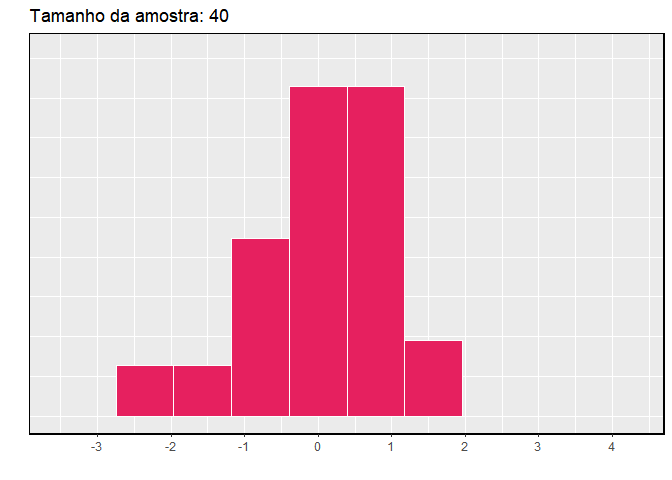

# Distribuições de Variáveis Aleatórias {#ch3-distribuicoes}

## Distribuição Normal {#normalDist}

Entre todas as distribuições que vemos na prática, uma é a mais comum. A curva de sino simétrica, unimodal, é onipresente em toda a estatística. Na verdade, é tão comum que as pessoas muitas vezes a conhecem como **curva normal** ou **distribuição normal**^[É também introduzido como a distribuição gaussiana após Frederic Gauss, a primeira pessoa a formalizar sua expressão matemática.] mostrada na Figura \@ref(fig:simplenorm). Variáveis como os pontos do SAT  e as alturas dos homens adultos norte-americanos seguem de perto a distribuição normal.

```{r simplenorm, fig.cap = "Uma curva normal", out.height='20%', fig.height=2}
ggplot(data = data.frame(x = c(-4, 4)), aes(x)) +
  stat_function(fun = dnorm, n = 1001, args = list(mean = 0, sd = 1), size = 1)  +
  theme(axis.title.x = element_blank(), axis.text.x = element_blank(), 
        axis.ticks.x = element_blank()) + 
  theme(axis.title.y = element_blank(), axis.text.y = element_blank(), 
        axis.ticks.y = element_blank()) + 
  geom_hline(yintercept = -0.008, size = 1) + 
  theme(panel.border = element_rect(colour = "black", fill=NA, size=1))
```

<div class="alert alert-info">
  <strong>Fatos da distribuição normal</strong>: Muitas variáveis são quase normais, mas nenhuma é exatamente normal. Assim, a distribuição normal, embora não seja perfeita para qualquer problema individual, é muito útil para uma variedade de problemas. Vamos usá-lo na exploração de dados e resolver problemas importantes em estatísticas.
</div>

### Modelo de distribuição normal {#normalDistributionModel}

O modelo de distribuição normal sempre descreve uma curva simétrica, unimodal e em forma de sino. No entanto, essas curvas podem parecer diferentes dependendo dos detalhes do modelo. Especificamente, o modelo de distribuição normal pode ser ajustado usando dois parâmetros: média e desvio padrão. Como você provavelmente pode adivinhar, alterar a média desloca a curva do sino para a esquerda ou para a direita, enquanto alterar o desvio padrão estende ou restringe a curva. A Figura \@ref(fig:twoSampleNormals) mostra a distribuição normal com média $0$ e desvio padrão $1$ no painel esquerdo e as distribuições normais com média $19$ e desvio padrão $4$ no painel direito. A Figura \@ref(fig:twoSampleNormalsStacked) mostra essas distribuições no mesmo eixo.

```{r twoSampleNormals, fig.cap = "Ambas as curvas representam a distribuição normal, no entanto, diferem em seu centro e propagação. A distribuição normal com média 0 e desvio padrão 1 é chamada de **distribuição normal padrão**.", out.height='20%', fig.height=2}

set.seed(1)
x1 <- rnorm(100000, 0, 1)
norm1 <- ggplot(mapping = aes(x = x1)) + 
  geom_histogram(aes(y = ..density..), color = "white", bins = 30, alpha = 0.5, fill = "#EAB217") + 
  stat_function(data = data.frame(), fun = dnorm, n = 1001, args = list(mean = 0, sd = 1), size = 1, color = "#EAB217") +
  scale_x_continuous(breaks = seq(-3, 3, 1)) + 
  theme(axis.text.y = element_blank(), axis.ticks.y = element_blank(), 
        axis.line.y = element_blank()) + 
  labs(x = NULL, y = NULL) + 
  theme(panel.border = element_rect(colour = "black", fill=NA, size=1))

x2 <- rnorm(100000, 19, 4)
norm2 <- ggplot(mapping = aes(x = x2)) + 
  geom_histogram(aes(y = ..density..), color = "white", bins = 30, alpha = 0.5, fill = "#E6205F") + 
  stat_function(data = data.frame(),fun = dnorm, n = 1001, args = list(mean = 19, sd = 4), size = 1, color = "#E6205F")+
  scale_x_continuous(breaks = seq(7, 31, 4)) + 
  theme(axis.text.y = element_blank(), axis.ticks.y = element_blank(),
        axis.line.y = element_blank()) + 
  labs(x = NULL, y = NULL) + 
  theme(panel.border = element_rect(colour = "black", fill=NA, size=1))

require(gridExtra)
grid.arrange(norm1, norm2, ncol = 2)
```

```{r twoSampleNormalsStacked, fig.cap = "Os modelos normais mostrados acima, mas plotados simultaneamente e na mesma escala.", out.height='20%', fig.height=2}
ggplot(data = data.frame(x = c(-3, 33)), aes(x)) + 
  stat_function(fun = dnorm, n = 10001, args = list(mean = 0, sd = 1), 
                size = 1, color = "#EAB217") +
  stat_function(fun = dnorm, n = 10001, args = list(mean = 19, sd = 4), 
                size = 1, color = "#E6205F") + 
  scale_x_continuous(breaks = seq(-3, 33, 4)) + 
  theme(axis.text.y = element_blank(), axis.ticks.y = element_blank()) + 
  labs(x = NULL, y = NULL) + 
  geom_hline(yintercept=0, colour="white", size = 1) +
  theme(panel.border = element_rect(colour = "black", fill=NA, size=1))
```

Se uma distribuição normal tem média $\mu$ e desvio padrão $\sigma$, podemos escrever a distribuição como $N(\mu, \sigma)$^[Distribuição normal com média $\mu$ e desvio padrão $\sigma$]. As duas distribuições na Figura \@ref(fig:twoSampleNormalsStacked) podem ser escritas como

\begin{align*}
N(\mu=0,\sigma=1)\quad\text{e}\quad N(\mu=19,\sigma=4)
\end{align*}

Como a média e o desvio padrão descrevem exatamente uma distribuição normal, eles são chamados **parâmetros** da distribuição.

***
```{exercise}
Anote a representação de uma distribuição normal com^[a. $N(\mu=5,\sigma=3)$, b. $N(\mu=-100, \sigma=10)$, c. $N(\mu=2, \sigma=9)$.]:
  
+ a. média 5 e desvio padrão 3,

+ b. média -100 e desvio padrão 10, e

+ c. média 2 e desvio padrão 9.
```

***

### Padronizando com pontos Z {#patterningZPoints}


```{example, label = "labex"}
: A Tabela \@ref(tab:satACTstats) mostra a média e o desvio padrão para as pontuações totais no SAT e no ACT. A distribuição dos pontos SAT e ACT é quase normal. Suponha que Ana marcou 1800 em seu SAT e Thiago marcou 24 em seu ACT. Quem teve melhor desempenho?
```

```{r satACTstats}
require(knitr)
ex3_1 <- cbind(c(1500, 300), c(20, 5))
rownames(ex3_1) <- c("Média", "DP")
colnames(ex3_1) <- c("SAT", "ACT")
kable(ex3_1, caption = "Média e desvio padrão para o SAT e ACT.", align = "c")
```

Nós usamos o desvio padrão como um guia. Ana é 1 desvio padrão acima da média na SAT: $1500 + 300=1800$. Thiago é 0,6 desvios padrão acima da média no ACT: $21+0.6\times 5=24$. Na Figura \@ref(fig:satActNormals), podemos ver que Ana tende a se sair melhor em relação a Thiago, então sua pontuação foi melhor.

```{r satActNormals, fig.cap = "Pontuação de Ana e Thiago mostrados com as distribuições dos pontos SAT e ACT.", fig.align="center", fig.height=7, out.height='100%'}

set.seed(1)
m <- 1500
s <- 300
X <- m + s * seq(-4, 4, 0.01)
Y <- dnorm(X, m, s)

ann <- ggplot(mapping = aes(x = X, y = Y)) + geom_line() + 
  labs(x = NULL, y = NULL) + 
  theme(axis.text.y = element_blank(), axis.ticks.y = element_blank(), 
        axis.line.y = element_blank()) + 
  scale_x_continuous(breaks = seq(m - 3*s, m + 3*s, s)) + 
  geom_vline(xintercept = m, linetype = "dotted") + 
  geom_vline(xintercept = m + s, linetype = "dashed", color = "coral4") + 
  annotate("text", x = m + s + s/2, y = Y[which(grepl(m + s, X))], 
           label = "Ana", color = "coral4") +
  theme(panel.border = element_rect(colour = "black", fill=NA, size=1))


mt <- 21
st <- 5
Xt <- mt + st * seq(-4, 4, 0.01)
Yt <- dnorm(Xt, mt, st)

tom <- ggplot(mapping = aes(x = Xt, y = Yt)) + geom_line() + 
  labs(x = NULL, y = NULL) + 
  theme(axis.text.y = element_blank(), axis.ticks.y = element_blank(), 
        axis.line.y = element_blank()) + 
  scale_x_continuous(breaks = seq(mt - 3*st, mt + 3*st, st)) + 
  geom_vline(xintercept = mt, linetype = "dotted") + 
  geom_vline(xintercept = mt + 0.6*st, linetype = "dashed", color = "cyan4") + 
  annotate("text", x = mt + st, y = Yt[which(grepl(mt + st, Xt))[20]]-0.006, 
           label = "Thiago", color = "cyan4") +
  theme(panel.border = element_rect(colour = "black", fill=NA, size=1))


grid.arrange(ann, tom, ncol = 1)

```

No Exemplo \@ref(exm:labex) usaram uma técnica de padronização chamada ponto Z, um método mais comumente empregado para observações quase normais, mas que pode ser usado com qualquer distribuição. O **ponto Z**^[Pontuação-Z, a observação padronizada]  de uma observação é definida como o número de desvios padrão que cai acima ou abaixo da média. Se a observação é um desvio padrão acima da média, sua pontuação Z é 1. Se for 1,5 desvios-padrão *abaixo* da média, então seu Z-escore é -1,5. E se $x$ é uma observação de uma distribuição $N(\mu, \sigma)$, nós definimos o Z-escore matematicamente como

\begin{eqnarray*}
Z = \frac{x-\mu}{\sigma}
\end{eqnarray*}

Usando $\mu_{SAT}=1500$, $\sigma_{SAT}=300$, e $x_{Ana}=1800$, nós achamos o Z-escore da Ana:

\begin{eqnarray*}
Z_{Ana} = \frac{x_{Ana} - \mu_{SAT}}{\sigma_{SAT}} = \frac{1800-1500}{300} = 1
\end{eqnarray*}

<div class="alert alert-info">
  <strong>O Z-escore</strong>: O escore Z de uma observação é o número de desvios padrão que cai acima ou abaixo da média. Calculamos o escore Z para uma observação $x$ que segue uma distribuição com média $\mu$ e desvio padrão $\sigma$ usando
\begin{eqnarray*}
Z = \frac{x-\mu}{\sigma}
\end{eqnarray*}
</div>

***
```{exercise}
Use a pontuação ACT de Thiago, 24, juntamente com a média e o desvio padrão de ACT para calcular seu escore Z.^[$Z_{Thiago} = \frac{x_{Thiago} - \mu_{ACT}}{\sigma_{ACT}} = \frac{24 - 21}{5} = 0.6$]
```

***

Observações acima da média sempre têm escores Z positivos, enquanto aquelas abaixo da média têm escores Z negativos. Se uma observação é igual à média (por exemplo, pontuação SAT de 1500), então a pontuação Z é $0$.

***
```{exercise}
$X$ representa uma variável aleatória de $N(\mu=3, \sigma=2)$, e suponha que observemos $x=5.19$.^[(a) Sua pontuação Z é dada por $Z = \frac{x-\mu}{\sigma} = \frac{5.19 - 3}{2} = 2.19/2 = 1.095$. (b) A observação $x$ é 1.095 desvios-padrão *acima* da média. Sabemos que deve estar acima da média, uma vez que $Z$ é positivo.]

+ (a) Descubra o escore Z de $x$. 

+ (b) Use o Z-escore para determinar a quantos desvios padrões acima ou abaixo da média $x$ cai.
```

***


***
```{exercise label = "compcabeca"}
Os comprimentos de cabeça dos gambás do brushtail seguem uma distribuição quase normal com média de 92,6mm e desvio padrão de 3,6mm. Calcule os escores Z para gambás com comprimentos de cabeça de 95,4mm e 85,8mm.^[Para $x_1=95.4$ mm: $Z_1 = \frac{x_1 - \mu}{\sigma} = \frac{95.4 - 92.6}{3.6} = 0.78$. Para $x_2=85.8$ mm: $Z_2 = \frac{85.8 - 92.6}{3.6} = -1.89$.]
```

***

Podemos usar escores Z para identificar aproximadamente quais observações são mais incomuns do que outras. Uma observação $x_1$ é mais incomum do que outra observação $x_2$ se o valor absoluto de seu Z-escore for maior que o valor absoluto do Z-escore da outra observação:$|Z_1| > |Z_2|$. Essa técnica é especialmente perspicaz quando uma distribuição é simétrica.

***
```{exercise}
Qual das observações na prática orientada \@ref(exr:compcabeca) é mais incomum?^[Porque o *valor absoluto* do escore Z para a segunda observação é maior que o do primeiro, a segunda observação tem um comprimento de cabeça mais incomum.]
```

***

### Tabela de probabilidade normal {#normalProbabilityTabel}

```{example}
Ana do Exemplo anterior ganhou uma pontuação de 1800 em seu SAT com um correspondente de $Z=1$. Ela gostaria de saber em que percentil ela se enquadra entre todos os candidatos ao teste SAT. 
```

```{r satBelow1800, fig.cap = "O modelo normal para a pontuação do SAT, sombreando a área daqueles indivíduos que pontuaram abaixo de Ana.", out.height='20%', fig.height=2}
set.seed(1)
m <- 1500
s <- 300
X <- m + s * seq(-4, 4, 0.01)
Y <- dnorm(X, m, s)

gg   <- data.frame(X,Y)

library(ggplot2)
ggplot(data = gg, mapping = aes(x = X, y = Y)) + 
  geom_linerange(data = gg[gg$X < 1800,], aes(X, ymin = 0, ymax = Y), colour="#E6205F") +
  geom_path(size = 1) +
  scale_x_continuous(breaks = seq(m - 3*s, m + 3*s, s)) + 
  labs(x = NULL, y = NULL) + 
  theme(axis.text.y = element_blank(), axis.ticks.y = element_blank(), 
        axis.line.y = element_blank()) + 
  geom_vline(xintercept = m + s, linetype = "dashed", color = "coral4") + 
  geom_hline(yintercept = 0) +
  theme(panel.border = element_rect(colour = "black", fill=NA, size=1))
```

O resultado **percentil** de Ana é a porcentagem de pessoas que obtiveram uma pontuação menor no SAT que Ana. Nós sombreamos a área que representa aqueles indivíduos na Figura \@ref(fig:satBelow1800). A área total abaixo da curva normal é sempre igual a 1, e a proporção de pessoas que pontuaram abaixo de Ana no SAT é igual à *área* sombreada na Figura \@ref(fig:satBelow1800): 0.8413. Em outras palavras, Ana está no 84 percentil de participantes do SAT.

Podemos usar o modelo normal para encontrar percentis. Uma **tabela de probabilidade normal**, que lista os escores Z e os percentis correspondentes, pode ser usado para identificar um percentil baseado no escore Z (e vice-versa). O software estatístico também pode ser usado.

No caso do **software R**, a função `pnorm` calcula essa área e é dada por: 

> pnorm(q, mean = 0, sd = 1, lower.tail = TRUE, log.p = FALSE)

```{r , results = "hide"}

# Estabelecendo aos argumentos 'q', 'mean' e 'sd' como a pontuação de Ana, 
# a média e o desvio padrão para as pontuações totais no SAT, respectivamente:
# lower.tail se TRUE então P[X ≤ x] se não, P[X > x].
# log.p se as probabilidades p são dadas como log(p)
  
pnorm(q = 1800, mean = 1500, sd = 300, lower.tail = TRUE, log.p = FALSE)
```

```{r, out.height='20%', fig.height=2}

set.seed(1)
m <- 1500
s <- 300
X <- m + s * seq(-4, 4, 0.01)
Y <- dnorm(X, m, s)

gg   <- data.frame(X,Y)

esq <- ggplot(data = gg, mapping = aes(x = X, y = Y)) + 
  geom_linerange(data = gg[gg$X < 1300,], aes(X, ymin = 0, ymax = Y), colour="#EAB217") + 
  geom_path(size = 1) +
  labs(x = NULL, y = NULL) + 
  theme(axis.text.y = element_blank(), axis.ticks.y = element_blank(), 
        axis.line.y = element_blank(), axis.text.x = element_blank()) + 
  geom_vline(xintercept = m, linetype = "dashed", color = "lightyellow4") + 
  geom_hline(yintercept = 0) +
  theme(panel.border = element_rect(colour = "black", fill=NA, size=1))

dir <- ggplot(data = gg, mapping = aes(x = X, y = Y)) + 
  geom_linerange(data = gg[gg$X > 1700,], aes(X, ymin = 0, ymax = Y), colour="#EAB217") + 
  geom_path(size = 1) +
  labs(x = NULL, y = NULL) + 
  theme(axis.text.y = element_blank(), axis.ticks.y = element_blank(), 
        axis.line.y = element_blank(), axis.text.x = element_blank()) + 
  geom_vline(xintercept = m, linetype = "dashed", color = "lightyellow4") + 
  geom_hline(yintercept = 0) +
  theme(panel.border = element_rect(colour = "black", fill=NA, size=1))

require(grid)
grid.arrange(esq, dir, ncol = 2, 
             top = textGrob("Z negativo vs. Z positivo", gp = gpar(fontsize = 27,font = 8)))
```


Uma tabela de probabilidade normal é abreviado na Tabela \@ref(tab:zTableShort). Usamos essa tabela para identificar o percentil correspondente a qualquer pontuação Z específica. Por exemplo, o percentil de $Z=0,43$ é mostrado na linha $0,4$ e a coluna $0,03$ na Tabela \@ref(tab:zTableShort): 0.6664, ou o 66.64 percentual. Geralmente, arredondamos $Z$ para duas casas decimais, identificamos a linha apropriada na tabela de probabilidade normal até o primeiro decimal e depois determinamos a coluna que representa o segundo valor decimal. A intersecção desta linha e coluna é o percentil da observação.

```{r zTableShort}

tab8 <- cbind(c(0.5000,0.5040,0.5080,0.5120,0.5160,0.5199,0.5239,0.5279,0.5319,0.5359),c(0.5398,0.5438,0.5478,0.5517,0.5557,0.5596,0.5636,0.5675,0.5714,0.5753),c(0.5793,0.5832,0.5871,0.5910,0.5948,0.5987,0.6026,0.6064,0.6103,0.6141),c(0.6179,0.6217,0.6255,0.6293,0.6331,0.6368,0.6406,0.6443,0.6480,0.6517),c(0.6554,0.6591,0.6628,0.6664,0.6700,0.6736,0.6772,0.6808,0.6844,0.6879),c(0.6915,0.6950,0.6985,0.7019,0.7054,0.7088,0.7123,0.7157,0.7190,0.7224),c(0.7257,0.7291,0.7324,0.7357,0.7389,0.7422,0.7454,0.7486,0.7517,0.7549),c(0.7580,0.7611,0.7642,0.7673,0.7704,0.7734,0.7764,0.7794,0.7823,0.7852),c(0.7881,0.7910,0.7939,0.7967,0.7995,0.8023,0.8051,0.8078,0.8106,0.8133),c(0.8159,0.8186,0.8212,0.8238,0.8264,0.8289,0.8315,0.8340,0.8365,0.8389))

tab8 <- t(tab8)

colnames(tab8) <- seq(0.00, 0.09, by = 0.01)
rownames(tab8) <- seq(0.0, 0.9, by = 0.1)


kable(tab8, caption = "Uma seção da tabela de probabilidade normal. O percentil de uma  variável  aleatória  normal com Z =  0.43  foi destacado e o percentilmais próoximo de 0.8000 também foi destacado.", align = "c")
```

Também podemos encontrar o escore Z associado a um percentil. Por exemplo, para identificar Z para o 84 percentil, procuramos o valor mais próximo de 0,8000 na parte central da tabela: 0,7995. Determinamos o ponto Z para o 80 percentil combinando os valores de linha e coluna Z: 0.84.

***
```{exercise}
Determine a proporção de participantes do teste SAT que pontuaram melhor que Ana no SAT.^[Se $84\%$ tinham menores pontuações do que Ana, a proporção de pessoas que tiveram melhores pontuações deve ser $16\%$. (Geralmente os laços são ignorados quando o modelo normal, ou qualquer outra distribuição contínua, é usado.)]
```

***


### Exemplos de probabilidade normal {#normalProbabiliyExamples}

A pontuação cumulativa do SAT são bem aproximadas por um modelo normal, $N(\mu=1500, \sigma=300)$.

```{example} 
Sabrina é uma candidata de SAT aleatoriamente selecionada, e nada se sabe sobre a aptidão SAT de Sabrina. Qual é a probabilidade de Sabrina marcar pelo menos 1630 em seus SATs?

Primeiro, desenhe e rotule sempre uma figura da distribuição normal. (Os desenhos não precisam ser exatos para serem úteis.) Estamos interessados na chance dela obter acima de 1630, então sombreamos essa cauda superior:
```


```{r satAbove1630, out.height='20%', fig.height=2}
ggplot(data = gg, mapping = aes(x = X, y = Y)) + 
  geom_linerange(data = gg[gg$X > 1630,], aes(X, ymin = 0, ymax = Y), colour="#E97C31") + 
  geom_path(size = 1) +
  scale_x_continuous(breaks = seq(m - 3*s, m + 3*s, s)) + 
  labs(x = NULL, y = NULL) + 
  theme(axis.text.y = element_blank(), axis.ticks.y = element_blank(), 
        axis.line.y = element_blank()) + 
  geom_vline(xintercept = m + 130, linetype = "dashed") + 
  geom_hline(yintercept = 0) +
  theme(panel.border = element_rect(colour = "black", fill=NA, size=1))
```

A figura mostra a média e os valores em 3 desvios padrão acima e abaixo da média. A maneira mais simples de encontrar a área sombreada sob a curva faz uso do ponto Z do valor de corte. Com $\mu=1500$, $\sigma=300$, e o valor de corte $x=1630$, o ponto Z é computado como

\begin{eqnarray*}
Z = \frac{x - \mu}{\sigma} = \frac{1630 - 1500}{300} = \frac{130}{300} = 0.43
\end{eqnarray*}

Procuramos o percentil de $Z=0.43$ na tabela de probabilidade normal mostrada na Tabela \@ref(tab:zTableShort), que é 0.6664. No entanto, o percentil descreve aqueles que tiveram um ponto Z *menor* de 0,43. Para encontrar a área *acima* de $Z=0.43$, calculamos um menos a área da cauda inferior:

```{r, out.height='20%', fig.height=2}
all <- ggplot(data = gg, mapping = aes(x = X, y = Y)) + 
  geom_linerange(data = gg[gg$X < 2700,], aes(X, ymin = 0, ymax = Y), colour="#EAB217") + 
  geom_path(size = 1) +
  labs(x = NULL, y = NULL) + 
  theme(axis.text.y = element_blank(), axis.ticks.y = element_blank(), 
        axis.line.y = element_blank(), axis.text.x = element_blank()) + 
  # geom_vline(xintercept = m + 130, linetype = "dashed", color = "gold4") + 
  geom_hline(yintercept = 0) +
  theme(panel.border = element_rect(colour = "black", fill=NA, size=1))

esquerda <- ggplot(data = gg, mapping = aes(x = X, y = Y)) + 
  geom_linerange(data = gg[gg$X < 1630,], aes(X, ymin = 0, ymax = Y), colour="#EAB217") +
  geom_path(size = 1) +
  labs(x = NULL, y = NULL) + 
  theme(axis.text.y = element_blank(), axis.ticks.y = element_blank(), 
        axis.line.y = element_blank(), axis.text.x = element_blank()) + 
  geom_vline(xintercept = m + 130, linetype = "dashed", color = "gold4") + 
  geom_hline(yintercept = 0) +
  theme(panel.border = element_rect(colour = "black", fill=NA, size=1))

direita <- ggplot(data = gg, mapping = aes(x = X, y = Y)) + 
  geom_linerange(data = gg[gg$X > 1630,], aes(X, ymin = 0, ymax = Y), colour="#EAB217") +
  geom_path(size = 1) +
  labs(x = NULL, y = NULL) + 
  theme(axis.text.y = element_blank(), axis.ticks.y = element_blank(), 
        axis.line.y = element_blank(), axis.text.x = element_blank()) + 
  geom_vline(xintercept = m + 130, linetype = "dashed", color = "gold4") + 
  geom_hline(yintercept = 0) +
  theme(panel.border = element_rect(colour = "black", fill=NA, size=1))

require(grid)
grid.arrange(all, esquerda, direita, ncol = 3, 
             top = textGrob("1.0000 - 0.6664 = 0.3336", gp = gpar(fontsize = 27,font = 8)))

```

A probabilidade de Sabrina ter pelo menos 1630 no SAT é de 0.3336. Essa probabilidade pode ser calculada direto pelo **software R**.

> pnorm(q = 1630, mean = 1500, sd = 300, lower.tail = FALSE)^[Note que ao especificar `lower.tail = FALSE`, é calculado direto a probabilidade de P(X > 1630).]

```{r, results = "hide"}
pnorm(q = 1630, mean = 1500, sd = 300, lower.tail = FALSE)
```

<div class="alert alert-info">
  <strong>Dica: primeiro desenhe a figura, em seguida encontre o score Z</strong>: Para qualquer situação de probabilidade normal, *sempre sempre sempre* desenhar e rotular a curva normal e sombrear a área de interesse em primeiro lugar. A imagem fornecerá uma estimativa da probabilidade. 

Depois de desenhar uma figura para representar a situação, identifique a pontuação Z para a observação de interesse.
</div>

***
```{exercise}
Se a probabilidade de Sabrina marcar pelo menos 1630 é de 0.3336, qual é a probabilidade de ela ter menos de 1630? Desenhe a curva normal representando este exercício, sombreando a região inferior em vez da superior.^[Encontramos a probabilidade no Exemplo: 0.6664. Uma imagem para este exercício é representada pela área sombreada abaixo de ``0.6664'' no Exemplo].
```

***

```{example, label = "ex4"}
Edward pontuou 1400 no seu SAT. Qual é o seu percentual?
```

Primeiro, uma foto é necessária. O percentil de Edward é a proporção de pessoas que não chegam tão alto quanto 1400. Essas são as pontuações à esquerda de 1400.

```{r, out.height='20%', fig.height=2}
ggplot(data = gg, mapping = aes(x = X, y = Y)) + 
  geom_linerange(data = gg[gg$X < 1400,], aes(X, ymin = 0, ymax = Y), colour="#E97C31") + 
  geom_path(size = 1) +
  labs(x = NULL, y = NULL) + 
  theme(axis.text.y = element_blank(), axis.ticks.y = element_blank(), 
        axis.line.y = element_blank()) + 
  geom_vline(xintercept = m - 100, linetype = "dashed") + 
  geom_hline(yintercept = 0) + 
  scale_x_continuous(breaks = seq(m - 3*s, m + 3*s, s)) +
  theme(panel.border = element_rect(colour = "black", fill=NA, size=1))
```

Identificando a média $\mu=1500$, o desvio padrão $\sigma=300$, e o limite para a área de cauda $x=1400$ facilita o cálculo do ponto Z:

\begin{eqnarray*}
Z = \frac{x - \mu}{\sigma} = \frac{1400 - 1500}{300} = -0.33
\end{eqnarray*}

Usando a tabela de probabilidade normal, identifique a linha de $-0.3$ e a coluna de $0.03$, o que corresponde à probabilidade de $0.3707$. Edward está no 37 percentil.

```{r, results = "hide"}
pnorm(q = 1400, mean = 1500, sd = 300, lower.tail = TRUE)
```

***
```{exercise}
Use os resultados do Exemplo \@ref(exm:ex4) para calcular a proporção de participantes do SAT que se saíram melhor do que Edward.^[Se Edward fez melhor do que 37\% de tomadores SAT, então sobre 63\% deve ter feito melhor que ele.]
```

```{r, out.height='20%', fig.height=2}
ggplot(data = gg, mapping = aes(x = X, y = Y)) + 
  geom_linerange(data = gg[gg$X > 1400,], aes(X, ymin = 0, ymax = Y), colour="#E97C31") + 
    geom_path(size = 1) +
  labs(x = NULL, y = NULL) + 
  theme(axis.text.y = element_blank(), axis.ticks.y = element_blank(), 
        axis.line.y = element_blank()) + 
  geom_vline(xintercept = m - 100, linetype = "dashed") + 
  geom_hline(yintercept = 0) + 
  scale_x_continuous(breaks = seq(m - 3*s, m + 3*s, s)) +
  theme(panel.border = element_rect(colour = "black", fill=NA, size=1))
```

***

<div class="alert alert-info">
  <strong>Dica: áreas à direita</strong>: A tabela de probabilidade normal na maioria dos livros dá a área à esquerda. Se você quiser a área à direita, primeiro encontre a área à esquerda e subtraia essa quantia de um. No **software R** é possível calcular essa probabilidade diretamente estabelecendo ao argumento *lower.tail* como `lower.tail = FALSE`. </div>
  
***
```{exercise}
Stuart obteve uma pontuação SAT de 2100. Faça uma figura para cada parte.^[Respostas numéricas: (a) 0.9772. (b) 0.0228.]

+ (a) Qual é o seu percentil? 
  
+ (b) Qual percentual de participantes do SAT se saiu melhor que Stuart? 
```

```{r, results = "hide"}
pnorm(q = 2100, mean = 1500, sd = 300, lower.tail = FALSE)
```

***


***
```{exercise}

Baseado em uma amostra de 100 homens^[Esta amostra foi retirada do banco de dados USDA Food Commodity Intake.], a altura de adultos do sexo masculino entre as idades de 20 e 62 anos nos EUA é quase normal, com média de 178cm e desvio padrão de 8.38cm.

Mike tem 170cm e Jim tem 193cm.^[(a) $Z_{Mike} = \frac{170 - 178}{8.38} = -0.95$, então 0.1698. (b) $Z_{Jim} = \frac{193 - 178}{8.38} = 1.79$, então 0.963.] 

+ (a) Qual é o percentil de altura de Mike? 
  
+ (b) Qual é o percentil de altura de Jim? Também desenhe uma imagem para cada parte.
```

***


Os últimos vários problemas se concentraram em encontrar a probabilidade ou o percentil de uma observação em particular. E se você quiser saber a observação correspondente a um percentil específico?

```{example} 
A altura de Erik está no 40 percentual. Quão alto ele é?
```
  
Como sempre, primeiro desenhe a distribuição.

```{r, out.height='20%', fig.height=2}
set.seed(1)
m <- 178
s <- 8.38
X <- m + s * seq(-4, 4, 0.01)
Y <- dnorm(X, m, s)

gg   <- data.frame(X,Y)


ggplot(data = gg, mapping = aes(x = X, y = Y)) + 
  geom_linerange(data = gg[gg$X < qnorm(p = 0.40, mean = m, sd = s),], 
                 aes(X, ymin = 0, ymax = Y), colour="#E6205F") + 
    geom_path(size = 1) +
  labs(x = NULL, y = NULL) + 
  theme(axis.text.y = element_blank(), axis.ticks.y = element_blank(), 
        axis.line.y = element_blank()) + 
  geom_vline(xintercept = qnorm(p = 0.40, mean = m, sd = s), 
             linetype = "dashed") + 
  geom_hline(yintercept = 0) + 
  annotate("text", x = m - 2*s, 
           y = Y[which(grepl(m - s, X))], label = "0.40 (40%)") + 
  scale_x_continuous(breaks = seq(m - 3*s, m + 3*s, s*1.5)) +
  theme(panel.border = element_rect(colour = "black", fill=NA, size=1))
```

Neste caso, a probabilidade de cauda inferior é conhecida (0.40), que pode ser sombreada a figura. Queremos encontrar a observação que corresponde a esse valor. Como primeiro passo nessa direção, determinamos o ponto Z associado ao percentil 40.

Porque o percentil está abaixo 50\%, Sabemos que $Z$ será negativo. Olhando na parte negativa da tabela de probabilidade normal, procuramos a probabilidade _dentro_ da tabela mais próxima de 0.4000. Descobrimos que 0.4000 cai na linha $-0.2$ e entre colunas $0.05$ e $0.06$. Uma vez que se aproxima de $0.05$, tomamos este: $Z = -0.25$. Sabendo $Z_{Erik}=-0.25$ e os parâmetros da população $\mu= 178$ e $\sigma= 8.38$cm, a fórmula do ponto Z pode ser configurada para determinar a altura desconhecida de Erik, $x_{Erik}$:

\begin{eqnarray*}
-0.25 = Z_{Erik} = \frac{x_{Erik} - \mu}{\sigma} = \frac{x_{Erik} - 178}{8.38}
\end{eqnarray*}

Resolvendo para $x_{Erik}$ produz a altura 175.88cm. Ou seja, Erik possui certa de 1,76m.

```{r, results="hide"}
qnorm(p = 0.40, mean = 178, sd = 8.38)
```

```{example}
Qual é a altura do homem adulto no 82 percentil?
```
  
Mais uma vez, desenhamos a figura primeiro.

```{r, out.height='20%', fig.height=2}
gg   <- data.frame(X,Y)

ggplot(data = gg, mapping = aes(x = X, y = Y)) + 
  geom_linerange(data = gg[gg$X < qnorm(p = 0.82, mean = m, sd = s),], 
                 aes(X, ymin = 0, ymax = Y), colour="#E6205F") + 
  geom_path(size = 1) +
  labs(x = NULL, y = NULL) + 
  theme(axis.text.y = element_blank(), axis.ticks.y = element_blank(), 
        axis.line.y = element_blank()) + 
  geom_vline(xintercept = qnorm(p = 0.82, mean = m, sd = s), 
             linetype = "dashed") + 
  geom_hline(yintercept = 0) + 
  annotate("text", x = m - 2*s, 
           y = Y[which(grepl(m - s, X))], label = "0.82 (82%)") + 
    annotate("text", x = m + 2*s, 
           y = Y[which(grepl(m - s, X))], label = "0.18 (18%)") + 
  scale_x_continuous(breaks = seq(m - 3*s, m + 3*s, s*1.5)) +
  theme(panel.border = element_rect(colour = "black", fill=NA, size=1))
```

Em seguida, queremos encontrar o ponto Z no percentil 82, qual será um valor positivo. Olhando na tabela Z, encontramos $Z$ na linha $0.9$ e a coluna mais próxima é $0.02$, i.e. $Z=0.92$. Finalmente, a altura $x$ é encontrada usando a fórmula do escore Z com a média conhecida $\mu$, desvio padrão $\sigma$, e ponto Z, $Z=0.92$:

\begin{eqnarray*}
0.92 = Z = \frac{x-\mu}{\sigma} = \frac{x - 178}{8.38}
\end{eqnarray*}

Isto rende 185.67 cm. Ou seja, uma altura de aproximadamente 1.86m como a altura no 82 percentil.

```{r, results="hide"}
qnorm(p = 0.82, mean = 178, sd = 8.38)
```

***
```{exercise}

Qual é o:^[Lembre-se: desenhe uma figura primeiro e depois encontre a pontuação Z. (Deixamos as distribuições para você). A pontuação Z pode ser encontrada usando os percentis e a tabela de probabilidade normal. (a) Procuramos por 0.95 na porção de probabilidade (parte do meio) da tabela de probabilidade normal, o que nos leva à linha 1.6 e (sobre) coluna 0.05, i.e. $Z_{95}=1.65$. Sabendo $Z_{95}=1.65$, $\mu = 1500$, e $\sigma = 300$, nós configuramos a fórmula do ponto Z: $1.65 = \frac{x_{95} - 1500}{300}$. Nós resolvemos para $x_{95}$: $x_{95} = 1995$. (b) Da mesma forma, encontramos $Z_{97.5} = 1.96$, novamente configure a fórmula do ponto Z para as alturas e calcule $x_{97.5} = 76.5$.]

+ (a) 95 percentil para pontos da SAT? 
  
+ (b) 97.5 percentil das alturas masculinas? Como sempre com problemas de probabilidade normais, primeiro desenhe uma figura.
```

***

***
```{exercise}

Qual é a probabilidade de um adulto: ^[Respostas numéricas: (a) 0.1164. (b) 0.3602.]

+ (a) homem selecionado aleatoriamente ter pelo menos 188cm? 
  
+ (b) do sexo masculino ser menor que 175cm?
```
  
```{r, results='hide'}
pnorm(q = 188, mean = 178, sd = 8.38, lower.tail = FALSE)

pnorm(q = 175, mean = 178, sd = 8.38, lower.tail = TRUE)
```

***

```{example, label = "po13"}
Qual é a probabilidade de um homem adulto aleatório estar entre 175cm e 188cm?
```
  
Essas alturas correspondem a 1.75m e 1.88m. Primeiro, desenhe a figura. A área de interesse não é mais uma cauda superior ou inferior.

```{r, out.height='20%', fig.height=2}
# entre 175 e 188
ggplot(data = gg, mapping = aes(x = X, y = Y)) + 
  geom_linerange(data = gg[gg$X > 175 & gg$X < 188, ], 
                 aes(X, ymin = 0, ymax = Y), colour="#E97C31") + 
  labs(x = NULL, y = NULL) + 
  geom_path(size = 1) +
  theme(axis.text.y = element_blank(), axis.ticks.y = element_blank(), 
        axis.line.y = element_blank()) + 
  geom_vline(xintercept = c(175, 188), 
             linetype = "dashed") + 
  geom_hline(yintercept = 0) + 
  scale_x_continuous(breaks = seq(m - 3*s, m + 3*s, s*1.5)) +
  theme(panel.border = element_rect(colour = "black", fill=NA, size=1))
```

A área total sob a curva é 1. Se encontrarmos a área das duas caudas que não estão sombreadas (da Prática Orientada \@ref(exm:po13), estas áreas são $0.3602$ e $0.1164$), então podemos encontrar a área do meio:

```{r, out.height='20%', fig.height=2}
inicio <- ggplot(data = gg, mapping = aes(x = X, y = Y)) + 
  geom_linerange(data = gg[gg$X > 144, ], 
                 aes(X, ymin = 0, ymax = Y), colour="#E6205F") + 
  labs(x = NULL, y = NULL) + 
  geom_path(size = 1) +
  theme(axis.text.y = element_blank(), axis.ticks.y = element_blank(), 
        axis.line.y = element_blank(), axis.text.x = element_blank()) + 
  geom_hline(yintercept = 0) +
  theme(panel.border = element_rect(colour = "black", fill=NA, size=1))

p175 <- ggplot(data = gg, mapping = aes(x = X, y = Y)) + 
  geom_linerange(data = gg[gg$X < 175, ], 
                 aes(X, ymin = 0, ymax = Y), colour="#E6205F") + 
  labs(x = NULL, y = NULL) + 
  geom_path(size = 1) +
  theme(axis.text.y = element_blank(), axis.ticks.y = element_blank(), 
        axis.line.y = element_blank(), axis.text.x = element_blank()) + 
  geom_vline(xintercept = 175, 
             linetype = "dashed") + 
  geom_hline(yintercept = 0) +
  theme(panel.border = element_rect(colour = "black", fill=NA, size=1))

p188 <- ggplot(data = gg, mapping = aes(x = X, y = Y)) + 
  geom_linerange(data = gg[gg$X > 188, ], 
                 aes(X, ymin = 0, ymax = Y), colour="#E6205F") + 
  labs(x = NULL, y = NULL) + 
  geom_path(size = 1) +
  theme(axis.text.y = element_blank(), axis.ticks.y = element_blank(), 
        axis.line.y = element_blank(), axis.text.x = element_blank()) + 
  geom_vline(xintercept = 188, 
             linetype = "dashed") + 
  geom_hline(yintercept = 0) +
  theme(panel.border = element_rect(colour = "black", fill=NA, size=1))


final <- ggplot(data = gg, mapping = aes(x = X, y = Y)) + 
  geom_linerange(data = gg[gg$X > 175 & gg$X < 188, ], 
                 aes(X, ymin = 0, ymax = Y), colour="#E6205F") + 
  labs(x = NULL, y = NULL) + 
  geom_path(size = 1) +
  theme(axis.text.y = element_blank(), axis.ticks.y = element_blank(), 
        axis.line.y = element_blank(), axis.text.x = element_blank()) + 
  geom_vline(xintercept = c(175, 188), 
             linetype = "dashed") + 
  geom_hline(yintercept = 0) +
  theme(panel.border = element_rect(colour = "black", fill=NA, size=1))

grid.arrange(inicio, p175, p188, final, ncol = 4, 
             top = textGrob("1.000 - 0.3602 - 0.1164 = 0.5234", gp = gpar(fontsize = 27,font = 8)))
```

Ou seja, a probabilidade de estar entre 1.75m e 1.88m é 0.5234.

***
```{exercise}
Qual porcentagem dos participantes do SAT obter entre 1500 e 2000?^[Esta é uma solução abreviada. (Certifique-se de desenhar uma figura!) Primeiro, encontre o percentual que fica abaixo de 1500 e o percentual que fica acima de 2000: $Z_{1500} = 0.00 \to 0.5000$ (área abaixo), $Z_{2000} = 1.67 a 0.0475$ (área abaixo). Resposta final: $1.0000-0.5000 - 0.0475 = 0.4525$.]
```

***

***
```{exercise}
Que percentual de homens adultos estão entre 165cm e 170cm?^[Solução numérica: $1.000 - 0.0604 - 0.8301 = 0.1095$, i.e. 10.95\%.]
```

***

### Lei 68-95-99.7 {#rule689599}

Aqui, apresentamos uma regra útil para a probabilidade de cair dentro de 1, 2 e 3 desvios padrão da média na distribuição normal. Isso será útil em uma ampla gama de configurações práticas, especialmente ao tentar fazer uma estimativa rápida sem uma calculadora ou tabela Z.

```{r f6895997, fig.cap="Probabilidades de cair dentro de 1, 2 e 3 desvios padrão da média em uma distribuição normal.", fig.align='center', fig.height=4, out.height='40%'}
set.seed(1)
m <- 0
s <- 1
X <- m + s * seq(-4, 4, 0.01)
Y <- dnorm(X, m, s)

gg   <- data.frame(X,Y)

library(ggplot2)
ggplot(data = gg, mapping = aes(x = X, y = Y)) + 
  geom_linerange(data = gg[gg$X < 2.97 & gg$X > -2.97,], # 99.7% 
                 aes(X, ymin = 0, ymax = Y), colour="#E6205F") +
  geom_linerange(data = gg[gg$X < 1.96 & gg$X > -1.96,], # 95%
                 aes(X, ymin = 0, ymax = Y), colour="#E97C31") + 
  geom_linerange(data = gg[gg$X < .99 & gg$X > -.99,], # 68% 
                 aes(X, ymin = 0, ymax = Y), colour="#EAB217") + 
  scale_x_continuous(breaks = seq(m - 3*s, m + 3*s, s)) + 
  geom_path(size = 1) +
  labs(x = NULL, y = NULL) + 
  theme(axis.text.y = element_blank(), axis.ticks.y = element_blank(), 
        axis.line.y = element_blank(),
        axis.text.x = element_blank(), axis.ticks.x = element_blank(), 
        axis.line.x = element_blank()) + 
  geom_hline(yintercept = 0) + 
  annotate(geom = "text", x = 0, y = 0.09, label = "95%", size = 4) + 
  annotate(geom = "text", x = 0, y = 0.03, label = "99.7%", size = 4) + 
  annotate(geom = "text", x = 0, y = 0.26, label = "68%", size = 4) + 
  geom_segment(aes(x = -1.96, y = 0.07, xend = 1.96, yend = 0.07)) + 
  geom_segment(aes(x = -1.96, y = 0, xend = -1.96, yend = 0.07), linetype = "dashed") +
  geom_segment(aes(x = 1.96, y = 0, xend = 1.96, yend = 0.07), linetype = "dashed") + # 95%
  geom_segment(aes(x = -2.97, y = 0.02, xend = 2.97, yend = 0.02)) + 
  geom_segment(aes(x = -2.97, y = 0, xend = -2.97, yend = 0.02), linetype = "dashed") +
  geom_segment(aes(x = 2.97, y = 0, xend = 2.97, yend = 0.02), linetype = "dashed") + #99.7%
  geom_segment(aes(x = -.99, y = 0.25, xend = .99, yend = 0.25)) + 
  geom_segment(aes(x = -.99, y = 0, xend = -.99, yend = 0.25), linetype = "dashed") +
  geom_segment(aes(x = .99, y = 0, xend = .99, yend = 0.25), linetype = "dashed") + 
  annotate(geom = "text", x = 0, y = -0.02, label = expression(mu*''), size = 4) +
  annotate(geom = "text", x = 1, y = -0.02, label = expression(mu*'+'*sigma), size = 4) +
  annotate(geom = "text", x = -1, y = -0.02, label = expression(mu*'-'*sigma), size = 4) +
  annotate(geom = "text", x = 2, y = -0.02, label = expression(mu*'+ 2'*sigma), size = 4) +
  annotate(geom = "text", x = -2, y = -0.02, label = expression(mu*'- 2'*sigma), size = 4) +
  annotate(geom = "text", x = 3, y = -0.02, label = expression(mu*'+ 3'*sigma), size = 4) +
  annotate(geom = "text", x = -3, y = -0.02, label = expression(mu*'- 3'*sigma), size = 4) + 
  theme(panel.border = element_rect(colour = "black", fill=NA, size=1))

```

***
```{exercise}
Use a tabela Z para confirmar que cerca de 68\%, 95\% e 99.7\% das observações estão dentro de 1, 2 e 3, desvios padrão da média na distribuição normal, respectivamente. Por exemplo, primeiro encontre a área que fica entre $Z=-1$ e $Z=1$, que deve ter uma área de cerca de 0.68. Da mesma forma, deve haver uma área de cerca de 0.95 entre $Z=-2$ e $Z=2$.^[Primeiro desenhe as imagens. Para encontrar a área entre $Z=-1$ e $Z=1$, use a tabela de probabilidade normal para determinar as áreas abaixo $Z=-1$ e acima $Z=1$. Em seguida, verifique a área entre $Z=-1$ e $Z=1$ é sobre 0.68. Repita isso para $Z=-2$ para $Z=2$ e também para $Z=-3$ para $Z=3$.]
```

***

É possível que uma variável aleatória normal caia 4, 5 ou ainda mais desvios padrão da média. No entanto, essas ocorrências são muito raras se os dados forem quase normais. A probabilidade de estar mais do que 4 desvios padrão da média é de cerca de 1 em 15.000. Para 5 e 6 desvios padrão, é cerca de 1 em 2 milhões e 1 em 500 milhões, respectivamente.

***
```{exercise}
A pontuação do SAT seguem de perto o modelo normal com média $\mu = 1500$ e desvio padrão $\sigma = 300$.^[(a) 900 e 2100 representam dois desvios padrão acima e abaixo da média, o que significa que cerca de $95\%$ dos participantes do teste terão pontuação entre 900 e 2100. (b) Como o modelo normal é simétrico, então metade dos participantes do teste (a) ($\frac{95\%}{2} = 47.5\%$ de todos os participantes do teste terá uma pontuação de 900 a 1500, enquanto a pontuação de $47.5\%$ será entre 1500 e 2100.]

+ (a) Sobre qual percentual de usuários de teste obtém entre 900 e 2100? 
  
+ (b) Qual a pontuação percentual entre 1500 e 2100?
```
  
***


## Avaliando a aproximação normal {#assessingNormalApproach}

Muitos processos podem ser bem aproximados pela distribuição normal. Já vimos dois bons exemplos: os resultados do SAT e as alturas dos homens adultos dos EUA. Embora o uso de um modelo normal possa ser extremamente conveniente e útil, é importante lembrar que a normalidade é sempre uma aproximação. Avaliar a adequação da suposição normal é um passo fundamental em muitas análises de dados.

Exemplo da altura sugere que a distribuição das alturas dos homens norte-americanos é bem aproximada pelo modelo normal. Estamos interessados em prosseguir com a suposição de que os dados são normalmente distribuídos, mas primeiro devemos verificar se isso é razoável.

Existem dois métodos visuais para verificar a suposição de normalidade, que podem ser implementados e interpretados rapidamente. O primeiro é um histograma simples com a curva normal de melhor ajuste sobreposta à plotagem, como mostrado no painel Figura \@ref(fig:fcidMHeights). A média da amostra $\bar{x}$ e desvio padrão $s$ são usados como os parâmetros da curva normal de melhor ajuste. Quanto mais esta curva se encaixa no histograma, mais razoável é a suposição do modelo normal. Outro método mais comum é examinar um *gráfico de probabilidade normal*^[Também comumente chamado de **gráfico quantil-quantil**.], mostrado no painel direito da Figura \@ref(fig:fcidMHeights). Quanto mais próximos os pontos estiverem de uma linha reta perfeita, mais confiantes estaremos de que os dados seguem o modelo normal.

```{r fcidMHeights, fig.cap = "Uma amostra de 100 alturas masculinas. As observações são arredondadas para o centímetro inteiro mais próximo, explicando por que os pontos parecem saltar em incrementos no gráfico de probabilidade normal.", fig.align='center'}

obs <- c(180.34, 170.18, 175.26, 177.8, 172.72, 160.02, 172.72, 182.88, 177.8, 177.8, 167.64, 180.34, 180.34, 172.72, 165.1, 154.94, 180.34, 172.72, 165.1, 167.64, 182.88, 175.26, 182.88, 177.8, 175.26, 185.42, 175.26, 167.64, 187.96, 175.26, 180.34, 175.26, 198.12, 177.8, 185.42, 175.26, 180.34, 187.96, 182.88, 187.96, 177.8, 182.88, 187.96, 170.18, 182.88, 182.88, 175.26, 170.18, 182.88, 180.34, 180.34, 170.18, 180.34, 187.96, 193.04, 175.26, 193.04, 182.88, 177.8, 167.64, 170.18, 160.02, 172.72, 193.04, 187.96, 190.5, 172.72, 175.26, 193.04, 180.34, 162.56, 187.96, 182.88, 180.34, 177.8, 172.72, 185.42, 180.34, 180.34, 182.88, 185.42, 180.34, 195.58, 185.42, 170.18, 170.18, 172.72, 180.34, 190.5, 172.72, 182.88, 170.18, 177.8, 175.26, 162.56, 162.56, 175.26, 167.64, 170.18, 177.8) #dados

require(qqplotr) # para o qqplot 

hist <- ggplot() + 
  geom_histogram(aes(x = obs, y = ..density..), bins = 9, color = "white", fill = "#EAB217") + 
  theme(axis.title.y = element_blank(), axis.text.y = element_blank(), 
        axis.ticks.y = element_blank()) + 
  labs(x = "Altura masculina (em cm)") +
  theme(panel.border = element_rect(colour = "black", fill=NA, size=1))
  
dados <- data.frame(obs)
qq <- ggplot(data = dados, mapping = aes(sample = obs)) +
  stat_qq_line(color = 'white') +
  stat_qq_point(color = "#EAB217") +
  labs(x = "Theoretical Quantiles", y = "Sample Quantiles") + 
  theme(panel.border = element_rect(colour = "black", fill=NA, size=1))


grid.arrange(hist, qq, ncol = 2)
```

```{example, label = "tres"}
Três conjuntos de dados de 40, 100 e 400 amostras foram simulados a partir de uma distribuição normal, e os histogramas e os gráficos de probabilidade normal dos conjuntos de dados são mostrados na Figura \@ref(fig:normalExamples). Estes irão fornecer uma referência para o que procurar em gráficos de dados reais.
```

```{r normalExamples, fig.cap = "Histogramas e gráficos de probabilidade normal para três conjuntos de dados normais simulados; $n=40$ (esquerda), $n=100$ (meio), $n=400$ (direita).", fig.height=7, out.height='100%'}
set.seed(35)
dados = data.frame(c(rnorm(40), rnorm(100), rnorm(400)),
                   c(rep("40", 40), rep("100", 100), rep("400", 400))) #simulando os dados
colnames(dados) <- c("obs", "n") #nomear as colunas

dados$n <- factor(dados$n, levels = unique(dados$n)) #deixar a ordem de acordo com o banco


his_3 <- ggplot(data = dados) + 
  geom_histogram(aes(x = obs, y = ..density.., fill = n), bins = 13, 
                 color = "white") + 
  theme(axis.ticks.y = element_blank(), axis.text.y = element_blank()) +
  labs(x = "", y = "") + facet_wrap(~n) + 
  theme(legend.position = "none") + 
  scale_fill_manual(values = c('#E6205F', '#E97C31', "#EAB217")) + 
  theme(panel.border = element_rect(colour = "black", fill=NA, size=1))

qq_3 <- ggplot(data = dados, aes(sample = obs, color = n)) + 
  stat_qq() +
  stat_qq_line() + 
  theme(axis.ticks.y = element_blank(), axis.text.y = element_blank()) +
  labs(x = "",y = "") + facet_wrap(~n) + 
  theme(legend.position = "none") + 
  scale_color_manual(values = c('#E6205F', '#E97C31', "#EAB217")) + 
  theme(panel.border = element_rect(colour = "black", fill=NA, size=1))

grid.arrange(his_3, qq_3, ncol = 1) 
```

Os painéis da esquerda mostram o histograma (superior) e o gráfico de probabilidade normal (inferior) para o conjunto de dados simulado com 40 observações. O conjunto de dados é muito pequeno para realmente ver uma estrutura clara no histograma. O gráfico de probabilidade normal também reflete isso, onde existem alguns desvios da linha. Devemos esperar desvios desse valor para um conjunto de dados tão pequeno.
Os painéis do meio mostram gráficos de diagnóstico para o conjunto de dados com 100 observações simuladas. O histograma mostra mais normalidade e o gráfico de probabilidade normal mostra um melhor ajuste. Embora existam algumas observações que se desviam notavelmente da linha, elas não são particularmente extremas.

O conjunto de dados com 400 observações tem um histograma que se assemelha muito à distribuição normal, enquanto o gráfico de probabilidade normal é quase uma linha reta perfeita. Novamente, no gráfico de probabilidade normal, há uma observação (a maior) que se desvia ligeiramente da linha. Se essa observação tivesse se desviado três vezes mais da linha, seria mais importante em um conjunto de dados real. Os outliers aparentes podem ocorrer em dados normalmente distribuídos, mas são raros.

Observe que os histogramas parecem mais normais à medida que o tamanho da amostra aumenta, e o gráfico de probabilidade normal se torna mais reto e mais estável. Pela Figura \@ref(fig:histn) é possível notar o comportamento do histograma conforme aumentamos o tamanho da amostra e como seu comportamento vai ficando mais parecido com o de uma distribuição normal.

```{r, fig.height=5, out.height='50%', results = FALSE}
library(gganimate)
library(magick)

set.seed(1)
tres <- data.frame(obs <- c(rnorm(40), rnorm(100), rnorm(400), rnorm(1000)), 
           n <- c(rep(40, 40), rep(100, 100), rep(400, 400), rep(1000, 1000)))

colnames(tres) <- c("obs", "n")

anim <- ggplot(tres, aes(x = obs, fill = n)) +
  geom_histogram(aes(y = ..density..), bins = 10, color = "white") + 
  scale_x_continuous(breaks = seq(-4, 4, 1)) + 
  scale_fill_gradient(low = "#E6205F", high = "#EAB217") + 
  theme(axis.ticks.y = element_blank(), 
        axis.text.y = element_blank(), legend.position = 'none') + 
  # Especifico do gganimate
  labs(title = 'Tamanho da amostra: {frame_time}', x = ' ', y = ' ') +
  transition_time(as.integer(n)) +
  ease_aes('linear') + 
  theme(panel.border = element_rect(colour = "black", fill=NA, size=1))

animate(anim, renderer = magick_renderer())
anim_save("images/c3/anim.gif")
```

```{r histn, fig.cap = "Histogramas simulados para dados normalmente distribuídos conforme o tamanho da amostra aumenta"}

```


```{example}
As alturas dos jogadores da NBA são normalmente distribuídas? Considere todos os 435 jogadores da NBA da temporada 2008-09 apresentados na Figura \@ref(fig:nbaNormal).^[Esses dados foram coletados do site da [NBA](www.nba.com)].
```

Primeiro criamos um histograma e um gráfico de probabilidade normal das alturas dos jogadores da NBA. O histograma no painel esquerdo está ligeiramente inclinado para a esquerda, o que não contrasta com a distribuição normal simétrica. Os pontos no gráfico de probabilidade normal não parecem seguir de perto uma linha reta, mas mostram o que parece ser uma "onda". Podemos comparar essas características com a amostra de 400 observações normalmente distribuídas do exemplo anterior e ver que eles representam desvios muito mais fortes do modelo normal. As alturas dos jogadores da NBA não parecem vir de uma distribuição normal.

```{r nbaNormal, fig.cap = "Histograma e gráfico de probabilidade normal para as alturas da NBA da temporada de 2008-9.", fig.align='center'}

library(openintro)
data(nba.heights)

obs <- nba.heights[, 4]

obs <- obs*2.54 #está em inches, transformar para cm 

hist2 <- ggplot() + 
  geom_histogram(aes(x = obs, y = ..density..), bins = 11, color = "white", fill = "#E97C31") + 
  theme(axis.title.y = element_blank(), axis.text.y = element_blank(), 
        axis.ticks.y = element_blank()) + 
  labs(x = "Altura (em cm)") + 
  theme(panel.border = element_rect(colour = "black", fill=NA, size=1))

dados <- data.frame(obs)
qq2 <- ggplot(data = dados, mapping = aes(sample = obs)) +
  stat_qq_line(color = 'white') +
  stat_qq_point(color = "#E97C31") +
  labs(x = "Theoretical Quantiles", y = "Sample Quantiles") + 
  theme(panel.border = element_rect(colour = "black", fill=NA, size=1))

grid.arrange(hist2, qq2, ncol = 2)
```

```{example}
Podemos aproximar os ganhos de pôquer por uma distribuição normal? Consideramos os ganhos de pôquer de um indivíduo com mais de 50 dias. Um histograma e um gráfico de probabilidade normal desses dados são mostrados na Figura \@ref(fig:pokerNormal).
```

Os dados são muito fortemente distorcidos no histograma, que corresponde aos desvios muito fortes no componente superior direito do gráfico de probabilidade normal. Se compararmos esses resultados com a amostra de 40 observações normais no Exemplo \@ref(exm:tres) dos três conjuntos de dados normais simulados, é evidente que esses dados mostram desvios muito fortes do modelo normal.

```{r pokerNormal, fig.cap = "Um histograma de dados de pôquer com a distribuição normal mais adequada e um gráfico de probabilidade normal.", fig.align='center'}
obs <- c(-110, -9, -60, 316, -200, -196,
         320, -160, 31, 331, 1731, 21,
         -926, -475, 914, -300, -15, 1,
         -29, 829, 761, 227, -141, -672,
         352, 385, 24, 103, -826, 95,
         115, 39, -9, -1000, -35, -200,
         -200, 235, 70, 307, 135, 60,
         -100, -295, -1000, 361, -95,
         337, 3712, -255)

hist2 <- ggplot() + 
  geom_histogram(aes(x = obs, y = ..density..), bins = 11, color = "white", fill = "#E97C31") + 
  theme(axis.title.y = element_blank(), axis.text.y = element_blank(), 
        axis.ticks.y = element_blank()) + 
  labs(x = "Altura (em cm)") + 
  theme(panel.border = element_rect(colour = "black", fill=NA, size=1))

dados <- data.frame(obs)
qq2 <- ggplot(data = dados, mapping = aes(sample = obs)) +
  stat_qq_line(color = 'white') +
  stat_qq_point(color = "#E97C31") +
  labs(x = "Theoretical Quantiles", y = "Sample Quantiles") + 
  theme(panel.border = element_rect(colour = "black", fill=NA, size=1))

grid.arrange(hist2, qq2, ncol = 2)

```

***
```{exercise}
Determinar quais conjuntos de dados representados em Figura \@ref(fig:normalQuantileExer) plausivelmente vêm de uma distribuiçãoo quase normal. Você está confiante em todas as suas conclusões? Existem 100 (canto superior esquerdo), 50 (canto superior direito), 500 (canto inferior esquerdo) e 15 pontos (canto inferior direito) nos quatro gráficos.^[Respostas podem variar um pouco. O gráfico superior esquerdo mostra alguns desvios nos menores valores no conjunto de dados; Especificamente, a cauda esquerda do conjunto de dados tem alguns outliers dos quais devemos ser cautelosos. Os gráficos superior direito e inferior esquerdo não mostram nenhum desvio óbvio ou extremo das linhas para seus respectivos tamanhos de amostra, portanto, um modelo normal seria razoável para esses conjuntos de dados. O gráfico inferior direito tem uma curvatura consistente que sugere que não é da distribuição normal. Se examinarmos apenas as coordenadas verticais dessas observações, vemos que há muitos dados entre -20 e 0 e, em seguida, cerca de cinco observações espalhadas entre 0 e 70. Isso descreve uma distribuição que tem um forte desvio de direita.]
```

```{r normalQuantileExer, fig.cap = " Quatro parcelas de probabilidades normais.", fig.height=7, out.height='100%'}


obs1 <- c(94.26, 79.54, 68.06, 63.96, 68.19, 89.73, 85.41, 76.29, 87.96, 87.32, 77.23, 58.01, 82.76, 80.17, 111.07, 88.07, 68.12, 87.58, 78.14, 39.64, 54.84, 84.88, 77.49, 91.56, 112.59, 97.78, 92.86, 100.78, 88.17, 71.69, 86.64, 80.79, 64.77, 103.2, 84.88, 69.51, 60.65, 68.41, 80.48, 71.39, 84.21, 87.66, 78.76, 74.04, 101.89, 89.83, 74.83, 84.47, 77.82, 88.07, 79.19, 58.31, 96.49, 4.27, 81.02, 80.36, 69.74, 77.78, 78.58, 62.12, 116.55, 83.32, 103.85, 90.29, 86.96, 71.35, 119.21, 82.68, 63.13, 109.77, 30.63, 93.48, 97.25, 56.43, 94.07, 74.97, 105.69, 76.5, 89.74, 47.85, 92.37, 128.92, 70.12, 74.07, 92.88, 81.49, 69.54, 70.66, 88.6, 92.74, 103.38, 109.85, 83.35, 94.64, 74.3, 93.15, 62.33, 72.77, 75.63, 91.18)

obs2 <- c(10.41, 8.256, 9.035, 8.487, 7.985, 12.801, 8.367, 8.619, 10.431, 9.883, 12.596, 9.962, 12.641, 11.221, 12.362, 8.111, 5.772, 11.269, 9.259, 12.357, 8.928, 8.173, 6.02, 6.59, 10.582, 9.163, 5.017, 7.32, 8.195, 8.181, 12.547, 9.042, 13.811, 7.195, 9.215, 9.873, 11.662, 10.123, 7.784, 9.383, 8.754, 10.248, 8.332, 9.878, 11.794, 8.868, 11.171, 4.703, 9.362, 10.648)

obs3 <- c(-2.271, -2.205, -2.516, -1.583, -2.641, -1.948, -2.109, -1.847, -2.484, -2.523, -1.458, -1.544, -0.976, -1.652, -1.894, -1.781, -1.788, -2.733, -2.422, -1.015, -1.939, -1.381, -1.754, -1.358, -1.77, -1.46, -2.018, -2.659, -2.137, -2.064, -2.503, -1.969, -1.309, -2.121, -2.247, -1.361, -2.423, -1.846, -1.851, -2.164, -2.579, -2.094, -1.758, -2.553, -2.175, -2.037, -2.134, -1.728, -2.008, -2.269, -1.962, -2.729, -2.063, -1.657, -2.076, -1.678, -1.766, -2.022, -1.716, -1.33, -3.047, -1.198, -3.141, -2.026, -3.251, -2.766, -2.127, -1.191, -1.879, -2.203, -1.871, -1.762, -2.114, -2.617, -2.041, -1.446, -1.844, -2.224, -3.023, -1.231, -1.001, -1.324, -2.18, -0.937, -1.862, -2.136, -1.821, -1.245, -2.025, -2.27, -1.746, -2.103, -2.224, -1.676, -1.369, -1.865, -1.841, -2.098, -1.728, -2.152, -1.959, -1.781, -1.635, -1.856, -2.037, -0.793, -2.663, -1.976, -1.851, -1.548, -1.594, -1.375, -2.372, -1.983, -1.761, -1.937, -2.559, -1.753, -0.6, -1.688, -1.605, -1.215, -2.31, -1.846, -1.919, -2.582, -2.923, -1.74, -3.141, -1.33, -2.46, -2.361, -2.727, -1.74, -2.372, -2.187, -2.339, -1.777, -2.358, -1.973, -2.094, -2.028, -1.905, -2.289, -1.001, -1.948, -2.55, -1.304, -2.81, -1.943, -2.19, -1.809, -2.509, -1.948, -1.455, -1.6, -2.81, -1.021, -1.264, -1.853, -2.357, -2.012, -2.379, -1.681, -1.795, -2.39, -2.217, -2.812, -2.625, -1.219, -1.21, -1.303, -2.825, -1.94, -1.388, -2.627, -1.85, -1.661, -1.369, -1.853, -1.177, -2.011, -2.505, -2.017, -1.262, -2.238, -2.513, -1.847, -2.333, -2.874, -1.802, -1.914, -2.002, -1.963, -3.067, -2.139, -1.611, -2.574, -2.037, -1.368, -1.574, -2.48, -2.62, -2.77, -1.608, -2.062, -1.773, -0.881, -2.073, -2.505, -2.122, -1.438, -2.187, -2.27, -1.692, -1.647, -3.085, -1.436, -2.867, -1.702, -1.708, -1.837, -1.327, -2.478, -1.971, -2.941, -1.395, -1.975, -2.145, -1.919, -1.81, -2.276, -2.183, -1.37, -2.328, -1.408, -2.925, -2.092, -2.462, -1.629, -2.461, -1.795, -2.299, -1.725, -1.69, -2.434, -1.472, -1.849, -1.793, -1.906, -2.643, -2.016, -2.032, -2.696, -2.169, -2.285, -2.301, -2.154, -3.027, -2.141, -2.835, -1.704, -2.788, -1.029, -2.727, -1.444, -1.508, -2.153, -2.57, -2.339, -1.515, -1.356, -2.242, -2.204, -2.093, -2.41, -2.009, -2.357, -1.214, -2.751, -1.587, -2.438, -2.194, -2.271, -2.278, -1.829, -2.14, -1.503, -2.075, -1.235, -1.965, -2.183, -1.596, -2.551, -2.462, -3.723, -2.059, -2.113, -2.174, -3.183, -1.831, -0.748, -2.482, -1.605, -1.25, -1.358, -2.845, -2.539, -1.431, -2.654, -2.003, -1.891, -2.593, -1.782, -1.756, -2.477, -1.882, -1.637, -2.467, -1.089, -2.739, -1.822, -2.153, -2.073, -1.828, -2.325, -1.213, -1.869, -1.708, -1.508, -2.31, -1.262, -2.788, -2.32, -1.697, -1.681, -1.935, -2.677, -1.792, -1.802, -2.876, -1.652, -1.861, -2.209, -3.094, -1.013, -2.992, -3.04, -1.948, -1.572, -1.95, -1.742, -1.958, -2.513, -1.599, -2.027, -1.605, -1.52, -1.955, -1.95, -1.474, -2.284, -0.96, -2.222, -2.618, -2.14, -1.752, -1.108, -1.687, -2.145, -1.921, -2.184, -1.818, -1.84, -2.474, -2.005, -1.76, -1.991, -2.461, -2.383, -2.652, -2.385, -1.529, -2.079, -2.112, -2.192, -1.696, -2.206, -1.737, -1.858, -2.573, -2.474, -1.539, -1.689, -1.854, -1.737, -2.021, -1.606, -2.009, -1.419, -2.55, -1.558, -1.887, -2.149, -2.666, -2.271, -1.587, -2.419, -1.902, -2.953, -1.811, -2.449, -2.2, -1.736, -1.537, -1.26, -2.184, -2.096, -1.73, -1.958, -2.4, -3.378, -1.808, -2.565, -1.508, -1.577, -2.504, -2.399, -2.333, -1.634, -1.11, -1.98, -2.014, -1.509, -2.143, -1.432, -1.899, -1.325, -1.32, -1.617, -1.834, -1.849, -1.636, -1.916, -1.166, -1.768, -1.388, -2.293, -2.254, -2.814, -1.44, -1.846, -1.699, -1.499, -2.043, -2.077, -2.02, -1.765, -2.472, -1.547, -2.317, -2.318, -1.686, -1.46, -2.514, -1.343, -2.233, -2.277, -2.298, -2.191, -2.014, -2.219, -1.853, -0.72, -1.607, -1.699, -2.443, -0.588, -1.78, -2.298, -2.168, -2.23, -2.497, -2.585, -3.055, -1.472, -1.456, -2.195, -0.845, -2.057, -2.952, -1.802, -1.841, -1.58, -3.105, -1.996, -1.799, -1.844, -1.373)
          
obs4 <- c(-2.428, -9.492, 22.085, 0.348, -11.842, -7.309, -8.679, 62.64, 44.868, -11.637, -3.771, 29.815, -15.36, 15.987, 0.455)
          
dados <- data.frame(obs1)
q1 <- ggplot(data = dados, mapping = aes(sample = obs1)) +
            stat_qq_point(color = "#E6205F") +
            labs(x = "Theoretical Quantiles", y = "Sample Quantiles") + 
  theme(panel.border = element_rect(colour = "black", fill=NA, size=1))
          
dados <- data.frame(obs2)
q2 <- ggplot(data = dados, mapping = aes(sample = obs2)) +
            stat_qq_point(color = "#E6205F") +
            labs(x = "Theoretical Quantiles", y = "Sample Quantiles") + 
  theme(panel.border = element_rect(colour = "black", fill=NA, size=1))
          
dados <- data.frame(obs3)
q3 <- ggplot(data = dados, mapping = aes(sample = obs3)) +
            stat_qq_point(color = "#E6205F") +
            labs(x = "Theoretical Quantiles", y = "Sample Quantiles") + 
  theme(panel.border = element_rect(colour = "black", fill=NA, size=1))
          
dados <- data.frame(obs4)
q4 <- ggplot(data = dados, mapping = aes(sample = obs4)) +
            stat_qq_point(color = "#E6205F") +
            labs(x = "Theoretical Quantiles", y = "Sample Quantiles") + 
  theme(panel.border = element_rect(colour = "black", fill=NA, size=1))
          
grid.arrange(q1, q2, q3, q4, ncol = 2)
          
```

***

<div class="alert alert-info">
<strong>Dica: </strong>: Quando as observações aparecem para baixo no lado esquerdo de um gráfico de probabilidade normal, isso significa que os dados têm mais outliers na cauda esquerda do que esperávamos em uma distribuição normal. Quando as observações surgem do lado direito, isso significa que os dados têm mais outliers na cauda direita do que o esperado na distribuição normal.
</div>

***
```{exercise} 

A Figura \@ref(fig:normalQuantileExerAdditional) mostra gráficos de probabilidade normal para duas distribuições que são distorcidas. Uma distribuição é inclinada para a extremidade inferior (inclinada para a esquerda) e a outra para a extremidade alta (inclinada para a direita). Qual é qual?^[Examine onde os pontos caem ao longo do eixo vertical. No primeiro gráfico, a maioria dos pontos está perto do limite inferior, com menos observações espalhadas ao longo da extremidade alta; isso descreve uma distribuiçãoo que é distorcida para o alto. O segundo gráfico mostra os recursos opostos, e essa distribuição é distorcida para a extremidade inferior.]
```

```{r normalQuantileExerAdditional, fig.cap = "Gráficos de probabilidade normal para a Prática orientada.", fig.align='center'}
set.seed(1)
obs1 <- 0.3 * rchisq(25, 1.4)

set.seed(5)
obs2 <- 16 - 2 * rlnorm(50, sdlog = 0.8)

dados <- data.frame(obs1)
q1 <- ggplot(data = dados, mapping = aes(sample = obs1)) +
            stat_qq_point(color = "#EAB217") +
            labs(x = "Theoretical Quantiles", y = "Sample Quantiles") + 
  theme(panel.border = element_rect(colour = "black", fill=NA, size=1))
          
dados <- data.frame(obs2)
q2 <- ggplot(data = dados, mapping = aes(sample = obs2)) +
            stat_qq_point(color = "#EAB217") +
            labs(x = "Theoretical Quantiles", y = "Sample Quantiles") + 
  theme(panel.border = element_rect(colour = "black", fill=NA, size=1))

          
grid.arrange(q1, q2, ncol = 2)
```

***


## Distribuição geométrica (tópico especial) {#geometricDistribution}

Quanto tempo devemos esperar para lançar uma moeda até que ela apareça **cara**? Ou quantas vezes devemos esperar rolar um dado até obtermos um **1**? Essas perguntas podem ser respondidas usando a distribuição geométrica. Inicialmente, formalizamos cada tentativa - como um lançamento de uma única moeda ou lançamento de dados - usando a distribuição de Bernoulli, e então combinamos esses dados com nossas ferramentas de probabilidade para construir a distribuição geométrica.

### Distribuição de Bernoulli {#bernoulliDistribution}

Stanley Milgram começou uma série de experimentos em 1963 para estimar que proporção de pessoas obedeceria voluntariamente a uma autoridade e daria choques severos a um estranho. Milgram descobriu que cerca de 65\% das pessoas obedeceriam a autoridade e dariam tais choques. Ao longo dos anos, pesquisas adicionais sugeriram que esse número é aproximadamente consistente entre as comunidades e o tempo.^[Encontre mais informações sobre o experimento de Milgram em www.cnr.berkeley.edu/ucce50/ag-labor/7article/article35.htm.]

Cada pessoa na experiência de Milgram pode ser pensada como *prova*. Nós rotulamos uma pessoa **sucesso** se ela se recusar a administrar o pior choque. Uma pessoa é rotulada como **falha** se ela administrar o pior choque. Porque apenas 35\% dos indivíduos se recusaram a administrar o choque mais grave, nós denotamos o **probabilidade de sucesso** com $p=0.35$. A probabilidade de uma falha é algumas vezes denotada $q=1-p$.

Portanto, **sucesso** ou **falha** é registrado para cada pessoa no estudo. Quando um teste individual tem apenas dois resultados possíveis, ele é chamado de **Variável aleatória de Bernoulli**.

<div class="alert alert-info">
  <strong>Variável aleatória de Bernoulli, descritiva</strong>: Uma variável aleatória de Bernoulli tem exatamente dois resultados possíveis. Normalmente rotulamos um desses resultados como "sucesso" e o outro como "falha". Podemos também denotar um sucesso por 1 e um fracasso por 0.
</div>

<div class="alert alert-info">
  <strong>Dica: "sucesso" não precisa ser algo positivo.</strong>: Nós escolhemos rotular uma pessoa que se recusa a administrar o pior choque de um "sucesso" e todos os outros como "fracassos". No entanto, poderíamos facilmente reverter esses rótulos. O arcabouço matemático que vamos construir não depende de qual resultado é rotulado como sucesso e qual falha, desde que seja consistente.
</div>

Variáveis aleatórias de Bernoulli são frequentemente indicadas como 1 para um sucesso e 0 para uma falha. Além de ser conveniente ao inserir dados, também é matematicamente útil. Suponha que observemos dez tentativas:

\begin{center}
0 1 1 1 1 0 1 1 0 0
\end{center}

Então a **proporção amostral**, $\hat{p}$, é a média amostral dessas observações:

\begin{eqnarray*}
\hat{p} = \frac{\text{# de sucessos}}{\text{# de tentativas}} = \frac{0+1+1+1+1+0+1+1+0+0}{10} = 0.6
\end{eqnarray*}

Esta investigação matemática das variáveis aleatórias de Bernoulli pode ser ampliada ainda mais. Como 0 e 1 são resultados numéricos, podemos definir *média* e *desvio padrão* de uma variável aleatória de Bernoulli.

Se ${p}$ é a verdadeira probabilidade de um sucesso, então a média de uma variável aleatória de Bernoulli $X$ é dado por 

\begin{align*}
\mu = E[X] &= P(X=0)\times0 + P(X=1)\times1 \\
	&= (1-p)\times0 + p\times 1 = 0+p \\
	&= p
\end{align*}

Da mesma forma, a variância $X$ pode ser calculado:

\begin{align*}
\sigma^2 &= {P(X=0)(0-p)^2 + P(X=1)(1-p)^2} \\
	&= {(1-p)p^2 + p(1-p)^2} \\
	&= p(1-p)
\end{align*}

O desvio padrão é $\sigma=\sqrt{p(1-p)}$.

<div class="alert alert-info">
  <strong>Variável aleatória de Bernoulli, matemática</strong>: Se $X$ é uma variável aleatória que leva valor 1 com probabilidade de sucesso $p$ e 0 com probabilidade $1-p$, então $X$ é uma variável aleatória de Bernoulli com média e desvio padrão

\begin{align*}
\mu &= p
	&\sigma&= \sqrt{p(1-p)}
\end{align*}
</div>

Em geral, é útil pensar em uma variável aleatória de Bernoulli como um processo aleatório com apenas dois resultados: um sucesso ou fracasso. Em seguida, construímos nossa estrutura matemética usando os rótulos numéricos 1 e 0 para sucessos e falhas, respectivamente.


### Distribuição Geométrica {#geometricDistribution2}

```{example}
A Dr. Smith quer repetir os experimentos de Milgram, mas ela só quer testar as pessoas até encontrar alguém que não inflija o pior choque.^[Isso é hipotético, uma vez que, na realidade, esse tipo de estudo provavelmente não seria mais permitido sob os padrões éticos atuais.] Se a probabilidade de uma pessoa *não* irá dar o choque mais grave ainda é 0,35 e os objetos de estudo são independentes, quais são as chances que ela vai parar o estudo após a primeira pessoa? A segunda pessoa? A terceira? E se isso leva ela $n-1$ indivíduos que irão administrar o pior choque antes de encontrar seu primeiro sucesso, ou seja, o primeiro sucesso está na n pessoa? (Se o primeiro sucesso é a quinta pessoa, então dizemos $n=5$.)
```

A probabilidade de parar após a primeira pessoa é apenas a chance de a primeira pessoa não administrar o pior choque: $1-0.65=0.35$. A probabilidade de ser a segunda pessoa é

\begin{eqnarray*}
&&P(\text{segunda pessoa é o primeiro a não administrar o pior choque}) \\
&&\quad = P(\text{o primeiro vai, o segundo não}) = (0.65)\times(0.35) = 0.228
\end{eqnarray*}

Da mesma forma, a probabilidade de ser a terceira pessoa ? $(0.65)\times(0.65)\times(0.35) = 0.148$.

Se o primeiro sucesso está no $n^{th}$ pessoa, então eles são $n-1$ falhas e, finalmente, 1 sucesso, o que corresponde ? probabilidade $(0.65)^{n-1}(0.35)$. Isso é o mesmo que $(1-0.35)^{n-1}(0.35)$.

Esse exemplo ilustra o que é chamado de distribuição geométrica, que descreve o tempo de espera até um sucesso para **distribuição independente e identicamente distribuída (iid)**. Neste caso, o aspecto *independência* apenas significa que os indivíduos no exemplo não afetam uns aos outros, e *idêntico* significa que cada um deles tem a mesma probabilidade de sucesso.

<div class="alert alert-info">
  <strong>Dica: </strong>: A distribuição geométrica pode ser simulada através da função `rgeom` disponível na base do software R. 
  
> rgeom(n, prob)
  
</div>

A distribuição geométrica do exemplo é mostrado na Figura \@ref(fig:geometricDist35). Em geral, as probabilidades de uma redução na distribuição geométrica *exponencialmente* rápida.

```{r geometricDist35, fig.cap = "A distribuição geométrica quando a probabilidade de sucesso é $p=0.35$.", fig.align='center', fig.height=7, out.height='100%'}
set.seed(242)
ggplot() + 
  geom_histogram(aes(x = rgeom(n = 1000, prob = 0.35), y = ..density..), bins = 12, 
                 color = "white", fill = "#E6205F") + 
  labs(x = "Número de tentativas", y = "Probabilidade") + 
  theme(panel.border = element_rect(colour = "black", fill=NA, size=1))
```

Enquanto este texto não deriva as fórmulas para o número médio (esperado) de tentativas necessárias para encontrar o primeiro sucesso ou o desvio padrão ou variância desta distribuição, apresentamos fórmulas gerais para cada um.


<div class="alert alert-info">
  <strong>Distribuição geométrica</strong>: Se a probabilidade de sucesso em um teste é $p$ e a probabilidade de uma falha é $1-p$, então a probabilidade de encontrar o primeiro sucesso na n-ésima observação é dada por

\begin{eqnarray}
(1-p)^{n-1}p
\end{eqnarray}

A média (ou seja, o valor esperado), a variância e o desvio padrão desse tempo de espera são fornecidos por

\begin{align*}
  \mu &= \frac{1}{p}
	&\sigma^2&=\frac{1-p}{p^2}
	&\sigma &= \sqrt{\frac{1-p}{p^2}}
  (\#eq:emc)
\end{align*}

</div>

Não é por acaso que usamos o símbolo $\mu$ para o valor médio e esperado. A média e o valor esperado são o mesmo. O lado esquerdo da Equação \@ref(eq:emc) diz que, em média, são necessários $1/p$ para obter sucesso. Este resultado matemático é consistente com o que esperamos intuitivamente. Se a probabilidade de um sucesso é alta (por exemplo, 0.8), então, normalmente, não esperamos muito tempo por um sucesso: $1/0.8 = 1.25$ ensaios em média. Se a probabilidade de sucesso for baixa (por exemplo, 0.1), esperaríamos ver muitos testes antes de vermos um sucesso: $1/0.1 = 10$ ensaios.

***
```{exercise}

A probabilidade de um indivíduo se recusar a administrar o pior choque é de cerca de 0.35. Se fôssemos examinar indivíduos até encontrarmos um que não administrasse o choque, quantas pessoas deveríamos esperar checar? A primeira expressão referente à média pode ser útil.^[Nós esperamos ver sobre $1/0.35 = 2.86$ indivíduos para encontrar o primeiro sucesso.]
```

***

```{example}
Qual é a chance de a Drª. Smith encontrar o primeiro sucesso nas primeiras 4 pessoas?
```
  
Esta é a chance da primeira ($n=1$), segunda ($n=2$), terceira ($n=3$), ou quarta ($n=4$) pessoa ser o primeiro sucesso, que são quatro desfechos disjuntos. Como os indivíduos da amostra são amostrados aleatoriamente em uma grande população, eles são independentes. Calculamos a probabilidade de cada caso e adicionamos os resultados separados:

\begin{eqnarray*}
&&P(n=1, 2, 3,\text{ or }4) \\
	&& \quad = P(n=1)+P(n=2)+P(n=3)+P(n=4) \\
	&& \quad = (0.65)^{1-1}(0.35) + (0.65)^{2-1}(0.35) + (0.65)^{3-1}(0.35) + (0.65)^{4-1}(0.35) \\
	&& \quad = 0.82
\end{eqnarray*}

Há 82\% de chance que ela irá acabar os estudos com 4 pessoas.

*** 
```{exercise}
Determine uma maneira mais inteligente de resolver o Exemplo acima. Mostre que você obtém o mesmo resultado.^[Primeiro encontre a probabilidade do complemento: $P($nenhum sucesso nos primeiros 4 ensaios$) = 0.65^4 = 0.18$. Em seguida, calcule uma menos essa probabilidade: $1-P($nenhum sucesso nos primeiros 4 ensaios$) = 1-0.18 = 0.82$.]
```

***

```{example, label = "examb"}
Suponha que, em uma região, se tenha constatado que a proporção de pessoas que administraria o pior choque era de "apenas" 55\%. Se as pessoas foram escolhidas aleatoriamente desta região, qual é o número esperado de pessoas que devem ser verificadas antes que uma delas seja considerada um sucesso? Qual é o desvio padrão desse tempo de espera?
```
  
Um sucesso é quando alguém *não* vai infligir o pior choque, que tem probabilidade $p=1-0.55=0.45$ para esta região. O número esperado de pessoas a serem verificadas é $1/p = 1/0.45 = 2.22$ e o desvio padrão é $\sqrt{(1-p)/p^2} = 1.65$.

***
```{exercise}
Usando os resultados de Exemplo \@ref(exm:examb), $\mu = 2.22$ e $\sigma = 1.65$, seria apropriado usar o modelo normal para descobrir que proporção de experimentos terminaria em 3 ou menos tentativas?^[A distribuição geométrica é sempre direita e nunca pode ser bem aproximada pelo modelo normal.]
```

***

A suposição de independência é crucial para a descrição precisa da distribuição geométrica de um cenário. Matematicamente, podemos ver que para construir a probabilidade do sucesso no n julgamento, tivemos que usar a regra de multiplicação para processos independentes. Não é tarefa simples generalizar o modelo geométrico para tentativas dependentes.


## Distribuição binomial (tópico especial) {#binomialDistribution}

```{example, label = "binex"} 
Suponha que nós selecionamos aleatoriamente quatro indivíduos para participar do estudo "choque". Qual é a chance de exatamente um deles ser um sucesso? Vamos chamar as quatro pessoas Allen ($A$), Brittany ($B$), Caroline ($C$), e Damian ($D$) por conveniência. Além disso, suponha que 35\% das pessoas sejam sucessos, como na versão anterior deste exemplo.
```

Vamos considerar um cenário em que uma pessoa se recusa:

\begin{eqnarray*}
&&P(A=\text{recusa},\text{ }B=\text{choque},\text{ }C=\text{choque},\text{ }D=\text{choque}) \\
 &&\quad =  P(A=\text{recusa})\ P(B=\text{choque})\ P(C=\text{choque})\ P(D=\text{choque}) \\
 &&\quad =  (0.35)  (0.65)  (0.65)  (0.65) = (0.35)^1 (0.65)^3 = 0.096
\end{eqnarray*}

Mas há três outros cenários: Brittany, Caroline ou Damian poderiam ter recusado. Em cada um desses casos, a probabilidade é novamente $(0.35)^1(0.65)^3$. Esses quatro cenários esgotam todas as maneiras possíveis que exatamente uma dessas quatro pessoas pode se recusar a administrar o choque mais severo, então a probabilidade total é de $4\times(0.35)^1(0.65)^3 = 0.38$.


***
```{exercise}
Verifique se o cenário em que Brittany é a única a recusar-se a dar o choque mais severo tem probabilidade $(0.35)^1(0.65)^3$.^[$P(A=\text{choque},\text{ }B=\text{recusa},\text{ }C=\text{choque},\text{ }D=\text{choque}) = (0.65)(0.35)(0.65)(0.65) = (0.35)^1(0.65)^3$.]
```

***

### A distribuição binomial {#theBinomialDistribution}

O cenário descrito no exemplo acima é um caso especial do que é chamado de distribuição binomial. A **distribuição binomial** descreve a probabilidade de ter exatamente $k$ sucessos em $n$ ensaios independentes de Bernoulli com probabilidade de sucesso $p$  (no Exemplo, $n=4$, $k=1$, $p=0.35$). Gostaríamos de determinar as probabilidades associadas à distribuição binomial de forma mais geral, ou seja, queremos uma fórmula onde possamos usar $n$, $k$, e $p$ para obter a probabilidade. Para fazer isso, reexaminamos cada parte do exemplo.

Havia quatro indivíduos que poderiam ter recusado, e cada um desses quatro cenários tinha a mesma probabilidade. Assim, poderíamos identificar a probabilidade final como

\begin{eqnarray}
[\text{# de cenários}] \times P(\text{cenário único})
(\#eq:bin)
\end{eqnarray}

O primeiro componente da Equação \@ref(eq:bin) é o número de maneiras de organizar os $k=1$ sucessos entre as tentativas $n=4$. O segundo componente é a probabilidade de qualquer um dos quatro (igualmente prováveis) cenários. Considere $P($cenário único$)$ no caso geral de $k$ sucessos e $n-k$ falhas nos $n$ ensaios. Em qualquer cenário, aplicamos a regra de multiplicação para eventos independentes:

\begin{eqnarray*}
p^k(1-p)^{n-k}
\end{eqnarray*}

Esta é a nossa fórmula geral para $P($cenário único$)$.

Em segundo lugar, introduzimos uma fórmula geral para o número de maneiras de escolher $k$ sucessos em $n$ tentativas, ou seja, organizar $k$ sucessos e o restante de falhas ($n-k$):

\begin{eqnarray*}
{n\choose k} = \frac{n!}{k!(n-k)!}
\end{eqnarray*}

A quantidade ${n\choose k}$ é lida como *n escolhe k*.^[Outra notação para $n$ escolhe $k$ inclui $_nC_k$, $C_n^k$, e $C(n,k)$.] A notação do ponto de exclamação (por exemplo $k!$) denota uma expressão **fatorial**.

\begin{eqnarray*}
&& 0! = 1 \label{zeroFactorial} \\
&& 1! = 1 \\
&& 2! = 2\times1 = 2 \\
&& 3! = 3\times2\times1 = 6 \\
&& 4! = 4\times3\times2\times1 = 24 \\
&& \vdots \\
&& n! = n\times(n-1)\times...\times3\times2\times1
\end{eqnarray*}

Usando a fórmula, podemos calcular o número de maneiras de escolher $k=1$ sucessos em $n=4$ ensaios:

\begin{eqnarray*}
{4 \choose 1} = \frac{4!}{1!(4-1)!} =  \frac{4!}{1!3!} 
	= \frac{4\times3\times2\times1}{(1)(3\times2\times1)} = 4
\end{eqnarray*}

Este resultado é exatamente o que encontramos pensando cuidadosamente em cada cenário possível do Exemplo \@ref(exm:binex).

Substituindo a combinação $n$ e $k$ pelo número de cenários e $p^k(1-p)^{n-k}$ para a probabilidade do cenário único, a fórmula $[\text{# de cenários}] \times P(\text{cenário único})$ produz a fórmula binomial geral.

<div class="alert alert-info">
  <strong>Distribuição binomial</strong>: Suponha que a probabilidade de um único teste ser um sucesso seja $p$. Então a probabilidade de observar exatamente $k$ sucessos em $n$ tentativas independentes é dada por

\begin{eqnarray}
{n\choose k}p^k(1-p)^{n-k} = \frac{n!}{k!(n-k)!}p^k(1-p)^{n-k}
(\#eq:binomialFormula)
\end{eqnarray}

Além disso, a média, variância e desvio padrâo do número de sucessos observados são 

\begin{align}
\mu &= np
	&\sigma^2 &= np(1-p)
	&\sigma &= \sqrt{np(1-p)}
	(\#eq:binf)
\end{align}
</div>

<div class="alert alert-info">
  <strong>Dica: é binomial? Quatro condições para verificar</strong>: 
  
(1) Os ensaios são independentes. 

(2) O número de tentativas, $n$, é fixo.

(3) Cada resultado do ensaio pode ser classificado como *sucesso* ou *falha*. 

(4) A probabilidade de sucesso, $p$, é a mesma para cada tentativa.
  
</div>

```{example}
Qual é a probabilidade de que 3 dos 8 alunos selecionados aleatoriamente se recusem a administrar o pior choque, ou seja, 5 de 8 irão?
```
  
Nós gostaríamos de aplicar o modelo binomial, então checamos nossas condições. O número de tentativas é fixo ($n=8$) (condição 2) e cada resultado da avaliação pode ser classificado como um sucesso ou falha (condição 3). Como a amostra é aleatória, os testes são independentes (condição 1) e a probabilidade de sucesso é a mesma para cada tentativa (condição 4).

No resultado de interesse, há $k=3$ sucessos em $n=8$ tentativas e a probabilidade de um sucesso é $p= 0.35$. Assim, a probabilidade de que 3 de 8 se recusem é dada por

\begin{eqnarray*}
{ 8 \choose 3}(0.35)^3(1-0.35)^{8-3}
	&=& \frac{8!}{3!(8-3)!}(0.35)^3(1-0.35)^{8-3} \\
	&=& \frac{8!}{3!5!}(0.35)^3(0.65)^5
\end{eqnarray*}

Trabalhando com a parte fatorial:

\begin{eqnarray*}
\frac{8!}{3!5!} = \frac{8\times7\times6\times5\times4\times3\times2\times1}{(3\times2\times1)(5\times4\times3\times2\times1)} = \frac{8\times7\times6}{3\times2\times1} = 56
\end{eqnarray*}

Usando $(0.35)^3(0.65)^5 \approx 0.005$, a probabilidade final é sobre $56*0.005 = 0.28$.

> dbinom(x, size, prob, log = FALSE)^[No software, essa conta pode ser feita diretamente através da função `dbinom`]

```{r, results='hide'}
dbinom(x = 3, size = 8, prob = 0.35, log = FALSE)
```


<div class="alert alert-info">
  <strong>Dica: calculando probabilidades binomiais</strong>: O primeiro passo para usar o modelo binomial é verificar se o modelo é apropriado. O segundo passo é identificar $n$, $p$ e $k$. O passo final é aplicar as fórmulas e interpretar os resultados.
</div>

<div class="alert alert-info">
  <strong>Dica: computando a combinação entre $n$ e $k$</strong>: Em geral, é útil fazer algum cancelamento nos fatoriais imediatamente. Alternativamente, muitos programas de computador e calculadoras incorporaram funções para calcular a combinação entre $n$ e $k$, fatoriais e até probabilidades binomiais inteiras.
</div>

***
```{exercise}
Se você realizou um estudo e amostrou aleatoriamente 40 alunos, quantos você esperaria que se recusassem a administrar o pior choque? Qual é o desvio padrão do número de pessoas que recusariam? Equação \@ref(eq:binf) pode ser útil.^[Somos solicitados a determinar o número esperado (a média) e o desvio padrão, sendo que ambos podem ser calculados diretamente a partir das fórmulas na Equação \@ref(eq:binf): $\mu=np = 40\times 0.35 = 14$ e $\sigma = \sqrt{np(1-p)} = \sqrt{40\times 0.35\times 0.65} = 3.02$. Porque muito aproximadamente 95\% das observações caem dentro de 2 desvios padrão da média, nós provavelmente observaríamos pelo menos 8, mas menos de 20 indivíduos em nossa amostra que se recusariam a administrar o choque.]
```

***

***
```{exercise} 
A probabilidade de um fumante aleatório desenvolver uma condição pulmonar grave em sua vida é de cerca de $0,30$. Se você tem 4 amigos que fumam, estão as condições para o modelo binomial satisfeitas?^[Uma possível resposta: se os amigos se conhecem, então a suposição da independência provavelmente não é satisfeita. Por exemplo, conhecidos podem ter hábitos de fumar semelhantes.]
```

***

***
```{exercise} 
Suponha que esses quatro amigos não se conheçam e possamos tratá-los como se fossem uma amostra aleatória da população. O modelo binomial é apropriado? Qual é a probabilidade de que^[Para verificar se o modelo binomial é apropriado, devemos verificar as condições. (i) Como estamos supondo que podemos tratar os amigos como uma amostra aleatória, eles são independentes. (ii) Temos um número fixo de tentativas ($n=4$). (iii) Cada resultado é um sucesso ou fracasso. (iv) A probabilidade de um sucesso é a mesma para cada tentativa, já que os indivíduos são como uma amostra aleatória ($p=0,3$ se dissermos que "sucesso" é alguém recebendo uma condição pulmonar, uma escolha mórbida). Calcule as partes (a) e (b) da fórmula binomial na Equação \@ref(eq:binomialFormula): $P(0) =  {4 \choose 0} (0.3)^0 (0.7)^4 = 1\times1\times0.7^4 = 0.2401$, $P(1) = {4 \choose 1} (0.3)^1(0.7)^{3} = 0.4116$. Note: $0!=1$, como mostrado na anteriormente. A parte (c) pode ser calculada como a soma das partes (a) e (b): $P(0) + P(1) = 0.2401 + 0.4116 = 0.6517$. Ou seja, há cerca de 65\% de chance de que não mais do que um dos seus quatro amigos fumantes desenvolva uma condição pulmonar grave.]

+ (a) nenhum deles desenvolva uma condição pulmonar grave? 
  
+ (b) Um irá desenvolver uma condição pulmonar grave? 
  
+ (c) Que não mais do que um irá desenvolver uma condição pulmonar grave?
```
  
***

***
```{exercise}
Qual é a probabilidade de que pelo menos 2 dos seus 4 amigos fumantes desenvolvam uma condição pulmonar grave durante sua vida?^[O complemento (não mais do que um irá desenvolver uma condição pulmonar grave) como calculado na Prática Guiada anterior como 0.6517, então calculamos um menos este valor: 0.3483.]
```

***

***
```{exercise}
Suponha que você tenha 7 amigos que sejam fumantes e eles possam ser tratados como uma amostra aleatória de fumantes. 

+ (a) Quantos você esperaria desenvolver uma condição pulmonar grave, ou seja, qual é a média? 
  
+ (b) Qual é a probabilidade de que no máximo 2 dos seus 7 amigos desenvolvam uma condição pulmonar grave?^[(a) $\mu=0.3\times7 = 2.1$. (b) $P($0, 1 ou 2 desenvolvem condições pulmonares graves $) = P(k=0) + P(k=1)+P(k=2) = 0.6471$.]
```

***

Em seguida, consideramos o primeiro termo na probabilidade binomial, a combinação de $n$ e $k$, em alguns cenários especiais.

***
```{exercise}
Por que é verdade que ${n \choose 0}=1$ e ${n \choose n}=1$ para qualquer número $n$?^[Enquadre essas expressões em palavras. Quantas maneiras diferentes existem para organizar 0 sucessos e $n$ falhas em $n$ tentativas? (1 caminho.) Quantas maneiras diferentes existem para organizar $n$ sucessos e 0 falhas em $n$ tentativas? (1 caminho).]
```

***

***
```{exercise}
Quantas maneiras você pode conseguir um sucesso e $n-1$ em $n$ tentativas? Quantas maneiras você pode conseguir $n-1$ sucessos e uma falha em $n$ tentativas?^[Um sucesso e falhas de $n-1$: existem exatamente $n$ lugares únicos que podemos colocar o sucesso, então existem $n$ maneiras para organizar um sucesso e $n-1$ de falhas. Um argumento similar é usado para a segunda questão. Matematicamente, mostramos esses resultados verificando as duas equações a seguir: ${n \choose 1} = n$ e ${n \choose n-1} = n$]
```

***

### Aproximação normal à distribuição binomial {#normalApproximationBinomialDistribution}

A fórmula binomial é incômoda quando o tamanho da amostra ($n$) é grande, principalmente quando consideramos uma série de observações. Em alguns casos, podemos usar a distribuição normal como uma maneira mais fácil e rápida de estimar probabilidades binomiais.

```{example}
Aproximadamente $20\%$ da população dos EUA fuma cigarros. Um governo local acreditava que sua comunidade tinha uma taxa menor de fumantes e encomendou uma pesquisa com 400 indivíduos selecionados aleatoriamente. A pesquisa descobriu que apenas 59 dos 400 participantes fumam cigarros. Se a proporção real de fumantes na comunidade era realmente de $20\%$, qual é a probabilidade de observar 59 ou menos fumantes em uma amostra de 400 pessoas?
```

Deixamos a verificação usual de que as quatro condições para o modelo binomial são válidas como um exercício. A questão colocada é equivalente a perguntar, qual é a probabilidade de observar $k=0$, $1,\dots,58$, ou 59 fumantes em uma amostra de $n=400$ quando $p=0.20$? Podemos calcular essas 60 probabilidades diferentes e juntá-las para encontrar a resposta:

\begin{align*}
&P(k=0\text{ or }k=1\text{ or }\cdots\text{ or } k=59) \\
	&\qquad= P(k=0) + P(k=1) + \cdots + P(k=59) \\
	&\qquad=0.0041
\end{align*}

Se a proporção real de fumantes na comunidade for $p=0,20$, então a probabilidade de observar 59 ou menos fumantes em uma amostra de $n=400$ é menor que 0,0041.

Os cálculos do exemplo acima são tediosos e longos. Em geral, devemos evitar esse trabalho se existir um método alternativo que seja mais rápido, mais fácil e ainda preciso. Lembre-se de que calcular probabilidades de um intervalo de valores é muito mais fácil no modelo normal. Podemos nos perguntar, é razoável usar o modelo normal no lugar da distribuição binomial? Surpreendentemente, sim, se certas condições forem cumpridas. 

***
```{exercise}
Aqui nós consideramos o modelo binomial quando a probabilidade de um sucesso é $p=0.10$. A Figura \@ref(fig:fourBinomialModelsShowingApproxToNormal) mostra quatro histogramas ocos para amostras simuladas da distribuição binomial usando quatro tamanhos de amostra diferentes: $n=10, 30, 100, 300$. O que acontece com a forma das distribuições à medida que o tamanho da amostra aumenta? Em que distribuição o último histograma oco se parece?^[A distribuição é transformada de uma distribuição enviesada e em blocos para uma que se assemelha à distribuição normal no último histograma oco.]
```

***

```{r fourBinomialModelsShowingApproxToNormal, fig.cap="Histogramas ocos de amostras do modelo binomial quando $p=0.10$. Os tamanhos das amostras para as quatro parcelas são $n=10$, 30, 100, e 300, respectivamente.", fig.align='center', fig.height=7, out.height='100%'}

k  <- -50:500
p  <- 0.1
n  <- c(10, 30, 100, 300)
xl <- c(0, 0, 0, 10) - 1
xu <- c(7, 11, 24, 50) - 1

ste1 = ggplot() + 
  geom_step(aes(k - 0.05, dbinom(k, n[1], p)), color = "#EAB217") + 
  xlim(c(xl[1], xu[1])) + 
  labs(x = paste0("n = ", n[1])) + 
  theme(axis.title.y = element_blank(), axis.text.y = element_blank(), 
        axis.ticks.y = element_blank()) + 
  theme(panel.border = element_rect(colour = "black", fill=NA, size=1))


ste2 = ggplot() + 
  geom_step(aes(k - 0.05, dbinom(k, n[2], p)), color = "#EAB217") + 
  xlim(c(xl[2], xu[2])) + 
  labs(x = paste0("n = ", n[2])) + 
  theme(axis.title.y = element_blank(), axis.text.y = element_blank(), 
        axis.ticks.y = element_blank()) + 
  theme(panel.border = element_rect(colour = "black", fill=NA, size=1))

ste3 = ggplot() + 
  geom_step(aes(k - 0.05, dbinom(k, n[3], p)), color = "#EAB217") + 
  xlim(c(xl[3], xu[3])) + 
  labs(x = paste0("n = ", n[3])) + 
  theme(axis.title.y = element_blank(), axis.text.y = element_blank(), 
        axis.ticks.y = element_blank()) + 
  theme(panel.border = element_rect(colour = "black", fill=NA, size=1))

ste4 = ggplot() + 
  geom_step(aes(k - 0.05, dbinom(k, n[4], p)), color = "#EAB217") + 
  xlim(c(xl[4], xu[4])) + 
  labs(x = paste0("n = ", n[4])) + 
  theme(axis.title.y = element_blank(), axis.text.y = element_blank(), 
        axis.ticks.y = element_blank()) + 
  theme(panel.border = element_rect(colour = "black", fill=NA, size=1))

grid.arrange(ste1, ste2, ste3, ste4, ncol = 2)
```

<div class="alert alert-info">
  <strong>Aproximação normal da distribuição binomial</strong>: A distribuição binomial com probabilidade de sucesso $p$ é quase normal quando o tamanho da amostra $n$ é suficientemente grande que $np$ e $n(1-p)$ são ambos pelo menos 10. A distribuição normal aproximada tem parâmetros correspondentes à média e desvio padrão da distribuição binomial:
  
\begin{align*}
\mu &= np
&&\sigma= \sqrt{np(1-p)}
\end{align*}
</div>

A aproximação normal pode ser usada ao calcular o alcance de muitos sucessos possíveis.

```{example} 
Como podemos usar a aproximação normal para estimar a probabilidade de observar 59 ou menos fumantes em uma amostra de 400, se a verdadeira proporção de fumantes é $p=0.20$?
```
  
Mostrar que o modelo binomial é razoável foi um exercício sugerido anteriormente. Também verificamos que tanto $np$ como $n(1-p)$ são pelo menos 10:

\begin{align*}
np&=400\times 0.20=80
&n(1-p)&=400\times 0.8=320
\end{align*}

Com estas condições verificadas, podemos usar a aproximação normal no lugar da distribuição binomial usando a média e o desvio padrão do modelo binomial:

\begin{align*}
\mu &= np = 80
&\sigma &= \sqrt{np(1-p)} = 8
\end{align*}

Queremos encontrar a probabilidade de observar menos de 59 fumantes usando esse modelo.

***
```{exercise}
Use o modelo normal $N(\mu=80, \sigma=8)$ para estimar a probabilidade de observar menos de 59 fumantes. Sua resposta deve ser aproximadamente igual à solução de Exemplo: 0.0041.^[Calcule o escore Z primeiro: $Z=\frac{59 - 80}{8} = -2.63$. A área da cauda esquerda correspondente é 0.0043.]
```

***


### A aproximação normal se divide em pequenos intervalos {#normalApproximationSmallIntervals}

<div class="alert alert-info">
  <strong>Cuidado: A aproximação normal pode falhar em pequenos intervalos</strong>: A aproximação normal da distribuição binomial tende a ter um desempenho ruim ao estimar a probabilidade de um pequeno intervalo de contagens, mesmo quando as condições são atendidas.
</div>


Suponha que nós quiséssemos calcular a probabilidade de observar 69, 70 ou 71 fumantes em 400 quando $p=0,20$. Com uma amostra tão grande, poderíamos ser tentados a aplicar a aproximação normal e usar o intervalo de 69 a 71. No entanto, descobriríamos que a solução binomial e a aproximação normal diferem notavelmente:

\begin{align*}
\text{Binomial:}&\ 0.0703
&\text{Normal:}&\ 0.0476
\end{align*}

<div class="alert alert-info">
  <strong>Melhorando a precisão da aproximação normal à distribuição binomial</strong>: A aproximação normal da distribuição binomial para intervalos de valores é geralmente melhorada se os valores de corte forem modificados ligeiramente. Os valores de corte para a extremidade inferior de uma região sombreada devem ser reduzidos em 0,5 e o valor de corte para a extremidade superior deve ser aumentado em 0,5.
</div>

A ponta para adicionar área extra ao aplicar a aproximação normal é mais útil quando se examina uma série de observações. Embora seja possível aplicá-lo ao calcular uma área de cauda, o benefício da modificação geralmente desaparece, já que o intervalo total é tipicamente bastante amplo.


## Distribuições mais discretas (tópico especial) {#discreteDistribuiton}

### Distribuição binomial negativa {#negativeBinomialDistribution}

A distribuição geométrica descreve a probabilidade de observar o primeiro sucesso na n tentativa. O **distribuição binomial negativa** é mais geral: descreve a probabilidade de observar o k sucesso na n tentativa.

```{example}
Todos os dias, um treinador de futebol do ensino médio diz ao seu astro, Brian, que ele pode ir para casa depois de ter conseguido quatro gols de campo de 35 jardas. Suponha que dizemos que cada chute tem uma probabilidade $p$ de ser bem sucedido. Se $ p $ é pequeno - por ex. próximo a 0.1 - esperaríamos que Brian precisasse de muitas tentativas antes de conseguir o seu quarto gol de campo?
```

Estamos aguardando o quarto sucesso ($k=4$). Se a probabilidade de um sucesso ($p$) for pequena, o número de tentativas ($n$) provavelmente será grande. Isso significa que Brian é mais provável que precise de muitas tentativas antes de receber $k=4$ sucessos. Para colocar isso de outra maneira, a probabilidade de $n$ ser pequeno é baixa.

Para identificar um caso binomial negativo, verificamos 4 condições. Os três primeiros são comuns à distribuição binomial.

<div class="alert alert-info">
  <strong>É uma binomial negativa? Quatro condições para verificar.</strong>: 
  
+ (1) Os ensaios são independentes. 

+ (2) Cada resultado do estudo pode ser classificado como um sucesso ou fracasso. 

+ (3) A probabilidade de sucesso ($p$) é a mesma para cada tentativa. 

+ (4) A última tentativa deve ser um sucesso.

</div>

***
```{exercise}
Suponha que Brian seja muito diligente em suas tentativas e ele faça um "field goal"^[ é uma forma de pontuar no futebol americano, na qual, em vez de se passar a bola a um quarterback, ela é passada a um placeholder, que a segura junto ao chão de forma que um kicker possa executar o chute, fazendo-a passar entre os postes do gol. O acerto vale três pontos no placar.] com probabilidade $p=0.8$. Adivinhe quantas tentativas ele precisaria antes de fazer seu quarto chute no alvo.^[Uma possível resposta: já que é provável que ele faça cada tentativa de field goal, ele levará pelo menos 4 tentativas, mas provavelmente não mais que 6 ou 7.]
```

***

```{example}
Na prática de ontem, Brian levou apenas 6 tentativas para conseguir seu quarto gol de campo. Escreva cada uma das sequencias possíveis de chutes.
```

Como Brian levou seis tentativas para obter o quarto sucesso, sabemos que o último chute deve ter sido um sucesso. Isso deixa três chutes de sucesso e dois chutes sem sucesso (os rotulamos como falhas) que compõem as primeiras cinco tentativas. Existem dez sequências possíveis desses cinco primeiros chutes, mostradas na Tabela. Se Brian conseguiu seu quarto sucesso ($k=4$) em sua sexta tentativa ($n=6$), então sua ordem de sucessos e fracassos deve ser uma dessas dez sequências possíveis.


|          |   1   |   2   |   3   |   4   |   5  |   6  |
|:--------:|:-----:|:-----:|:-----:|:-----:|:----:|:----:|
|     1    |   F   |   F   | $S^1$ | $S^2$ | $S3$ | $S4$ |
|     2    |   F   | $S^1$ |   F   | $S^2$ | $S3$ | $S4$ |
|     3    |   F   | $S^1$ | $S^2$ |   F   | $S3$ | $S4$ |
|     4    |   F   | $S^1$ | $S^2$ |   S3  |   F  | $S4$ |
|     5    | $S^1$ |   F   |   F   | $S^2$ | $S3$ | $S4$ |
|     6    | $S^1$ |   F   | $S^2$ |   F   | $S3$ | $S4$ |
|     7    | $S^1$ |   F   | $S^2$ |  $S3$ |   F  | $S4$ |
|     8    | $S^1$ | $S^2$ |   F   |   F   | $S3$ | $S4$ |
|     9    | $S^1$ | $S^2$ |   F   |  $S3$ |   F  | $S4$ |
|    10    | $S^1$ | $S^2$ |   S3  |   F   |   F  | $S4$ |

Table: As dez sequências possíveis quando o quarto chute de sucesso está na sexta tentativa.

***
```{exercise}
Cada sequência na tabela acima tem exatamente dois fracassos e quatro sucessos, sendo a última tentativa sempre um sucesso. Se a probabilidade de um sucesso para $p=0,8$, encontre a probabilidade da primeira sequência.^[A primeira sequência: $0.2\times0.2\times0.8\times0.8\times0.8\times0.8 = 0.0164$.]
```

***

Se a probabilidade de Brian chutar um field goal de 35 jardas for $p=0.8$, qual é a probabilidade de Brian levar exatamente seis tentativas para obter seu quarto chute de sucesso? Podemos escrever isso como

\begin{align*}
&P(\text{Brian leva seis tentativas para fazer quatro gols de campo}) \\
& \quad = P(\text{ Brian faz três dos seus primeiros cinco gols de campo, e ele faz o sexto}) \\
& \quad = P(\text{1 sequência ou 2 sequência ou ... ou 10 sequência})
\end{align*}

onde as sequências estão na tablea. Podemos dividir essa última probabilidade na soma de dez possibilidades diferentes: 

\begin{align*}
&P(\text{$1^{st}$1 sequência ou 2 sequência ou ... ou 10 sequência}) \\
&\quad = P(\text{1 sequência}) + P(\text{$2^{nd}$ sequência}) + \cdots + P(\text{$10^{th}$ sequência })
\end{align*}

A probabilidade da primeira sequência foi identificada na prática guiada como 0,0164, e cada uma das outras sequências tem a mesma probabilidade. Como cada uma das dez sequências tem a mesma probabilidade, a probabilidade total é dez vezes a de qualquer sequência individual. A maneira de computar essa probabilidade binomial negativa é semelhante a como os problemas binários foram resolvidos. A probabilidade é dividida em duas partes:

\begin{align*}
&P(\text{Brian leva seis tentativas para fazer quatro gols de campo}) \\
&= [\text{Número de sequências possíveis}] \times P(\text{Sequência única})
\end{align*}

Cada parte é examinada separadamente, depois multiplicamos para obter o resultado final.

Primeiro identificamos a probabilidade de uma única sequência. Um caso particular é primeiro observar todas as falhas ($n-k$ delas) seguidas dos $k$ sucessos:

\begin{align*}
&P(\text{Sequência única}) \\
&= P(\text{$n-k$ falhas e, em seguida, $k$ sucessos}) \\
&= (1-p)^{n-k} p^{k}
\end{align*}

Também devemos identificar o número de sequências para o caso geral. Acima, dez sequências foram identificadas onde o quarto sucesso veio na sexta tentativa. Essas sequências foram identificadas fixando a última observação como um sucesso e procurando todas as maneiras de organizar as outras observações. Em outras palavras, quantas maneiras podemos conseguir $k-1$ sucessos em $n-1$ tentativas? Isso pode ser encontrado usando o coeficiente $n$ escolha $k$, mas para $n-1$ e $k-1$ em vez disso:

\begin{eqnarray*}
{n-1 \choose k-1} = \frac{(n-1)!}{(k-1)! \left((n-1) - (k-1)\right)!} = \frac{(n-1)!}{(k-1)! \left(n - k\right)!}
\end{eqnarray*}

Este é o número de diferentes maneiras pelas quais podemos solicitar $k-1$ sucessos e $n-k$ falhas em $n-1$ tentativas.

<div class="alert alert-info">
  <strong>Distribuição binomial negativa</strong>: A distribuição binomial negativa descreve a probabilidade de observar o k sucesso na n tentativa:
  
\begin{eqnarray}
P(\text{o k sucesso na tentativa n}) = {n-1 \choose k-1} p^{k}(1-p)^{n-k}
(\#eq:nb)
\end{eqnarray}

onde $p$ é a probabilidade de um teste individual ser um sucesso. Todas as tentativas são consideradas independentes.
</div>

Mostre usando a Equação \@ref(eq:nb) que a probabilidade de Brian chutar seu quarto gol de sucesso na sexta tentativa é 0.164.

A probabilidade de um único sucesso é $p=0,8$, o número de sucessos é $k=4$ e o número de tentativas necessárias sob este cenário é $n=6$.

\begin{align*}
{n-1 \choose k-1}p^k(1-p)^{n-k}\ 
	=\ \frac{5!}{3!2!} (0.8)^4 (0.2)^2\ 
	=\ 10\times 0.0164\ 
	=\ 0.164
\end{align*}


***
```{exercise}
A distribuição binomial negativa requer que cada tentativa de chute de Brian seja independente. Você acha razoável sugerir que cada tentativa de chute de Brian seja independente?^[As respostas podem variar. Não podemos afirmar conclusivamente que eles são ou não são independentes. No entanto, muitas análises estatísticas do desempenho atlético sugerem que tais tentativas são quase independentes.]
```

***

***
```{exercise}
Suponha que as tentativas de chute de Brian sejam independentes. Qual é a probabilidade de que o Brian chute seu quarto gol dentro de 5 tentativas?^[Se o seu quarto field goal ($k=4$) está dentro de cinco tentativas, ele levou quatro ou cinco tentativas ($n=4$ ou $n=5$). Nós temos $p=0.8$ de antes. Use a Equação \@ref(eq:nb) para calcular a probabilidade de $n=4$ tentativas e $n=5$ tentativas, em seguida, adicione essas probabilidades juntos: $P(n=4\text{ ou }n=5) = P(n=4) + P(n=5) \\ = {4-1 \choose 4-1} 0.8^4 + {5-1 \choose 4-1} (0.8)^4(1-0.8) = 1\times 0.41 + 4\times 0.082 = 0.41 + 0.33 = 0.74$]
```


***

<div class="alert alert-info">
  <strong>Binomial versus binomial negativo</strong>: o caso binomial, normalmente temos um número fixo de tentativas e, em vez disso, consideramos o número de sucessos. No caso do binômio negativo, examinamos quantas tentativas são necessárias para observar um número fixo de sucessos e exigir que a última observação seja um sucesso.
</div>


***
```{exercise}
Em $70\%$ dos dias, um hospital admite pelo menos um paciente com ataque cardíaco. Em $30\%$ dos dias, nenhum paciente com ataque cardíaco é admitido. Identifique cada caso abaixo como um caso binomial  ou negativo e calcule a probabilidade.^[Em cada parte, $p=0.7$. (a) O número de dias é fixo, então isso é binomial. Os parâmetros são $k=3$ e $n=7$: 0,097. (b) O último "sucesso" (admitir um paciente com ataque cardíaco) é fixado no último dia, então devemos aplicar a distribuição binomial negativa. Os parâmetros são $k=2$, $n=4$: 0,132. (c) Esse problema é um binômio negativo com $k=1$ e $n=5$: 0,006. Observe que o caso binomial negativo quando $k=1$ é o mesmo que usar a distribuição geométrica.]

+ (a) Qual é a probabilidade de o hospital admitir um paciente com ataque cardíaco em exatamente três dias esta semana?
  
+ (b) Qual é a probabilidade do segundo dia com um paciente de ataque cardíaco ser o quarto dia da semana?
  
+ (c) Qual é a probabilidade de o quinto dia do próximo mês ser o primeiro dia com um paciente com ataque cardíaco?
```
  
***


### Distribuição de Poisson {#poissonDistribution}

```{example}
Existem cerca de 8 milhões de pessoas em Nova York. Quantos indivíduos poderíamos esperar ser hospitalizados por infarto agudo do miocárdio (IAM), ou seja, um ataque cardíaco, a cada dia? De acordo com registros históricos, o número médio é de cerca de 4,4 indivíduos. No entanto, gostaríamos também de saber a distribuição aproximada das contagens. Como seria um histograma do número de ocorrências de IAM a cada dia se gravássemos as contagens diárias ao longo de um ano inteiro?
```

Um histograma do número de ocorrências de AMI em 365 dias para NYC é mostrado na Figura \@ref(fig:amiIncidencesOver100Days).^[Esses dados são simulados. Na prática, devemos verificar uma associação entre os dias sucessivos.] A média da amostra (4,38) é semelhante à média histórica de 4,4. O desvio padrão da amostra é de cerca de 2, e o histograma indica que cerca de 70\% dos dados estão entre 2,4 e 6,4. A forma da distribuição é unimodal e inclinada para a direita.

```{r amiIncidencesOver100Days, fig.cap='Um histograma do número de ocorrências de IAM em 365 dias separados em NYC.', fig.align='center'}
set.seed(1)
r <- 200 / 10^6
N <- 8 * 10^6
n <- 365
x <- rpois(n, r * N / 365)

ggplot() + 
  geom_histogram(aes(x = x), bins = 11, color = "white", fill = "#EAB217") + 
  scale_x_continuous(breaks = seq(0, 10, 1)) + 
  labs(x = NULL, y = NULL) + 
  theme(panel.border = element_rect(colour = "black", fill=NA, size=1))
```

A __Distribuição de Poisson__ geralmente é útil para estimar o número de eventos em uma grande população em uma unidade de tempo. Por exemplo, considere cada um dos seguintes eventos:

* tendo um ataque cardíaco,

* se casar e

* sendo atingido por um raio.

A distribuição de Poisson nos ajuda a descrever o número de tais eventos que ocorrerão em um dia para uma população fixa se os indivíduos dentro da população forem independentes. A distribuição de Poisson também pode ser usada em outra unidade de tempo, como uma hora ou uma semana.

O histograma na Figura \@ref(fig:amiIncidencesOver100Days) aproxima uma distribuição de Poisson com taxa igual a 4,4. A **taxa** para uma distribuição de Poisson é o número médio de ocorrências em uma população predominantemente fixa por unidade de tempo. No Exemplo apresentado, a unidade de tempo é um dia, a população é toda a cidade de Nova Iorque, e a taxa histórica é de 4,4. O parâmetro na distribuição de Poisson é a taxa - ou quantos eventos esperamos observar - e é tipicamente denotada por $\lambda$ (a letra grega _lambda_)  ou $\mu$. Usando a taxa, podemos descrever a probabilidade de observar exatamente $k$ eventos em uma única unidade de tempo.

<div class="alert alert-info">
  <strong>Distribuição de Poisson</strong>: Suponha que estamos observando eventos e o número de eventos observados segue uma distribuição de Poisson com taxa $\lambda$. Então
  
\begin{align*}
P(\text{observe $k$ eventos}) = \frac{\lambda^{k} e^{-\lambda}}{k!}
\end{align*}

onde $k$ pode ter um valor 0, 1, 2 e assim por diante, e $k!$ representa $k$-fatorial. A letra $e\approx2.718$ é a base do logaritmo natural. A média e o desvio padrão desta distribuição são $\lambda$ e $\sqrt{\lambda}$, respectivamente.
</div>

Deixaremos um conjunto rigoroso de condições para a distribuição de Poisson para um curso posterior. No entanto, oferecemos algumas diretrizes simples que podem ser usadas para uma avaliação inicial de se o modelo de Poisson seria apropriado.

<div class="alert alert-info">
  <strong>É Poisson?</strong>: Uma variável aleatória pode seguir uma distribuição de Poisson se estivermos procurando pelo número de eventos, a população que gera tais eventos for grande e os eventos ocorrerem independentemente uns dos outros.
</div>

Mesmo quando os eventos não são realmente independentes - por exemplo, sábados e domingos são especialmente populares para casamentos - um modelo de Poisson pode às vezes ainda ser razoável se permitirmos que ele tenha uma taxa diferente para momentos diferentes. No exemplo do casamento, a taxa seria modelada como maior nos fins de semana do que nos dias da semana. A ideia de modelar taxas para uma distribuição de Poisson contra uma segunda variável como _dia da semana_ forma a base de alguns métodos mais avançados que se enquadram no reino dos __modelos lineares generalizados__.

***
<center><a rel="license" href="http://creativecommons.org/licenses/by-sa/3.0/"></a><br />This work is licensed under a <a rel="license" href="http://creativecommons.org/licenses/by-sa/3.0/">Creative Commons Attribution-ShareAlike 3.0 Unported License</a>.</center>