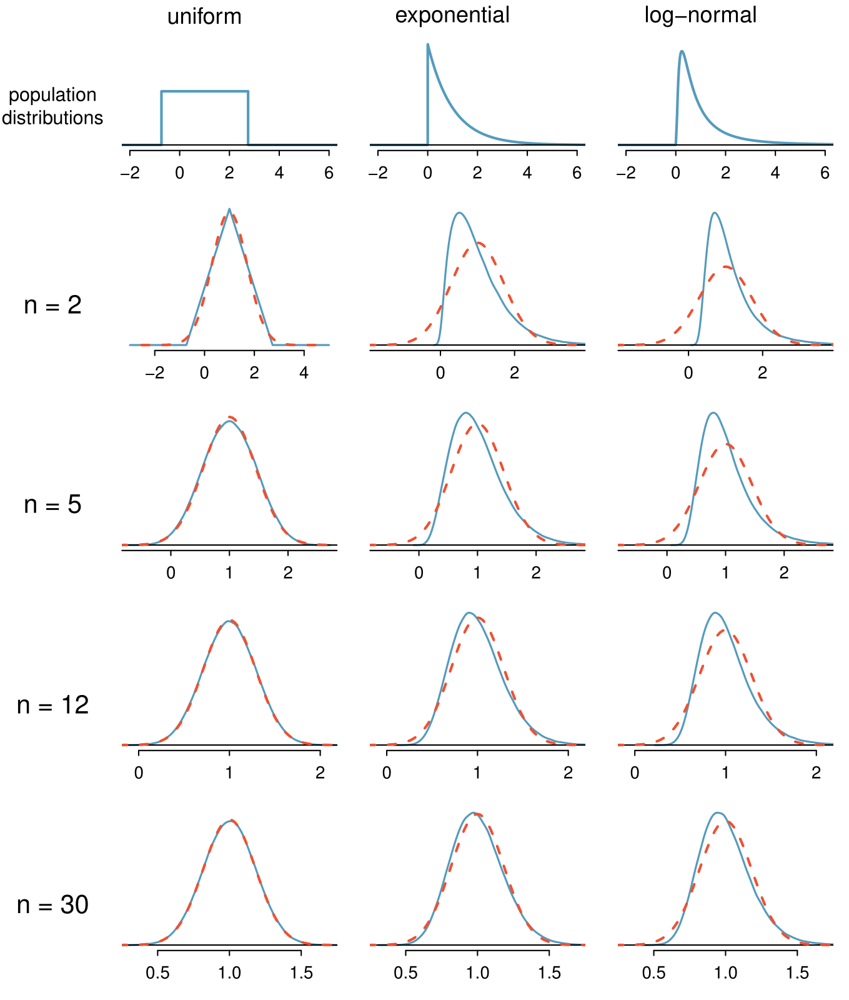

# Fundamentos para Inferência {#ch4-fund-inf}

A inferência estatística está relacionada principalmente com a compreensão da qualidade das estimativas de parâmetros. Por exemplo, uma pergunta inferencial clássica é: "Como estamos certos de que a média estimada, $\overline{x}$, está perto da verdadeira média populacional, $\mu$?'' Enquanto as equações e detalhes mudam dependendo da configuração, as bases para a inferência são as mesmas em todas as estatísticas. Introduzimos esses temas comuns nas primeiras quatro seções discutindo inferência sobre a média da população, $\mu$, e definir o cenário para outros parâmetros e cenários na Seção 5. Entender este capítulo fará com que o restante deste livro, e de fato o resto das estatísticas, pareça muito mais familiar.

Ao longo das próximas seções, consideramos um conjunto de dados chamado `yrbss`, que representa todos os 13.583 estudantes do ensino médio no Sistema de Vigilância do Comportamento de Risco Juvenil (YRBSS) de 2013.^[www.cdc.gov/healthyyouth/data/yrbs/data.htm] Parte deste conjunto de dados é mostrada na Tabela \@ref(tab:yrbssDF).

```{r yrbssDF}
library(openintro)
data(yrbss)

require(dplyr)
dados = select(yrbss, age, gender, grade, height, weight, helmet_12m,
               physically_active_7d, strength_training_7d)
colnames(dados) = c('idade', 'genero', 'grau', 'altura', 'peso', 
                    'capacete', 'ativo', 'levantamento')

knitr::kable(head(dados, 5), 
      caption = "Cinco casos do conjunto de dados yrbss. Algumas observações estão em branco, pois há dados ausentes. Por exemplo, a altura e o peso dos alunos 1 e 2 estão ausentes.")
```

As variáveis são descritas como:

* __idade:__ Idade do estudante,

* __gênero:__ Gênero do estudante,

* __grau:__ Grau do ensino méedio,

* __altura:__ Altura (em metros),

* __peso:__ Peso (em quilogramas),

* __capacete:__ Frequência em que o estudante usou um capacete ao andar de bicicleta nos últimos 12 meses 

* __ativo:__ Número de dias fisicamente ativos por 60+ minutos nosúultimos 7 dias e

* __levantamento:__ Número  de  dias  de  treinamento  de  força  (i.é, levantamento  de  peso)  nos últimos 7 dias.

Vamos considerar a população de alunos do ensino médio que participaram do YRBSS de 2013. Nós pegamos uma amostra aleatória simples dessa população, que é representada na Tabela \@ref(tab:yrbssSampDF).^[Cerca de 10\% dos estudantes do ensino médio para cada variável optaram por não responder à pergunta, usamos a regressão múltipla para prever o que essas respostas teriam sido. Por simplicidade, vamos supor que esses valores previstos são exatamente a verdade.]

```{r yrbssSampDF}
library(openintro)
data(yrbss.samp)

require(dplyr)
dados_samp = select(yrbss.samp, age, gender, grade, height, weight, helmet_12m, 
                    physically_active_7d, strength_training_7d)
colnames(dados_samp) = c('idade', 'genero', 'grau', 'altura', 'peso', 
                         'capacete', 'ativo', 'levantamento')

knitr::kable(head(dados_samp, 5), 
      caption = "Cinco observações para o conjunto de dados da amostra, que representa uma amostra aleatória simples de 100 alunos do ensino médio de 2013.")
```


Usaremos essa amostra, à qual nos referimos como o conjunto de dados `amostra_yrbss`, para tirar conclusões sobre a população de participantes do YRBSS. Essa é a prática da inferência estatística no sentido mais amplo. Quatro histogramas resumindo as variáveis altura, peso, ativo, e levantamento do conjunto de dados `amostra_yrbss` são mostrados na Figura \@ref(fig:yrbssSampHistograms).

```{r yrbssSampHistograms, fig.cap = "Histogramas de altura, peso, ativo, e levantamento para os dados de amostra YRBSS. A distribuição altura é aproximadamente simétrica, peso está moderadamente inclinada para a direita, ativo é bimodal ou multimodal (com inclinação indefinida) e levantamento está fortemente enviesada para a direita.",  out.height='60%', fig.height=5}

require(ggplot2)

alt <- ggplot(data = dados_samp, mapping = aes(x = altura)) + 
  labs(x = "Altura (em metros)", y = NULL) + 
  geom_histogram(bins = 12, color = "white", fill = "#EAB217") +
  theme(panel.border = element_rect(colour = "black", fill=NA, size=1))

pes <- ggplot(data = dados_samp, mapping = aes(x = peso)) + 
  labs(x = "Peso (em quilogramas)", y = NULL) + 
  geom_histogram(bins = 12, color = "white", fill = "#EAB217") +
  theme(panel.border = element_rect(colour = "black", fill=NA, size=1))

ati <- ggplot(data = dados_samp, mapping = aes(x = ativo)) + 
  labs(x = "Núm. de dias fisicamente ativos por 60+ minutos \n nos últimos 7 dias", y = NULL) + 
  geom_histogram(bins = 8, color = "white", fill = "#EAB217") +
  theme(panel.border = element_rect(colour = "black", fill=NA, size=1))

lev <- ggplot(data = dados_samp, mapping = aes(x = levantamento)) + 
  labs(x = "Núm.  de  dias  de  treinamento  de  força  \n (levantamento  de  peso)  nos últimos 7 dias", y = NULL) + 
  geom_histogram(bins = 8, color = "white", fill = "#EAB217") +
  theme(panel.border = element_rect(colour = "black", fill=NA, size=1))

require(gridExtra)
grid.arrange(alt, pes, ati, lev, ncol = 2)
```

## Variabilidade nas estimativas {#variabilityEstimates}

Gostaríamos de estimar quatro características dos alunos do ensino médio em YRBSS usando a amostra.

+ **[(1)]** Qual é a altura média dos alunos do ensino médio do YRBSS?

+ **[(2)]** Qual é o peso médio dos alunos do ensino médio do YRBSS? {}

+ **[(3)]** Em média, quantos dias por semana os estudantes do YRBSS são fisicamente ativos?

+ **[(4)]** Em média, quantos dias por semana os alunos do ensino médio da YRBSS fazem treinamento com pesos?

Enquanto nos concentramos na média neste capítulo, questões relativas à variação são frequentemente tão importantes na prática. Por exemplo, se os alunos são muito ativos ou quase totalmente inativos (a distribuição é bimodal), podemos tentar diferentes estratégias para promover um estilo de vida saudável entre os alunos do que se todos os alunos do ensino médio já estivessem ativos.

### Estimativas pontuais {#pointEstimates}

Queremos estimar a __média da população__ com base na amostra. A maneira mais intuitiva de fazer isso é simplesmente pegar a __média amostral__. Ou seja, para estimar a altura média de todos os alunos do YRBSS, calcule a altura média da amostra:

\begin{eqnarray*}
\bar{x}_{altura} = \frac{1,50 + 1,78 + \dots + 1,70}{100} = 1,697
\end{eqnarray*}

A media amostral $\bar{x} = 1,697$ metros é chamada de __estimativa pontual__ da média populacional: se pudermos escolher apenas um valor para estimar a média populacional, este é o nosso melhor palpite. Suponha que tomemos uma nova amostra de 100 pessoas e recompomos a média; provavelmente não obteremos a mesma resposta que recebemos usando o conjunto de dados `amostra_yrbss`. As estimativas geralmente variam de uma amostra para outra, e essa __variação de amostragem__ sugere que a nossa estimativa pode estar perto, mas não vai ser exatamente igual ao parâmetro.

Podemos também estimar o peso médio dos respondentes do YRBSS, examinando a média da amostra de _peso_ (em kg), e número médio de dias fisicamente ativos em uma semana:

\begin{align*}
\bar{x}_{peso} &= \frac{52,6 + 74,8 + \dots + 55,8}{100} = 68,89
&\bar{x}_{ativo} &= \frac{0 + 7 + \dots + 1}{100} = 3,75
\end{align*}

O peso médio é de 68,89 kg, o que equivale a 151.6 libras (medidas americanas).

Que tal gerar estimativas pontuais de outros parâmetros de população, tais como a mediana da população ou o desvio padrão da população? Mais uma vez podemos estimar parâmetros com base em estatísticas de amostra, como mostrado na Tabela \@ref(tab:ptEstimatesYrbssActive). Por exemplo, o desvio padrão da população __ativa__ é 2.56 dias.

```{r ptEstimatesYrbssActive}
aux = matrix(c(c(mean(dados$ativo, na.rm = TRUE), 
                 mean(dados_samp$ativo, na.rm = TRUE)), 
               c(median(dados$ativo, na.rm = TRUE), 
                 median(dados_samp$ativo, na.rm = TRUE)),
               c(sd(dados$ativo, na.rm = TRUE), 
                 sd(dados_samp$ativo, na.rm = TRUE))), 
             ncol = 2, nrow = 3, byrow = TRUE)

rownames(aux) <- c("Média", "Mediana", "Desvio Padrão")
colnames(aux) <- c("Parâmetro", "Estimativa")

knitr::kable(aux,
      caption = "Estimativas pontuais e valores de parâmetros para a variável 'ativo'. Os parâmetros foram obtidos pelo cálculo da média, mediana e desvio padrão para todos os respondentes do YRBSS.",
      align = "c", digits = 4)
```

***
```{exercise}
Suponha que queremos estimar a diferença em dias ativos para homens e mulheres. Se $\bar{x}_{homem} = 4.3$ e $\bar{x}_{mulher} = 3.2$, então qual seria uma boa estimativa pontual para a diferença de população?^[Poderíamos tirar a diferença das duas médias de amostra: $4.3 - 3.2 = 1.1$. Os homens são fisicamente ativos cerca de 1.1 dias por semana mais do que as mulheres, em média, em YRBSS.]
```

***

***
```{exercise}
Se você tivesse que fornecer uma estimativa pontual do IQR da população para as alturas dos participantes, como você poderia fazer tal estimativa usando uma amostra? ^[Para obter uma estimativa pontual da altura para o conjunto completo de alunos da YRBSS, poderíamos tome o IQR da amostra.]
```

***

### Estimativas pontuais não são exatas {#pointEstimatesNotExact}

As estimativas geralmente não são exatamente iguais à verdade, mas melhoram à medida que mais dados são disponibilizados. Podemos ver isso traçando uma média de execução de `amostra_yrbss`. A _média móvel_ é uma sequência de médias, em que cada média usa mais uma observação em seu cálculo do que a média diretamente antes dela na sequência. Por exemplo, a segunda média na sequência é a média das duas primeiras observações e a terceira na sequência é a média das três primeiras. A média para a variável _ativo_ na `amostra_yrbss` é mostrado na Figura \@ref(fig:yrbssActiveRunningMean), e se aproxima da real, 3.90 dias, à medida que o tamanho de amostra aumenta.

```{r yrbssActiveRunningMean, fig.cap="A média computada após adicionar cada indivíduo à amostra. A média tende a se aproximar da média real da população à medida que mais dados se tornam disponíveis.", fig.align = "center"}

d <- dados_samp$ativo
xBars <- cumsum(d) / (1:100)
m <- mean(dados$ativo, na.rm = TRUE)

require(plotly)


p <- ggplot(data = data.frame(n = 1:100, xBars), aes(x = n, y = xBars)) + 
  geom_line(color = "#E6205F") + 
  geom_hline(yintercept = m, linetype = "dashed", color = "#E6205F") + 
  labs(y = "Média de dias fisicamente ativo \n /por semana", 
      x = "Tamanho da amostra") +
  theme(panel.border = element_rect(colour = "black", fill=NA, size=1))
ggplotly(p)
```

Estimativas pontuais da amostra apenas se aproximam do parâmetro populacional e variam de uma amostra para outra. Se pegássemos outra amostra aleatória simples dos alunos do YRBSS, descobriríamos que a média da amostra para o número de dias ativos seria um pouco diferente. Será útil quantificar quão variável é uma estimativa de uma amostra para outra. Se esta variabilidade é pequena (ou seja, a média da amostra não muda muito de uma amostra para outra), então essa estimativa é provavelmente muito precisa. Se variar muito de uma amostra para outra, então não devemos esperar que nossa estimativa seja muito boa.

### Erro padrão da média {#standardErrorMean}

Da amostra aleatória representada em __amostra_yrbss__, adivinhamos que o número médio de dias que um aluno YRBSS está fisicamente ativo é de 3.75 dias. Suponha que tomemos outra amostra aleatória de 100 indivíduos e tomemos sua média: 3.22 dias. Suponha que tenhamos outro (3.67 dias) e outro (4.10 dias) e assim por diante. Se fizermos isso muitas e muitas vezes -- o que podemos fazer apenas porque temos todos os alunos do YRBSS -- podemos construir uma **distribuição amostral** para a média da amostra quando o tamanho da amostra for 100, mostrado na Figura \@ref(fig:yrbssActive1000SampDist).

```{r yrbssActive1000SampDist, fig.cap="Um histograma de 1000 amostras significa para o número de dias fisicamente ativos por semana, onde as amostras são de tamanho $n=100$.", fig.align = "center"}
set.seed(5)
means <- c()
for (i in 1:1000) {
  these <- sample(nrow(dados), 100)
  means[i] <- mean(dados$ativo[these], na.rm = TRUE)
}

m <- mean(dados$ativo, na.rm = TRUE)
s <- sd(dados$ativo, na.rm = TRUE) / 10

ggplot() + 
  labs(x = "Média Amostral", y = "Frequência") + 
  geom_rect(mapping = aes(xmin = m - s, xmax = m + s, ymin = 0, ymax = 93),
            fill = "gray60") +
  geom_rect(mapping = aes(xmin = m - (2*s), xmax = m + (2*s), ymin = 0, ymax = 93),
            fill = "gray28", alpha = 0.5) +
  geom_rect(mapping = aes(xmin = m - (3*s), xmax = m + (3*s), ymin = 0, ymax = 93),
            fill = "gray48", alpha = 0.5) +
  geom_histogram(aes(x = means), color = "black", fill = "#E97C31") + 
  geom_vline(xintercept = m, linetype = "dashed") +
  theme(panel.border = element_rect(colour = "black", fill=NA, size=1))
```

<div class="alert alert-info">
<strong>Distribuição Amostral</strong>: A distribuição amostral representa a distribuição das estimativas pontuais com base em amostras de um tamanho fixo de uma determinada população. É útil pensar em uma determinada estimativa pontual como sendo extraída de tal distribuição. Entender o conceito de uma distribuição amostral é fundamental para entender a inferência estatística.
</div>

A distribuição amostral mostrada na Figura \@ref(fig:yrbssActive1000SampDist) é unimodal e aproximadamente simétrica. Também é centrada exatamente na verdadeira média da população: $\mu=3.90$. Intuitivamente, isso faz sentido. As médias amostrais devem tender a "cair ao redor" da média populacional.

Podemos ver que a média amostral possui alguma variabilidade em torno da média populacional, que pode ser quantificada usando o desvio padrão desta distribuição de médias amostrais: $\sigma_{\bar{x}} = 0.26$. O desvio padrão da média da amostra nos diz até que ponto a estimativa típica está distante da média real da população, 3.90 dias. Ele também descreve o típico __erro__ da estimativa pontual e, por esse motivo, geralmente chamamos esse desvio padrão de __erro padrão (EP)__ da estimativa.

<div class="alert alert-info">
<strong>Erro padrão de uma estimativa</strong>: O desvio padrão associado a uma estimativa é chamado de _erro padrão_. Descreve o erro típico ou a incerteza associada à estimativa.
</div>

Ao considerar o caso da estimativa pontual $\bar{x}$, há um problema: não há uma maneira óbvia de estimar seu erro padrão a partir de uma única amostra. No entanto, a teoria estatística fornece uma ferramenta útil para resolver esse problema. 

***
```{exercise}
^[(a) Considere duas amostras aleatórias: um de tamanho 10 e um de tamanho 1000. Observações individuais na pequena amostra são altamente influentes na estimativa, enquanto que em amostras maiores, essas observações individuais seriam mais frequentemente uma média entre si. A amostra maior tenderia a fornecer uma estimativa mais precisa. (b) Se pensarmos que uma estimativa é melhor, provavelmente queremos dizer que ela geralmente tem menos erros. Com base em (a), nossa intuição sugere que um tamanho de amostra maior corresponde a um erro padrão menor.]

+ (a) Você prefere usar uma amostra pequena ou uma amostra grande ao estimar um parâmetro? Por quê? 
  
+ (b) Usando seu raciocínio de (a), você esperaria que uma estimativa pontual baseada em uma amostra pequena tivesse um erro padrão menor ou maior do que uma estimativa pontual baseada em uma amostra maior?
```

***

Na amostra de 100 alunos, o erro padrão da média da amostra é igual ao desvio padrão da população dividido pela raiz quadrada do tamanho da amostra:

\begin{eqnarray*}
EP_{\bar{x}} = \sigma_{\bar{x}} = \frac{\sigma_{x}}{\sqrt{n}} = \frac{2,6}{\sqrt{100}} = 0,26
\end{eqnarray*}

onde $\sigma_{x}$ é o desvio padrão das observações individuais. Isso não é coincidência. Podemos mostrar matematicamente que esta equação está correta quando as observações são independentes usando as ferramentas de probabilidade.

<div class="alert alert-info">
<strong>Calculando EP para a amostra média</strong>: considerando observações independentes de $n$ de uma população com desvio padrão $\sigma$, o erro padrão da média amostral é igual a 

\begin{eqnarray}
EP = \frac{\sigma}{\sqrt{n}}
  (\#eq:seOfXBar)
\end{eqnarray}

Um método confiável para garantir que as observações da amostra sejam independentes é conduzir uma amostra aleatória simples que consiste em pelo menos 10\% da população.
</div>

Há uma questão sutil na Equação \@ref(eq:seOfXBar): o desvio padrão da população é tipicamente desconhecido. Você já deve ter adivinhado como resolver esse problema: podemos usar a estimativa pontual do desvio padrão da amostra. Esta estimativa tende a ser suficientemente boa quando o tamanho da amostra é de pelo menos 30 e a distribuição da população não é fortemente distorcida. Assim, muitas vezes usamos apenas o desvio padrão da amostra $s$  do $\sigma$. Quando o tamanho da amostra for menor que 30, precisaremos usar um método para considerar a incerteza extra no erro padrão. Se a condição de inclinação não for atendida, uma amostra maior será necessária para compensar o desvio extra.

***
```{exercise}
Na amostra de 100 alunos, o desvio padrão das alturas dos alunos é $s_{altura} = 0,088$ metros. Neste caso, podemos confirmar que as observações são independentes, verificando se os dados provêm de uma amostra aleatória simples que consiste em pelo menos de 10\% da população.^[(a) Use Equação \@ref(eq:seOfXBar) com o desvio padrão da amostra para calcular o erro padrão: $EP_{\bar{y}} = 0,088 / \sqrt{100} = 0,0088$ metros. (b) Não seria surpreendente. Nossa amostra é de cerca de 1 erro padrão de 1,69m. Em outras palavras, 1,69m não parece ser implausível, dado que nossa amostra estava relativamente próxima a ela. (Usamos o erro padrão para identificar o que está próximo).]

+ (a) Qual é o erro padrão da média da amostra?, $\bar{x}_{altura} = 1,70$ metros? 
  
+ (b) Você ficaria surpreso se alguém lhe dissesse que a altura média de todos os entrevistados da YRBSS era de 1,69 metros?
```

***

***
```{exercise}
^[(a) Observações extras geralmente são úteis para entender a população, portanto, uma estimativa pontual com 400 observações parece mais confiável. (b) O erro padrão quando o tamanho da amostra é 100 é dado por $EP_{100} = 10/\sqrt{100} = 1$. Para 400: $EP_{400} = 10/\sqrt{400} = 0,5$. A amostra maior tem um erro padrão menor. (c) O erro padrão da amostra com 400 observações é menor que o da amostra com 100 observações. O erro padrão descreve o erro típico e, como é menor para a amostra maior, isso mostra matematicamente que a estimativa da amostra maior tende a ser melhor -- embora não garanta que todas as amostras grandes forneçam uma estimativa melhor do que uma determinada amostra pequena.]

+ (a) Você confiaria mais em uma amostra que tivesse 100 observações ou 400 observações?
  
+ (b) Queremos mostrar matematicamente que nossa estimativa tende a ser melhor quando o tamanho da amostra é maior. Se o desvio padrão das observações individuais for 10, qual é a nossa estimativa do erro padrão quando o tamanho da amostra é 100? E quando é 400? 
  
+ (c) Explique como a sua resposta à parte (b) matematicamente justifica sua intuição em parte (a).
```

***

### Propriedades básicas de estimativas pontuais {#basicPropertiesPointEstimates}

Conseguimos três objetivos nesta seção. Primeiro, determinamos que as estimativas pontuais de uma amostra podem ser usadas para estimar parâmetros populacionais. Também determinamos que essas estimativas pontuais não são exatas: elas variam de uma amostra para outra. Por fim, quantificamos a incerteza da média amostral usando o que chamamos de erro padrão, representado matematicamente na Equação \@ref(eq:seOfXBar). Embora possamos quantificar o erro padrão para outras estimativas -- como a mediana, o desvio padrão ou qualquer outro número de estatísticas -- adiaremos essas extensões para capítulos ou cursos posteriores.

## Intervalos de confiança {#confidenceIntervals}

Uma estimativa pontual fornece um único valor plausível para um parâmetro. No entanto, uma estimativa pontual raramente é perfeita; geralmente há algum erro na estimativa. Em vez de fornecer apenas uma estimativa pontual de um parâmetro, um próximo passo lógico seria fornecer um plausível __intervalo de valores__ para o parâmetro.

### Capturando o parâmetro populacional {#capturingPopParameter}

Um intervalo plausível de valores para o parâmetro populacional é chamado de __intervalo de confiança__.

Usar apenas uma estimativa pontual é como pescar em um lago escuro com uma lança, e usar um intervalo de confiança é como pescar com uma rede. Podemos lançar uma lança onde vimos um peixe, mas provavelmente vamos errar. Por outro lado, se atirarmos uma rede nessa área, temos uma boa chance de pegar o peixe.

Se reportarmos uma estimativa pontual, provavelmente não atingiremos o parâmetro populacional exato. Por outro lado, se reportarmos um intervalo de valores plausíveis -- um intervalo de confiança -- temos uma boa chance de capturar o parâmetro. 

***
```{exercise}
Se quisermos ter certeza de que capturamos o parâmetro populacional, devemos usar um intervalo maior ou um intervalo menor?^[Se quisermos ter mais certeza de capturar o peixe, poderemos usar uma rede mais ampla. Da mesma forma, usamos um intervalo de confiança mais amplo, se queremos ter mais certeza de que capturamos o parâmetro.]
```

***

### Um intervalo de confiança aproximado de 95 \% {#confidenceIntervalApproximate95}

A estimativa pontual é o valor mais plausível do parâmetro, portanto, faz sentido construir o intervalo de confiança em torno da estimativa pontual. O erro padrão, que é uma medida da incerteza associada à estimativa pontual, fornece um guia de quão grande devemos fazer o intervalo de confiança.

O erro padrão representa o desvio padrão associado à estimativa e em aproximadamente 95\% do tempo estará dentro de 2 erros padrão do parâmetro. Se o intervalo cobrir 2 erros padrão da estimativa pontual, podemos ter aproximadamente 95\% de __confiança__ que capturamos o verdadeiro parâmetro:

\begin{eqnarray}
\text{estimativa pontual}\ \pm\ 2\times EP
(\#eq:95PercentConfidenceIntervalFormula)
\end{eqnarray}

Mas o que significa "95\% confiante"? Suponha que tirássemos muitas amostras e construíssemos um intervalo de confiança de cada amostra usando a Equação \@ref(eq:95PercentConfidenceIntervalFormula). Então, cerca de 95\% desses intervalos conteriam a média real, $\mu$. A Figura \@ref(fig:95PercentConfidenceInterval) mostra este processo com 25 amostras, em que 24 dos intervalos de confiança resultantes contêm o número médio de dias por semana em que os alunos do YRBSS estão fisicamente ativos, $\mu=3.90$ dias, e um intervalo não.

```{r 95PercentConfidenceInterval, fig.cap="Vinte e cinco amostras de tamanho n=100 foram tiradas do banco yrbss. Para cada amostra, um intervalo de confiança foi criado para tentar capturar o número médio de dias por semana em que os alunos estão fisicamente ativos. Apenas 1 desses 25 intervalos não capturou a verdadeira média de 3.90.", fig.align="center"}

set.seed(1)
amostras <- matrix(NA, ncol = 25, nrow = 100)

for (i in 1:25){
  amostras[,i] <- sample(x = dados$ativo, size = 100, replace = FALSE)
}

vetor_medias <- apply(amostras, 2, mean, na.rm=TRUE) #vetor de medias
vetor_sd <- apply(amostras, 2, sd, na.rm=TRUE) #vetor de desvio padrao

vetor_ic_inf <- vetor_medias - (qnorm(0.975))*(vetor_sd/sqrt(100)) #vetor de IC inferior
vetor_ic_sup <- vetor_medias + (qnorm(0.975))*(vetor_sd/sqrt(100)) #vetor de IC superior

ggplot() + 
  geom_vline(xintercept = m, linetype = "dashed") +
  geom_segment(aes(x = vetor_ic_inf, y = 1:25, 
                   xend = vetor_ic_sup, yend = 1:25), 
               color = ifelse(vetor_ic_inf < m, '#E6205F', '#EAB217')) + 
  geom_point(aes(x = vetor_medias, y = 1:25), 
             color = ifelse(vetor_ic_inf < m, '#E6205F', '#EAB217')) + 
  labs(y = NULL, x = NULL) + 
  theme(axis.ticks = element_blank(), axis.text = element_blank()) +
  theme(panel.border = element_rect(colour = "black", fill=NA, size=1))
```

***
```{exercise}
Na Figura \@ref(fig:95PercentConfidenceInterval), um intervalo não contém 3.90 dias. Isso implica que a média não pode ser de 3.90?^[Assim como algumas observações estão a mais de 2 desvios-padrão da média, algumas estimativas pontuais serão mais de 2 erros padrão do parâmetro. Um intervalo de confiança fornece apenas um intervalo plausível de valores para um parâmetro. Embora possamos dizer que outros valores são implausíveis com base nos dados, isso não significa que eles sejam impossíveis.]
```

***

A regra em que cerca de 95\% das observações estão dentro de dois desvios padrão da média é apenas aproximadamente verdadeira. No entanto, vale muito bem para a distribuição normal. Como veremos em breve, a média tende a ser normalmente distribuída quando o tamanho da amostra é suficientemente grande. 

```{example}
A média da amostra de dias ativos por semana de `amostra_yrbss` é de 3.75 dias. O erro padrão, estimado usando o desvio padrão da amostra, é $EP=\frac{2,6}{\sqrt{100}} = 0,26$ dias. (O DP da população é desconhecido na maioria das aplicações, portanto, usamos o DP da amostra aqui.) Calcule um intervalo de confiança aproximado de 95\% para a média de dias ativos por semana para todos os alunos do YRBSS.
```

Nós aplicamos a Equação \@ref(eq:95PercentConfidenceIntervalFormula):

\begin{eqnarray*}
3.75\ \pm\ 2 \times  0.26 \quad \rightarrow \quad (3.23, 4.27)
\end{eqnarray*}

Com base nesses dados, temos cerca de 95\% de certeza de que a média de dias ativos por semana para todos os alunos da YRBSS foi maior que 3.23, mas menor que 4.27 dias. Nosso intervalo estende-se 2 erros padrão da estimativa pontual, $\bar{x}_{ativo}$.

***
```{exercise}
Os dados da amostra sugerem que a altura média dos alunos do YRBSS é $\bar{x}_{altura} = 1.697$ metros com um erro padrão de 0.0088 metros (estimado usando o desvio padrão da amostra, 0.088 metros). O que é um intervalo de confiança aproximado de 95\% para a altura média de todos os alunos do YRBSS?^[Aplique a Equação \@ref(eq:95PercentConfidenceIntervalFormula): $1.697 \ \pm \ 2\times 0.0088 \rightarrow (1.6794, 1.7146)$. Interpretamos este intervalo da seguinte forma: Temos cerca de 95\% de certeza de que a altura média de todos os alunos do YRBSS era entre 1.6794 e 1.7146 metros.]
```

***

### A distribuição amostral para a média {#meanSampleDistribution}

Foi introduzido uma distribuição amostral para $\bar{x}$, a média de dias fisicamente ativos por semana para amostras de tamanho 100. Examinamos essa distribuição na Figura \@ref(fig:yrbssActive1000SampDist). Agora vamos pegar 100.000 amos
tras, calcular a média de cada uma e plotar em um histograma para obter uma representação especialmente precisa da distribuição amostral. Este histograma é mostrado no painel esquerdo da Figura \@ref(fig:yrbssActiveBigSampDist).

```{r yrbssActiveBigSampDist, fig.align="center", fig.cap="O painel esquerdo mostra um histograma das médias amostrais para 100.000 amostras aleatórias diferentes. O painel da direita mostra um gráfico de probabilidade normal dessas médias amostrais."}

set.seed(5)
means <- c()
for (i in 1:100000) {
  these <- sample(nrow(dados), 100)
  means[i] <- mean(dados$ativo[these], na.rm = TRUE)
}

s_mean <- ggplot() + 
  labs(x = "Média Amostral", y = "Frequência") + 
  geom_rect(mapping = aes(xmin = m - s, xmax = m + s, ymin = 0, ymax = 12500),
            fill = "gray60") +
  geom_rect(mapping = aes(xmin = m - (2*s), xmax = m + (2*s), ymin = 0, ymax = 12500),
            fill = "gray28", alpha = 0.5) +
  geom_rect(mapping = aes(xmin = m - (3*s), xmax = m + (3*s), ymin = 0, ymax = 12500),
            fill = "gray48", alpha = 0.5) +
  geom_histogram(aes(x = means), color = "black", fill = "#E97C31") + 
  geom_vline(xintercept = m, linetype = "dashed") +
  theme(panel.border = element_rect(colour = "black", fill=NA, size=1))


s_qq <-ggplot(data.frame(means), aes(sample = means)) + 
  stat_qq(color = "#E97C31") +
  theme(panel.border = element_rect(colour = "black", fill=NA, size=1))

grid.arrange(s_mean, s_qq, ncol = 2)

```

Esta distribuição parece familiar? Esperamos que sim! A distribuição das médias amostrais é muito semelhante à distribuição normal. Um gráfico de probabilidade normal dessas médias amostrais é mostrado no painel direito Figura \@ref(fig:yrbssActiveBigSampDist). Como todos os pontos caem em torno de uma linha reta, podemos concluir que a distribuição das médias da amostra é quase normal. Este resultado pode ser explicado pelo Teorema Central do Limite.

<div class="alert alert-info">
  <strong>Teorema do Limite Central, descrição informal</strong>: Se uma amostra consistir em pelo menos 30 observações independentes e os dados não estiverem fortemente distorcidos, então a distribuição da média amostral é bem aproximada por um modelo normal.
</div>

Nós vamos aplicar esta versão informal do Teorema Central do Limite por enquanto, e discutiremos seus detalhes mais à frente.

A escolha de usar 2 erros padrão na Equação \@ref(eq:95PercentConfidenceIntervalFormula) foi baseado em nossa diretriz geral de que aproximadamente 95\% do tempo, as observações estão dentro de dois desvios padrão da média. Sob o modelo normal, podemos tornar isso mais preciso usando 1.96 no lugar de 2.

\begin{eqnarray}
\text{estimativa pontual}\ \pm\ 1.96\times EP
(\#eq:95PercentCIWhenUsingNormalModel)
\end{eqnarray}

Se uma estimativa pontual, como $\bar{x}$, está associado a um modelo normal e erro padrão $EP$, então usamos este intervalo de confiança mais preciso de 95\%.

### Alterando o nível de confiança {#changingLevelConfidence}

Suponha que nós queremos considerar intervalos de confiança onde o nível de confiança é um pouco maior que 95\%; talvez nós gostaríamos de um nível de confiança de 99\%. Pense na analogia sobre tentar pegar um peixe: se queremos ter mais certeza de que vamos pegar o peixe, devemos usar uma rede mais ampla. Para criar um nível de confiança de 99\%, devemos também ampliar nosso intervalo de 95\%. Por outro lado, se quisermos um intervalo com menor confiança, como 90\%, poderíamos tornar nosso intervalo original de 95\% um pouco mais magro.

A estrutura do intervalo de confiança de 95\% fornece orientação sobre como fazer intervalos com novos níveis de confiança. Abaixo está um intervalo de confiança geral de 95\% para uma estimativa pontual que vem de uma distribuição quase normal:

\begin{eqnarray}
\text{estimativa pontual}\ \pm\ 1.96\times EP
\end{eqnarray}

Existem três componentes para este intervalo: a estimativa pontual, "1.96" e o erro padrão. A escolha de $1.96\times EP$ foi baseada na captura de 95\% dos dados, pois a estimativa está dentro dos desvios padrão de 1.96 do parâmetro, aproximadamente 95\% do tempo. A escolha de 1.96 corresponde a um nível de confiança de 95\%.

***
```{exercise, label = "poant"}
Se $X$ é uma variável aleatória distribuída normalmente, com que freqüência $X$ estará dentro de 2.58 desvios padrão da média?^[Isso equivale a perguntar com que frequência o Z-escore será maior que -2.58, mas menor que 2.58. (Para uma foto, veja a Figura \@ref(fig:choosingZForCI).) Para determinar essa probabilidade, procura-se -2.58 e 2.58 na tabela de probabilidade normal (0.0049 e 0.9951). Assim, há $0.9991-0.0049 \approx 0.99$ probabilidade de que a variável aleatória não observada $X$ esteja dentro de 2.58 desvios-padrão de $\mu$.]
```

***

Para criar um intervalo de confiança de 99\%, altere 1.96 na fórmula do intervalo de confiança de 95\% para $2.58$. Na prática orientada \@ref(exr:poant), destaca-se que 99\% do tempo uma variável aleatória normal estará dentro de 2.58 desvios padrão da média. Esta abordagem -- usando as pontuações Z no modelo normal para calcular os níveis de confiança -- é apropriada quando $\bar{x}$ está associado a uma distribuição normal com média $\mu$ e erro padrão $EP_{\bar{x}}$. Assim, a fórmula para um intervalo de confiança de 99\% é

\begin{eqnarray}
\bar{x}\ \pm\ 2,58\times EP_{\bar{x}}
(\#eq:99PercCIForMean)
\end{eqnarray}

```{r choosingZForCI, fig.cap="A área entre -z e z aumenta ao passo que |z| torna-se maior. Se o nível de confiança é de 99%, nós escolhemos z tal que 99% da curva normal está entre -z e z, que corresponde a 0.005% na cauda inferior e 0.005% na cauda superior: z=2.58.", fig.align="center"}

set.seed(1)
m <- 0
s <- 1
X <- m + s * seq(-4, 4, 0.01)
Y <- dnorm(X, m, s)

gg   <- data.frame(X,Y)

library(ggplot2)
ggplot(data = gg, mapping = aes(x = X, y = Y)) + 
  geom_rect(mapping = aes(xmin = -2.58, xmax = 2.58, ymin = 0, ymax = 0.5),
            fill = "gray94") + 
  geom_rect(mapping = aes(xmin = -1.96, xmax = 1.96, ymin = 0, ymax = 0.42),
            fill = "gray88") + 
  geom_linerange(data = gg[gg$X < 2.58 & gg$X > -2.58,], 
                 aes(X, ymin = 0, ymax = Y), colour="#E97C31") + 
  geom_linerange(data = gg[gg$X < 1.96 & gg$X > -1.96,], 
                 aes(X, ymin = 0, ymax = Y), colour="#EAB217") + 
  geom_path(size = 1) +
  scale_x_continuous(breaks = seq(m - 3*s, m + 3*s, s)) + 
  labs(x = NULL, y = NULL) + 
  theme(axis.text.y = element_blank(), axis.ticks.y = element_blank(), 
        axis.line.y = element_blank()) + geom_hline(yintercept = 0) + 
  annotate(geom = "text", x = 0, y = 0.45, 
           label = "95%, se estende de -1.96 a 1.96", size = 3) + 
  annotate(geom = "text", x = 0, y = 0.53, 
           label = "99%, se estende de -2.58 a 2.58", size = 3) + 
  geom_segment(aes(x = -1.96, y = 0.42, xend = 1.96, yend = 0.42)) + 
  geom_segment(aes(x = -2.58, y = 0.5, xend = 2.58, yend = 0.5)) + 
  geom_segment(aes(x = -1.96, y = 0, xend = -1.96, yend = 0.42), linetype = "dashed") +
  geom_segment(aes(x = 1.96, y = 0, xend = 1.96, yend = 0.42), linetype = "dashed") + 
  geom_segment(aes(x = -2.58, y = 0, xend = -2.58, yend = 0.5), linetype = "dashed") +
  geom_segment(aes(x = 2.58, y = 0, xend = 2.58, yend = 0.5), linetype = "dashed") +
  theme(panel.border = element_rect(colour = "black", fill=NA, size=1))
```

A aproximação normal é crucial para a precisão desses intervalos de confiança. A Seção 4.4 fornece uma discussão mais detalhada sobre quando o modelo normal pode ser aplicado com segurança. Quando o modelo normal não é um bom ajuste, usaremos distribuições alternativas que melhor caracterizem a distribuição amostral.

<div class="alert alert-info">
  <strong>Condições para $\bar{x}$ ser quase normal e $EP$ ser exato</strong>: Condições importantes para ajudar a garantir que a distribuição amostral de $\bar{x}$ é quase normal e a estimativa de EP suficientemente precisa:

+ As observações da amostra são independentes.

+ O tamanho da amostra é grande: $n\geq30$ é uma boa regra prática.

+ A distribuição da população não é fortemente distorcida. Essa condição pode ser difícil de avaliar, então apenas use seu melhor julgamento.

Além disso, quanto maior o tamanho da amostra, mais leniente que podemos ser com o desvio da amostra.
</div>

<div class="alert alert-info">
  <strong>Como verificar que observações da amostra são independentes</strong>: Se as observações são de uma amostra aleatória simples e consistem em pelo menos 10\% da população, então elas são independentes.
  
Os participantes de um experimento são considerados independentes se forem submetidos aleatoriamente aos grupos de tratamento.

Se uma amostra é de um processo aparentemente aleatório, por exemplo, o tempo de vida de chaves usadas em um processo de fabricação específico, a verificação da independência é mais difícil. Nesse caso, use seu melhor julgamento.
</div>

<div class="alert alert-info">
  <strong>A verificação de inclinação forte geralmente significa verificar se há desvios óbvios</strong>: Quando há outliers proeminentes presentes, a amostra deve conter pelo menos 100 observações e, em alguns casos, muito mais. 
</div>

***
```{exercise, label = "po10"}
Crie um intervalo de confiança de 99\% para os dias médios ativos por semana de todos os alunos do YRBSS usando **amostra\_yrbss**. A estimativa pontual é $\bar{x}_{ativo} = 3.75$ e o erro padrão é $EP_{\bar{x}} = 0.26$.^[As observações são independentes (amostra aleatória simples, $<10\%$ da população), o tamanho da amostra é de pelo menos 30 ($n = 100$), e a distribuição não tem uma inclinação clara da Figura \@ref(fig:yrbssSampHistograms); a aproximação normal e estimativa de EP deve ser razoável. Aplique a fórmula do intervalo de confiança 99\%: $\bar{x}_{ativo}\ \pm\ 2,58 \times  EP_{\bar{x}} \rightarrow (3,08, 4,42)$. Estamos 99\% confiantes de que a média de dias ativos por semana de todos os alunos do YRBSS está entre 3.08 e 4.42 dias.]
```

***

<div class="alert alert-info">
  <strong>Intervalo de confiança para qualquer nível de confiança</strong>: Se a estimativa pontual segue o modelo normal com erro padrão $EP$, então um intervalo de confiança para o parâmetro população é
  
\begin{eqnarray*}
\text{estimativa pontual}\ \pm\ z^{\star} \times EP
\end{eqnarray*}

onde $z^{\star}$ corresponde ao nível de confiança selecionado, ou seja, é o valor na tabela z que corresponde a $|z_{\alpha/2}|$.
</div>

A Figura \@ref(fig:choosingZForCI) fornece uma imagem de como identificar $z^{\star}$ com base em um nível de confiança. Nós selecionamos $z^{\star}$ de modo que a área entre -$z^{\star}$ e $z^{\star}$ no modelo normal corresponde ao nível de confiança. 

<div class="alert alert-info">
  <strong>Margem de erro</strong>: Em um intervalo de confiança, $z^{\star}\times EP$ é chamado __margem de erro__.
</div>

***
```{exercise}
Use os dados na Prática Orientada \@ref(exr:po10) para criar um intervalo de confiança de 90\% para os dias médios ativos por semana de todos os alunos do YRBSS.^[Nós primeiro encontramos $z^{\star}$ tal que 90\% da distribuição fica entre -$z^{\star}$ e $z^{\star}$ no modelo normal padrão, $N(\mu=0, \sigma=1)$. Nós podemos procurar -$z^{\star}$ na tabela de probabilidade normal, procurando uma cauda inferior de 5\% (os outros 5\% estão na cauda superior): $z^{\star}=1,65$. O intervalo de confiança de 90\% pode então ser calculado como $\bar{x}_{ativo}\ \pm\ 1,65\times EP_{\bar{x}} \to (3,32, 4,18)$. (Nós já tínhamos verificado condições para a normalidade e o erro padrão.) Ou seja, estamos 90\% confiantes de que a média de dias ativos por semana é entre 3,32 e 4,18 dias.]
```

***

### Interpretando intervalos de confiança {#interpretingConfidenceIntervals}

Um olho atento pode ter observado a linguagem um pouco desajeitada usada para descrever os intervalos de confiança. Interpretação correta:

> Nós temos XX\% de confiança de que o parâmetro populacional é entre...


A linguagem __incorreta__  pode tentar descrever o intervalo de confiança como capturando o parâmetro da população com uma certa probabilidade. Este é um erro comum: embora possa ser útil pensar nisso como uma probabilidade, o nível de confiança apenas quantifica como é plausível que o parâmetro esteja no intervalo.
Outra consideração importante dos intervalos de confiança é que eles __tentam apenas capturar o parâmetro de população__. Um intervalo de confiança não diz nada sobre a confiança de capturar observações individuais, uma proporção das observações ou sobre a captura de estimativas pontuais. Os intervalos de confiança tentam apenas capturar os parâmetros da população.

## Teste de hipóteses {#hypothesisTest}

Os alunos estão levantando pesos ou realizando outros exercícios de treinamento de força mais ou menos frequentemente do que no passado? Compararemos os dados dos alunos da pesquisa de 2011 da YRBSS com nossa amostra de 100 alunos da pesquisa de 2013 da YRBSS.

Nós também vamos considerar o comportamento do sono. Um estudo recente descobriu que os estudantes universitários têm em média 7 horas de sono por noite.^[Pesquisa mostra que estudantes universitários dormem menos]. No entanto, pesquisadores de uma faculdade rural estão interessados em mostrar que seus alunos dormem mais de sete horas em média. Nós investigamos este tópico mais à frente. 

### Quadro de testes de hipóteses {#hypothesisTestFramework}

Os alunos do YRBSS de 2011 levantaram pesos (ou realizaram outros exercícios de treinamento de força) em média 3.09 dias por semana. Queremos determinar se o conjunto de dados  fornece fortes evidências de que os alunos do YRBSS selecionados em 2013 estão levantando mais ou menos do que os alunos do YRBSS de 2011, em comparação com a outra possibilidade de que não houve mudanças.^[Embora possamos responder a essa pergunta examinando todo o conjunto de dados YRBSS de 2013, nós só consideramos os dados da amostra, que é mais realista, uma vez que raramente temos acesso a dados populacionais.] Simplificamos essas três opções em duas __hipóteses__ conflitantes:

$$
\begin{cases}
  H_0: & \mbox{A média de dias por semana que os alunos da YRBSS levantaram pesos foi a mesma para 2011 e 2013.} \\
  H_1: & \mbox{A média de dias por semana que os alunos da YRBSS levantaram pesos foi diferente para 2011 e 2013.}
\end{cases}
$$

Nós chamamos $H_0$ de hipótese nula e $H_1$ de hipótese alternativa.

<div class="alert alert-info">
  <strong>Hipóteses nula e alternativa</strong>:  A __hipótese nula ($H_0$)__ muitas vezes representa uma perspectiva cética ou uma reivindicação a ser testada. A __hipótese alternativa ($H_1$)__ representa uma alegação alternativa em consideração e é frequentemente representada por um intervalo de possíveis valores de parâmetro.
</div>

A hipótese nula frequentemente representa uma posição cética ou uma perspectiva de nenhuma diferença. A hipótese alternativa frequentemente representa uma nova perspectiva, como a possibilidade de que houve uma mudança.

<div class="alert alert-info">
  <strong>Quadro de testes de hipóteses</strong>: O cético não rejeitará a hipótese nula ($H_0$), a menos que a evidência em favor da hipótese alternativa ($H_1$) seja tão forte que ela rejeite $H_0$ a favor da $H_1$.
</div>

A estrutura de testes de hipóteses é uma ferramenta muito genérica e geralmente a usamos sem pensar duas vezes. Se uma pessoa faz uma afirmação um pouco inacreditável, estamos inicialmente céticos. No entanto, se houver evidência suficiente que suporte a afirmação, deixamos de lado nosso ceticismo e rejeitamos a hipótese nula em favor da alternativa. As marcas do teste de hipóteses também são encontradas no sistema judiciário dos EUA. 

***
```{exercise}
Um tribunal dos EUA considera duas possíveis reivindicações sobre um réu: ele é inocente ou culpado. Se definirmos essas reivindicações em uma estrutura de hipóteses, qual seria a hipótese nula e qual a alternativa?^[O júri considera se a evidência é tão convincente (forte) que não há dúvida razoável em relação à culpa da pessoa; em tal caso, o júri rejeita a inocência (a hipótese nula) e conclui que o réu é culpado (hipótese alternativa).]
```

***

Os jurados examinam as evidências para ver se mostram convincentemente que um réu é culpado. Mesmo que os jurados não se deixem convencer da culpa além de uma dúvida razoável, isso não significa que eles acreditem que o réu é inocente. Esse também é o caso do teste de hipóteses: _mesmo se falharmos em rejeitar a hipótese nula, normalmente não aceitamos a hipótese nula como verdadeira_. Não encontrar evidências fortes para a hipótese alternativa não é equivalente a aceitar a hipótese nula.

No exemplo com o YRBSS, a hipótese nula não representa diferença na média de dias por semana de levantamento de peso em 2011 e 2013. A hipótese alternativa representa algo novo ou mais interessante: houve uma diferença, um aumento ou uma diminuição. Estas hipóteses podem ser descritas em notação matemática usando $\mu_{13}$ como os dias médios de levantamento de peso para 2013:

$$
\begin{cases}
H_0: & \mu_{13} = 3.09 \\
H_1: & \mu_{13} \neq 3.09
\end{cases}
$$

onde 3.09 é o número médio de dias por semana que os alunos do YRBSS de 2011 levantaram pesos. Usando a notação matemática, as hipóteses podem ser mais facilmente avaliadas usando ferramentas estatísticas. Chamamos de 3.09 o __valor nulo__, pois representa o valor do parâmetro se a hipótese nula for verdadeira.

### Testando hipóteses usando intervalos de confiança {#testHypothesisConfidenceIntervals}

Nós vamos usar o conjunto de dados `amostra_yrbss` para avaliar o teste de hipótese, e começamos comparando a estimativa pontual de 2013 do número de dias por semana em que os alunos levantaram pesos: $\bar{x}_{13} = 2.78$ dias. Essa estimativa sugere que os alunos do YRBSS de 2013 estavam levantando pesos menores do que os alunos no YRBSS de 2011. No entanto, para avaliar se isso fornece fortes evidências de que houve uma mudança, devemos considerar a incerteza associada com $\bar{x}_{13}$.

Nós aprendemos que há flutuação de uma amostra para outra, e é improvável que a média da amostra seja exatamente igual ao parâmetro: não devemos esperar $\bar{x}_{13}$ exatamente igual a $\mu_{13}$. Dado que $\bar{x}_{13} = 2.78$, talvez ainda seja possível que a média de todos os alunos da pesquisa de 2013 do YRBSS seja igual à média da pesquisa de 2011 do YRBSS. A diferença entre $\bar{x}_{13}$ e 3.09 poderia ser devido a __variação amostral__, ou seja, a variabilidade associada à estimativa pontual quando tomamos uma amostra aleatória. E intervalos de confiança foram introduzidos como forma de encontrar uma gama de valores plausíveis para a média populacional.

```{example}
Na amostra de 100 alunos da pesquisa de 2013 da YRBSS, o número médio de dias por semana em que os alunos levantaram pesos foi de 2.78 dias com um desvio padrão de 2.56 dias (coincidentemente o mesmo que os dias ativos). Calcule um intervalo de confiança de 95\% para a média de todos os alunos da pesquisa de 2013 do YRBSS. Você pode assumir que as condições para o modelo normal são atendidas.
```

A fórmula geral para o intervalo de confiança com base na distribuição normal é

\begin{align*}
\bar{x} \pm z^{\star} EP_{\bar{x}}
\end{align*}

Nos é dado $\bar{x}_{13} = 2.78$, nós usamos $z^{\star} = 1.96$ para um nível de confiança de 95\%, e podemos calcular o erro padrão usando o desvio padrão dividido pela raiz quadrada do tamanho da amostra:

\begin{align*}
EP_{\bar{x}} = \frac{s_{13}}{\sqrt{n}} = \frac{2,56}{\sqrt{100}} = 0,256
\end{align*}

Inserindo a média da amostra, $z^{\star}$, e o erro padrão na fórmula do intervalo de confiança resulta em (2.27, 3.29). Temos 95\% de confiança de que o número médio de dias por semana que todos os alunos do YRBSS 2013 levantaram pesos ficou entre 2.27 e 3.29 dias.

Como a média de todos os alunos da pesquisa YRBSS de 2011 é de 3.09, que se enquadra na faixa de valores plausíveis do intervalo de confiança, não podemos dizer que a hipótese nula seja implausível. Ou seja, deixamos de rejeitar a hipótese nula, $H_0$.

<div class="alert alert-info">
  <strong>Dupla negação às vezes podem ser usados em estatísticas</strong>: Em muitas explicações estatísticas, usamos dupla negação. Por exemplo, podemos dizer que a hipótese nula é __não implausível__ ou nós __não rejeitamos__ a hipótese nula. Dupla negação são usados para comunicar que, embora não rejeitemos uma posição, também não estamos dizendo que ela está correta.
</div>

***
```{exercise}
Faculdades frequentemente fornecem estimativas de despesas estudantis, como moradia. Um consultor contratado por uma faculdade comunitária alegou que a despesa média com moradia estudantil era de \$650 por mês. Quais são as hipóteses nula e alternativa para testar se essa afirmação é precisa?^[$H_0$: O custo médio é de \$650 por mês, $\mu = \$650$ e $H_1$: O custo médio é diferente de \$650 por mês, $\mu \neq \$650$.]
```

***

***
```{exercise, label = "exrdinheiro"}
O community college decide coletar dados para avaliar a reivindicação de \$650 por mês. Eles pegam uma amostra aleatória de 175 alunos em sua escola e obtêm os dados na Figura \@ref(fig:communityCollegeClaimedHousingExpenseDistribution). Podemos aplicar o modelo normal à média da amostra?^[A aplicação do modelo normal requer que certas condições sejam atendidas. Como os dados são uma amostra aleatória simples e a amostra (presumivelmente) representa não mais do que 10\% de todos os alunos da faculdade, as observações são independentes. O tamanho da amostra também é suficientemente grande ($n = 175$) e os dados exibem forte inclinação. Embora os dados estejam fortemente distorcidos, a amostra é suficientemente grande para que isso seja aceitável, e o modelo normal pode ser aplicado à média da amostra.]
```

```{r communityCollegeClaimedHousingExpenseDistribution, fig.cap="Amostra de distribuição de despesas com moradia estudantil. Estes dados são fortemente distorcidos, que podemos ver pela cauda direita longa com alguns outliers notáveis.", fig.align="center"}

x <- student.housing$price

ggplot() + geom_histogram(aes(x), color = "white", fill = "#E6205F", bins = 17) + 
  labs(x = "Despesas de Habitação (dólares)", y = "Frequência") +
  theme(panel.border = element_rect(colour = "black", fill=NA, size=1))

```

***

<div class="alert alert-info">
  <strong>Avaliar a condição de inclinação é desafiadora</strong>: Não se desespere se verificar a condição de inclinação for difícil ou confusa. Você não está sozinho -- quase todos os alunos ficam frustrados ao verificar a inclinação. Avaliar corretamente o desvio requer prática e você não será um profissional, mesmo no final deste livro. 
  
Mas isso não significa que você deva desistir. Verificar a inclinação e as outras condições é extremamente importante para uma análise de dados responsável. No entanto, tenha certeza de que avaliar a inclinação não é algo que você precisa dominar até o final do livro, embora nesse momento você deva ser capaz de avaliar corretamente casos claros.
</div>

```{example}
A média da amostra para alojamento de estudantes é de \$616.91 e o desvio padrão da amostra é de \$128.65. Construa um intervalo de confiança de 95\% para a média populacional e avalie as hipóteses da Prática orientada \@ref(exr:exrdinheiro).
```

O erro padrão associado à média pode ser estimado usando o desvio padrão da amostra dividido pela raiz quadrada do tamanho da amostra. Lembre-se de que $n = 175$ estudantes foram amostrados.

\begin{align*}
EP = \frac{s}{\sqrt{n}} = \frac{128,65}{\sqrt{175}} = 9,73
\end{align*}

Você mostrou na Prática Orientada \@ref(exr:exrdinheiro) que o modelo normal pode ser aplicado à média da amostra. Isso garante que um intervalo de confiança de 95\% possa ser construído com precisão:

$$\bar{x}\ \pm\ z^{\star} EP \quad\to\quad 616,91\ \pm\ 1,96 \times 9,73 \quad \to \quad (597.84, 635.98) $$

Como o valor nulo \$650 não está no intervalo de confiança, uma média real de \$650 é implausível e rejeitamos a hipótese nula. Os dados fornecem evidências estatisticamente significativas de que a despesa média real de habitação é menor que \$650 por mês.

### Erros de decisão {#decisionErrors}

Os testes de hipóteses não são perfeitos, já que podemos tomar uma decisão errada nos testes de hipóteses estatísticas com base nos dados. Por exemplo, no sistema judiciário, pessoas inocentes são às vezes erroneamente condenadas e os culpados, por vezes, andam livres. No entanto, a diferença é que, nos testes de hipóteses estatísticos, temos as ferramentas necessárias para quantificar com que frequência cometemos esses erros.

Existem duas hipóteses concorrentes: a nula e a alternativa. Em um teste de hipótese, fazemos uma declaração sobre qual delas pode ser verdadeira, mas podemos escolher incorretamente. Existem quatro cenários possíveis, resumidos na Tabela \@ref(tab:fourHTScenarios).

```{r fourHTScenarios}
teste_hip <- matrix(NA, ncol = 2, nrow = 2)
teste_hip[1,] <- c("ok", "Erro tipo I")
teste_hip[2,] <- c("Erro tipo II", "ok")
rownames(teste_hip) <- c("H0 verdadeiro", "H1 verdadeiro")
colnames(teste_hip) <- c("Não rejeitamos H0", "Rejeitamos H0 em favor de H1")
  
knitr::kable(teste_hip, align = "c", 
      caption = "Quatro cenários diferentes para testes de hipóteses.")
```

O __erro do tipo I__ está rejeitando a hipótese nula quando $H_0$ é realmente verdade. Um __erro do tipo II__ está falhando em rejeitar a hipótese nula quando a alternativa é realmente verdadeira.

***
```{exercise, label = "tribunal1"}
Em um tribunal dos EUA, o réu é inocente ($H_0$) ou culpado ($H_1$). O que um erro do tipo I representa nesse contexto? O que um erro do tipo II representa? A Tabela \@ref(tab:fourHTScenarios) pode ser útil.^[Se o tribunal fizer um erro do tipo I, isso significa que o réu é inocente ($H_0$ verdadeira), mas erroneamente condenado. Um erro do tipo II significa que o tribunal não rejeitou $H_0$ (ou seja, não condenou a pessoa) quando ela era de fato culpada ($H_1$ verdadeira).]
```

***

***
```{exercise, label = "tribunal2"}
Como poderíamos reduzir a taxa de erro do tipo I nos tribunais dos EUA? Que influência isso teria na taxa de erro do tipo II?^[Para diminuir a taxa de erro do ripo I, poderíamos aumentar nosso padrão de condenação de "além de uma dúvida razoável" para "além de uma dúvida concebível" então menos pessoas seriam erroneamente condenadas. No entanto, isso também tornaria mais difícil condenar as pessoas que são realmente culpadas, por isso poderíamos fazer mais erros do tipo II.]
```

***

***
```{exercise, label = "tribunal3"}
 Como poderíamos reduzir a taxa de erro do tipo II nos tribunais dos EUA? Que influência isso teria na taxa de erro tipo I?^[Para diminuir a taxa de erro do tipo II, queremos condenar pessoas mais culpadas. Poderíamos baixar os padrões de condenação de "além de uma dúvida razoável" para "além de uma pequena dúvida". Diminuir o nível de culpa também resultará em condenações mais injustas, aumentando a taxa de erro do tipo  II.]
```

***

As práticas orientadas \@ref(exr:tribunal1), \@ref(exr:tribunal2) e \@ref(exr:tribunal3) fornecem uma lição importante: se reduzirmos a frequência com que cometemos um tipo de erro, geralmente fazemos mais do outro tipo.

O teste de hipóteses é construído em torno de rejeitar ou não rejeitar a hipótese nula. Ou seja, nós não rejeitamos $H_0$ a menos que tenhamos fortes evidências. Mas o que exatamente significa __forte evidência__? Como regra geral, para os casos em que a hipótese nula é realmente verdadeira, não queremos rejeitar incorretamente $H_0$ mais de 5\% do tempo. Isso corresponde a um __nível de significância__ de 0.05. Costumamos escrever o nível de significância usando $\alpha$ (a letra grega) então $\alpha = 0.05$. Discutimos a adequação de diferentes níveis de significância mais a frente. 

Se usarmos um intervalo de confiança de 95\% para avaliar um teste de hipótese em que a hipótese nula é verdadeira, faremos um erro sempre que a estimativa pontual estiver a pelo menos 1.96 erros padrão fora do parâmetro população. Isso acontece cerca de 5\% do tempo (2.5\% em cada cauda). Da mesma forma, usar um intervalo de confiança de 99\% para avaliar uma hipótese é equivalente a um nível de significância de $\alpha = 0.01$.

Um intervalo de confiança é, num certo sentido, simplista no mundo dos testes de hipóteses. Considere os dois cenários a seguir:

* O valor nulo (o valor do parâmetro sob a hipótese nula) está no intervalo de confiança de 95\%, mas apenas por pouco, por isso não rejeitaríamos $H_0$. No entanto, gostaríamos de dizer, quantitativamente, que foi uma decisão próxima.

* O valor nulo está muito longe do intervalo, por isso rejeitamos $H_0$. No entanto, queremos comunicar que, não só rejeitamos a hipótese nula, como também não foi nem perto. Tal caso é descrito na Figura \@ref(fig:whyWeWantPValue).

```{r whyWeWantPValue, fig.cap="Seria útil quantificar a força da evidência contra a hipótese nula. Neste caso, a evidência é extremamente forte.", fig.align="center"}
set.seed(1)
m <- 0
s <- 1
X <- m + s * seq(-4, 4, 0.01)
Y <- dnorm(X, m, s)

gg   <- data.frame(X,Y)

library(ggplot2)
ggplot(data = gg, mapping = aes(x = X, y = Y)) + 
  xlim(-10, 4) + 
  labs(x = NULL, y = NULL) + 
  theme(axis.line.y = element_blank(), axis.text = element_blank(), 
        axis.ticks.y = element_blank()) + 
  geom_hline(yintercept = 0) + 
  annotate(geom = "text", x = 0, y = 0.15, 
           label = "Distribuição da \n média se H0 \n for verdade", size = 3) + 
  annotate(geom = "text", x = -7, y = 0.09, 
           label = "média observada", size = 3, color = "#E6205F") + 
  geom_segment(aes(x = -7, xend = -7, y = 0.07, yend = 0.01),
               arrow = arrow(length = unit(0.1, "cm")), color = "#E6205F") +
  geom_path(size = 1) +
  theme(panel.border = element_rect(colour = "black", fill=NA, size=1))
```


Na próxima seção será introduzido uma ferramenta chamada __p-valor__ que será útil nesses casos. O método do p-valor também se estende a testes de hipóteses nos quais os intervalos de confiança não podem ser facilmente construídos ou aplicados.

### Teste formal usando p-valores {#formalTestPValue}

O p-valor é uma maneira de quantificar a força da evidência contra a hipótese nula e em favor da alternativa. Formalmente, o __p-valor__ é uma probabilidade condicional.

<div class="alert alert-info">
  <strong>P-valor</strong>: O __p-valor__ é a probabilidade de observar dados pelo menos tão favoráveis à hipótese alternativa quanto nosso conjunto de dados atual, se a hipótese nula for verdadeira. Normalmente usamos uma estatística resumida dos dados, neste capítulo a média da amostra, para ajudar a calcular o p-valor e avaliar as hipóteses.
</div>

***
```{exercise}
Uma pesquisa da *National Sleep Foundation* descobriu que os estudantes universitários têm em média 7 horas de sono por noite. Pesquisadores de uma escola rural estão interessados em mostrar que os alunos em sua escola dormem mais de sete horas em média, e eles gostariam de demonstrar isso usando uma amostra de estudantes. Qual seria uma posição cética apropriada para esta pesquisa?^[Um cético não teria motivos para acreditar que os padrões de sono nessa escola são diferentes dos padrões de sono de outra escola.]
```

***

Podemos configurar a hipótese nula para este teste como uma perspectiva cética: os alunos nesta escola têm em média 7 horas de sono por noite. A hipótese alternativa assume uma nova forma refletindo os interesses da pesquisa: os alunos têm em média mais de 7 horas de sono. Podemos escrever essas hipóteses como

$$
\begin{cases}
  H_0: & \mu = 7 \\
  H_1: & \mu > 7
\end{cases}
$$

Usando $\mu > 7$ como a alternativa é um exemplo de um teste de hipótese _unilateral_. Nesta investigação, não há interesse aparente em saber se a média é inferior a 7 horas.^[Isto é inteiramente baseado nos interesses dos pesquisadores. Se eles estivessem interessados apenas no caso oposto -- mostrando que seus alunos estavam na verdade com menos de sete horas de sono, mas não interessados em mostrar mais de 7 horas -- então nossa configuração teria definido a alternativa como $\mu<7$.] Anteriormente encontramos uma hipótese _bilateral_ em que procuramos qualquer diferença clara, maior ou menor que o valor nulo.

Sempre use um teste bilateral, a menos que tenha sido esclarecido antes da coleta de dados que o teste deve ser unilateral. Mudar um teste bilteral para um teste unilateral depois de observar os dados é perigoso porque pode inflar a taxa de erro do tipo I. 

<div class="alert alert-info">
  <strong>Testes unilaterais e bilaterais</strong>: Quando você estiver interessado em verificar um aumento ou uma diminuição, mas não ambos, use um teste unilateral. Quando você está interessado em alguma diferença do valor nulo -- um aumento ou diminuição -- então o teste deve ser bilateral.
</div>

<div class="alert alert-info">
  <strong>Sempre escreva a hipótese nula como uma igualdade</strong>: Consideraremos mais útil se listarmos sempre a hipótese nula como uma igualdade (por ex.$\mu = 7$) enquanto a alternativa sempre usa uma desigualdade (por ex.$\mu\neq7$, $\mu>7$, ou $\mu<7$).
</div>

Os pesquisadores da escola rural conduziram uma amostra aleatória simples de $n = 110$ estudantes no campus. Eles descobriram que esses alunos tiveram uma média de 7.42 horas de sono e o desvio padrão da quantidade de sono para os alunos foi de 1.75 horas. Um histograma da amostra é mostrado na Figura \@ref(fig:histOfSleepForCollegeThatWasCheckingForMoreThan7Hours).

```{r histOfSleepForCollegeThatWasCheckingForMoreThan7Hours, fig.cap="Distribuição de uma noite de sono para 110 estudantes universitários. Estes dados são fortemente distorcidos.", fig.align="center"}
ggplot() + geom_histogram(aes(x), bins = 14, 
                          color = "white", fill = "#EAB217") + 
  labs(y = "Frequência", x = "Sono noturno (horas)") +
  theme(panel.border = element_rect(colour = "black", fill=NA, size=1))
```

Antes de podermos usar um modelo normal para a média da amostra ou computar o erro padrão da média da amostra, devemos verificar as condições. 

__(1)__ Porque esta é uma amostra aleatória simples de pelo menos de 10\% do corpo discente, as observações são independentes. 

__(2)__ O tamanho da amostra no estudo do sono é suficientemente grande, uma vez que é maior que 30. 

__(3)__ Os dados mostram uma forte inclinação na Figura \@ref(fig:histOfSleepForCollegeThatWasCheckingForMoreThan7Hours) e a presença de alguns outliers. Esta inclinação e os outliers são aceitáveis para um tamanho de amostra de $n=110$. Com essas condições verificadas, o modelo normal pode ser aplicado com segurança $\bar{x}$ e podemos calcular razoavelmente o erro padrão.

***
```{exercise}
No estudo do sono, o desvio padrão da amostra foi de 1.75 horas e o tamanho da amostra é de 110. Calcule o erro padrão de $\bar{x}$.^[O erro padrão pode ser estimado a partir do desvio padrão da amostra e do tamanho da amostra: $EP_{\bar{x}} = \frac{s_x}{\sqrt{n}} = \frac{1.75}{\sqrt{110}} = 0,17$.]
```

***

O teste de hipóteses para o estudo do sono será avaliado utilizando um nível de significância de $\alpha = 0,05$. Queremos considerar os dados sob o cenário de que a hipótese nula é verdadeira. Neste caso, a média da amostra é de uma distribuição que é quase normal e tem média 7 e desvio padrão de cerca de $EP_{\bar{x}} = 0.17$. Essa distribuição é mostrada na Figura \@ref(fig:pValueOneSidedSleepStudy).

```{r pValueOneSidedSleepStudy, fig.cap="Se a hipótese nula for verdadeira, então a média da amostra veio dessa distribuição quase normal. A cauda direita descreve a probabilidade de se observar uma amostra tão grande significa se a hipótese nula é verdadeira.", fig.align="center"}
set.seed(1)
m <- 0; s <- 1
X <- m + s * seq(-4, 4, 0.01)
Y <- dnorm(X, m, s)

gg   <- data.frame(X,Y)

ggplot(data = gg, mapping = aes(x = X, y = Y)) + 
  geom_linerange(data = gg[gg$X >2,], 
                 aes(X, ymin = 0, ymax = Y), colour="#EAB217", alpha = 0.6) + 
  scale_x_continuous(breaks = seq(m - 3*s, m + 3*s, s)) + 
  labs(x = NULL, y = NULL) + 
  geom_path(size = 1) +
  theme(axis.text = element_blank(), axis.ticks.y = element_blank(), 
        axis.line.y = element_blank()) + geom_hline(yintercept = 0) +
  annotate(geom = "text", x = 0, y = -0.02, 
           label = expression(H[0]*': '*mu*' = 7  '), size = 3) + 
  geom_segment(aes(x = 0, y = 0, xend = 0, yend = 0.4), linetype = "dashed") + 
  annotate(geom = "text", x = 2, y = -0.02, 
           label = expression(bar(x)*' = 7.42'), size = 3) + 
  geom_segment(aes(x = 2, y = 0, xend = 2, yend = 0.055), linetype = "dashed") + 
  annotate(geom = "text", x = 2.3, y = 0.15, 
           label = "p-valor de \n 0.007", size = 3, color = "#EAB217") + 
  geom_segment(aes(x = 2.3, xend = 2.3, y = 0.11, yend = 0.05),
               arrow = arrow(length = unit(0.1, "cm")), color = "#EAB217") + 
  annotate(geom = "text", x = 0, y = 0.15, 
           label = "0.993", size = 6) +
  theme(panel.border = element_rect(colour = "black", fill=NA, size=1))
```

A cauda sombreada na Figura \@ref(fig:pValueOneSidedSleepStudy) representa a chance de observar uma média tão grande, condicionada à hipótese nula ser verdadeira. Ou seja, a cauda sombreada representa o __p-valor__. Nós sombreamos todos os valores maiores do que a nossa média de amostra, $\bar{x} = 7.42$, porque são mais favoráveis à hipótese alternativa do que a média observada.

Calculamos o p-valor encontrando a área da cauda dessa distribuição normal, que aprendemos a fazer na Seção 3. Primeiro calcule o Z-escore da média da amostra, $\bar{x} = 7.42$:

\begin{eqnarray*}
Z = \frac{\bar{x} - \text{valor nulo}}{EP_{\bar{x}}} = \frac{7.42 - 7}{0.17} = 2.47
\end{eqnarray*}

Usando a tabela de probabilidades normal, a área não sombreada inferior é 0.993. Assim, a área sombreada é $1-0.993 = 0.007$. _Se a hipótese nula for verdadeira, a probabilidade de observar uma amostra significante de pelo menos 7.42 horas para uma amostra de 110 alunos é de apenas 0.007_. Isto é, se a hipótese nula for verdadeira, não veríamos frequentemente uma média tão grande.

Avaliamos as hipóteses comparando o p-valor ao nível de significância. Porque o p-valor é menor que o nível de significância (p-valor $= 0.007 < 0.05 = \alpha$), rejeitamos a hipótese nula. O que observamos é tão incomum em relação à hipótese nula que lança sérias dúvidas sobre $H_0$ e fornece fortes evidências favorecendo $H_1$.

<div class="alert alert-info">
  <strong>P-valor como uma ferramenta no teste de hipóteses</strong>: Quanto menor o p-valor, mais fortes são os dados que favorecem $H_1$ acima de $H_0$. Um pequeno p-valor (geralmente $<0.05$) corresponde a evidência suficiente para rejeitar $H_0$ em favor de $H_1$.
</div>

<div class="alert alert-info">
  <strong>É útil primeiro desenhar uma figura para encontrar o p-valor</strong>: É útil desenhar uma imagem da distribuição de $\bar{x}$ como se $H_0$ fosse verdadeiro (ou seja, $\mu$ é igual ao valor nulo), e sombrear a região (ou regiões) de médias amostrais que são pelo menos tão favoráveis à hipótese alternativa. Essas regiões sombreadas representam o p-valor.
</div>

As ideias abaixo revisam o processo de avaliação de testes de hipóteses com p-valores:

* A hipótese nula representa a posição de um cético ou uma posição sem diferença. Rejeitamos essa posição somente se a evidência favorecer fortemente $H_1$.

* Um pequeno p-valor significa que se a hipótese nula for verdadeira, há uma baixa probabilidade de ver uma estimativa pontual pelo menos tão extrema quanto a que vimos. Nós interpretamos isso como uma forte evidência em favor da alternativa.

* Rejeitamos a hipótese nula se o p-valor for menor que o nível de significância, $\alpha$, que normalmente é 0.05. Caso contrário, não poderemos rejeitar $H_0$.

* Devemos sempre declarar a conclusão do teste de hipóteses em linguagem clara, para que os não-estatísticos também possam entender os resultados.

O p-valor é construído de tal forma que podemos compará-lo diretamente ao nível de significância ($\alpha$) para determinar se devemos ou não rejeitar $H_0$. Este método garante que a taxa de erro do tipo I não exceda o nível de significância padrão. 

```{r pValueOneSidedSleepStudyExplained, fig.cap="Para identificar o p-valor, a distribuição da média da amostra é considerada como se a hipótese nula fosse verdadeira. Então o p-valor é definido e calculado como a probabilidade do valor da média observada ou uma média ainda mais favorável a H1 sob esta distribuição.", fig.align="center"}
ggplot(data = gg, mapping = aes(x = X, y = Y)) + 
  geom_linerange(data = gg[gg$X >2,], 
                 aes(X, ymin = 0, ymax = Y), colour="#EAB217", alpha = 0.6) + 
  scale_x_continuous(breaks = seq(m - 3*s, m + 3*s, s)) + 
  labs(x = NULL, y = NULL) + 
  theme(axis.text = element_blank(), axis.ticks.y = element_blank(), 
        axis.line.y = element_blank()) + geom_hline(yintercept = 0) +
  geom_path(size = 1) +
  annotate(geom = "text", x = 0, y = -0.02, 
           label = expression(H[0]), size = 3) + 
  geom_segment(aes(x = 0, y = 0, xend = 0, yend = 0.4), linetype = "dashed") + 
  annotate(geom = "text", x = 2, y = -0.02, 
           label = expression(bar(x)*' observado'), size = 3) + 
  geom_segment(aes(x = 2, y = 0, xend = 2, yend = 0.055), linetype = "dashed") + 
  annotate(geom = "text", x = 2.2, y = 0.23, 
           label = "
           chance da média 
           observada ou 
           outra média que é 
           mais favorável a H1, 
           se H0 é verdade.", 
           size = 3, color = "#E97C31") + 
  geom_segment(aes(x = 2.3, xend = 2.3, y = 0.11, yend = 0.05),
               arrow = arrow(length = unit(0.1, "cm")), color = "#E97C31") +
  annotate(geom = "text", x = -2.7, y = 0.23, 
           label = "
           Distribuição da 
           média, se H0 é
           verdade", size = 3) + 
  geom_segment(aes(x = -2.5, xend = -2.3, y = 0.15, yend = 0.05),
               arrow = arrow(length = unit(0.1, "cm"))) +
  theme(panel.border = element_rect(colour = "black", fill=NA, size=1))
```

***
```{exercise}
Se a hipótese nula for verdadeira, com que frequência o p-valor será menor que 0.05?^[Cerca de 5\% do tempo. Se a hipótese nula é verdadeira, então os dados têm apenas 5\% de chance de estar nos 5\% de dados mais favoráveis $H_1$.]
```

***

***
```{exercise}
Suponha que tenhamos usado um nível de significância de 0.01 no estudo do sono. A evidência teria sido forte o suficiente para rejeitar a hipótese nula? (O p-valor foi 0.007.) E se o nível de significância fosse $\alpha = 0.001$?^[Nós rejeitamos a hipótese nula sempre que p-valor$< \alpha$. Assim, ainda rejeitaríamos a hipótese nula se $\alpha = 0.01$, mas não se o nível de significância tivesse sido $\alpha = 0.001$.]
```

***


***
```{exercise}
O Ebay pode estar interessado em mostrar que os compradores em seu site tendem a pagar menos do que pagariam pelo novo item correspondente na Amazon. Vamos pesquisar este tópico para um produto em particular: um videogame chamado __Mario Kart__ para o Nintendo Wii. No início de outubro de 2009, a Amazon vendeu esse jogo por \$46.99. Configure um teste de hipótese apropriado (unilateral!) Para verificar a alegação de que os compradores do eBay pagam menos durante os leilões neste mesmo momento.^[O cético diria que a média é a mesma no Ebay, e estamos interessados em mostrar o preço médio é menor. $H_0$: O preço médio do leilão no Ebay é igual (ou superior) ao preço na Amazon. Nós escrevemos apenas a igualdade na notação estatística: $\mu_{ebay} = 46.99$ _versus_ $H_1$: O preço médio no Ebay é menor que o preço na Amazon, $\mu_{ebay} < 46.99$.]
```

***

***
```{exercise}
Durante o início de outubro de 2009, foram registrados 52 leilões do Ebay para __Mario Kart__.^[Estes dados foram coletados pela equipe do OpenIntro.] Os preços totais para os leilões são apresentados usando um histograma em Figura \@ref(fig:ebayMarioKartAuctionPriceHistogramFor3ConditionsExercise), e podemos gostar de aplicar o modelo normal à média da amostra. Verifique as três condições exigidas para a aplicação do modelo normal:^[(1) A condição de independência não é clara. Vamos supor que as observações são independentes, as quais devemos reportar com quaisquer resultados finais. (2) O tamanho da amostra é suficientemente grande: $n =52 \geq 30$. (3) A distribuição de dados não é fortemente distorcida; é aproximadamente simétrica.]

> (1) independência, 
> (2) ter pelo menos 30 observações e 
> (3) os dados não são fortemente distorcidos.
```

```{r ebayMarioKartAuctionPriceHistogramFor3ConditionsExercise, fig.cap="Um histograma dos preços totais de leilão para 52 leilões Ebay.", fig.align="center"}

data(marioKart)
d <- marioKart[marioKart$totalPr < 100,]
d <- d$totalPr[d$wheels == 1]

ggplot() + 
  geom_histogram(aes(d), bins = 12, color = "white", fill = "#E6205F") + 
  labs(x = "Preço total do leilão (US$)", y = "Frequência") +
  theme(panel.border = element_rect(colour = "black", fill=NA, size=1))

```

***

```{example}
O preço médio de venda dos 52 leilões Ebay para __Mario Kart Wii__ foi de \$44.17 com um desvio padrão de \$4.15. Isso fornece evidência suficiente para rejeitar a hipótese nula na Prática Orientada do Ebay? Use um nível de significância de $\alpha = 0.01$.
```

As hipóteses foram estabelecidas e as condições foram verificadas. O próximo passo é encontrar o erro padrão da média da amostra e produzir um esboço para ajudar a encontrar o p-valor.

\begin{eqnarray*}
EP_{\bar{x}} = s/\sqrt{n} = 4.15/\sqrt{52} = 0.5755
\end{eqnarray*}

```{r}
set.seed(1)
m <- 0
s <- 1
X <- m + s * seq(-4, 4, 0.01)
Y <- dnorm(X, m, s)

gg   <- data.frame(X,Y)

library(ggplot2)
ggplot(data = gg, mapping = aes(x = X, y = Y)) + 
  geom_path() +
  xlim(-10, 4) + 
  labs(x = NULL, y = NULL) + 
  theme(axis.line.y = element_blank(), axis.text = element_blank(), 
        axis.ticks = element_blank()) + 
  geom_segment(aes(x = -10, y = 0, xend = 4, yend = 0)) + 
  annotate(geom = "text", x = -7, y = 0.19, 
           label = "
           O p-valor é representado
           pela área à esquerda.
           A área é tão fina que
           não conseguimos vê-la", size = 3, color = "red") + 
  geom_segment(aes(x = -6.9, xend = -6.9, y = 0.08, yend = 0.01),
               arrow = arrow(length = unit(0.1, "cm")), color = "red") + 
  annotate(geom = "text", x = 0, y = -0.02, 
           label = expression(H[0]*': '*mu*' = 46.99  '), size = 3) + 
  annotate(geom = "text", x = -7, y = -0.02, 
           label = expression(bar(x)*' = 44.17'), size = 3) + 
  geom_segment(aes(x = -10, y = 0, xend = -7, yend = 0), color = "red", size = 1) +
  theme(panel.border = element_rect(colour = "black", fill=NA, size=1))
```

Como a hipótese alternativa diz que estamos procurando uma média menor, nós sombreamos a cauda inferior. Encontramos esta área sombreada usando o ponto Z e a tabela de probabilidade normal: $Z = \frac{44.17 – 46.99}{0.5755} = -4.90$, que tem área inferior a 0.0002. A área é tão pequena que não podemos realmente vê-la na foto. Essa área da cauda inferior corresponde ao p-valor.

Como o p-valor é tão pequeno - especificamente, menor que $\alpha = 0.01$ -- isso fornece evidência suficientemente forte para rejeitar a hipótese nula em favor da alternativa. Os dados fornecem evidências estatisticamente significativas de que o preço médio no Ebay é menor do que o preço pedido pela Amazon.

<div class="alert alert-info">
  <strong>O que há de tão especial em 0.05?</strong>: É comum usar um limite de 0.05 para determinar se um resultado é estatisticamente significativo, mas por que o valor mais comum é 0.05? Talvez o nível de significância padrão deva ser maior ou talvez deva ser menor. Se você está um pouco intrigado, isso provavelmente significa que você está lendo com um olhar crítico -- bom trabalho! Fizemos uma tarefa de 5 minutos para ajudar a esclarecer __por que 0.05__: www.openintro.org/why05.
  
Às vezes também é uma boa ideia desviar-se do padrão. Discutiremos quando escolher um limite diferente de 0.05 mais adiante.
</div>

### Teste de hipóteses de dois lados com p-valores {#HTTwoSidedPValue}

Consideramos agora como calcular um p-valor para um teste bilateral. Nos testes unilaterais, sombreamos a cauda única na direção da hipótese alternativa. Por exemplo, quando a alternativa tinha a forma $\mu > 7$, então o p-valor foi representado pela cauda superior (Figura \@ref(fig:pValueOneSidedSleepStudyExplained)). Quando a alternativa era $\mu<46.99$, o p-valor era a cauda inferior. Em um teste bilateral, __somamos duas caudas__ porque as evidências em qualquer direção são favoráveis a $H_1$.

***
```{exercise}
Anteriormente falamos sobre um grupo de pesquisa que investigava se os alunos da escola dormiam mais de 7 horas por noite. Vamos considerar um segundo grupo de pesquisadores que deseja avaliar se os alunos de sua faculdade diferem da norma de 7 horas. Escreva as hipóteses nula e alternativa para esta investigação.^[Como os pesquisadores estão interessados em alguma diferença, eles devem usar uma configuração de dois lados: $H_0: \mu = 7$, $H_1: \mu \neq 7$.]
```

***

```{example}
A segunda faculdade faz uma amostragem aleatória de 122 alunos e encontra uma média de $\bar{x} = 6.83$ horas e um desvio padrão de $s = 1.8$ horas. Isso fornece fortes evidências contra $H_0$? Use um nível de significância de $\alpha=0.05$.
```

Primeiro, devemos verificar as suposições. 

+ (1) Uma amostra aleatória simples de pelo menos de 10\% do corpo discente significa que as observações são independentes. 

+ (2) O tamanho da amostra é 122, que é maior que 30. 

+ (3) Com base na distribuição anterior e no que já sabemos sobre os hábitos de sono dos estudantes universitários, o tamanho da amostra será aceitável.

Em seguida, podemos calcular o erro padrão ($EP_{\bar{x}} = \frac{s}{\sqrt{n}} = 0.16$) da estimativa e criar uma imagem para representar o p-valor, mostrado na Figura \@ref(fig:2ndSchSleepHTExample). Ambas as caudas estão sombreadas. Uma estimativa de 7.17 ou mais fornece pelo menos uma evidência tão forte contra a hipótese nula e em favor da alternativa como a estimativa observada, $\bar{x} = 6.83$.

Podemos calcular as áreas da cauda, primeiro encontrando a cauda inferior correspondente $\bar{x}$:

\begin{eqnarray*}
Z = \frac{6.83 – 7}{0.16} = -1.06 \quad\stackrel{table}{\rightarrow}\quad \text{cauda da esquerda} = 0.1446
\end{eqnarray*}

Como o modelo normal é simétrico, a cauda direita terá a mesma área da cauda esquerda. O p-valor é encontrado como a soma das duas caudas sombreadas:

\begin{eqnarray*}
\text{p-valor} = \text{cauda da esquerda} + \text{cauda da direita} = 2\times(\text{cauda esquerda}) = 0.2892
\end{eqnarray*}

Este p-valor é relativamente grande (maior que $\alpha = 0.05$), portanto, não devemos rejeitar $H_0$. Ou seja, se $H_0$ for verdadeiro, não seria muito incomum ver uma amostra com uma média de 7 horas, simplesmente devido à variação amostral. Assim, não temos evidências suficientes para concluir que a média é diferente de 7 horas.

```{r 2ndSchSleepHTExample, fig.cap="H1 é bilateral então ambas as caudas devem ser contadas para o p-valor"}

set.seed(1)
m <- 0; s <- 1
X <- m + s * seq(-4, 4, 0.01)
Y <- dnorm(X, m, s)

gg   <- data.frame(X,Y)

ggplot(data = gg, mapping = aes(x = X, y = Y)) +
  geom_linerange(data = gg[gg$X > 1 | gg$X < -1,], 
                 aes(X, ymin = 0, ymax = Y), colour="#EAB217", alpha = 0.6) + 
  scale_x_continuous(breaks = seq(m - 3*s, m + 3*s, s)) + 
  geom_path(size = 1) +
  labs(x = NULL, y = NULL) + 
  theme(axis.text = element_blank(), axis.ticks.y = element_blank(), 
        axis.line.y = element_blank()) + geom_hline(yintercept = 0) +
  annotate(geom = "text", x = 0, y = -0.02, 
           label = expression(H[0]*': '*mu*' = 7  '), size = 3) + 
  geom_segment(aes(x = 0, y = 0, xend = 0, yend = 0.4), linetype = "dashed") + 
  annotate(geom = "text", x = -1, y = -0.02, 
           label = expression(bar(x)*' = 6.83'), size = 3) + 
  geom_segment(aes(x = 1, y = 0, xend = 1, yend = 0.25), linetype = "dashed") + 
  geom_segment(aes(x = -1, y = 0, xend = -1, yend = 0.25), linetype = "dashed") + 
  annotate(geom = "text", x = 2.85, y = 0.15, 
           label = "observações tão usuais \n quanto a média amostral \n sob H0", 
           size = 3, color = "#E97C31") + 
  geom_segment(aes(x = 2.3, xend = 2.3, y = 0.11, yend = 0.05),
               arrow = arrow(length = unit(0.1, "cm")), color = "#E97C31") +
  annotate(geom = "text", x = -2.85, y = 0.15, 
           label = "cauda esquerda", 
           size = 3, color = "#E97C31") + 
  geom_segment(aes(x = -2.3, xend = -2.3, y = 0.11, yend = 0.05),
               arrow = arrow(length = unit(0.1, "cm")), color = "#E97C31") +
  theme(panel.border = element_rect(colour = "black", fill=NA, size=1))

```

```{example}
Há problema em alterar os testes bilaterais para testes unilaterais após observar os dados! 
  
Neste exemplo, exploramos as consequências de ignorar esse aviso. Usando $\alpha = 0.05$, mostramos que a comutação livre de testes de dois lados para testes unilaterais nos levará a fazer o dobro de erros do tipo I.
```

Suponha que a média da amostra fosse maior que o valor nulo, $\mu_0$ (por exemplo, $\mu_0$ representaria 7 se $H_0$: $\mu = 7$). Então, se pudermos passar para um teste unilateral, usaremos $H_1$: $\mu > \mu_0$. Agora, se obtivermos qualquer observação com um Z-escore maior que 1.65, rejeitaríamos $H_0$. Se a hipótese nula é verdadeira, nós rejeitamos incorretamente a hipótese nula sobre 5\% do tempo quando a média da amostra está acima do valor nulo, como mostrado Figura \@ref(fig:type1ErrorDoublingExampleFigure).

Suponha que a média da amostra fosse menor que o valor nulo. Então, se mudarmos para um teste unilateral, usaríamos $H_1$: $\mu < \mu_0$. Se $\bar{x}$ Se o Z-escore fosse menor que -1.65, rejeitaríamos $H_0$. Se a hipótese nula for verdadeira, então observaríamos um caso desses aproximadamente 5\% do tempo.

Examinando esses dois cenários, podemos determinar que faremos um erro do tipo I $5\%+5\%=10\%$ do tempo se formos autorizados a trocar para o "melhor" teste unilateral para os dados. Isso é o dobro da taxa de erro que prescrevemos com nosso nível de significância: $\alpha=0.05$ (!).

```{r type1ErrorDoublingExampleFigure, fig.cap = "As regiões sombreadas representam áreas onde rejeitaríamos H0 sob as más práticas consideradas no exemplo"}
ggplot(data = gg, mapping = aes(x = X, y = Y)) + 
  geom_linerange(data = gg[gg$X > 2 | gg$X < -2,], 
                 aes(X, ymin = 0, ymax = Y), colour="#EAB217", alpha = 0.6) + 
  scale_x_continuous(breaks = seq(m - 3*s, m + 3*s, s)) + 
  labs(x = NULL, y = NULL) + 
  theme(axis.text = element_blank(), axis.ticks.y = element_blank(), 
        axis.line.y = element_blank()) + geom_hline(yintercept = 0) +
  annotate(geom = "text", x = 0, y = -0.02, 
           label = expression(mu*' = '*mu[0]), size = 3) + 
  geom_path(size = 1) +
  geom_segment(aes(x = 0, y = 0, xend = 0, yend = 0.4), linetype = "dashed") + 
  geom_segment(aes(x = 2, y = 0, xend = 2, yend = 0.05), linetype = "dashed") + 
  geom_segment(aes(x = -2, y = 0, xend = -2, yend = 0.05), linetype = "dashed") + 
  annotate(geom = "text", x = 2.3, y = 0.15, label = "5%", size = 3, color = "#E97C31") + 
  geom_segment(aes(x = 2.3, xend = 2.3, y = 0.11, yend = 0.05),
               arrow = arrow(length = unit(0.1, "cm")), color = "#E97C31") +
  annotate(geom = "text", x = -2.3, y = 0.15, label = "5%", size = 3, color = "#E97C31") + 
  geom_segment(aes(x = -2.3, xend = -2.3, y = 0.11, yend = 0.05),
               arrow = arrow(length = unit(0.1, "cm")), color = "#E97C31") +
  theme(panel.border = element_rect(colour = "black", fill=NA, size=1))
```

<div class="alert alert-info">
<strong>Hipóteses unilaterais são permitidas somente antes de ver dados</strong>: Depois de observar os dados, é tentador transformar um teste bilateral em um teste unilateral. Evite essa tentação. As hipóteses devem ser configuradas __antes__ de observado os dados. Se não forem, o teste deve ser bilateral.
</div>

### Escolhendo um nível de significância {#chosingLevelConfidence}

Escolher um nível de significância para um teste é importante em muitos contextos, e o nível tradicional é de 0.05. No entanto, geralmente é útil ajustar o nível de significância com base na aplicação. Podemos selecionar um nível menor ou maior que 0.05, dependendo das consequências de quaisquer conclusões obtidas no teste.

Se fazer um erro tipo do I for perigoso ou especialmente caro, devemos escolher um nível de significância pequeno (por exemplo, 0.01). Sob este cenário, queremos ser muito cautelosos ao rejeitar a hipótese nula, então exigimos evidências muito fortes favorecendo $H_1$ antes de rejeitarmos $H_0$.

Se um erro do  tipo II for relativamente mais perigoso ou muito mais caro do que um erro do tipo I, então devemos escolher um nível de significância mais alto (por exemplo, 0.10). Aqui, queremos ter cautela ao não rejeitar $H_0$ quando o valor nulo for realmente falso.

<div class="alert alert-info">
<strong>Níveis de significância devem refletir consequências de erros</strong>: O nível de significância selecionado para um teste deve refletir as consequências associadas aos erros do tipo I e tipo II.
</div>

```{example}
Um fabricante de automóveis está considerando um fornecedor de qualidade superior, porém mais caro, para peças de janelas em seus veículos. Eles experimentam um número de peças de seu fornecedor atual e também partes do novo fornecedor. Eles decidem que, se as peças de alta qualidade durarem mais de 12\%, faz sentido financeiro mudar para esse fornecedor mais caro. Existe uma boa razão para modificar o nível de significância em tal teste de hipóteses?
```

A hipótese nula é que as partes mais caras não duram mais do que 12\% a mais, enquanto a alternativa é que elas duram mais de 12\% a mais. Esta decisão é apenas um dos muitos fatores regulares que têm um impacto marginal no carro e na empresa. Um nível de significância de 0.05 parece razoável, já que nem um erro do tipo I ou  tipo II deve ser perigoso ou (relativamente) muito mais caro.

```{example}
O mesmo fabricante de automóveis está considerando um fornecedor um pouco mais caro para peças relacionadas à segurança, e não às janelas. Se a durabilidade desses componentes de segurança for melhor do que a do fornecedor atual, eles mudarão de fabricante. Existe uma boa razão para modificar o nível de significância em tal avaliação?
```

A hipótese nula seria que as partes dos fornecedores são igualmente confiáveis. Como a segurança está envolvida, a montadora deve estar ansiosa para mudar para o fabricante um pouco mais caro (rejeitar $H_0$), mesmo que a evidência de maior segurança seja apenas moderadamente forte. Um nível de significância ligeiramente maior, como $\alpha = 0.10$, pode ser apropriado.


***
```{exercise}
Uma parte dentro de uma máquina é muito cara para substituir. No entanto, a máquina normalmente funciona corretamente mesmo se esta parte estiver quebrada, então a peça é substituída somente se tivermos certeza absoluta de que ela está quebrada com base em uma série de medições. Identifique hipóteses apropriadas para este teste (em linguagem simples) e sugira um nível de significância apropriado.^[Aqui a hipótese nula é que a parte não está quebrada, e a alternativa é que ela está quebrada. Se não tivermos evidências suficientes para rejeitar $H_0$, não substituiríamos a peça. Parece que não conseguir consertar a peça se ela está quebrada ($H_0$ falsa, $H_1$ verdadeira) não é muito problemática, e substituir a peça é caro. Assim, devemos exigir evidência muito forte contra $H_0$ antes de substituirmos a peça. Escolha um nível de significância pequeno, como $\alpha=0.01$.]
```

***


## Examinando o Teorema Central do Limite {#examiningCentralLimitTheorem}

O modelo normal para a média da amostra tende a ser muito bom quando a amostra consiste em pelo menos 30 observações independentes e os dados da população não são fortemente distorcidos. O Teorema Central do Limite fornece a teoria que nos permite fazer essa suposição.

<div class="alert alert-info">
<strong>Teorema Central do Limite, definição informal</strong>: A distribuição de $\bar{x}$ é aproximadamente normal. A aproximação pode ser ruim se o tamanho da amostra for pequeno, mas melhora com tamanhos de amostra maiores.
</div>

O Teorema Central do Limite afirma que, quando o tamanho da amostra é pequeno, a aproximação normal pode não ser muito boa. No entanto, à medida que o tamanho da amostra se torna grande, a aproximação normal melhora. Vamos investigar três casos para ver mais ou menos quando a aproximação é razoável.

Consideramos três conjuntos de dados: um de uma distribuição _uniforme_, um de uma distribuição _exponencial_ e outro de uma distribuição _log-normal_. Estas distribuições são mostradas nos painéis superiores na Figura \@ref(fig:cltSimulations). A distribuição uniforme é simétrica, a distribuição exponencial pode ser considerada como tendo inclinação moderada, pois sua cauda direita é relativamente curta (alguns outliers), e a distribuição log-normal é fortemente distorcida e tenderá a produzir outliers mais aparentes.

```{r cltSimulations, fig.cap="Distribuições amostral para a média em diferentes tamanhos de amostra e para três distribuições diferentes. As linhas vermelhas tracejadas mostram distribuições normais."}

```

O painel esquerdo na linha $n = 2$ representa a distribuição amostral de $\bar{x}$ se for a média da amostra de duas observações da distribuição uniforme mostrada. A linha tracejada representa a aproximação mais próxima da distribuição normal. Da mesma forma, os painéis central e direito da linha $n = 2$ representam as respectivas distribuições de $\bar{x}$ para dados de distribuições exponencial e log-normal.

***
```{exercise}
Examine as distribuições em cada linha da Figura \@ref(fig:cltSimulations). O que você percebe sobre a aproximação normal para cada distribuição amostral à medida que o tamanho da amostra se torna maior?^[A aproximação normal torna-se melhor à medida que amostras maiores são usadas.]
```

***

```{example}
A aproximação normal seria boa em todas as aplicações em que o tamanho da amostra é pelo menos 30?
```

Não necessariamente. Por exemplo, a aproximação normal para o exemplo log-normal é questionável para um tamanho de amostra de 30. Geralmente, quanto mais distorcida for uma distribuição populacional ou quanto mais comum a freqüência de outliers, maior a amostra necessária para garantir a distribuição da média da amostra seja quase normal.

<div class="alert alert-info">
<strong>Com maior $n$, a distribuição amostral de $\bar{x}$ torna-se mais normal</strong>: À medida que o tamanho da amostra aumenta, o modelo normal para $\bar{x}$ torna-se mais razoável. Também podemos relaxar nossa condição quando o tamanho da amostra é muito grande.
</div>

Nós discutimos em seções anteriores que o desvio padrão da amostra, $s$, poderia ser usado como um substituto do desvio padrão da população, $\sigma$, ao calcular o erro padrão. Esta estimativa tende a ser razoável quando $n\geq30$. Encontraremos distribuições alternativas para amostras menores mais a frente.

```{example}
A Figura \@ref(fig:pokerProfitsCanApplyNormalToSampMean) mostra um histograma de 50 observações. Estes representam ganhos e perdas de 50 dias consecutivos de um jogador profissional de poker. A aproximação normal pode ser aplicada à média da amostra, 90.69?
```

Devemos considerar cada uma das condições exigidas.

+ [(1)] Estes são referidos como __dados da série temporal__, porque os dados chegaram em uma determinada sequência. Se o jogador ganhar em um dia, isso pode influenciar a forma como ela joga o próximo. Para fazer a suposição de independência, devemos realizar verificações cuidadosas de tais dados. Enquanto a análise de apoio não é mostrada, nenhuma evidência foi encontrada para indicar que as observações não são independentes.

+ [(2)] O tamanho da amostra é 50, satisfazendo a condição de tamanho da amostra.

+ [(3)] Existem dois outliers, um muito extremo, o que sugere que os dados são muito fortemente distorcidos ou outliers muito distantes podem ser comuns para este tipo de dados. Os outliers podem desempenhar um papel importante e afetar a distribuição da média amostral e a estimativa do erro padrão.

Uma vez que deveríamos ser céticos quanto à independência das observações e o extremo superior extremo é um desafio, não devemos usar o modelo normal para a média amostral dessas 50 observações. Se pudermos obter uma amostra muito maior, talvez várias centenas de observações, então as preocupações sobre distorção e outliers não mais se aplicam.

```{r pokerProfitsCanApplyNormalToSampMean, fig.cap="Amostra de distribuição de ganhos de poker. Esses dados incluem alguns outliers muito claros. Estes são problemáticos quando se considera a normalidade da média da amostra. Por exemplo, os outliers são frequentemente um indicador de distorção muito forte"}
data(poker)

ggplot(data = poker) + 
  geom_histogram(aes(x = winnings), color = "white", bins = 9, fill = "#EAB217") + 
  labs(x = "Ganhos e perdas de poker (US$)", y = "Frequência") +
  theme(panel.border = element_rect(colour = "black", fill=NA, size=1))
```

<div class="alert alert-info">
<strong>Examine a estrutura de dados ao considerar independência</strong>: Alguns conjuntos de dados são recolhidos de tal forma que eles têm uma estrutura subjacente natural entre observações, por exemplo, quando as observações ocorrem consecutivamente. Seja especialmente cauteloso sobre as suposições de independência em relação a esses conjuntos de dados.
</div>

<div class="alert alert-info">
<strong>Cuidado com o fortes distorções e outliers</strong>: Fortes distorções são frequentemente identificadas pela presença de outliers claros. Se um conjunto de dados tem outliers proeminentes, ou tais observações são um tanto comuns para o tipo de dados em estudo, então é útil coletar uma amostra com muitas mais de 30 observações se o modelo normal for usado para $\bar{x}$.
</div>

Você não será um profissional em avaliar a distorção até o final deste livro, então apenas use seu bom senso e continue aprendendo. À medida que você desenvolve suas habilidades estatísticas e enfrenta situações difíceis, considere também aprender sobre melhores maneiras de analisar dados distorcidos, como o bootstrap estudantilizado (bootstrap-t), ou consulte um estatístico mais experiente.

## Inferência para outros estimadores {#inferenceOtherEstimators}

A média amostral não é a única estimativa pontual para a qual a distribuição amostral é quase normal. Por exemplo, a distribuição amostral das proporções da amostra é muito semelhante à distribuição normal quando o tamanho da amostra é suficientemente grande. Nesta seção, introduzimos vários exemplos em que a aproximação normal é razoável para a estimativa pontual. As próximas aulas revisitarão cada uma das estimativas pontuais que você vê nesta seção junto com outras novas estatísticas.

Fazemos outra suposição importante sobre cada estimativa pontual encontrada nesta seção: a estimativa é imparcial. Uma estimativa pontual é __imparcial__ se a distribuição amostral da estimativa estiver centrada no parâmetro estimado. Ou seja, uma estimativa imparcial não supera ou subestima o parâmetro naturalmente. Pelo contrário, ele tende a fornecer uma estimativa "boa". A média da amostra é um exemplo de uma estimativa pontual imparcial, assim como cada um dos exemplos que introduzimos nesta seção.

Finalmente, discutiremos o caso geral em que uma estimativa pontual pode seguir alguma distribuição diferente da distribuição normal. Também fornecemos orientação sobre como lidar com cenários em que as técnicas estatísticas com as quais você está familiarizado são insuficientes para o problema em questão.

### Intervalos de confiança para estimativas pontuais quase normais {#CIPointEstimatesAlmostNormal}

Anteriormente, nós usamos a estimativa pontual $\bar{x}$ com um erro padrão $EP_{\bar{x}}$ para criar um intervalo de confiança de 95 \% para a média da população:

\begin{align}
  \bar{x}\ \pm\ 1.96 \times EP_{\bar{x}}
  (\#eq:95PercCIForMeanInGeneralizingSection)
\end{align}

Construímos este intervalo observando que a média da amostra está dentro de 1.96 erros padrão da média real de cerca de 95\% do tempo. Essa mesma lógica generaliza para qualquer estimativa pontual imparcial que seja quase normal. Também podemos generalizar o nível de confiança usando um marcador de posição $z^{\star}$.

<div class="alert alert-info">
<strong>Intervalo de confiança geral para o caso de distribuição amostral normal</strong>: Um intervalo de confiança baseado em uma estimativa pontual imparcial e quase normal é

\begin{eqnarray}
\text{estimativa pontual}\ \pm\ z^{\star}EP
(\#eq:95PercGeneralCIInGeneralizingSection)
\end{eqnarray}

onde $z^{\star}$ é selecionado para corresponder ao nível de confiança e $EP$ representa o erro padrão. O valor que $z^{\star}EP$ é chamado de _margem de erro_.
</div>

Geralmente, o erro padrão para uma estimativa pontual é estimado a partir dos dados e calculado usando uma fórmula. Por exemplo, o erro padrão para a média da amostra é

\begin{eqnarray*}
EP_{\bar{x}} = \frac{s}{\sqrt{n}}
\end{eqnarray*}

Nesta seção, fornecemos o erro padrão computado para cada exemplo e o exercício sem detalhar de onde os valores vieram. Nos próximos capítulos, você aprenderá a preencher esses e outros detalhes para cada situação.

```{example}
Calculamos uma estimativa pontual para a diferença na média de dias ativos por semana entre alunos do sexo masculino e feminino: $\bar{x}_{homem}-\bar{x}_{mulher}=1.1$ dias. Esta estimativa pontual está associada a uma distribuição quase normal com erro padrão $EP = 0.5$ dias. O que é um intervalo de confiança razoável de 95\% para a diferença em dias médios ativos por semana?
```

A aproximação normal é dita como válida, então aplicamos Equação \@ref(eq:95PercGeneralCIInGeneralizingSection):

\begin{eqnarray*}
\text{estimativa pontual}\ \pm\ z^{\star} EP
	\quad\rightarrow\quad 1.1\ \pm\ 1.96\times 0.5
	\quad\rightarrow\quad (0.12, 2.08)
\end{eqnarray*}

Temos 95\% de confiança de que os estudantes do sexo masculino, em média, estavam fisicamente ativos 0.12 a 2.08 dias a mais do que os estudantes do sexo feminino no YRBSS a cada semana. Ou seja, a diferença média real é plausível entre 0.12 e 2.08 dias por semana com 95\% de confiança.

```{example}
O Exemplo anterior garante que, se um aluno do sexo masculino e feminino for selecionado aleatoriamente do YRBSS, o estudante do sexo masculino estaria ativo 0.12 a 2.08 dias a mais do que a aluna?
```

Nosso intervalo de confiança não diz absolutamente nada sobre observações individuais. Ele _apenas_ faz uma declaração sobre um intervalo plausível de valores para a diferença __média__ entre todos os alunos do sexo masculino e feminino que participaram do YRBSS.

***
```{exercise}
Qual $z^{\star}$ seria apropriado para um nível de confiança de 99\%? Como ajuda, veja a Figura \@ref(fig:choosingZForCI).^[Nós buscamos $z^{\star}$ tal que 99 \% da área sob a curva normal será entre os Z-escores -$z^{\star}$ e $z^{\star}$. Porque o 1\% restante é encontrado nas caudas, cada cauda tem uma área de 0.5\%, e nós podemos identificar -$z^{\star}$ olhando para cima 0.0050 na tabela de probabilidade normal: $z^{\star} = 2,58$. Veja também a Figura \@ref(fig:choosingZForCI).]
```

***

***
```{exercise}
A proporção de alunos que são do sexo masculino na amostra `amostra_yrbss` é $\hat{p} = 0,48$. Esta amostra atende a certas condições que garantem que $\hat{p}$ será quase normal, e o erro padrão da estimativa é $EP_{\hat{p}} = 0,05$. Crie um intervalo de confiança de 90\% para a proporção de alunos na pesquisa de 2013 do YRBSS que são homens.^[Nós usamos $z^{\star}=1,65$ e aplique a fórmula geral do intervalo de confiança, assim, temos 90\% de confiança de que entre 39.75\% e 56.25\% dos alunos da YRBSS eram homens]
```

***

### Teste de hipóteses para estimativas pontuais quase normais {#HTPointEstimatesAlmostNormal}

Assim como o método do intervalo de confiança funciona com muitas outras estimativas pontuais, podemos generalizar nossos métodos de teste de hipóteses para novas estimativas pontuais. Aqui, consideramos apenas a abordagem do p-valor, introduzido antes, já que é a técnica mais comumente usada e também se estende a casos não normais.

<div class="alert alert-info">
<strong>Teste de hipóteses usando o modelo normal</strong>: 

+ Primeiro, escreva as hipóteses em linguagem simples e, em seguida, configure-as em notação matemática.

+ Identifique uma estimativa pontual apropriada do parâmetro de interesse.

+ Verifique as condições para garantir que a estimativa do erro padrão seja razoável e a estimativa pontual seja quase normal e imparcial.

+ Calcule o erro padrão. Desenhe uma figura descrevendo a distribuição da estimativa sob a idéia de que $H_0$ é verdadeira. Sombreie a área que representa o p-valor.

+ Usando a figura e modelo normal, calcule o __teste estatístico__ (Z-escore) e identifique o p-valor para avaliar as hipóteses. Escreva uma conclusão em linguagem simples.
</div>

***
```{exercise}
Um medicamento chamado sulfinpirazona estava sob consideração para uso na redução da taxa de mortalidade em pacientes com ataque cardíaco. Para determinar se o medicamento era eficaz, um conjunto de 1.475 pacientes foram recrutados para um experimento e divididos aleatoriamente em dois grupos: um grupo controle que recebeu um placebo e um grupo de tratamento que recebeu o novo medicamento. Qual seria uma hipótese nula apropriada? E a alternativa?^[A perspectiva do cético é que a droga não trabalha na redução de mortes em pacientes com ataque cardíaco ($H_0$), enquanto a alternativa é que a droga funciona ($H_1$).]
```

***

Podemos formalizar as hipóteses da Prática Orientada deixando $p_{controle}$ e $p_{tratamento}$ representam a proporção de pacientes que morreram nos grupos controle e tratamento, respectivamente. Então as hipóteses podem ser escritas como

\begin{eqnarray*}
&&H_0: p_{controle} = p_{tratamento} \quad\text{(a droga não funciona)} \quad \\
&&H_1: p_{controle} > p_{tratamento} \quad\text{(a droga funciona)}
\end{eqnarray*}

ou equivalentemente,

\begin{eqnarray*}
&&H_0: p_{controle} - p_{tratamento} = 0 \quad\text{(a droga não funciona)} \quad \\
&&H_1: p_{controle} - p_{tratamento} > 0 \quad\text{(a droga funciona)}
\end{eqnarray*}

Evidência forte contra a hipótese nula e a favor da alternativa corresponderia a uma diferença observada nas taxas de mortalidade,

\begin{eqnarray*}
\text{estimativa pontual} = \hat{p}_{controle} - \hat{p}_{tratamento}
\end{eqnarray*}

sendo maior do que poderíamos esperar do acaso sozinho. Esta diferença nas proporções da amostra representa uma estimativa pontual que é útil na avaliação das hipóteses. 

```{exercise}
Queremos avaliar a configuração da hipótese da Prática Orientada usando dados do estudo atual.^[Anturane Reinfarction Trial Research Group. 1980. Sulfinpirazona na prevenção de morte súbita após infarto do miocárdio. New England Journal of Medicine 302 (5): 250-256.] No grupo de controle do Exemplo, 60 de 742 pacientes morreram. No grupo de tratamento, 41 dos 733 pacientes morreram. A diferença amostral nas taxas de mortalidade pode ser resumida como

\begin{eqnarray*}
\text{estimativa pontual} = \hat{p}_{controle} - \hat{p}_{tratamento} = \frac{60}{742} - \frac{41}{733} = 0.025
\end{eqnarray*}

Esta estimativa pontual é quase normal e é uma estimativa imparcial da diferença real nas taxas de mortalidade. O erro padrão desta diferença de amostra é $EP = 0.013$. Avaliar o teste de hipótese em um nível de significância de 5\%: $\alpha=0.05$.

Gostaríamos de identificar o p-valor para avaliar as hipóteses. Se a hipótese nula é verdadeira, então a estimativa pontual teria vindo de uma distribuição quase normal, como a mostrada na Figura \@ref(fig:sulphStudyFindPValueUsingNormalApprox). A distribuição é centralizada em zero desde $p_{controle}-p_{tratamento}=0$ sob a hipótese nula. Como uma grande diferença positiva fornece evidência contra a hipótese nula e em favor da alternativa, a cauda superior foi sombreada para representar o p-valor. Não precisamos sombrear a cauda inferior, já que este é um teste unilateral: uma observação na cauda inferior não suporta a hipótese alternativa.
```

```{r sulphStudyFindPValueUsingNormalApprox, fig.cap="A distribuição da diferença da amostra se a hipótese nula for verdadeira."}
set.seed(1)
m <- 0; s <- 1
X <- m + s * seq(-4, 4, 0.01)
Y <- dnorm(X, m, s)

gg   <- data.frame(X,Y)

ggplot(data = gg, mapping = aes(x = X, y = Y)) + 
  geom_linerange(data = gg[gg$X >2,], 
                 aes(X, ymin = 0, ymax = Y), colour="#EAB217", alpha = 0.6) + 
  scale_x_continuous(breaks = seq(m - 3*s, m + 3*s, s)) + 
  labs(x = NULL, y = NULL) + 
  geom_path(size = 1) +
  theme(axis.text = element_blank(), axis.ticks.y = element_blank(), 
        axis.line.y = element_blank()) + geom_hline(yintercept = 0) +
  annotate(geom = "text", x = 0, y = -0.02, label = ("null diff. = 0"), size = 3) + 
  geom_segment(aes(x = 0, y = 0, xend = 0, yend = 0.4), linetype = "dashed") + 
  annotate(geom = "text", x = 2, y = -0.02, label = "obs diff. = 0.025", size = 3) + 
  geom_segment(aes(x = 2, y = 0, xend = 2, yend = 0.055), linetype = "dashed") + 
  annotate(geom = "text", x = 2.3, y = 0.15, label = "p-valor de \n 0.027", size = 3, color = "#EAB217") +
  geom_segment(aes(x = 2.3, xend = 2.3, y = 0.11, yend = 0.05),
               arrow = arrow(length = unit(0.1, "cm")), color = "#EAB217") + 
  annotate(geom = "text", x = 0, y = 0.15, label = "0.973", size = 6) +
  theme(panel.border = element_rect(colour = "black", fill=NA, size=1))

```

O p-valor pode ser calculado usando o Z-escore da estimativa pontual e a tabela probabilística normal.

\begin{eqnarray}
Z = \frac{\text{estimativa pontual} - \text{valor nulo}}{EP_{\text{estimativa pontual}}}
	= \frac{0,025 - 0}{0,013} = 1,92
(\#eq:zScoreOfPointEstimateForSulphinpyrazoneThisIsFirstTestStatReference)
\end{eqnarray}

Examinando Z na tabela probabilística normal, descobrimos que a cauda não-sombreada inferior é de aproximadamente 0.973. Assim, a cauda sombreada superior representando o p-valor é

\begin{eqnarray*}
\text{p-valor} = 1-0,973 = 0,027
\end{eqnarray*}

Como o p-valor é menor que o nível de significância ($\alpha = 0.05$), dizemos que a hipótese nula é implausível. Ou seja, rejeitamos a hipótese nula em favor da alternativa e concluímos que a droga é eficaz na redução de mortes em pacientes com ataque cardíaco.

O Z-escore na Equação \@ref(eq:zScoreOfPointEstimateForSulphinpyrazoneThisIsFirstTestStatReference) é chamado de __teste estatístico__. Na maioria dos testes de hipóteses, uma estatística de teste é um resumo de dados específico que é especialmente útil para calcular o p-valor e avaliar o teste de hipóteses. No caso de estimativas pontuais quase normais, a estatística de teste é o Z-escore.

<div class="alert alert-info">
<strong>Teste estatísticos</strong>: Um _teste estatístico_ é uma estatística resumida que é particularmente útil para avaliar um teste de hipótese ou identificar o p-valor. Quando uma estimativa pontual é quase normal, usamos a pontuação Z da estimativa pontual como a estatística do teste. Nos capítulos posteriores, encontramos situações em que outras estatísticas de teste são úteis.
</div>

### Estimativas pontuais não normais {#PointEstimatesNotNormal}

Podemos aplicar as ideias de intervalos de confiança e testes de hipóteses aos casos em que a estimativa pontual ou a estatística de teste não é necessariamente normal. Existem muitas razões pelas quais tal situação pode surgir:

+ o tamanho da amostra é muito pequeno para a aproximação normal ser válida;

+ a estimativa do erro padrão pode ser pobre; ou

+ a estimativa pontual tende para alguma distribuição que não é a distribuição normal.

Para cada caso em que a aproximação normal não é válida, nossa primeira tarefa é sempre entender e caracterizar a distribuição amostral da estimativa pontual ou estatística de teste. Em seguida, podemos aplicar as estruturas gerais para intervalos de confiança e testes de hipóteses a essas distribuições alternativas.

### Quando recuar {#whenToRetreat}

Ferramentas estatísticas dependem de condições. Quando as condições não são satisfeitas, essas ferramentas não são confiáveis e tirar conclusões delas é traiçoeiro. As condições para essas ferramentas normalmente vêm em duas formas.

__As observações individuais devem ser independentes__: Uma amostra aleatória de menos de 10\% da população assegura que as observações sejam independentes. Em experimentos, geralmente exigimos que os sujeitos sejam randomizados em grupos. Se a independência falhar, técnicas avançadas devem ser usadas e, em alguns casos, a inferência pode não ser possível.

__Outras condições concentram-se no tamanho da amostra e na inclinação__: Por exemplo, se o tamanho da amostra for muito pequeno, a inclinação muito forte ou valores extremos estiverem presentes, o modelo normal para a média da amostra falhará.

A verificação de condições para ferramentas estatísticas é sempre necessária. Sempre que as condições não forem satisfeitas para uma técnica estatística, existem três opções. A primeira é aprender novos métodos apropriados para os dados. A segunda rota é consultar um estatístico.^[Se você trabalha em uma universidade, pode haver serviços de consultoria em campus para ajudá-lo. Alternativamente, existem muitas empresas de consultoria privadas que também estão disponíveis para contratação.] A terceira via é ignorar a falha das condições. Esta última opção efetivamente invalida qualquer análise e pode desacreditar descobertas novas e interessantes.

Finalmente, advertimos que talvez não haja ferramentas de inferência úteis ao considerar dados que incluam vieses desconhecidos, como amostras de conveniência. Por esta razão, existem livros, cursos e pesquisadores dedicados às técnicas de amostragem e design experimental. 

### Significância estatística versus significância prática {#statisticalSignificancePracticalSignificance}

Quando o tamanho da amostra se torna maior, as estimativas pontuais tornam-se mais precisas e quaisquer diferenças reais na média e no valor nulo tornam-se mais fáceis de detectar e reconhecer. Mesmo uma diferença muito pequena provavelmente seria detectada se pegássemos uma amostra grande o suficiente. Às vezes, os pesquisadores coletam amostras tão grandes que até mesmo a menor diferença é detectada. Embora ainda digamos que a diferença é __estatisticamente significante__, ela pode não ser __praticamente significativa__.

Diferenças estatisticamente significativas são às vezes tão pequenas que não são praticamente relevantes. Isso é especialmente importante para a pesquisa: se conduzirmos um estudo, queremos nos concentrar em encontrar um resultado significativo. Não queremos gastar muito dinheiro encontrando resultados que não têm valor prático.

O papel de um estatístico na condução de um estudo geralmente inclui o planejamento do tamanho do estudo. O estatístico pode primeiro consultar especialistas ou literatura científica para saber qual seria a menor diferença significativa do valor nulo. Ele também obteria alguma estimativa razoável para o desvio padrão. Com essas informações importantes, ele escolheria um tamanho de amostra suficientemente grande para que a robustez para a diferença significativa seja talvez de 80\% ou 90\%. Embora amostras maiores ainda possam ser usadas, ele pode desaconselhar o uso delas em alguns casos, especialmente em áreas sensíveis de pesquisa.

***
<center><a rel="license" href="http://creativecommons.org/licenses/by-sa/3.0/"></a><br />This work is licensed under a <a rel="license" href="http://creativecommons.org/licenses/by-sa/3.0/">Creative Commons Attribution-ShareAlike 3.0 Unported License</a>.</center>